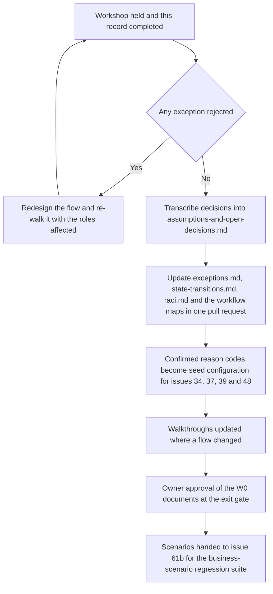

# Exception catalogue review — agenda and record

This is the record of the workshop in which every exception in [`../exceptions.md`](../exceptions.md) is walked
through with the people who will actually meet it: one representative each of Reception, Tailor Master, Inventory
Clerk, Cashier and Delivery Staff. It is both the agenda used to run the session and the record signed at the end
of it. Issue #17 names this review as evidence, and the W0 exit gate of plan
[Section 6.2](../../IMPLEMENTATION_PLAN.md) is not met until it is complete and the corrections it produces have
been folded back into the documents.

> **Status: awaiting the workshop.** The date, the attendees and every sign-off cell below are to be filled in
> when the session runs. Nothing in this file may be cited as a decision until section 6 carries a dated entry.
> **Date of workshop: _to be filled in_** — the Branch Manager schedules it and the business owner confirms the
> date; the target is before the W0 exit gate.

---

## 1. Session details

| Field | Value |
| --- | --- |
| Date | _to be filled in_ |
| Start and end time | _to be filled in_ (150 minutes scheduled, including two breaks) |
| Location | _to be filled in_ — the branch counter and workshop, so that the physical steps can be walked, not described |
| Facilitator | Branch Manager |
| Note-taker | _to be filled in_ — not the facilitator |
| Chair for decisions | Business owner, or the Branch Manager where the owner has delegated in writing |
| Materials | [`../exceptions.md`](../exceptions.md), [`../state-transitions.md`](../state-transitions.md), [`../walkthroughs.md`](../walkthroughs.md), [`../raci.md`](../raci.md), the draft reason-code lists, a printed label sheet, a phone with the scanner, and one real bundle from the rack |
| Recording | Written notes only. No photograph, screen recording or audio recording that could capture a customer's name, phone number or measurements |

---

## 2. Attendees

Each of the five roles below must be represented by someone who does the job daily, not by a supervisor speaking
for them. A row without a name and a confirmation is an incomplete review.

| Role | Name | Branch | Present | Confirms the record | Date |
| --- | --- | --- | --- | --- | --- |
| Reception | _to be filled in_ | _to be filled in_ | ☐ | ☐ | |
| Tailor Master | _to be filled in_ | _to be filled in_ | ☐ | ☐ | |
| Inventory Clerk | _to be filled in_ | _to be filled in_ | ☐ | ☐ | |
| Cashier | _to be filled in_ | _to be filled in_ | ☐ | ☐ | |
| Delivery Staff | _to be filled in_ | _to be filled in_ | ☐ | ☐ | |
| Branch Manager (facilitator) | _to be filled in_ | _to be filled in_ | ☐ | ☐ | |
| Business owner (chair) | _to be filled in_ | — | ☐ | ☐ | |
| Tailor (optional, for EX-02, EX-05, EX-07) | _to be filled in_ | _to be filled in_ | ☐ | ☐ | |
| Note-taker | _to be filled in_ | — | ☐ | ☐ | |

"Confirms the record" means the attendee has read this file after the session and agrees it says what was
decided. It is not an approval of the system design; that is the owner's, at the W0 exit gate.

---

## 3. Agenda

| # | Item | Minutes | Led by | Output |
| --- | --- | --- | --- | --- |
| 1 | Purpose, and the four rules every exception obeys (nothing deleted, refusal explicit, customer told on a consented channel, reason mandatory) | 10 | Facilitator | Shared starting point |
| 2 | Walk the happy path once, using walkthrough 1 in [`../walkthroughs.md`](../walkthroughs.md), with a real bundle and a printed label | 15 | Reception, Tailor Master | Agreement that the spine is right before the exceptions are discussed |
| 3 | Counter exceptions: EX-01, EX-03, EX-08 | 20 | Reception | Section 4 rows signed |
| 4 | Workshop exceptions: EX-02, EX-04, EX-05, EX-06, EX-07 | 30 | Tailor Master, Inventory Clerk, Tailor | Section 4 rows signed |
| — | Break | 10 | | |
| 5 | Money exceptions: EX-09, EX-10, EX-15 | 20 | Cashier | Section 4 rows signed |
| 6 | Delivery exceptions: EX-12, EX-13 | 20 | Delivery Staff | Section 4 rows signed |
| 7 | After the garment: EX-11, EX-14 | 10 | Branch Manager | Section 4 rows signed |
| — | Break | 5 | | |
| 8 | Reason codes: read the draft lists for hold, cancellation, rework, delivery failure and custody correction aloud and correct them in the words the shop actually uses (**XQ-01**) | 15 | All | Section 5 completed |
| 9 | Open questions carried into the session: XQ-02 to XQ-05 and the RACI questions of [`../raci.md`](../raci.md) section 5 | 15 | Chair | Section 6 decisions log |
| 10 | Actions, owners and dates; confirm who updates which document | 10 | Facilitator | Section 7 actions log |

---

## 4. Per-exception sign-off

One row per exception in [`../exceptions.md`](../exceptions.md). **R** marks a role that must walk the exception
and sign it, because the catalogue names that role as the one who detects it or acts on it; **–** marks a role
that is not involved. At the session, replace each **R** with the reviewer's initials and the date. A row is
complete only when every **R** cell has been replaced and the outcome column is filled.

Outcome vocabulary: **Confirmed** (the flow matches what the shop does or should do), **Confirmed with change**
(an action is raised in section 7), **Rejected** (the flow is wrong and must be redesigned before the W0 exit
gate).

| ID | Exception | Reception | Tailor Master | Inventory Clerk | Cashier | Delivery Staff | Outcome | Actions raised |
| --- | --- | --- | --- | --- | --- | --- | --- | --- |
| EX-01 | Duplicate customer | R | – | – | – | – | | |
| EX-02 | Missing material | R | R | R | – | – | | |
| EX-03 | Changed measurements | R | R | – | – | – | | |
| EX-04 | Rejected QC | – | R | – | – | – | | |
| EX-05 | Rework | – | R | – | – | – | | |
| EX-06 | Late order | R | R | – | – | R | | |
| EX-07 | Damaged or unreadable label | R | R | – | – | R | | |
| EX-08 | Cancelled order | R | R | R | R | – | | |
| EX-09 | Refund | R | – | – | R | – | | |
| EX-10 | Unpaid dispatch attempt | R | – | – | R | R | | |
| EX-11 | Negative feedback | R | R | – | – | – | | |
| EX-12 | Failed or returned delivery | R | – | – | R | R | | |
| EX-13 | Custody mismatch or lost garment | R | R | R | – | R | | |
| EX-14 | Notification not delivered | R | – | – | – | R | | |
| EX-15 | Dispatch exception expired or invalid | – | – | – | R | R | | |

### 4.1 The four questions asked of every exception

The facilitator asks the same four questions on every row, so the review is comparable across roles and the
answers can be turned into acceptance criteria:

1. **Does this happen here, and how often?** If it never happens, say so — the row may be over-engineered.
2. **Who notices it first, and on which device?** The catalogue's "detecting role" column must match the answer.
3. **What would you do in the next five minutes?** The system's immediate action must match, or the design is
   asking staff to do something they will not do under pressure.
4. **What must the customer be told, and when?** Silence and over-communication are both failures.

### 4.2 Physical steps that must actually be performed, not described

| Step | Exception | Why it must be done for real |
| --- | --- | --- |
| Scan a deliberately soaked or torn label, then reprint and verify | EX-07 | The recovery path is only credible if the manual-entry and reprint flow is walked on a real phone with wet hands |
| Attempt a dispatch with an unpaid balance | EX-10 | The refusal must be seen by Delivery Staff, not read about, so that the counter conversation is rehearsed |
| Scan a stock label where a garment label is expected | EX-13 | The wrong-namespace refusal is the commonest scanning mistake |
| Send a bundle out and receive it back with condition photographs | EX-13, Aari flow | Two-sided custody transfer is the step the shop has never done before |
| Count a shelf and record a variance | Stocktake, EX-02 | The counting screen and the approval separation are best judged in the store room |

---

## 5. Reason codes confirmed at the session (XQ-01)

The draft lists are read aloud and corrected into the words the shop uses. A code is machine-readable and never
changes; its label is what staff see and may be corrected later without changing behaviour.

| List | Draft codes brought to the session | Confirmed list | Confirmed by |
| --- | --- | --- | --- |
| Hold | `MATERIAL_SHORT`, `CUSTOMER_REQUEST`, `AWAITING_DECISION`, `SPECIALIST_DELAY`, `MACHINE_DOWN` | _to be filled in_ | |
| Cancellation | `CUSTOMER_CANCELLED`, `MATERIAL_UNUSABLE`, `CANNOT_COMPLETE`, `DUPLICATE_ORDER` | _to be filled in_ | |
| Rework | `FIT_ISSUE`, `STITCH_QUALITY`, `AARI_STONE_LOOSE`, `FINISH_ISSUE`, `WRONG_DESIGN` | _to be filled in_ | |
| Delivery failure | `NOBODY_AT_ADDRESS`, `REFUSED_AT_DOOR`, `WRONG_ADDRESS`, `RESCHEDULED_BY_CUSTOMER` | _to be filled in_ | |
| Custody correction | `WRONG_CUSTODIAN`, `DUPLICATE_SCAN`, `STALE_EVENT`, `UNKNOWN_LOCATION`, `GARMENT_NOT_FOUND`, `DISPUTED_HANDOFF` | _to be filled in_ | |
| Manual scan entry | `LABEL_DAMAGED`, `CAMERA_UNAVAILABLE`, `SCANNER_FAILED`, `LABEL_MISSING` | _to be filled in_ | |

The confirmed lists become seed configuration for issues #34, #37, #39 and #48. They are configuration, not code:
adding a code later is an administrative act, so the session should not try to be exhaustive.

---

## 6. Decisions log

Every decision taken in the session, with where it is written down afterwards. A decision that is not transcribed
into the register does not exist.

| # | Decision | Exception(s) affected | Decided by | Date | Transcribed into |
| --- | --- | --- | --- | --- | --- |
| 1 | _to be filled in_ | | | | |
| 2 | | | | | |
| 3 | | | | | |
| 4 | | | | | |
| 5 | | | | | |

### 6.1 Questions the session must answer

These are carried in from the documents. Each already has an interim position; the session either confirms it or
replaces it, and either way the outcome is transcribed into
[`../assumptions-and-open-decisions.md`](../assumptions-and-open-decisions.md).

| Question | Raised in | Interim position | Resolves under | Answer |
| --- | --- | --- | --- | --- |
| **XQ-01** Reason-code lists for hold, cancellation, rework, delivery failure and custody correction | [`../exceptions.md`](../exceptions.md) | The draft lists in section 5 above | OD-10 | _to be filled in_ |
| **XQ-02** Who may approve a dispatch exception, and whether Delivery Staff may collect the balance at the door | [`../exceptions.md`](../exceptions.md) | Owner only; no doorstep collection | OD-04 | _to be filled in_ |
| **XQ-03** Whether an advance is refundable on cancellation, and with which approval | [`../exceptions.md`](../exceptions.md) | Compensating approved records exist; the business policy is unset | OD-04 with OD-05 | _to be filled in_ |
| **XQ-04** Service-recovery rating threshold, case due time and escalation ladder | [`../exceptions.md`](../exceptions.md) | At most 3 of 5, owned by the Branch Manager, due within one business day | OD-15 | _to be filled in_ |
| **XQ-05** Whether a customer is told when a garment fails QC, or only when the promised date moves | [`../exceptions.md`](../exceptions.md) | Only when the date moves | OD-03 | _to be filled in_ |
| Whether Reception may record an advance, or only the Cashier | [`../raci.md`](../raci.md) | Reception may record it; the Cashier is accountable | OD-13 | _to be filled in_ |
| Whether Branch Manager is a distinct role or a branch-scoped Admin | [`../raci.md`](../raci.md) | A distinct role | OD-13 | _to be filled in_ |
| Whether a seventh walkthrough for a cancelled and refunded order is needed | [`../walkthroughs.md`](../walkthroughs.md) | Not written; EX-08 and EX-09 are catalogued but not walked end to end | Issue #17 scope, with #61b | _to be filled in_ |
| Whether counter collection or delivery is the default ending, per category and per branch | [`../workflows/blouse.md`](../workflows/blouse.md) `OD-WF-06` | Counter collection is the default for blouse and kids | OD-04 with OD-06 | _to be filled in_ |

---

## 7. Actions log

| # | Action | Raised by | Owner | Due | Status | Evidence when done |
| --- | --- | --- | --- | --- | --- | --- |
| 1 | _to be filled in_ | | | | Open | |
| 2 | | | | | Open | |
| 3 | | | | | Open | |
| 4 | | | | | Open | |
| 5 | | | | | Open | |

Status vocabulary: **Open**, **In progress**, **Done** (with the pull request that closed it), **Dropped** (with
the reason).

---

## 8. What happens after the session

The pull request that folds the corrections back in is the one that also updates this file's status line from
*awaiting the workshop* to the date it was held. Until then, every document in
[`../`](../) that cites this review cites it as pending.

---

## 9. Maintenance

This record is written once per review and then kept. When an exception is added to
[`../exceptions.md`](../exceptions.md) after the first workshop, it is walked with the roles that detect it and a
dated addendum is appended to section 4 rather than the original table being edited — the history of what was
agreed, and by whom, is part of the evidence issue #17 must produce.
