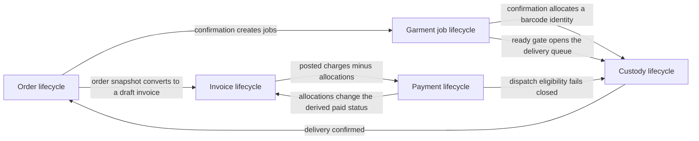
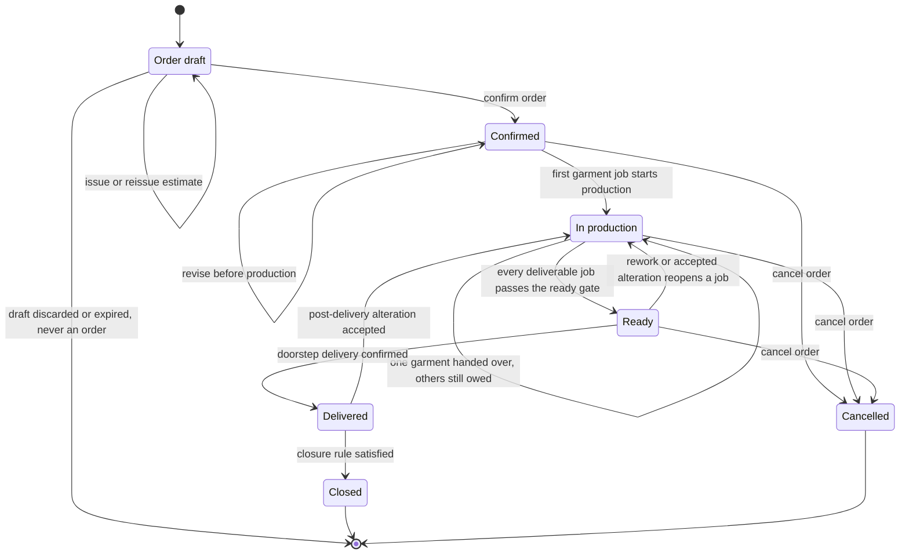
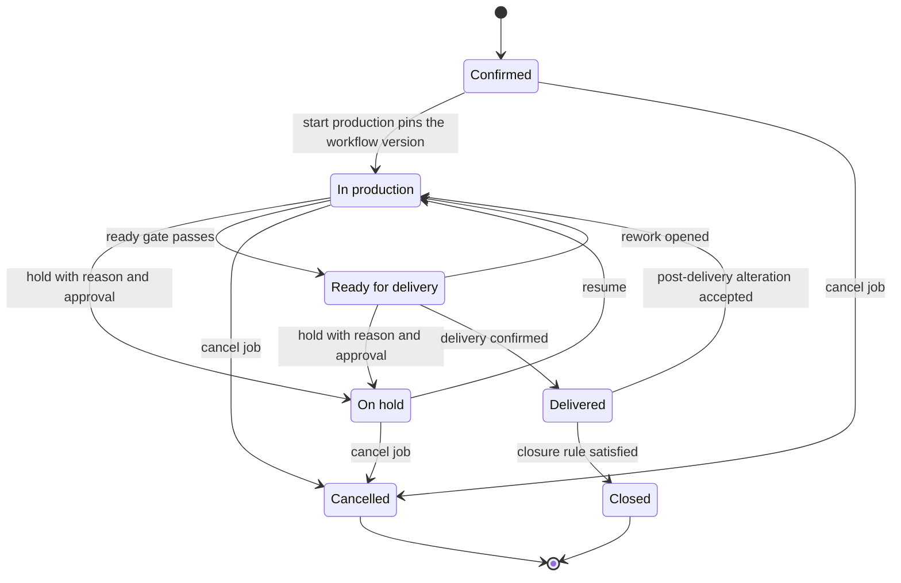
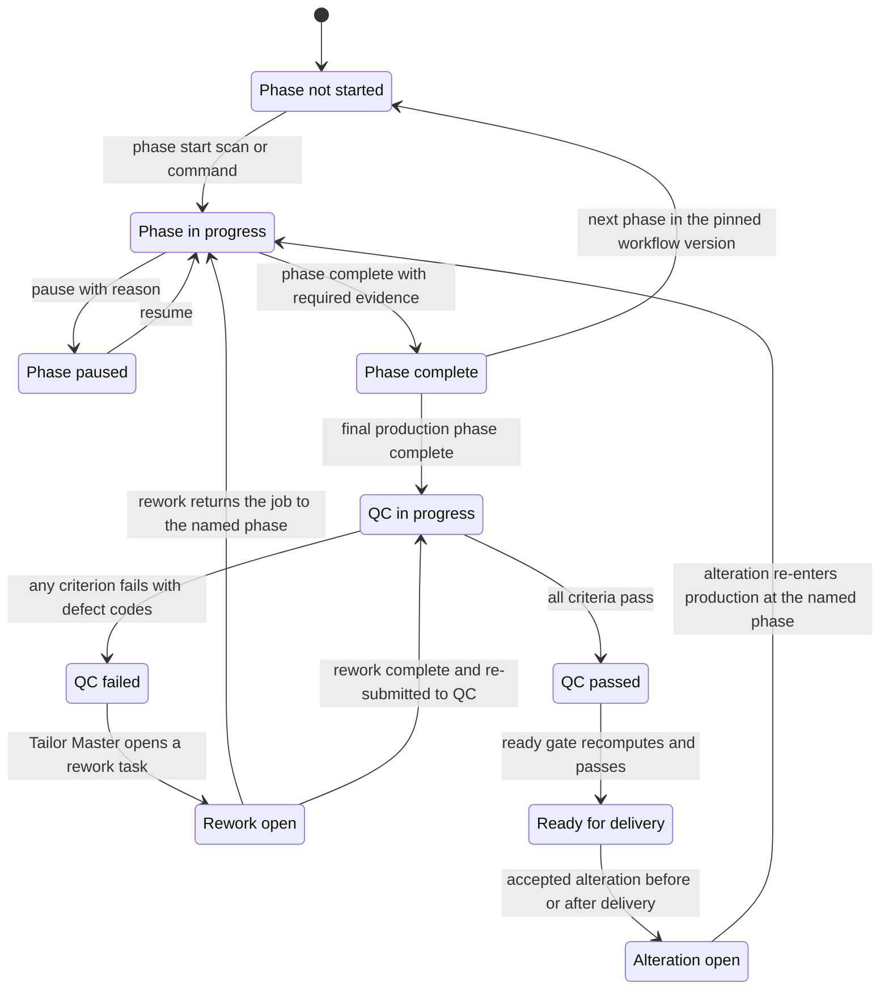
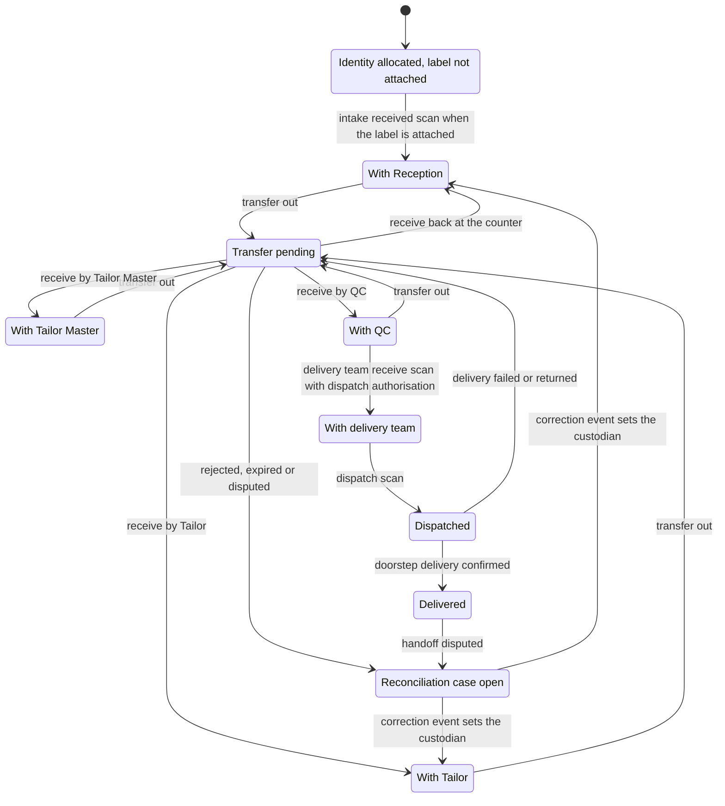
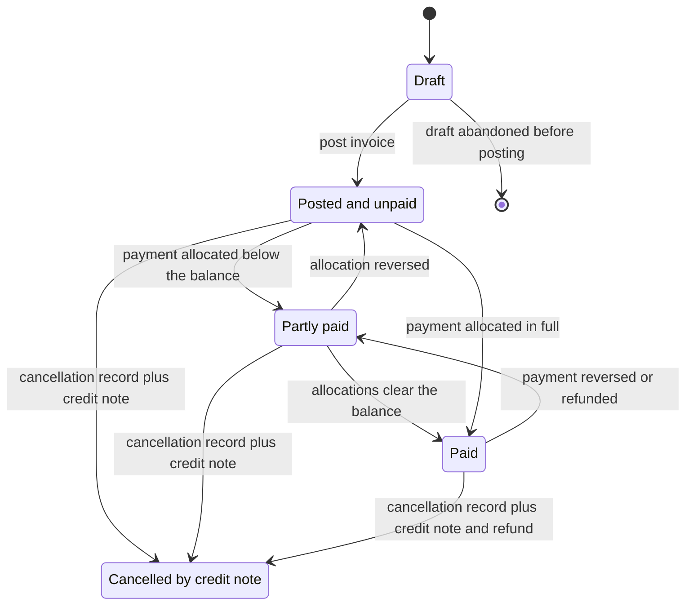
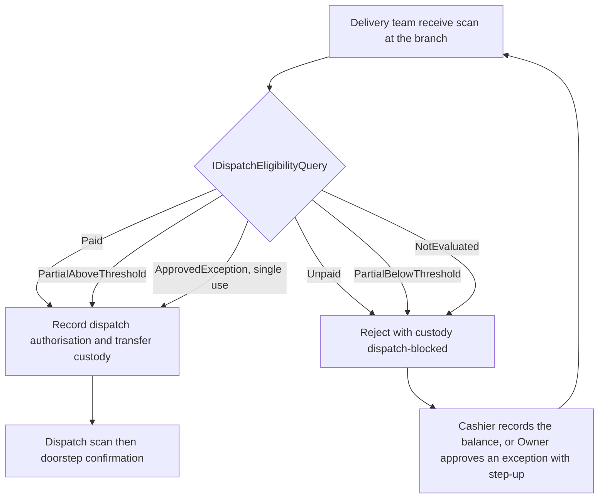

# State transitions

This is the authoritative transition table for HyFib Tailor 360. It states, for every lifecycle the shop floor
touches — order, garment job, custody, invoice and payment — what may move from which state to which, who may move
it, what must already be true, what the move produces, what it records in the audit trail and what happens when it
is refused. Where a screen, an endpoint, an event name or a test disagrees with this file, this file wins and the
other is a defect. Terms are defined in [`glossary.md`](glossary.md); the journey they sit in is described in
[`00-overview.md`](00-overview.md); what an administrator may change without a deployment is in
[`configurable-vs-fixed.md`](configurable-vs-fixed.md); the exception paths referenced from the last column are
catalogued in [`exceptions.md`](exceptions.md) and the branch dimension in
[`workflows/branch-scenarios.md`](workflows/branch-scenarios.md). Everything here is derived from
[`../IMPLEMENTATION_PLAN.md`](../IMPLEMENTATION_PLAN.md) Sections 3, 4 and 8; anything the plan has not settled is
registered in section 10 below and mirrored into
[`assumptions-and-open-decisions.md`](assumptions-and-open-decisions.md) against plan Section 11.

---

## 1. How to read the tables

| Column | Meaning |
| --- | --- |
| **From** | The state the aggregate is in before the command. `—` means the aggregate does not yet exist |
| **Event / transition** | The named command or system event that causes the move. Commands are authorised HTTP requests; system events are raised by the worker under a system principal from a declared `[WorkerJob]` scope |
| **To** | The state after the command. `(unchanged)` means the aggregate's own status does not move, but the transition is still recorded |
| **Actor (role)** | The role that normally performs it. Authorisation is always evaluated on the permission plus branch scope, never on the role name (plan Section 4.4, issue #24) |
| **Preconditions** | What the server validates before the change. A failed precondition is an RFC 9457 problem-details response, never a silent no-op |
| **Outputs** | Documents, labels, printed artefacts, integration events and notifications produced by the transition |
| **Audit event** | The `[Audited("module.action")]` action name written in the same transaction as the mutation |
| **Exception behaviour** | What happens when the transition is refused, retried, raced or reversed |

### 1.1 Markers used throughout

| Marker | Meaning |
| --- | --- |
| **IRREVERSIBLE** | There is no command that undoes this transition. The only remedy is a compensating record — a credit note, a correction scan event, a compensating ledger entry, a new order |
| **REASON** | A free-text reason is mandatory and is stored on the audit event |
| **STEP-UP** | The permission carries `RequiresStepUp`, so the actor must have re-authenticated with a second factor within the last five minutes (`identity.sessions.last_strong_auth_at`); the full flagged set is fixed by issue #24 |
| **IDEMPOTENT** | The endpoint requires a client-generated `Idempotency-Key`; a replay returns the original outcome, the same key with a different body is rejected `422 idempotency.key-reused`, and a duplicate arriving while the first is in flight waits up to five seconds then returns `409 idempotency.in-progress` |

### 1.2 Conventions that hold for every table

1. Every state-changing endpoint enforces authentication, authorisation, validation, idempotency where it is
   retried, and audit logging (plan Section 2.2). A transition with no audit row is a defect.
2. Audit action names follow the `[Audited("module.action")]` convention of plan Section 4.4 and mirror the
   permission that guards the endpoint. The names in these tables are the naming this document proposes; the
   definitive name for each endpoint is fixed by the implementing issue's pull request and, once merged, this
   file is corrected in the same pull request.
3. Permission names are those of the catalogue fixed by issue #24. Where the plan does not yet name the
   permission that guards a transition, the name shown is this document's proposal, is marked as such by the same
   rule that governs audit names, and is corrected in the pull request that implements the endpoint.
4. Server timestamps are authoritative for every scan and transition; client times are recorded but never trusted
   (plan D11).
5. Concurrency is optimistic: editable aggregates carry `ETag`/`If-Match` and an `xmin` concurrency token, and a
   lost race returns `409` with the current version (plan Section 4.4).
6. Times, due dates and report cut-offs are evaluated in the branch IANA timezone, default `Asia/Kolkata`, against
   the branch working calendar where one is configured (plan D11).

### 1.3 The five lifecycles and how they interlock

Two interlocks are load-bearing and are stated in full in section 9: the **ready-for-delivery gate**, which is the
only writer of a garment job's ready state, and the **dispatch gate**, which is evaluated by Billing and enforced
by Custody so that neither Custody nor Delivery Staff ever computes a balance.

---

## 2. Order lifecycle

Stored order statuses are `draft`, `confirmed`, `in_production`, `ready`, `delivered`, `closed` and `cancelled`
(plan Section 8, issue #32a). Two words in common shop-floor use are deliberately **not** order statuses:

| Shop-floor word | Where it actually lives |
| --- | --- |
| **Dispatched** | A custody state, not an order status. The order stays `ready` from the moment the delivery team takes the parcel until the doorstep confirmation moves it to `delivered` — see section 4 |
| **On hold** | A garment job status (`on_hold`) and a `holds` record with reason and approval. An order shown as "on hold" on a screen is a derived display over its jobs' open holds — see section 3 |

### 2.1 Order transitions

| From | Event / transition | To | Actor (role) | Preconditions | Outputs | Audit event | Exception behaviour |
| --- | --- | --- | --- | --- | --- | --- | --- |
| — | Create order draft | Draft | Reception (`orders.intake`) | Customer selected or created in a branch the actor is assigned to; consent records present for any purpose the draft will use | Server-side draft shared with every user in the branch holding `orders.intake`; per-garment section lock via `If-Match`; expiry default 72 hours | `orders.draft_create` | A draft is not an obligation. On expiry it is removed by the retention job with an audit row; media already uploaded follows its own retention. Two users editing the same garment section race on `If-Match` and the loser gets `409` with the current version |
| Draft | Issue estimate — **IDEMPOTENT** | Draft, estimate `issued` | Reception (`orders.estimate`) | Every garment carries category, service type and design selections that pass the configured design rules; the service type is orderable at this branch today (`ICatalogAvailabilityQuery`); pricing is available | Estimate PDF numbered `E-<branch>-<FY>-000001` marked "Estimate — not a tax invoice"; expiring customer link with `purpose = estimate`; `EstimateIssued` on the outbox | `orders.issue_estimate` | Measurements are **not** required for an estimate. A reissue supersedes the previous estimate rather than editing it. The estimate is never posted and never consumes an invoice number; an expired link is reissued, never extended |
| Draft | **Confirm order** — **IDEMPOTENT**, **IRREVERSIBLE** | Confirmed | Reception (`orders.confirm`) | Catalogue, measurement template and workflow availability validated; every garment has a confirmed measurement version or an explicit reuse; required consents recorded; required media in `ready` state | One transaction: measurement, design and price snapshots frozen; display numbers `O-<branch>-<FY>-000001` and `J-…-01` allocated; a `G-…` barcode identity allocated per garment job by the confirmation participant; `OrderConfirmed` and `GarmentJobCreated` on the outbox; job cards and labels printable in the same counter session | `orders.confirm` | Any failure rolls the whole transaction back — there is no partly confirmed order, no orphan display number and no orphan barcode identity. Confirmation is refused with a field error listing garments that have neither a confirmed measurement version nor an explicit reuse. A replay of the same `Idempotency-Key` returns the original order |
| Confirmed | Revise order — **REASON** | Confirmed, revision *n+1* | Reception or Branch Manager (`orders.revise`) | **Every** job still `confirmed` and none has entered production; `If-Match` matches | Re-validated and re-priced snapshots; `order_revisions` row; the outstanding estimate is superseded; `OrderConfirmed` republished with `revision_number` | `orders.revise` | Refused once any job has entered production; the only route afterwards is an alteration request (issue #34). A revision never rewrites the previous snapshot — it appends a new revision |
| Confirmed | First garment job starts production | In production | Tailor Master (`orders.start_production`) | See the garment job table, section 3 | `JobEnteredProduction`; the order's derived status follows its jobs | `orders.start_production` (job-scoped) | Order revision is refused from this moment. See open question **SQ-02** for the exact aggregation rule from job states to order status |
| In production | Every deliverable job passes the ready-for-delivery gate | Ready | The gate alone (system) | All gate predicates pass for the job set the branch dispatch policy requires — `whole_order`, `per_job` or `exception` (issue #48) | `JobReadyForDelivery` per job; delivery queue entries; customer status notification where consented | `orders.ready_state_changed` | The gate is the only writer of ready state. A staff member cannot mark an order ready; a failing predicate returns its own reason code to the queue screen |
| Ready or In production | Rework opened, hold opened or alteration accepted | In production | Tailor Master, Branch Manager | See sections 3.1 and 3.2 | Gate recomputation closes the ready state; queue entry withdrawn | `orders.ready_state_changed` | A job already dispatched cannot be pulled back by a gate recomputation; the remedy is a failed or returned delivery (see section 4) |
| Ready | Doorstep delivery confirmed — **IRREVERSIBLE** | Delivered | Delivery Staff (`custody.confirm_delivery`) | A valid, unexpired dispatch authorisation exists; the order is not cancelled; custody is unchanged since dispatch; recipient confirmation captured by OTP or signature per branch policy | `DeliveryConfirmed`; delivery receipt document; customer notification; feedback invitation on the consented channel | `custody.confirm_delivery` | Confirmation is never silently skipped. A confirmation replayed from the offline queue is re-validated server-side and a conflict is surfaced rather than absorbed. `DeliveryFailed` and `DeliveryReturned` create the compensating custody transfer back to the branch and reopen the queue entry |
| In production | Doorstep delivery confirmed for one garment — **IRREVERSIBLE** | In production (unchanged) | Delivery Staff (`custody.confirm_delivery`) | Everything the `Ready` row above requires, asked of the **garment**, and the order itself still open — a cancelled or closed order refuses every handover. Reachable while the order's dispatch policy is `whole_order`, which is the aggregation that keeps the order at `in_production` while one garment stands `ready` beside another still being made; under `per_job` the same facts read the order as `ready`, so the row above applies instead. The garment must also be free to travel alone: unbound, or its `deliver_together` binding waived at the scan (issue #48) | `DeliveryConfirmed`; delivery receipt document; customer notification; feedback invitation on the consented channel | `custody.confirm_delivery` | The order stays `in_production`: the garment that kept it out of `ready` is still outstanding after the handover, so this row can never be the one that reaches `delivered` — the last garment still owed is handed over from `ready`, by the row above. A garment that is not itself `ready` is refused as a garment, and a live `deliver_together` partner left behind is refused with `orders.delivery-would-split-parcel` exactly as above |
| Delivered | Post-delivery alteration accepted — **REASON** | In production | Branch Manager or Tailor Master (`orders.alteration_decide`) | An alteration request exists from staff or from feedback (issue #49); price and due-date decisions taken | New or reopened garment job linked to the original; `AlterationDecided`; billing adjustment intent as event data | `orders.alteration_decide` | Orders never posts a financial document itself; a chargeable alteration travels to Billing as an intent on the event (issue #42). The original job's history is never rewritten |
| Delivered | Closure rule satisfied | Closed | System | See open question **SQ-01** — the closure trigger is not fixed by the plan | `JobClosed` per job | `orders.close` | Until SQ-01 is decided, `closed` is documented but not implemented as an automatic transition; a delivered order remains `delivered` and is fully reportable in that state |
| Draft, Confirmed, In production or Ready | Cancel order — **REASON** | Cancelled | Branch Manager or Owner (`orders.cancel`) | Not in a prohibited financial, stock or custody state; a configured reason code chosen | `OrderCancelled`; cancellation credit intent to Billing; reservations released as ledger `release` entries; customer material return recorded | `orders.cancel` | Cancellation is **blocked, not forced**, while a prohibited state stands — for example recognised value on a posted invoice, unreturned customer material, or a garment in another custodian's hands. The compensating flows run first (see [`exceptions.md`](exceptions.md) EX-08). The prohibited-state list is fixed by issue #34 |
| Cancelled | — | — | — | — | — | — | There is no un-cancel. A customer who changes their mind again is served by a new order that may reuse the same measurement version. See **SQ-03** for the `job-reopened` boundary |

### 2.2 Estimate sub-lifecycle

An estimate is a priced snapshot of a draft, not a stage of the order (issue #32a).

| From | Event / transition | To | Actor (role) | Preconditions | Outputs | Audit event | Exception behaviour |
| --- | --- | --- | --- | --- | --- | --- | --- |
| — | Issue estimate | `issued` | Reception (`orders.estimate`) | As section 2.1 | Numbered PDF, customer link, `EstimateIssued` | `orders.issue_estimate` | Never posted; never numbered in the invoice sequence |
| `issued` | Reissue after a draft change | `superseded` | Reception | A newer estimate has been issued for the same draft | New estimate issued; the superseded link stops resolving | `orders.issue_estimate` | The superseded PDF remains stored with its original checksum |
| `issued` | Order confirmed from the draft | `converted` | Reception | Confirmation succeeded | `OrderConfirmed`; issue #42 uses `EstimateIssued` only to prefill an invoice draft | `orders.confirm` | An estimate past its validity date is reissued at current prices, never silently honoured |

---

## 3. Garment job lifecycle

Stored garment job statuses are `confirmed`, `in_production`, `ready`, `delivered`, `closed`, `cancelled` and
`on_hold` (issue #32a). Phases live **inside** `in_production` and are instantiated from the workflow version
pinned at start of production.

### 3.1 Production detail, including QC failure and alteration re-entry

### 3.2 Garment job transitions

| From | Event / transition | To | Actor (role) | Preconditions | Outputs | Audit event | Exception behaviour |
| --- | --- | --- | --- | --- | --- | --- | --- |
| — | Job created inside order confirmation — **IRREVERSIBLE** | Confirmed | Reception (`orders.confirm`) | Part of the confirmation transaction of section 2.1 | Job number `J-<branch>-<FY>-000001-01`; measurement, design and price snapshots; `G-…` barcode identity; `GarmentJobCreated` | `orders.confirm` | Snapshots are copies, not references. Republishing the catalogue or capturing new measurements never changes a confirmed job |
| Confirmed | **Start production** — **IRREVERSIBLE** | In production | Tailor Master (`orders.start_production`), or the first phase scan when the branch sets `Workflow:AutoStartOnFirstScan` | The currently published workflow version resolves for the job's definition; `finish_before` prerequisites satisfied | The workflow version is **pinned** on the job; `job_phases` created; `JobEnteredProduction` | `orders.start_production` | The pinned version never changes, even if a newer workflow version is published mid-job. Order revision is refused from this moment |
| In production | Assign or reassign a phase — **REASON** | (unchanged) | Tailor Master (`orders.assign`) | Same branch, active user, role permitted for the phase, and a capability row for the job's category and phase unless `Workflow:RequireCapabilityMatch=false` | New `assignments` row; `JobAssigned` or `JobReassigned` | `orders.assign` | Reassignment is a new row, never an update: earlier completions stay attributed to the previous assignee. An ineligible assignee is rejected with the failing eligibility reason |
| In production | Phase start, pause, resume, complete | (unchanged) | Tailor (`orders.phase_transition`), by scan or command | Expected custodian and prerequisites hold; job version concurrency token matches; required evidence present on completion | Server-timestamped `job_phases` rows; `JobPhaseChanged` carrying previous state, phase code, actor role and workflow version | `orders.phase_transition` | Two concurrent scans cannot double-complete a phase; the loser sees a conflict with the current state. An out-of-order transition is rejected against the pinned version's transition graph |
| In production | **Record QC result** — **IRREVERSIBLE** | (unchanged) | Tailor Master or the checklist's responsible role (`orders.record_qc`) | A published QC checklist version resolves for the category and service type; required evidence media are `ready` | Immutable `qc_results` row embedding a copy of the criteria evaluated, defect codes and evidence; `QcRecorded` | `orders.record_qc` | A QC result is never edited. A mistaken result is superseded by a new result, and both remain visible on the timeline. A fail leaves the ready gate closed |
| In production | QC fail opens rework — **REASON** | (unchanged) | Tailor Master (`orders.open_rework`) | The latest QC result is a fail with at least one defect code | `rework_tasks` row naming the phase to return to; `ReworkOpened`; workload and due-date impact surfaced | `orders.open_rework` | Rework never deletes history: the failed QC result, the original assignment and the original phase timings all stay. Repeated rework on one job is surfaced on the quality dashboard |
| In production | Rework complete | (unchanged) | Tailor, then Tailor Master | The rework task's phases are complete | `ReworkCompleted`; the job returns to QC | `orders.complete_rework` | The ready gate stays closed until a **new** QC result passes; a rework does not inherit the previous pass |
| In production or Ready | **Hold** — **REASON** | On hold | Branch Manager or Tailor Master (`orders.hold`) | A configured hold reason code; approval per the hold policy | `holds` row; `JobHeld`; the ready gate closes **on this garment and on no other** (**SQ-09**); the hold appears on the overdue-hold dashboard | `orders.hold` | An overdue hold raises `HoldOverdue` once per job and condition. Time on hold is visible on the job so the promised date can be renegotiated honestly. A `deliver_together` partner left standing at `ready` is held at the door instead, by the delivery row below |
| On hold | Resume — **REASON** | In production | Branch Manager or Tailor Master (`orders.resume`) | The hold's blocking condition is recorded as resolved | `JobResumed`; gate recomputation | `orders.resume` | Resuming does not silently move the due date; a new date is a separate reschedule with its own reason and customer communication |
| In production or On hold | Reschedule the promised date — **REASON** | (unchanged) | Branch Manager (`orders.reschedule`) | A new date evaluated in the branch timezone against the branch working calendar | `JobRescheduled`; customer notification on the consented channel | `orders.reschedule` | Due-soon and overdue conditions are re-evaluated; each condition is raised exactly once per job and cleared on completion |
| In production | Ready gate passes | Ready | The gate alone (system) | `WorkflowComplete`, `QcPassed` with no open rework, `DocumentationComplete`, `NoOpenHold`, `DependenciesMet` and `CustodyReconciled` all true | `ready_state` materialised; `JobReadyForDelivery`; delivery queue entry | `orders.ready_state_changed` | Every predicate returns its own reason code, shown on the queue. `CustodyReconciled` is treated as blocked while custody state is unknown and the custody gate is enabled — the gate **fails closed** |
| Ready | Delivery confirmed — **IRREVERSIBLE** | Delivered | Delivery Staff | See section 4, and every live garment of this one's `deliver_together` parcel is itself ready — unless the branch policy in force at the scan permits partial delivery | `DeliveryConfirmed` | `custody.confirm_delivery` | A `deliver_together` dependency binds sibling jobs at the queue unless the branch policy permits partial delivery; a handover that would strand one is refused with `orders.delivery-would-split-parcel`, naming the garment left behind. A cancelled or already delivered sibling has left the parcel and is not waited for (**SQ-08**) |
| Delivered | Alteration requested and accepted — **REASON** | In production | Branch Manager or Tailor Master (`orders.alteration_decide`) | Request recorded from staff or from feedback through `IAlterationRequests.Open(...)`; price and due-date decisions taken and communicated | `AlterationRequested`, `AlterationDecided`; new or reopened job linked to the original; billing adjustment intent | `orders.alteration_decide` | A rejected alteration is also recorded with its reason and communicated; it is never left silent |
| Confirmed, In production, On hold or Ready | Cancel job — **REASON** | Cancelled | Branch Manager or Owner (`orders.cancel_job`) | Not in a prohibited financial, stock or custody state | `JobCancelled`; reservation release; label invalidation where the garment does not exist | `orders.cancel_job` | Cancelling every job of an order does not by itself cancel the order — see **SQ-04** |

---

## 4. Custody lifecycle

Custody answers one question: who physically holds this garment right now. It is recorded by append-only
`scan_events` and two-sided `custody_transfers`; history is never edited and a correction is a new event
(issues #35, #36, #37).

Where a branch keeps finished garments in a ready-store location between QC and the delivery team, that location
is an ordinary location custodian and the move to it is the same transfer-out and receive pair as any other; the
chain drawn above is the minimum, not a restriction on how many custodians a branch uses.

### 4.1 Custody transitions

| From | Event / transition | To | Actor (role) | Preconditions | Outputs | Audit event | Exception behaviour |
| --- | --- | --- | --- | --- | --- | --- | --- |
| — | Allocate barcode identity — **IRREVERSIBLE** | Allocated | Reception, inside order confirmation | Runs as the first confirmation participant in the confirmation transaction | One active `G-…` identity per garment job, enforced by a partial unique index; payload unique across all statuses | `orders.confirm` | The generator accepts no customer, order, phone or name input: the payload is namespace, random body and check character only. A payload is never re-issued after supersession or invalidation |
| Allocated | Print label | Allocated | Reception (`custody.print_label`; batches above the configured cap need `custody.bulk_print_label`) | Identity active; template version resolves; branch scope | `label_prints` row; print job queued to the branch print station, or a downloaded PDF as fallback | `custody.print_label` | A phone never drives a thermal printer directly; it queues to a print station. Preview renders without recording an issuance |
| Allocated | Verify printed label | Allocated | Reception at the print station | The freshly printed label decodes to the expected payload | `label_verified` flag on the print record | `custody.verify_label` | An unverifiable print is reprinted before the label is attached, so a bad label never enters the workshop |
| Allocated | **Intake received scan** | With Reception | Reception (`custody.scan`) | Label attached to the customer's material; identity active and in branch scope | Immutable `scan_events` row with custodian reception or branch store; link to the customer material custody record | `custody.scan` | Duplicate submissions deduplicate on `(actor_id, client_event_uuid)` and on the `Idempotency-Key`; the same client event UUID under a different actor is `409 custody.event-conflict`, never a replay |
| Any custodian state | Transfer out | Transfer pending | The current custodian (`custody.transfer_out`) | The actor is the expected custodian; destination custodian or location is valid for the branch | `custody_transfers` row `pending`; `CustodyTransferRequested`; pending-transfer queue entry for the destination | `custody.transfer_out` | A transfer not received within the configured SLA raises `CustodyTransferOverdue` and appears on the overdue-acceptance screen; it may expire |
| Transfer pending | Receive | The destination custodian's state | Tailor Master, Tailor, QC or Reception (`custody.receive`) | The transfer is still pending; the receiver is the named destination, or holds the transfer-scoped grant for a cross-branch transfer | `custody_transfers` accepted; `CustodyTransferred`; `ScanRecorded` | `custody.receive` | Receiving a garment that is not the one expected is refused and offered as a reconciliation case rather than silently accepted |
| Transfer pending | Reject or expire — **REASON** | Reconciliation case open | Destination custodian, or the system on expiry | Rejection carries a reason; expiry follows the configured SLA | `custody_transfers` rejected or expired; reconciliation case opened | `custody.reject_transfer` | Custody stays with the sender until a receive is recorded. A rejected transfer never leaves the garment stateless |
| With QC | Delivery team receive scan at the branch | With delivery team | Delivery Staff (`custody.receive`) | Ready state true for the job set required by the branch dispatch policy; **`IDispatchEligibilityQuery` returns `Paid`, `PartialAboveThreshold` or `ApprovedException`** | `dispatch_authorisation` recorded with policy version, amount, approver and expiry at branch end of day; any dispatch exception consumed | `custody.receive` | This is where the payment rule blocks. `Unpaid`, `PartialBelowThreshold` and `NotEvaluated` are rejected `custody.dispatch-blocked`; the query is online-only and **fails closed**. See [`exceptions.md`](exceptions.md) EX-10 |
| With delivery team | Dispatch scan — **IRREVERSIBLE** | Dispatched | Delivery Staff (`custody.dispatch`) | A valid dispatch authorisation exists and has not expired | `DispatchRecorded`; customer dispatch notification where consented | `custody.dispatch` | Failed-QC, held and wrong-custody jobs have **no** exception path: they cannot be dispatched at all |
| Dispatched | **Delivery confirmed** — **IRREVERSIBLE** | Delivered | Delivery Staff (`custody.confirm_delivery`) | Recipient name plus a six-digit OTP valid ten minutes with at most five attempts, or a signature stroke, per the branch `custody.recipient_confirmation` policy; the authorisation is unexpired and the order is not cancelled | `DeliveryConfirmed` with recipient confirmation type, evidence media ids and server time; delivery receipt document; feedback invitation | `custody.confirm_delivery` | This is the one custody action on the offline allowlist; on replay the server re-validates the authorisation and surfaces conflicts. Confirmation is never skipped silently |
| Dispatched | Delivery failed or returned — **REASON** | Transfer pending back to the branch | Delivery Staff (`custody.record_delivery_outcome`) | A configured failure reason | `DeliveryFailed` or `DeliveryReturned`; compensating custody transfer to the branch; the queue entry reopens | `custody.record_delivery_outcome` | The dispatch authorisation is spent: a second attempt is re-evaluated against the payment rule from scratch |
| Delivered | Handoff disputed — **REASON** | Reconciliation case open | Any staff member (`custody.open_case`) | Evidence recorded | `HandoffDisputed`; reconciliation case | `custody.open_case` | The delivery record is not deleted; the dispute is resolved by a correction event and, above the configured threshold, approval by a different user |
| Reconciliation case open | **Correction event** — **REASON**, **STEP-UP** for approval | The custodian named by the correction | Branch Manager (`custody.reconcile`); approval above the configured threshold by a different user (`custody.approve_reconciliation`, **STEP-UP**) | A case exists; the correcting event names the resulting custodian and location | New `scan_events` row with `action = CORRECTION` linked to the corrected event and the case | `custody.reconcile` | History is never edited. The timeline shows the original and the correcting event side by side. Branch change, phase skip and dispatch reversal always exceed the threshold and need the second approver |
| Any | Manual lookup instead of a scan — **REASON** | (unchanged) | Any scanning role (`custody.manual_lookup`) | A reason is supplied; resolution is by queue pick, then job number, then raw payload | Scan event with `source = manual` and the reason recorded | `custody.manual_lookup` | Manual entry is available whenever a camera is denied or a label is damaged, and is always audited — see [`exceptions.md`](exceptions.md) EX-07 |
| Any | Reprint or invalidate a label — **REASON**, **STEP-UP** | (unchanged) | Branch Manager or Admin (`custody.reprint_label`, `custody.invalidate_label`) | The job exists and is in branch scope | The old identity is superseded and a new active identity inserted in one transaction under the job's row lock | `custody.reprint_label` | Two simultaneous reprints yield exactly one active identity. The superseded payload is never re-issued and continues to resolve as `superseded` with a reprint action |

---

## 5. Invoice lifecycle

The **stored** invoice status is `draft` or `posted` and nothing else. What staff call "unpaid", "partly paid",
"paid" and "cancelled" are **derived** displays: paid status comes from allocations against the posted charges,
and cancellation is an appended `invoice_cancellations` record from which the display is derived (issue #42).
Recording this distinction is the point of the table: a posted invoice row is frozen by a database trigger that
rejects every UPDATE and DELETE, including from the application role.

### 5.1 Invoice transitions

| From | Event / transition | To | Actor (role) | Preconditions | Outputs | Audit event | Exception behaviour |
| --- | --- | --- | --- | --- | --- | --- | --- |
| — | Create draft invoice from an order — **IDEMPOTENT** | Draft | Cashier (`billing.create_invoice`) | Order confirmed and not cancelled; no open draft or posted invoice covering the same garment jobs; branch tax configuration and GST registration present; recalculation with the same price-list and tax versions matches the order snapshot | Draft invoice carrying the customer snapshot, GST registration and place of supply | `billing.create_invoice` | A mismatch between the recalculation and the order snapshot fails with `billing.snapshot-mismatch` rather than quietly re-pricing. Partial invoicing by job set only where policy permits |
| Draft | Edit draft lines, discounts or tax reference | Draft | Cashier; a discount above the configured threshold needs `billing.override_price` (**STEP-UP**) | `If-Match` matches; the price-list version is available at this branch | Recalculated `calculation_snapshot` | `billing.update_invoice` | Nothing about a draft is authoritative. All arithmetic is `decimal`, half-up to paise at line level with document round-off to the nearest rupee, using the tax configuration version in force |
| Draft | **Post invoice** — **IDEMPOTENT**, **IRREVERSIBLE** | Posted, derived unpaid | Cashier (`billing.post_invoice`) | Totals recomputed; sequence available for branch, document type and financial year | The next invoice number allocated under a row lock in the same transaction; the row frozen; accessible PDF rendered with an `I-…` barcode and stored with its checksum; `InvoicePosted` | `billing.post_invoice` | Concurrent posting produces no duplicate and no skipped number. A duplicate post with the same key returns the original invoice. After posting, every UPDATE and DELETE is rejected by the database itself |
| Posted | Payment allocated | Derived partly paid or paid | Cashier (`payments.record`, `payments.allocate_manual` for manual allocation, **STEP-UP**) | Allocation is oldest invoice first by default | `PaymentAllocated`; `InvoicePaidStatusChanged` | `payments.allocate` | The paid status is derived from allocations, never stored on the invoice row as an editable field |
| Posted | **Cancel invoice** — **REASON** | Derived cancelled | Cashier with approval, or Branch Manager (`billing.cancel_invoice`) | Within the configured cancellation window; a credit note where value has already been recognised | Appended `invoice_cancellations` record; posted credit note; `InvoiceCancelled` and `CreditNotePosted` | `billing.cancel_invoice` | The original invoice PDF still renders with its original hash. The invoice number is never reused. Whether `billing.cancel_invoice` should carry `RequiresStepUp` is open question **SQ-05** |
| Posted | Post a credit note or debit note — **REASON** | (unchanged) | Cashier (`billing.post_credit_note`) | A reason and, for a credit note, the invoice it relieves | Numbered, immutable credit or debit note; `CreditNotePosted` or `DebitNotePosted` | `billing.post_credit_note` | Corrections are always new documents. There is no editing route into a posted document |

---

## 6. Payment lifecycle

Payments, allocations, advances, refunds, reversals and receipts are append-only and trigger-protected; a status
change is always a **new row** (issue #43).

| From | Event / transition | To | Actor (role) | Preconditions | Outputs | Audit event | Exception behaviour |
| --- | --- | --- | --- | --- | --- | --- | --- |
| — | Record advance — **IDEMPOTENT**, **IRREVERSIBLE** | Advance unapplied | Cashier (`payments.record`) | An open cashier session; a payment mode active at this branch; a reference where the mode requires one | `advances` row linked to customer or order; numbered receipt with an `R-…` barcode; `AdvanceReceived` | `payments.record` | Card PAN, CVV and track data are never stored or logged; only masked last four digits, network, provider reference and authorisation code |
| — | Record payment — **IDEMPOTENT**, **IRREVERSIBLE** | Recorded | Cashier (`payments.record`) | As above; the amount is `decimal` and never floating point | `payments` row; receipt; `PaymentRecorded` | `payments.record` | A duplicate request or a duplicate provider callback is idempotent on the key and the provider reference |
| Recorded | Allocate to invoices | Allocated, fully or partly | Cashier; manual allocation needs `payments.allocate_manual` (**STEP-UP**) | A posted invoice exists for the customer or order | `payment_allocations` rows; `PaymentAllocated`; `InvoicePaidStatusChanged` | `payments.allocate` | Default allocation is deterministic, oldest invoice first, so two cashiers cannot produce different outcomes from the same facts |
| Advance unapplied | Apply advance | Allocated | Cashier | A posted invoice to apply against | `AdvanceApplied`; allocation rows | `payments.allocate` | An unapplied advance still counts towards dispatch eligibility only where the branch enables `dispatch.allow_on_advance` |
| Recorded or Allocated | **Reverse** — **REASON**, **STEP-UP** | Reversed by a new row | Cashier with approval (`payments.reverse`) | The original payment exists; a reason code | Compensating `refunds`/`reversals` row; `PaymentReversed`; `InvoicePaidStatusChanged` | `payments.reverse` | The original row is untouched. Balance = posted charges − allocations − credits + refunds, recomputed from rows only |
| Allocated | **Refund** — **REASON**, **STEP-UP** | Refunded by a new row | Cashier with approval (`payments.refund`) | The payment mode allows refunds; approval recorded | Compensating refund row; receipt; `RefundRecorded` | `payments.refund` | Refund policy on cancellation and on advances is an owner decision registered under OD-04 and OD-05 in [`assumptions-and-open-decisions.md`](assumptions-and-open-decisions.md) |
| — | Open cashier session | Open | Cashier (`payments.session`) | No other open session for this cashier at this branch | `cashier_sessions` row | `payments.open_session` | Payments recorded outside an open session are refused, so the day always reconciles to a session |
| Open | **Close cashier session** — **REASON** for a variance | Closed | Cashier; variance approval by a different user | Denomination count sheet completed; expected against counted totals by mode | `CashierSessionClosed`; reconciliation batch | `payments.close_session` | A variance is explained and approved, never absorbed. Session totals by mode must equal the sum of payments and refunds in the session |
| — | Provider payment intent | Intent recorded | Cashier through the gateway adapter | Intent recorded **before** the provider call; the intent id is the provider idempotency key | `PaymentIntent`; provider call outside any database transaction | `payments.record_intent` | A timeout is `unknown`, never assumed successful: the outcome is resolved by status polling. Callbacks never post financial state themselves |

---

## 7. Transitions that are irreversible

These have no undo. The only remedy is a compensating record, and the exception catalogue names it in each case.

| Transition | Why it cannot be reversed | The compensating route instead |
| --- | --- | --- |
| Customer merge | The survivor absorbs the merged record and measurements and orders are re-pointed | A correction on the survivor with a reason, and the merged number remains searchable as an alias |
| Measurement version confirmed | Versions are never edited and a draft is consumed exactly once | Capture a new version; the order keeps the version it was confirmed with |
| Order confirmation | Snapshots are frozen and display numbers and barcode identities are allocated | Revise before production, or cancel and place a new order |
| Start production | The workflow version is pinned and revision is refused | An alteration request under issue #34 |
| Barcode identity supersession or invalidation | A payload is never re-issued | A new active identity from a reprint, with the old payload still resolving as superseded |
| Scan event, custody transfer, QC result | Append-only, trigger-protected | A new `CORRECTION` scan event, or a new QC result that supersedes without deleting |
| Stock ledger entry | Append-only, trigger-protected; balances are derived from it | A compensating entry carrying `corrects_entry_id` |
| Invoice posting | The number is allocated and the row frozen by a database trigger | Cancellation record plus a credit note |
| Payment, allocation, receipt, refund, reversal | Append-only; status changes only through new rows | A reversal or refund row, itself append-only |
| Dispatch and delivery confirmation | The garment has physically left, or been handed over | Failed or returned delivery with a compensating custody transfer; a dispute opens a reconciliation case |
| Audit event | Hash-chained, trigger-written, month-partitioned | Nothing. A broken chain is an incident, detected by the hourly verification job |

## 8. Transitions that require a reason, and those that require step-up authorisation

Every transition marked **REASON** stores free text on its audit event; the reason is never optional and never
defaulted by the client. Step-up means re-authentication with a second factor within the last five minutes.

| Transition | Reason | Step-up | Permission |
| --- | --- | --- | --- |
| Merge two customer records | Yes | **Yes** | `customers.merge` |
| Correct a customer record | Yes | No | `customers.update` |
| Publish a catalogue, workflow, measurement-template or QC-checklist version | Yes | **Yes** | `catalog.*.publish` |
| Revise an order before production | Yes | No | `orders.revise` |
| Revise a design after confirmation | Yes | No | `orders.revise_design` |
| Hold, resume, reschedule or reopen a job | Yes | No | `orders.hold`, `orders.resume`, `orders.reschedule` |
| Open rework after a failed QC | Yes | No | `orders.open_rework` |
| Decide an alteration | Yes | No | `orders.alteration_decide` |
| Cancel a garment job or an order | Yes | See **SQ-05** | `orders.cancel_job`, `orders.cancel` |
| Manual barcode lookup instead of a scan | Yes | No | `custody.manual_lookup` |
| Generate a barcode identity manually | Yes | **Yes** | `custody.generate_identity` |
| Reprint or invalidate a label | Yes | **Yes** | `custody.reprint_label`, `custody.invalidate_label` |
| Record a custody correction event | Yes | No | `custody.reconcile` |
| Approve a custody reconciliation above threshold | Yes | **Yes** | `custody.approve_reconciliation` |
| Approve a dispatch exception | Yes | **Yes** | `billing.approve_dispatch_exception` |
| Override a price or discount above threshold | Yes | **Yes** | `billing.override_price` |
| Allocate a payment manually | Yes | **Yes** | `payments.allocate_manual` |
| Reverse a payment or record a refund | Yes | **Yes** | `payments.reverse`, `payments.refund` |
| Approve a stocktake variance or negative stock | Yes | **Yes** | `inventory.approve_variance`, `inventory.approve_negative_stock` |
| Replay a notification or an outbox message | Yes | **Yes** | `notifications.replay`, `admin.outbox.replay` |
| Any administration of users, branches, roles or feature flags | Yes | **Yes** | `admin.*` |

The step-up column reproduces the initial flagged set of issue #24. The set itself is owner-approved through
OD-13; until that approval, treat the column as the plan's proposal, not as a settled grant.

## 9. The two gates

### 9.1 Ready-for-delivery gate

**Only this gate can open `garment_jobs.ready_state`** (INV-JOB-07). A hold, a resume and a cancellation each
close it on the one garment they are about, and nothing else writes it at all — so no route makes it true except
this one. It is recomputed on every workflow, QC, hold, dependency and custody event, and each predicate returns
its own reason code to the screen.

| Predicate | True when | Blocking reason surfaced |
| --- | --- | --- |
| `WorkflowComplete` | The garment has entered production and carries a pinned workflow version, and every non-skippable phase of that version is complete. A garment with no pinned version has no phases to have completed and cannot satisfy this, whatever facts are supplied | The named incomplete phase |
| `QcPassed` | The latest QC result is a pass and no rework task is open | The failed QC result, as the one reference a block carries rather than a list of criteria and defect codes |
| `DocumentationComplete` | Every piece of evidence the workflow or checklist requires is present and `ready` | What is missing, as the one reference a block carries rather than a list of every missing piece |
| `NoOpenHold` | No `holds` row is open on the job | The hold reason code. How long the hold has stood is read from the job's own `holds` row; a block carries one reference, and the free-text reason is never one of them (security rule 7) |
| `DependenciesMet` | Every other garment of the `deliver_together` parcel has met its own predicates in the same evaluation. A garment whose facts were not supplied has not met them and blocks — the gate fails closed — unless it already stands at `ready`, which is this gate's own last verdict rather than a caller's claim and needs no facts supplied again. Waived where the branch policy permits partial delivery. That is the branch's single answer, and it is checked across the facts of **one** evaluation — answered two ways there, the evaluation is refused with `orders.dispatch-policy-not-shared` — but nothing compares two evaluations, so it is a property of a call and not of the parcel's life; see "One parcel, one branch dispatch policy" below | The sibling job number |
| `CustodyReconciled` | `ICustodyStateQuery` reports a consistent custodian with no open case, or the branch has the custody gate switched off and the predicate is not asked | The open reconciliation case; while the custody gate is enabled, **unknown counts as blocked** |

**The unit of evaluation is the parcel, not the garment.** Where a garment is bound by `deliver_together` and the
branch policy has not waived the binding, the whole parcel is evaluated in one pass and **is promoted whole or not
at all**: a command that would leave one member standing at `ready` while a live partner is left short of it is
refused with `orders.ready-gate-parcel-split`, whether that partner is missing from the command or carried in it
with a verdict of blocked. A partner that *will* stand at `ready` once the command is written satisfies it without
being re-applied, whether this command says so or the partner already does — nothing is left behind, because it is
already there. Under the waiver no parcel is recorded on the verdicts at all, so there is none to keep whole and
each garment stands on its own.

**The refusal runs in one direction, and it is not free.** A verdict that *closes* a member's gate is recorded on
its own, whatever its partners are standing at — the one exception being a command that carries a closure for one
member and a promotion for a bound partner together, which is refused whole, because a command is applied
atomically or not at all. The closure is recorded by presenting it on its own. Closing a gate only ever takes a garment off the delivery queue, and half
a parcel is a garment left standing *on* it, so no closure can split one. Refused in both directions, the guard
inverted: a QC failure recomputed for the garment that failed — the only garment a QC result is about — was
refused because its partner stood at `ready`, so the garment that failed QC stayed `ready` and stayed
dispatchable. What the surviving refusal costs is the waiting. A garment that passes all five of the predicates it
answers for itself is not promoted while a live partner is still being made; the evaluation that judges them
together gives it a `DependenciesMet` block naming that partner, it does not reach the delivery queue, and the
parcel moves at the pace of its slowest member. A caller that applies one garment of a parcel at a time promotes
none of it and is told so; the remedy is to evaluate the parcel as a set and record the whole evaluation in one
command.

**And the parcel is held again at the delivery queue.** INV-JOB-09 names two places — a `deliver_together`
dependency "binds jobs at the ready gate **and in the delivery queue**" — and the gate is only the first, because
a parcel can come apart after the gate has spoken. A hold closes the ready state of the garment it is taken on and
of no other, and so does a recomputation that closes one member's gate on its own, so a parcel promoted together
comes apart the moment one member is held or fails QC; resuming returns that member to `in_production` rather than
to `ready`, and its partners stay at `ready` and on the queue. That is what makes the second place load-bearing
rather than a restatement of the first. Section 3.2's delivery row is therefore enforced where it is written:
handing over a garment while a live garment of its `deliver_together` parcel is not itself ready is refused with
`orders.delivery-would-split-parcel`, unless the branch policy in force at the scan permits partial delivery. A
garment that has left the parcel — cancelled, or already handed over — is not waited for (**SQ-08**, interim),
which is what lets a wholly ready parcel go to the customer one garment after another. What neither refusal does
is take the rest of the parcel off the queue when one member is held or has its own gate closed; whether it should
is **SQ-09**, and it is not settled.

**One parcel, one branch dispatch policy.** Whether partial delivery is permitted is the branch's answer
(`whole_order`, `per_job` or `exception`, issue #48) and not a property of a garment, so facts that permit it for
one member of a parcel and refuse it for another **within one evaluation** are refused outright: a parcel bound at
one end and loose at the other is one the gate would let the loose end leave on its own. The gate holds no memory
between evaluations and cannot compare one call's facts with another's, so a caller that answers for one branch
two ways across two separate evaluations can still record one garment of a parcel on its own — what then stops
that garment reaching the customer is the branch policy read again at the door. And a garment nobody is making
holds no verdict at all: an evaluation of a parcel reaches none about a cancelled garment and the applying side
records none, so a recomputation that runs over the parcel applies nothing to it rather than failing (**SQ-08**,
interim). Asked about a cancelled garment on its own, the one-garment evaluation says so, with
`orders.job-status-transition-not-allowed`, rather than returning a verdict nothing could accept.

**`DependenciesMet` was amended on 2026-09-11.** It read "`deliver_together` siblings are ready", which made the
predicate depend on its own output: nothing but this gate can make `ready_state` true (INV-JOB-07), so of two
bound garments both in production and both passing all six of their own predicates, each blocked on the other,
neither could go first, and no parcel of two or more could ever be dispatched. INV-JOB-09 — "a `deliver_together`
dependency binds jobs at the ready gate and in the delivery queue" — is the authority over the predicate's
wording, and the reading that satisfies it is the one in the table: every garment of the parcel is judged on **its
own** predicates, all of them in the same evaluation, and the parcel becomes ready together. Nothing else changed.
There are still six predicates, the reason code is still `DependenciesMet`, and it still names the sibling job
number; only *when* it is raised has changed.

Three consequences of that reading are **not** settled by INV-JOB-09 and must not be presented as though they
were. They are recorded as **SQ-07**, **SQ-08** and **SQ-09** in section 10: whether a parcel is the transitive
closure of the relation, whether a cancelled or delivered garment is still a member of one, and whether closing
one member's gate closes the ready state of the rest.

### 9.2 Dispatch gate

Billing alone computes the balance; Custody and Delivery Staff never do. A dispatch exception is single-use,
reason-coded and bound to the order, the job set, a maximum outstanding amount, the policy version and an expiry
of at most 72 hours; the approver must be a different person from the dispatcher. Jobs that failed QC, are on
hold or are in the wrong custody have **no** exception path.

---

## 10. Open decisions raised by this document

These are registered against plan [Section 11](../IMPLEMENTATION_PLAN.md) and are to be transcribed into
[`assumptions-and-open-decisions.md`](assumptions-and-open-decisions.md) with a status of **Decided** in the same
pull request that settles each one. None of them may be presented anywhere as settled until then.

| ID | Question | Interim position | Resolves under | Owner | Raised |
| --- | --- | --- | --- | --- | --- |
| **SQ-01** | What moves a delivered order or garment job to `closed`? The plan defines the status and the `JobClosed` event but not the trigger | Proposed, to be confirmed: closure is a scheduled transition once the post-delivery alteration window has elapsed with no open alteration, hold or unpaid balance. Until decided, `delivered` is the last automatic state | Plan Section 11 with issue #34; the window length sits with OD-08 retention and OD-04 payment policy | Business owner with the Tailor Master | 2026-09-04 |
| **SQ-02** | The exact aggregation rule from garment job states to order status | Proposed, to be confirmed: `in_production` once any job has entered production, `ready` when the job set required by the branch dispatch policy is ready, `delivered` when every non-cancelled job is delivered | Plan Section 11 with issues #32a and #48 | Business owner | 2026-09-04 |
| **SQ-03** | What `job-reopened` (issue #34) may reopen — a closed job only, or also a cancelled one | Proposed, to be confirmed: reopen applies to a delivered or closed job, for example for an alteration; reversing a cancellation requires a new order | Plan Section 11 with issue #34 | Business owner | 2026-09-04 |
| **SQ-04** | Whether cancelling every garment job of an order also cancels the order | Proposed, to be confirmed: it does not. Order cancellation stays an explicit, separately authorised and reasoned command because its financial consequences differ | Plan Section 11 with issue #34 | Business owner | 2026-09-04 |
| **SQ-05** | Whether `billing.cancel_invoice`, `orders.cancel` and `orders.cancel_job` should carry `RequiresStepUp` | Proposed, to be confirmed: they are not in issue #24's initial flagged set; this document recommends adding invoice cancellation to it | OD-13 permission matrix | Business owner | 2026-09-04 |
| **SQ-06** | Whether a draft invoice may be discarded, and whether that is a deletion or a status | Proposed, to be confirmed: a draft is abandoned rather than deleted, leaving an audit row; no number has been allocated so nothing is lost | Plan Section 11 with issue #42 | Business owner with the accountant | 2026-09-04 |
| **SQ-07** | Whether a `deliver_together` parcel is the transitive closure of the relation — is a garment bound to a second, which is bound to a third, one parcel of three? | Proposed, to be confirmed: it is. "These two go together" said twice over three garments is read as one promise about three garments, because stopping at the garments a row names directly would let the first go while the third was still being made. INV-JOB-09 says only that the dependency binds jobs at the ready gate and says nothing about transitivity | Plan Section 11 with issues #34 and #48 | Business owner | 2026-09-11 |
| **SQ-08** | Whether a cancelled or delivered garment is still a member of the `deliver_together` parcel it was declared into | Proposed, to be confirmed: it is not — it is neither a member nor a step between two other members, whichever garment the gate is recomputed from. Nobody is making a cancelled garment and a delivered one has gone, so binding the parcel to it would leave the finished garments unable to reach the customer at all. The consequence to confirm is that **a garment leaving the parcel releases the rest of it**, by either route: cancelling one garment releases a set the customer was promised together, and so does handing one of them over — which is the same reading that lets a wholly ready parcel go to the customer one garment after another, and that lets the two ends of a chain separate once the garment between them has gone | Plan Section 11 with issues #34 and #48 | Business owner | 2026-09-11 |
| **SQ-09** | Whether closing one garment's gate on a promoted `deliver_together` parcel should also close the ready state of the rest of it — does the whole parcel come off the delivery queue when one member is held, resumed, cancelled, or recomputed to a verdict of blocked? | Proposed, to be confirmed: it does not. A hold, a resume, a cancellation and a gate recomputation each close the ready state of the garment they are about and of no other, so its partners stay at `ready` and on the queue, and the promise is kept at the door instead: handing one of them over while a live partner is not ready is refused. The consequence to confirm is that the queue shows a garment as ready which cannot in fact be handed over until its partner returns. The alternative — closing the whole parcel's gate on one hold — is a parcel that disappears from the queue on one member's hold and has to be put back by a recomputation nobody triggers, and it would make a hold a writer of another garment's ready state, which is what INV-JOB-07 forbids | Plan Section 11 with issues #34 and #48 | Business owner | 2026-09-11 |

---

## 11. Maintenance

This file is amended by pull request only, in the same pull request that adds or changes a transition. A new
state-changing endpoint that does not appear here is an incomplete pull request: the Definition of Done requires
the transition, its authorisation, its audit action and its exception behaviour to be documented alongside the
code. When a transition changes, the corresponding rows in [`exceptions.md`](exceptions.md), the affected
`workflows/` documents and the authorisation matrix fixtures are updated in the same change.
