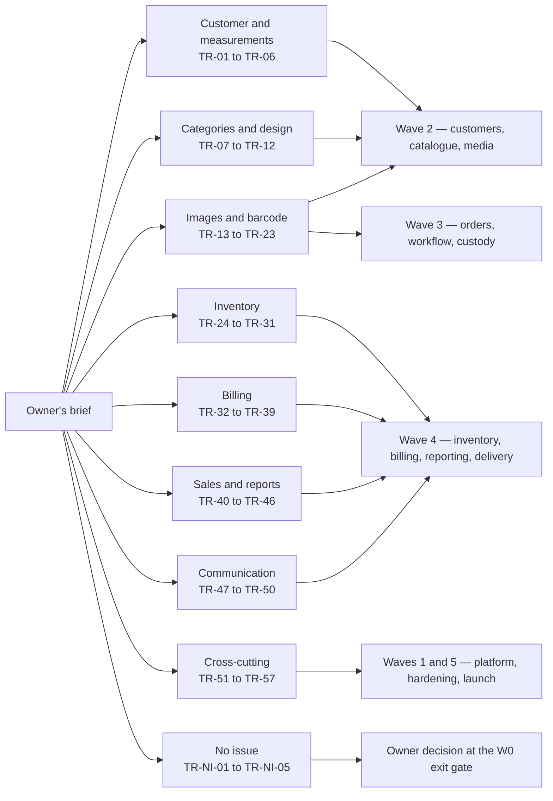

# Traceability — the owner's brief to the backlog

This document answers one question for every element of the original brief: where does it live in the workflows,
which module owns it, which backlog issue delivers it, and is it actually covered? It exists so that nothing the
owner asked for is quietly lost between a conversation and a sprint, and so that anything the platform will
**not** do is a recorded decision rather than an omission. Read it with
[`00-overview.md`](00-overview.md) for the twelve product outcomes,
[`assumptions-and-open-decisions.md`](assumptions-and-open-decisions.md) for the decision register, and
[`../IMPLEMENTATION_PLAN.md`](../IMPLEMENTATION_PLAN.md) Section 7 for the issue-to-wave-to-evidence matrix that
sits beneath this one.

> **Status: drafted for the owner workshop, not approved.** Section 6 lists the requests that no backlog issue
> covers; each carries a decision line that the owner must confirm or overturn at the W0 exit gate.

---

## 1. How to read this document

### 1.1 Columns

| Column | Meaning |
| --- | --- |
| **Original request** | The element of the brief, in the owner's language rather than the engineer's |
| **Workflow(s)** | Where it appears in the documented flows — a category map under [`workflows/`](workflows/), a lifecycle step in [`00-overview.md`](00-overview.md) section 3, or a transition in [`state-transitions.md`](state-transitions.md) |
| **Owning module** | The module that owns the data and the contract, from plan Section 4.3. No other module may read its tables |
| **Backlog issue(s)** | The GitHub issue that delivers it |
| **Status** | See 1.2 |

### 1.2 Status vocabulary

| Status | Meaning |
| --- | --- |
| **Covered** | A backlog issue delivers it and nothing is waiting on a decision |
| **Covered, decision open** | The issue exists, but an owner decision fixes how it behaves. The decision id is named in the cell |
| **New issue proposed** | No backlog issue covers it. Section 6 carries the decision line: raise an issue, or record it as out of scope |
| **Out of scope** | Deliberately excluded, with the reason and what adopting it would require, in [`assumptions-and-open-decisions.md`](assumptions-and-open-decisions.md) section 5 |
| **Deferred** | In the direction of travel but not in the first release, with its condition recorded in the same file, section 5.1 |

Request identifiers `TR-nn` are stable and are the reference used elsewhere in this documentation set. Proposed
new issues are `TR-NI-nn` until they are raised in the backlog and given a number.

---

## 2. Customer, measurements and the counter

| ID | Original request | Workflow(s) | Owning module | Backlog issue(s) | Status |
| --- | --- | --- | --- | --- | --- |
| TR-01 | "Customer name" — recorded, searchable, correctable, with the Tamil-script form where the customer gives one | Intake, all six category maps; [`workflows/kids.md`](workflows/kids.md) adds the child-to-guardian link | Customers/Measurements | #26 | **Covered** |
| TR-02 | "Customer phone" — recorded, validated, searchable by the last digits, never treated as unique, duplicates detected and merged only by an authorised decision | Intake, all category maps; EX-01 in [`exceptions.md`](exceptions.md) | Customers/Measurements | #26 | **Covered** |
| TR-03 | "Measurements taken from the customer" — captured against a per-category template, in inches or centimetres, stored canonically, never edited once confirmed | Measurement capture, all category maps; [`measurement-templates.md`](measurement-templates.md) | Customers/Measurements | #27 templates, #28 capture | **Covered, decision open** — field sets confirmed under **OD-10** |
| TR-04 | "Measurements go from the customer to the Tailor Master" — the workshop works from the figures the counter captured, not from a slip that can be lost | Order confirmation freezes a measurement snapshot on the garment job; job card and printable measurement sheet reach the workshop | Orders/Workflow (snapshot), Customers/Measurements (version), Platform (print queue) | #32a snapshot, #33 workboard, #35 print station and `measurement_sheet` document type | **Covered** |
| TR-05 | "Regular customers should not be re-measured every time" — previous versions offered for reuse, with provenance | Measurement capture; walkthrough 1 in [`walkthroughs.md`](walkthroughs.md) | Customers/Measurements | #28 | **Covered** |
| TR-06 | "Consent for holding measurements and photographs" — implied by the brief's request to store them | Intake; consent records per purpose | Customers/Measurements | #26, retention under #57 | **Covered, decision open** — retention periods under **OD-08** |

---

## 3. Categories, shape and design

| ID | Original request | Workflow(s) | Owning module | Backlog issue(s) | Status |
| --- | --- | --- | --- | --- | --- |
| TR-07 | "The stitching categories: Blouse pattern, Blouse Aari work, Salwar, Lehenga, Gown, Kids" | One workflow map per category under [`workflows/`](workflows/); [`category-hierarchy.md`](category-hierarchy.md) | Catalog/Design | #29 | **Covered, decision open** — the seeded hierarchy is confirmed under **OD-10** |
| TR-08 | "New categories must be possible without a new release" | [`configurable-vs-fixed.md`](configurable-vs-fixed.md); the "add a category without code" demo | Catalog/Design | #29 | **Covered** |
| TR-09 | "Shape and design" — the customer's choices recorded rather than described in a few words on a card | Design and images step, all category maps | Catalog/Design | #30 | **Covered, decision open** — the seeded option groups are confirmed under **OD-10** |
| TR-10 | "The workshop must see the same design the customer agreed to, even months later" | Design snapshot frozen at confirmation and rendered on the job card without a catalogue lookup | Catalog/Design (built), Orders/Workflow (stored) | #30, #32a | **Covered** |
| TR-11 | "Aari work is different from a plain pattern blouse" — its own lead time, its own phase, its own placement measurements and its own QC | [`workflows/blouse.md`](workflows/blouse.md) sections 2.3 and 2.4.4; walkthrough 2 | Catalog/Design, Orders/Workflow, Custody/Barcode | #29, #30, #33, #34, #37 | **Covered** |
| TR-12 | "Each category needs its own measurements, process and checks" | Every service type carries a measurement template, workflow definition, design option groups, price-list item and QC checklist | Catalog/Design | #27, #29, #30, #33, #34, #41 | **Covered** |

---

## 4. Images, barcode tracking and the workshop

| ID | Original request | Workflow(s) | Owning module | Backlog issue(s) | Status |
| --- | --- | --- | --- | --- | --- |
| TR-13 | "Image upload for the customer's material" | Design and images step, all category maps | Media | #31 | **Covered** |
| TR-14 | "Image upload for reference images" — the photograph on the customer's phone or the catalogue book | Design and images step; walkthrough 2 | Media | #31 | **Covered** |
| TR-15 | "The tailor must be able to see those images" — without the images becoming public URLs | Job card; every media request is re-authorised and streamed, never redirected to storage | Media | #31, #24 | **Covered** |
| TR-16 | Condition evidence — photographs at custody transfer, at QC failure and at doorstep handover | [`workflows/blouse.md`](workflows/blouse.md) specialist transfer; EX-04, EX-12, EX-13 | Media, Orders/Workflow, Custody/Barcode | #31, #34, #37, #48 | **Covered** |
| TR-17 | "Barcode tracking of every garment" — one opaque identity per garment job, no customer data on the label | Barcode allocation inside the confirmation transaction, all category maps | Custody/Barcode | #35 | **Covered** |
| TR-18 | "Barcode at each phase" — intake, Tailor Master, production, QC, delivery team, payment clearance, dispatch, feedback | Phases and custody, all category maps; [`state-transitions.md`](state-transitions.md) section 4 | Custody/Barcode, Orders/Workflow | #33, #35, #36, #37 | **Covered** |
| TR-19 | "Scanning must work on the shop's phones and on the counter scanner" — camera, keyboard-wedge and a manual fallback | Scanner experience; EX-07 | Custody/Barcode (server), PWA | #36 | **Covered, decision open** — device and scanner matrix under **OD-07** |
| TR-20 | "Printed labels that survive the workshop" | Label print and verify; EX-07 reprint | Custody/Barcode, Platform (print queue) | #35 | **Covered, decision open** — label size and whether a QR accompanies the Code 128 under **OD-09** |
| TR-21 | "Know who is holding a garment right now, and who had it before" | Custody transfers and scan events, append-only | Custody/Barcode | #37 | **Covered** |
| TR-22 | "Work sent to an outside Aari specialist must be accounted for" | Two-sided custody transfer with condition evidence on both legs | Custody/Barcode, Inventory | #37, #39 | **Covered** |
| TR-23 | "When a garment cannot be found, there must be a record, not an argument" | EX-13 reconciliation cases | Custody/Barcode | #37 | **Covered** |

---

## 5. Inventory, billing, sales and reports

### 5.1 Stock inventory with reports

| ID | Original request | Workflow(s) | Owning module | Backlog issue(s) | Status |
| --- | --- | --- | --- | --- | --- |
| TR-24 | "Stock inventory" — items, units, suppliers, locations | Material issue step; [`configurable-vs-fixed.md`](configurable-vs-fixed.md) | Inventory | #38 | **Covered, decision open** — the opening item list under **OD-10** |
| TR-25 | "Know what was used on which garment" — issue, consumption, return and wastage booked against the job and phase | Material issue and the phases that consume; walkthroughs 2 and 6 | Inventory | #39 | **Covered** |
| TR-26 | "Purchases recorded" — purchase orders, receipts, cost, supplier, evidence | Stock receipt; EX-02 replenishment | Inventory | #39 | **Covered** |
| TR-27 | "Stock reports" — on hand, available, reserved, in transit, per item and location, plus the replenishment list | Inventory reports, served from the ledger and not from a reporting projection | Inventory | #40, cross-module analysis #46 | **Covered** |
| TR-28 | "Low-stock alert" — raised, acknowledged, snoozed, escalated and cleared, without repeating itself | EX-02; alert policy per branch | Inventory (evaluation), Notifications/Feedback (routing) | #40, #47 | **Covered, decision open** — alert channel and recipients under **OD-15**, providers under **OD-03** |
| TR-29 | "Physical counting" — stocktake with recount, variance explanation and approval by a second person | Stocktake; [`raci.md`](raci.md) row 23 | Inventory | #40 | **Covered** |
| TR-30 | "What is the stock worth" | Valuation runs at a cut-off | Inventory | #40 | **Covered, decision open** — valuation method under **OD-05** |
| TR-31 | "The customer's own cloth must be tracked but never counted as ours" | Customer-material custody at intake and its return | Inventory | #38 | **Covered** |

### 5.2 Billing with product name, rate, total with GST and an integrated barcode

| ID | Original request | Workflow(s) | Owning module | Backlog issue(s) | Status |
| --- | --- | --- | --- | --- | --- |
| TR-32 | "The bill must show the product name" — the garment and service, in the words the customer recognises, one line per garment job | Payment settlement; every walkthrough's money table | Billing/Payments | #42 | **Covered** |
| TR-33 | "The bill must show the rate" — from a versioned price list, with design option impacts visible | Estimate and invoice | Billing/Payments | #41, #42 | **Covered, decision open** — opening rates under **OD-10** |
| TR-34 | "The total with GST" — CGST and SGST intra-state, IGST inter-state, decided by place of supply, with round-off | Estimate and invoice; plan D10 | Billing/Payments | #41 engine, #42 documents | **Covered, decision open** — rates, SAC/HSN mapping, rounding and round-off confirmed with the accountant under **OD-05** |
| TR-35 | "The bill must carry the barcode too" — an `I-` identity on the invoice and an `R-` identity on the receipt, so a document can be pulled up by scanning it | Payment settlement | Billing/Payments, Custody/Barcode (namespace) | #35 namespaces, #42 invoice barcode, #43 receipt | **Covered** |
| TR-36 | "Advances and balances" — money taken before the invoice exists, held unapplied, then allocated | Advance collection and payment settlement; every walkthrough | Billing/Payments | #43 | **Covered** |
| TR-37 | "Nothing leaves the shop unpaid" | Dispatch gate; EX-10, EX-15; walkthrough 3 | Billing/Payments (eligibility), Custody/Barcode (enforcement) | #43, #37, #48 | **Covered, decision open** — the payment rule, the exception approver and doorstep collection under **OD-04** |
| TR-38 | "Cash must add up at the end of the day" | Cashier session open, count, close and reconcile | Billing/Payments | #43 | **Covered** |
| TR-39 | "Cancellations and refunds" | EX-08, EX-09 | Orders/Workflow (cancellation), Billing/Payments (credit note, refund) | #34, #42, #43 | **Covered, decision open** — whether an advance is refundable, and with which approval, under **OD-04** with **OD-05** |

### 5.3 Sales tracking and reports

| ID | Original request | Workflow(s) | Owning module | Backlog issue(s) | Status |
| --- | --- | --- | --- | --- | --- |
| TR-40 | "Sales tracking" — what was sold, by day, branch, category and service type | Reporting, from posted invoices only | Reporting | #44 | **Covered** |
| TR-41 | "Sales reports the accountant can use" — GST summary reconciling to the posted documents | Reporting | Reporting | #44 | **Covered, decision open** — format and statutory retention under **OD-05** and **OD-08** |
| TR-42 | "Who still owes us money" | Receivables and ageing | Reporting, Billing/Payments | #44 | **Covered** |
| TR-43 | "How much work is in the shop, and is it late" | Pipeline, workload, turnaround and quality analytics | Reporting | #45 | **Covered** |
| TR-44 | "Which categories actually make money" | Profitability, combining price snapshots with consumption | Reporting, Inventory, Billing/Payments | #46 | **Covered, decision open** — costing assumptions under **OD-05** |
| TR-45 | "Send me the numbers without my asking" | Scheduled reports and governed exports | Reporting | #44, #46 | **Covered, decision open** — delivery channel under **OD-03** |
| TR-46 | "Reports must agree with the bills and the ledger" | Reconciliation runs; projections are never authoritative | Reporting | #44, #45, #46 | **Covered** |

### 5.4 Communication, feedback and alterations

These are not separate lines of the brief but are inseparable from it: the brief asks for the customer to be told
when the garment is ready and for alterations to stop being forgotten.

| ID | Original request | Workflow(s) | Owning module | Backlog issue(s) | Status |
| --- | --- | --- | --- | --- | --- |
| TR-47 | "Tell the customer when it is ready, and when the date moves" | Ready and reschedule steps; EX-06 | Notifications/Feedback | #47, #48 | **Covered, decision open** — vendors under **OD-03** |
| TR-48 | "Let the customer see the status without ringing the shop" | Expiring, purpose-bound status link | Notifications/Feedback | #48 | **Covered** |
| TR-49 | "Ask what the customer thought" | Feedback invitation and response | Notifications/Feedback | #49 | **Covered** |
| TR-50 | "An alteration must never be forgotten again" | Alteration request, decision and its own garment job; EX-11 | Orders/Workflow, Notifications/Feedback | #34, #49 | **Covered** |

---

## 6. Cross-cutting requirements

The brief asked for a system that is production grade, secure, maintainable, upgradable, integrable, scalable and
extensible. Each is traced the same way, because each is a requirement that can be tested and evidenced, not an
adjective.

| ID | Original request | Where it is realised in the workflows | Owning module or area | Backlog issue(s) | Status |
| --- | --- | --- | --- | --- | --- |
| TR-51 | **Production grade** — it must work on the shop's real devices, every day, and someone must know when it does not | Every workflow runs on the supported device matrix; health probes, alerting and runbooks sit under all of them | Platform.Observability, infrastructure | #19 NFRs and SLOs, #52 cross-browser and performance, #58 observability and load, #60 backups and DR, #61c UAT, pilot and go-live | **Covered, decision open** — hosting model **OD-02**, device matrix **OD-07**, telemetry backend **OD-14**, operations ownership **OD-15**; all numeric targets are **proposed, to be confirmed** by #19 |
| TR-52 | **Secure** — customer data, measurements, photographs and money are protected, and every action is attributable | Authentication and branch scope on every step of every workflow; audit on every state change | Identity/Admin, Platform.Security, Media | #23 authentication and sessions, #24 authorisation and branch scope, #53 API standards, #56a threat models and ASVS, #56b security baseline and penetration test, #57 privacy, audit and secrets | **Covered, decision open** — authentication strategy **OD-12**, permission matrix **OD-13**, retention **OD-08** |
| TR-53 | **Maintainable** — a change in one part must not break another, and a new engineer must be able to find their way | Module ownership makes every workflow's data boundaries explicit; architecture tests fail a forbidden reference | Whole solution | #18 architecture, ADRs and `ARCH-…` rules, #20 scaffold and architecture tests, #22 CI governance and `CLAUDE.md`, #61a test strategy and fixtures | **Covered** |
| TR-54 | **Upgradable** — new versions must go in without losing a day's work or a day's data | Expand-migrate-contract migrations, build-once-promote-the-digest releases, rehearsed rollback, and a PWA update flow that refuses outdated clients with a clear message | Platform.Persistence, infrastructure, PWA | #21 migrations, #51 PWA install and update, #59 environments, CI/CD and releases | **Covered, decision open** — hosting model **OD-02** fixes the deployment target |
| TR-55 | **Integrable** — it must be able to talk to messaging, payment and accounting systems | Notification sends, payment intents and the accounting export hang off the workflows through ports, never inside a database transaction | Integration | #53 OpenAPI and API standards, #54 integration events and webhooks, #55 provider adapters and accounting export | **Covered, decision open** — vendors and the accounting target under **OD-03** |
| TR-56 | **Scalable** — more branches, more orders and more staff must not require a rewrite | Branch-aware from day one: `organisation_id` and `branch_id` on every operational aggregate, per-branch sequences, per-branch calendars and alert policies | Whole solution | #19 capacity and performance targets, #58 load, soak and mixed-load tests, #59 environments | **Covered, decision open** — measured targets replace assumption A3 in #19; growing beyond a single web replica additionally requires the connection budget to be recomputed or PgBouncer, and a distributed cache, both **Deferred** in [`assumptions-and-open-decisions.md`](assumptions-and-open-decisions.md) section 5.1 |
| TR-57 | **Extensible** — the shop must be able to add a category, a design option, a phase or a checklist without calling the developers | The taxonomy behind every workflow is versioned data: categories, service types, templates, option groups, workflow definitions, QC checklists, price lists, tax configuration, alert and retention policies | Catalog/Design, Orders/Workflow, Customers/Measurements, Billing/Payments, Platform | #29, #27, #30, #33, #34, #41, plus feature flags in #21 and #25 | **Covered** |

---

## 7. Requests with no backlog issue — decision lines

Each row below is a request, or a reasonable reading of one, that **no** backlog issue covers. Rule: none of them
may be left as a silence. Each carries a proposed decision that the owner confirms or overturns at the W0 exit
gate, and the outcome is transcribed into
[`assumptions-and-open-decisions.md`](assumptions-and-open-decisions.md).

| ID | Request | Proposed decision | Reason | Owner | Raised |
| --- | --- | --- | --- | --- | --- |
| **TR-NI-01** | Supplier payments and accounts payable — the money side of "stock inventory" | **New issue proposed** if the owner wants payables in the platform; otherwise **out of scope**. The plan's position: out of scope for the first release | Purchase orders and receipts are recorded (#39) and flow to the accountant through the accounting export adapter (#55). Paying suppliers, ageing payables and reconciling supplier statements are the accountant's ledger, and building a second money system would double the audit surface for no counter benefit | Business owner, with the accountant | 2026-09-04 |
| **TR-NI-02** | Petty cash and other cash paid **out** at the counter — tea, auto fare, small purchases | **New issue proposed** if the owner wants the cash book replaced entirely; otherwise **out of scope** | The cashier session records tender taken in, the expected-against-counted totals and the variance with a reason (#43). Cash paid out is not modelled, so a session that funds a small purchase will show a variance that must be explained rather than categorised. Modelling it means a petty-cash ledger with its own approvals | Business owner, with the accountant | 2026-09-04 |
| **TR-NI-03** | Tailor piece-rate wages calculated from recorded work | **Out of scope**, already recorded | The platform records who worked which phase and for how long, and #45 turns that into workload and turnaround analytics — the data a future piece-rate calculation would need. Computing and paying earnings is payroll, which is out of scope in [`assumptions-and-open-decisions.md`](assumptions-and-open-decisions.md) section 5 | Business owner | 2026-09-04 |
| **TR-NI-04** | Order intake and billing while the internet is down at the counter | **Out of scope for the first release**, by design | Only approved idempotent operations are queued offline — scan submissions and the doorstep delivery-confirmed scan. Billing, payment and intake are online-only and show an explicit "needs connection" state rather than pretending to succeed (plan Section 4.6). Queuing an order intake offline would mean an order with no allocated number, no barcode identity and no price snapshot. If the branch loses connectivity often enough to matter, the evidence belongs to **OD-02** and **OD-07** and a new issue is raised then | Business owner, with the technical reviewer | 2026-09-04 |
| **TR-NI-05** | Appointment booking for trial fittings | **Out of scope for the first release** | A trial fitting is already a configured, optional workflow phase (used in [`workflows/lehenga.md`](workflows/lehenga.md) and walkthrough 4), so the fitting is recorded and visible on the workboard. A calendar of customer appointment slots, with reminders and rescheduling, is a separate surface and was not asked for | Business owner | 2026-09-04 |

Requests already recorded as out of scope elsewhere are **not** repeated here: customer self-service accounts,
multi-legal-entity tenancy, e-commerce and online ordering, payroll and microservices are in
[`assumptions-and-open-decisions.md`](assumptions-and-open-decisions.md) section 5, and Tamil as a launch
language, an external client API, presigned media URLs, Kubernetes and a distributed cache are deferred in section
5.1 of the same file.

---

## 8. Coverage at a glance

| Group | Requests | Covered | Covered, decision open | New issue proposed | Out of scope or deferred |
| --- | --- | --- | --- | --- | --- |
| Customer and measurements (TR-01 to TR-06) | 6 | 4 | 2 | – | – |
| Categories and design (TR-07 to TR-12) | 6 | 4 | 2 | – | – |
| Images and barcode tracking (TR-13 to TR-23) | 11 | 9 | 2 | – | – |
| Inventory (TR-24 to TR-31) | 8 | 5 | 3 | – | – |
| Billing (TR-32 to TR-39) | 8 | 4 | 4 | – | – |
| Sales and reports (TR-40 to TR-46) | 7 | 4 | 3 | – | – |
| Communication and feedback (TR-47 to TR-50) | 4 | 3 | 1 | – | – |
| Cross-cutting (TR-51 to TR-57) | 7 | 2 | 5 | – | – |
| No issue (TR-NI-01 to TR-NI-05) | 5 | – | – | 2 conditional | 3 |
| **Total** | **62** | **35** | **22** | **2 conditional** | **3** |

Every element of the brief is therefore either delivered by a named issue or carries an explicit decision. Nothing
is silent. The twenty-two "decision open" rows are not gaps in the design; they are places where the plan has an
engineering default and the business has the final word, and every one of them names the decision in
[`assumptions-and-open-decisions.md`](assumptions-and-open-decisions.md).

---

## 9. Maintenance

This table is amended by pull request only. Three rules keep it honest:

1. **A new request gets a row before it gets a branch.** A request that reaches the backlog without a row here is
   a process failure, and the pull request that adds the issue adds the row.
2. **A status never improves without evidence.** "Covered, decision open" becomes "Covered" only in the pull
   request that records the decision in
   [`assumptions-and-open-decisions.md`](assumptions-and-open-decisions.md), and never before.
3. **A row is never deleted.** A request that turns out to be out of scope keeps its row with the reason, so that
   the same conversation is not had twice a year later.

The table is walked with the owner at the W0 exit gate alongside
[`reviews/exception-review.md`](reviews/exception-review.md), and the issue-level view of the same information —
wave, branch, size, dependencies and required evidence — stays in
[`../IMPLEMENTATION_PLAN.md`](../IMPLEMENTATION_PLAN.md) Section 7.
