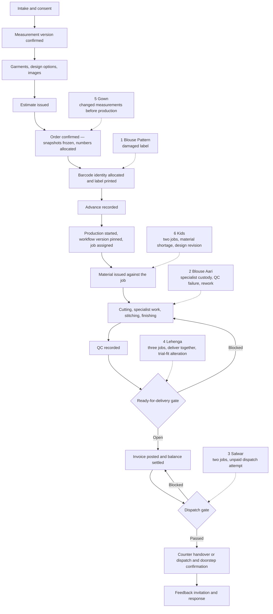

# End-to-end walkthroughs

Six worked examples, one per stitching category, that follow a single order from the moment a customer reaches the
counter to the moment feedback is recorded. They exist so that the workflow maps can be checked against something
concrete: a name, a date, an amount in rupees, a barcode payload and a numbered document. Where a walkthrough
turns off the happy path it says which exception from [`exceptions.md`](exceptions.md) it is exercising, so the
set doubles as the source for the business-scenario regression suite of issue #61b and for the training material
of issue #61c.

Read these with the category workflow maps in [`workflows/`](workflows/), which give the phases and the exception
flows in full; the walkthroughs do not repeat them, they instantiate them. Terms are defined in
[`glossary.md`](glossary.md), transitions in [`state-transitions.md`](state-transitions.md), and who answers for
each step in [`raci.md`](raci.md).

> **Status: drafted for the owner workshop, not approved.** Every rate, lead time, tax rate and reason code below
> is illustrative seed data awaiting the owner's confirmation — see section 1.3 and
> [`assumptions-and-open-decisions.md`](assumptions-and-open-decisions.md).

---

## 1. How to read a walkthrough

### 1.1 The shared spine

Every walkthrough runs the same spine. What differs is where it branches, how many garment jobs the order carries,
and which exception it meets.

### 1.2 Sample data conventions

All names, phone numbers, amounts and payloads below are **synthetic**. Production never receives synthetic
seeding (plan Section 2.2), and no real customer appears in this documentation set.

| Convention | Value used here | Fixed by |
| --- | --- | --- |
| Branch | `CBE01`, a single branch in Coimbatore, Tamil Nadu, timezone `Asia/Kolkata` | The launch branch list is **OD-06**; `CBE01` is illustrative |
| Working calendar | Monday to Saturday working, Sunday non-working, no public holiday in the periods shown | Branch working calendar, **OD-06** |
| Financial year | 2026-27 (1 April 2026 to 31 March 2027), rendered in display numbers as `2627` | Plan D9/D10 fix the financial year; the exact rendering of the token is fixed by issue #42 |
| Order, job, estimate numbers | `O-CBE01-2627-000512`, `J-CBE01-2627-000512-01`, `E-CBE01-2627-000418` | Plan D9 |
| Invoice and receipt numbers | Rendered as `INV-CBE01-2627-000731` and `RCPT-CBE01-2627-001204`; the prefixes are fixed by issue #42 | Issue #42 |
| Customer number | `C-CBE01-004182` | Plan D9 |
| Barcode payload | `G-` plus eleven random Crockford base32 characters plus one check character, for example `G-7K3M9QW2XZ4B`. Namespaces `S-` stock, `I-` invoice, `R-` receipt | Plan D9. The payloads here are **illustrative**: their final character is shown as a check character but is not computed with the production checksum |
| Configuration codes | Price list `PL_CBE01`, workflow definitions `WF_BLOUSE_PATTERN`, `WF_BLOUSE_AARI`, `WF_SALWAR`, `WF_GOWN`, `WF_KIDS`, and the version numbers quoted for catalog, template, workflow and QC-checklist versions, are all illustrative | Category, service-type and template codes follow [`category-hierarchy.md`](category-hierarchy.md); price-list and workflow codes are seeded under **OD-10** |
| Money | INR, `decimal`, line rounding half-up to paise, document round-off to the nearest rupee | Plan D10 |
| Tax | Intra-state supply within Tamil Nadu: CGST 2.5% + SGST 2.5% on stitching services under SAC 998821 | **Illustrative.** The tax configuration version, rates, SAC/HSN mapping and round-off convention are confirmed by the accountant under **OD-05** |
| Times | Indian Standard Time, 12-hour display; stored in UTC | Plan D11 |

### 1.3 Staff appearing in the walkthroughs

| Role | Person (synthetic) |
| --- | --- |
| Reception | Kalaiselvi R., holding `measurements.capture` |
| Tailor Master | Murugesan P. |
| Tailor | Shanthi K. (blouse and choli), Ramesh V. (salwar and gown), Latha M. (kids) |
| Aari specialist | Anbu Aari Works, an external unit that receives garments by custody transfer |
| Inventory Clerk | Vijaya S. |
| Cashier | Deepa N. |
| Delivery Staff | Arun T. |
| Branch Manager | Saravanan M. |
| Owner | The proprietor |

### 1.4 What every walkthrough ends with

Each one closes with the artefacts it produced: the estimate, the job card, the labels, the invoice, the receipts
and the feedback request, plus anything the exception added. An artefact that is not produced is stated as not
produced rather than left out, so the list can be checked at the workshop.

---

## 2. Walkthrough 1 — Blouse, Pattern: the reference journey

A regular customer brings a saree and a blouse piece for a pattern blouse. The journey is the happy path from end
to end, with one internal recovery: the label is soaked at the wash basin on day two and has to be reprinted
(**EX-07**).

| Item | Value |
| --- | --- |
| Customer | Kavitha Raman, `C-CBE01-004182`, +91 98430 21174, existing customer since FY 2025-26 |
| Branch and category | `CBE01`; `BLOUSE_PATTERN.STITCHING` |
| Measurement template | `MT_BLOUSE_PATTERN` version 1, published 1 April 2026 |
| Placed | Monday 4 May 2026, 10:55 IST |
| Promised | Thursday 7 May 2026 (3 working days) |
| Order | `O-CBE01-2627-000512`, one garment job `J-CBE01-2627-000512-01` |
| Barcode identity | `G-7K3M9QW2XZ4B`, superseded on 5 May by `G-6MTB4XZ9DKQ2` |
| Total | ₹609.00, advance ₹300.00, balance ₹309.00 |

### 2.1 The narrative

1. **10:55 — Reception searches by phone.** Kalaiselvi types the last six digits, `021174`, into the segmented
   phone search. One record matches: Kavitha Raman, last order 12 February 2026. No duplicate candidate is raised.
   Reception opens the record; contact details are visible because Reception holds `customers.read_contact`.
2. **10:57 — consent is checked.** The consent card shows `measurement_storage` and `transactional_messages`
   recorded on 3 August 2025 against wording version 1, and `photo_capture` not recorded. Kalaiselvi asks, the
   customer agrees, and `photo_capture` is recorded against wording version 1 with source "counter, verbal".
3. **11:00 — measurements are captured.** The wizard opens `MT_BLOUSE_PATTERN` version 1 with the previous
   version's values offered for reuse. The customer has lost weight, so Kalaiselvi captures a new draft in inches
   and the system stores millimetres: blouse length 380 mm (15 in), shoulder 355 mm (14 in), chest 890 mm (35 in),
   waist 760 mm (30 in), armhole 430 mm (17 in), sleeve length 230 mm (9 in), sleeve round 280 mm (11 in),
   front neck depth 180 mm (7 in), back neck depth 230 mm (9 in), cross front 340 mm, cross back 355 mm, dart
   point 250 mm, apex to apex 190 mm. Two values fall inside the confirm band and none inside the reject band, so
   no warning is shown.
4. **11:06 — the version is confirmed.** The draft is consumed exactly once and becomes measurement version 4 for
   this customer, immutable, taken by Kalaiselvi, reason "new measurements, customer request".
5. **11:08 — the garment is added to the draft order.** Category `BLOUSE_PATTERN`, service type `STITCHING`.
   Design options: front neck `KATORI`, back neck `ROUND_DEEP`, sleeve `THREE_QUARTER`, closure `HOOK`, lining
   `KATORI_CUP`, finish `PIPING`. The design rule "padding requires lining" is satisfied; nothing is blocked.
6. **11:12 — images are captured.** Two photographs of the saree and blouse piece and one reference photograph
   from the customer's phone are uploaded. Each is quarantined, virus-scanned, stripped of metadata, re-encoded
   and given a thumbnail before it appears on the draft; the reference image carries the alternative text
   "customer's reference blouse, katori neck".
7. **11:15 — the estimate is issued.** `E-CBE01-2627-000418`, valid to 11 May 2026, marked *Estimate — not a tax
   invoice*, ₹609.00 including GST. It is shared to the customer's phone as an expiring customer link with
   purpose `estimate`.
8. **11:20 — the order is confirmed.** One transaction: catalogue availability validated against published
   catalog version 3, measurement, design and price snapshots frozen, `O-CBE01-2627-000512` and
   `J-CBE01-2627-000512-01` allocated, barcode identity `G-7K3M9QW2XZ4B` allocated by the confirmation
   participant, `OrderConfirmed` and `GarmentJobCreated` written to the outbox. Due date 7 May 2026, derived from
   the three working-day duration of `BLOUSE_PATTERN.STITCHING` against the `CBE01` calendar.
9. **11:22 — the label is printed.** Kalaiselvi sends the label to the counter print station; it prints with the
   job number, the category cue "Blouse — Pattern", the due cue "Thu 07 May" and the branch code. The verify step
   scans the printed label before it is tied to the bundle, and `label_verified` is recorded.
10. **11:25 — the advance is taken.** Deepa records ₹300.00 in cash against the order in the open cashier session
    and issues receipt `RCPT-CBE01-2627-001204`. The advance is held unapplied because no invoice exists yet.
11. **4 May, 14:30 — production starts.** Murugesan starts production on the job. Workflow definition
    `WF_BLOUSE_PATTERN` version 2 is pinned onto the job, its phases are created, and the job is assigned to
    Shanthi, who holds the capability for `BLOUSE_PATTERN` cutting and stitching. Order revision is refused from
    this moment.
12. **4 May, 14:35 — material is issued.** The customer's saree and blouse piece are recorded as customer-material
    custody against the job and are never valued. From shop stock, Vijaya issues 0.25 m of cotton lining
    (`S-9XR2VT6KHB3D`), one hook card and one reel of matching thread, consumed against the job.
13. **5 May, 09:10 — the label is damaged (EX-07).** Shanthi's phone cannot decode the soaked label. She uses
    manual entry, picks the job from her own queue with the reason "label unreadable — water damage", and the
    confirmation card shows the job. Because the label cannot be relied on, Saravanan approves a reprint with
    step-up: `G-7K3M9QW2XZ4B` is superseded and `G-6MTB4XZ9DKQ2` inserted as the new active identity in one
    transaction under the job's row lock. The new label is printed, verified by scan, attached, and the old label
    destroyed. The old payload keeps resolving as `superseded` for ever.
14. **5 May, 09:40 to 6 May, 16:20 — the garment is made.** Shanthi scans to take custody, then works and closes
    each phase with server timestamps: cutting (ease applied from the published `BLOUSE_PATTERN` standard, not by
    inflating a stored measurement), stitching, finishing.
15. **6 May, 16:45 — QC.** Shanthi hands over by scan to the QC custodian. Murugesan records the result against
    QC checklist version 2 for `BLOUSE_PATTERN`: all eleven criteria pass, including the katori symmetry and the
    hook alignment checks. The evaluated criteria are copied into the result.
16. **6 May, 16:47 — the ready gate opens.** Workflow complete, QC passed with no open rework, evidence complete,
    no open hold, no dependencies, custody reconciled. `ready_state` becomes true and `JobReadyForDelivery` is
    published. The job appears in the branch delivery queue.
17. **6 May, 16:50 — the customer is told.** Notifications sends a "ready for collection" message on the consented
    channel with a status link. The send is recorded as delivered.
18. **7 May, 11:05 — collection at the counter.** Kavitha arrives. Reception finds the job by scanning the label.
    `ready_state` is true, so Deepa posts invoice `INV-CBE01-2627-000731` and takes the balance of ₹309.00 by UPI,
    issuing receipt `RCPT-CBE01-2627-001366`. The ₹300.00 advance is allocated to the invoice automatically,
    oldest first.
19. **7 May, 11:09 — handover.** Dispatch eligibility returns `Paid`. Reception records the counter handover scan;
    custody passes to the customer and the delivery queue entry closes.
20. **7 May, 17:00 — feedback.** The worker sends a feedback invitation with a one-time link. Kavitha responds the
    same evening: overall 5, fit 5, stitching 5, timeliness 5, comment "neck is exactly as the sample". No
    service-recovery case is opened.

### 2.2 The money

| Line | Basis | Amount |
| --- | --- | --- |
| Blouse stitching — `BLOUSE_PATTERN.STITCHING` | Price list `PL_CBE01` version 4, SAC 998821 | ₹450.00 |
| Katori cup lining | Design option price impact | ₹90.00 |
| Piping finish | Design option price impact | ₹40.00 |
| **Taxable value** | | **₹580.00** |
| CGST @ 2.5% | Intra-state supply, place of supply Tamil Nadu | ₹14.50 |
| SGST @ 2.5% | | ₹14.50 |
| Round-off | To the nearest rupee | ₹0.00 |
| **Invoice total** | | **₹609.00** |
| Advance received 4 May | Cash, `RCPT-CBE01-2627-001204` | ₹300.00 |
| Balance received 7 May | UPI, `RCPT-CBE01-2627-001366` | ₹309.00 |

### 2.3 Artefacts produced

| Artefact | Reference | Where it lives |
| --- | --- | --- |
| Estimate | `E-CBE01-2627-000418`, PDF plus expiring customer link | Billing `documents/` prefix; link purpose `estimate` |
| Job card | `J-CBE01-2627-000512-01`, printed at the counter and available on screen | Orders/Workflow; shows customer name and job number only, never contact details |
| Labels | Two prints: `G-7K3M9QW2XZ4B` (superseded), `G-6MTB4XZ9DKQ2` (active), both with a `label_prints` audit row | Custody/Barcode |
| Invoice | `INV-CBE01-2627-000731`, ₹609.00, posted and immutable, carrying an `I-` barcode | Billing/Payments |
| Receipts | `RCPT-CBE01-2627-001204` (₹300.00 advance), `RCPT-CBE01-2627-001366` (₹309.00 balance), each with an `R-` barcode | Billing/Payments |
| Feedback request | One-time feedback link, response recorded 7 May 17:42 IST | Notifications/Feedback |
| Also produced | Measurement version 4 and its printable measurement sheet; consent record for `photo_capture`; three media objects with derivatives; one manual-entry scan event with a reason; one reprint audit record with step-up | Customers, Media, Custody |

**Exceptions exercised:** EX-07 damaged or unreadable label.

---

## 3. Walkthrough 2 — Blouse, Aari work: the garment leaves the shop

A festival blouse with hand embroidery. The garment goes out to an Aari specialist and comes back, QC finds
insecure stones, and a rework costs one working day (**EX-04**, **EX-05**), which moves the promised date and
therefore generates a reschedule message.

| Item | Value |
| --- | --- |
| Customer | Revathi Murugan, `C-CBE01-004610`, +91 94420 66315, new customer |
| Branch and category | `CBE01`; `BLOUSE_AARI.STITCHING` |
| Measurement template | `MT_BLOUSE_AARI` version 1 |
| Placed | Tuesday 2 June 2026, 17:40 IST |
| Promised | Tuesday 16 June 2026 (10 working days), rescheduled to Wednesday 17 June 2026 |
| Order | `O-CBE01-2627-000689`, one garment job `J-CBE01-2627-000689-01` |
| Barcode identity | `G-4Q7NBX2K9WMT` |
| Total | ₹4,557.00, advance ₹2,000.00, balance ₹2,557.00 |

### 3.1 The narrative

1. **17:40 — a new customer.** No record matches +91 94420 66315. Kalaiselvi creates one; the duplicate panel
   scores two candidates on name similarity and shows a masked disambiguation card for each — different phone,
   different last-order branch — so she creates the new record and the reason is recorded.
2. **17:44 — consent.** `measurement_storage`, `photo_capture`, `transactional_messages` and `feedback_requests`
   are recorded; `marketing_messages` is declined and the decline is stored as a consent record, not as an
   absence.
3. **17:50 — measurements.** `MT_BLOUSE_AARI` version 1 shows the fifteen bodice fields plus the Aari placement
   group. The placement fields appear only after the design selection, so Kalaiselvi captures the bodice fields
   first: blouse length 400 mm, shoulder 360 mm, chest 940 mm, waist 810 mm, armhole 445 mm, sleeve length
   150 mm, sleeve round 300 mm, front neck depth 200 mm, back neck depth 250 mm, cross front 350 mm, cross back
   365 mm, dart point 260 mm, apex to apex 200 mm.
4. **17:58 — design.** Front neck `SWEETHEART`, sleeve `CAP`, closure `HOOK`, Aari motif `PEACOCK_MEDIUM`,
   density `MEDIUM`, stone type `AD_STONE`, placement `FRONT` + `NECK` + `SLEEVE`. Selecting the placement
   reveals the placement measurements, which are then captured: front work height 300 mm, front work width
   240 mm, neck band depth 60 mm, sleeve band length 120 mm.
5. **18:05 — the version is confirmed** and the reference photographs of the motif the customer wants are
   uploaded and attached to the garment.
6. **18:10 — the estimate.** `E-CBE01-2627-000605` shows the stitching charge and each embroidery component on
   its own line, together with the ten working-day lead time. The customer accepts at the counter.
7. **18:14 — order confirmed.** `O-CBE01-2627-000689`, job `-01`, identity `G-4Q7NBX2K9WMT`, due 16 June 2026
   derived from the `BLOUSE_AARI.STITCHING` duration against the branch calendar — not from a promise at the
   counter.
8. **18:16 — label printed and verified**; **18:20 — advance ₹2,000.00 in cash**, receipt
   `RCPT-CBE01-2627-001487`.
9. **3 June, 09:30 — production starts.** `WF_BLOUSE_AARI` version 2 is pinned; it carries the conditional
   Specialist work phase between cutting and stitching. Cutting is assigned to Shanthi.
10. **3 June, 09:40 — material issued.** Customer's blouse piece taken into customer-material custody with two
    condition photographs. From shop stock: one AD stone and bead kit (`S-9XR2VT6KHB3D`, ₹340.00 charged on),
    embroidery thread, and 0.5 m of backing cloth, all reserved then consumed against the job.
11. **3 June, 11:15 — cutting.** Shanthi scans to take custody and cuts the panels with the wider Aari ease from
    the published standard.
12. **3 June, 15:00 — transfer out to the specialist.** Murugesan raises a custody transfer to Anbu Aari Works
    with four condition photographs and the list of trims issued. The transfer is pending until the specialist's
    receive scan; custody, and accountability for the garment, sit with the specialist while it is away.
13. **12 June, 16:30 — the work comes back.** The specialist's return leg is received by Murugesan's scan. The
    condition photographs are compared against the send evidence, the returned trims are recorded, and the
    unused stones are returned to stock as a ledger `return` entry.
14. **13 June to 15 June — stitching and finishing** by Shanthi, each phase started and completed by scan.
15. **15 June, 16:10 — QC fails (EX-04).** Murugesan records the result against QC checklist version 2 for
    `BLOUSE_AARI`. Nine criteria pass; "stone security — no movement under light pull" fails on the left sleeve
    band with defect code `AARI_STONE_LOOSE` and two evidence photographs. The failed result is immutable; the
    ready gate stays closed with the blocking reason `QcPassed = false`.
16. **15 June, 16:15 — rework opened (EX-05).** Murugesan opens a rework naming the Specialist work phase, reason
    "loose stones, left sleeve band". The job returns to that phase without losing history; the earlier phase
    completions stay attributed to Shanthi and to the specialist.
17. **15 June, 16:20 — the promised date moves.** Because the rework costs a working day, Murugesan reschedules
    the job to 17 June with the reason "rework after QC". Notifications sends a reschedule message on the
    consented channel; the original date stays visible in the job's history. The customer is told the date has
    moved, not that QC failed — see **XQ-05**.
18. **16 June — rework and re-QC.** The sleeve band is re-secured by the specialist's visiting worker at the
    branch, so no second custody transfer is needed. A **new** QC result is recorded on 16 June at 17:05: all
    criteria pass. The ready gate needs this fresh pass and never inherits the previous one.
19. **16 June, 17:07 — ready.** `ready_state` becomes true; the job enters the delivery queue.
20. **17 June, 12:20 — settlement and collection.** Revathi collects at the counter. Deepa posts
    `INV-CBE01-2627-000902` for ₹4,557.00, takes ₹2,557.00 by card, issues `RCPT-CBE01-2627-001662`, and the
    ₹2,000.00 advance is allocated to the invoice. Dispatch eligibility returns `Paid`; the counter handover scan
    is recorded.
21. **18 June, 10:00 — feedback.** Overall 4, fit 5, stitching quality 4, design match 5, timeliness 3, comment
    "one day late but the work is beautiful". 4 is above the branch service-recovery threshold, so no case opens;
    the timeliness score feeds the quality dashboard.

### 3.2 The money

| Line | Basis | Amount |
| --- | --- | --- |
| Blouse stitching — `BLOUSE_AARI.STITCHING` | Price list `PL_CBE01` version 4, SAC 998821 | ₹600.00 |
| Aari work — front panel, peacock motif, medium density | Design option price impact | ₹2,200.00 |
| Aari work — neckline band | Design option price impact | ₹700.00 |
| Aari work — sleeve bands, pair | Design option price impact | ₹500.00 |
| AD stone and bead kit issued from stock | Consumption charged on at the configured rate | ₹340.00 |
| **Taxable value** | | **₹4,340.00** |
| CGST @ 2.5% | | ₹108.50 |
| SGST @ 2.5% | | ₹108.50 |
| Round-off | | ₹0.00 |
| **Invoice total** | | **₹4,557.00** |
| Advance received 2 June | Cash, `RCPT-CBE01-2627-001487` | ₹2,000.00 |
| Balance received 17 June | Card, `RCPT-CBE01-2627-001662` | ₹2,557.00 |

### 3.3 Artefacts produced

| Artefact | Reference | Where it lives |
| --- | --- | --- |
| Estimate | `E-CBE01-2627-000605`, embroidery lines itemised, lead time shown | Billing `documents/` prefix |
| Job card | `J-CBE01-2627-000689-01`, showing the design snapshot with motif, density, stone type and placement | Orders/Workflow |
| Labels | One print, `G-4Q7NBX2K9WMT`; no reprint needed | Custody/Barcode |
| Invoice | `INV-CBE01-2627-000902`, ₹4,557.00 | Billing/Payments |
| Receipts | `RCPT-CBE01-2627-001487` (₹2,000.00), `RCPT-CBE01-2627-001662` (₹2,557.00) | Billing/Payments |
| Feedback request | One-time link; response recorded 18 June | Notifications/Feedback |
| Also produced | Custody transfer out and return with eight condition photographs; two QC results, the first a failure with defect code and evidence; one rework task; one reschedule with reason and its notification; stock ledger entries for issue, consumption and return of stones, thread and backing | Custody, Orders, Inventory, Notifications |

**Exceptions exercised:** EX-04 rejected QC, EX-05 rework, EX-06 in its mildest form (a promised date that moves).

---

## 4. Walkthrough 3 — Salwar: two sets on one order, and a garment that may not leave

A customer orders two salwar sets. The delivery team's receive scan finds the balance unpaid and the dispatch gate
refuses to let the garments leave the branch (**EX-10**). The money is taken at the counter and the dispatch is
re-attempted; no exception approval is needed.

| Item | Value |
| --- | --- |
| Customer | Anitha Selvam, `C-CBE01-003977`, +91 90032 47781 |
| Branch and category | `CBE01`; `SALWAR.STITCHING` × 2 |
| Measurement template | `MT_SALWAR` version 1 |
| Placed | Monday 20 July 2026, 12:15 IST |
| Promised | Friday 24 July 2026 (4 working days) |
| Order | `O-CBE01-2627-000934`, jobs `-01` (churidar set) and `-02` (palazzo set) |
| Barcode identities | `G-2H8FKQ3NRW5Y` (job `-01`), `G-5PN3WYQ7KB8M` (job `-02`) |
| Total | ₹1,743.00, advance ₹700.00, balance ₹1,043.00 |

### 4.1 The narrative

1. **12:15 — intake.** The customer is found by phone. Consent for `measurement_storage` and
   `transactional_messages` is already recorded and current.
2. **12:20 — measurements.** One version against `MT_SALWAR` version 1 covers both sets, because both are cut to
   the same body: kameez length 1,060 mm, shoulder 365 mm, chest 950 mm, waist 830 mm, hip 1,020 mm, armhole
   450 mm, sleeve length 480 mm, sleeve round 300 mm, front neck depth 200 mm, back neck depth 230 mm, side slit
   height 260 mm, bottom waist round 840 mm, waist finish `BOTH`, elastic relaxed length 720 mm, salwar length
   980 mm, thigh round 620 mm, knee round 430 mm, bottom round 340 mm.
3. **12:34 — two garments are added to one draft.** Both `SALWAR.STITCHING`. Job `-01` takes bottom style
   `CHURIDAR`; job `-02` takes `PALAZZO`, which carries a price impact. Reception uses "duplicate garment" to copy
   the first garment's design selections into the second and then changes the bottom style, so nothing is retyped.
4. **12:40 — material.** Both fabrics are the customer's own. Each garment records its own customer-material
   custody entry with a photograph, because the two lengths must not be confused in the workshop.
5. **12:45 — estimate `E-CBE01-2627-000771`** for ₹1,743.00, accepted at the counter.
6. **12:48 — order confirmed.** One transaction creates the order and **both** garment jobs, allocates both job
   numbers and both barcode identities, and freezes a separate measurement, design and price snapshot on each
   job. No `deliver_together` dependency is declared: the customer is happy to take whichever is ready first.
7. **12:50 — two labels printed and verified**; **12:55 — advance ₹700.00 in cash**, receipt
   `RCPT-CBE01-2627-001905`.
8. **20 July, 15:00 — production starts on both jobs.** `WF_SALWAR` version 1 is pinned onto each. Job `-01` goes
   to Ramesh, job `-02` to Ramesh as well; the workboard shows both against his capacity for the week.
9. **21 to 23 July — cutting, stitching and finishing** on both jobs, each phase opened and closed by scan
   against the correct label. On 22 July a wrong-namespace scan (a stock label, `S-…`) is rejected immediately by
   the scanner with "this is a stock barcode, not a garment"; nothing is recorded against the job.
10. **23 July, 16:00 and 16:40 — QC passes on both jobs.** Both ready gates open; both jobs enter the delivery
    queue, grouped under the order with the outstanding balance shown.
11. **24 July, 09:30 — the delivery team's receive scan is refused (EX-10).** Arun scans both labels at the
    branch to take custody for a doorstep delivery. Custody and ready state are valid, but
    `IDispatchEligibilityQuery` returns `Unpaid` — ₹1,043.00 outstanding, and the branch policy requires full
    payment. The scan is rejected with problem details `custody.dispatch-blocked`, the queue shows the blocking
    reason per job, and the denied attempt is audited. Nothing leaves the branch.
12. **24 July, 09:35 — the money is taken.** Reception telephones the customer, who pays by UPI on the status
    link. Deepa posts invoice `INV-CBE01-2627-001188` for ₹1,743.00, records the ₹1,043.00 payment, allocates the
    ₹700.00 advance and the new payment to the invoice, and issues `RCPT-CBE01-2627-002044`.
13. **24 July, 09:52 — the receive scan is re-attempted and passes.** Eligibility returns `Paid`. A dispatch
    authorisation is recorded with the policy version, the amount, the approver and an expiry at the branch end
    of day. Custody passes to Arun.
14. **24 July, 10:05 — dispatch.** Arun's dispatch scan records that both garments have left the branch.
15. **24 July, 13:20 — doorstep confirmation.** Arun records the handover: recipient name "Anitha Selvam" and a
    one-time password read from the customer's phone, referencing the dispatch authorisation. The delivery queue
    entries close.
16. **25 July, 10:00 — feedback.** Overall 5, fit 4, stitching 5, timeliness 5, comment "palazzo fit is perfect,
    churidar is slightly loose at the ankle". A 4 on fit is above the threshold, so no case opens; the comment is
    visible to the Branch Manager and to the Tailor Master on the quality dashboard.

### 4.2 The money

| Line | Basis | Amount |
| --- | --- | --- |
| Salwar set, churidar bottom — job `-01` | `SALWAR.STITCHING`, price list `PL_CBE01` version 4 | ₹780.00 |
| Salwar set, palazzo bottom — job `-02` | `SALWAR.STITCHING` ₹780.00 + palazzo option ₹100.00 | ₹880.00 |
| **Taxable value** | | **₹1,660.00** |
| CGST @ 2.5% | | ₹41.50 |
| SGST @ 2.5% | | ₹41.50 |
| **Invoice total** | | **₹1,743.00** |
| Advance received 20 July | Cash, `RCPT-CBE01-2627-001905` | ₹700.00 |
| Balance received 24 July | UPI, `RCPT-CBE01-2627-002044` | ₹1,043.00 |

Each invoice line carries the garment job it relates to, so the profitability report can attribute the palazzo
option to job `-02` and not to the order as a whole.

### 4.3 Artefacts produced

| Artefact | Reference | Where it lives |
| --- | --- | --- |
| Estimate | `E-CBE01-2627-000771` covering both garments | Billing `documents/` prefix |
| Job cards | `J-CBE01-2627-000934-01` and `-02`, printed together | Orders/Workflow |
| Labels | Two prints, `G-2H8FKQ3NRW5Y` and `G-5PN3WYQ7KB8M` | Custody/Barcode |
| Invoice | `INV-CBE01-2627-001188`, ₹1,743.00, two lines each carrying its job reference | Billing/Payments |
| Receipts | `RCPT-CBE01-2627-001905` (₹700.00), `RCPT-CBE01-2627-002044` (₹1,043.00) | Billing/Payments |
| Feedback request | One-time link; response recorded 25 July | Notifications/Feedback |
| Also produced | One audited denied dispatch attempt with the eligibility result; one dispatch authorisation; dispatch and doorstep-confirmation scan events; a payment-request message on the status link | Custody, Billing, Notifications |
| **Not produced** | No dispatch exception was needed or issued; no credit note; no rework | — |

**Exceptions exercised:** EX-10 unpaid dispatch attempt, resolved by payment rather than by an approved exception.

---

## 5. Walkthrough 4 — Lehenga: three jobs that must travel together

Bridal work. The order carries three garment jobs bound by `deliver_together`, a trial fitting reveals a
correction that is decided as an alteration before delivery, and the choli finishes six days before the skirt
without becoming collectable.

| Item | Value |
| --- | --- |
| Customer | Bhuvaneswari Karthik, `C-CBE01-004903`, +91 99529 18840 |
| Branch and category | `CBE01`; `LEHENGA.STITCHING` × 3 |
| Measurement template | `MT_LEHENGA` version 1 |
| Placed | Thursday 6 August 2026, 11:00 IST; function date Sunday 23 August 2026 |
| Promised | Thursday 20 August 2026 (12 working days) |
| Order | `O-CBE01-2627-001007`, jobs `-01` choli, `-02` skirt, `-03` dupatta |
| Barcode identities | `G-3RVK8QT2NXH6`, `G-8DWQ2KMY5TB3`, `G-QK4T7BNZ2XV9` |
| Total | ₹12,180.00, advances ₹5,000.00 and ₹3,000.00, balance ₹4,180.00 |

### 5.1 The narrative

1. **11:00 — intake and consent**, including `photo_capture`, which matters here because the customer's material
   is high value and its condition is photographed at intake.
2. **11:10 — measurements.** One version against `MT_LEHENGA` version 1 covers the choli, skirt and dupatta
   groups: choli length 375 mm, shoulder 350 mm, upper chest 830 mm, chest 880 mm, waist 730 mm, armhole 425 mm,
   sleeve length 200 mm, sleeve round 270 mm, front neck depth 190 mm, back neck depth 260 mm, cross front
   335 mm, cross back 350 mm, dart point 245 mm, apex to apex 185 mm, lehenga waist 740 mm, lehenga length
   1,020 mm, flare 4,200 mm, kali count 12.
3. **11:30 — three garments are added.** All `LEHENGA.STITCHING`. Reception declares two dependencies: `-01`
   `finish_before` `-02`, because the fall of the skirt depends on the fitted choli, and `deliver_together`
   across all three, because a lehenga is one outfit and half of it is worthless.
4. **11:40 — material.** Six pieces of the customer's material — skirt fabric, choli fabric, dupatta, lining,
   canvas and a can-can net — are received into customer-material custody, each photographed and listed.
5. **11:50 — estimate `E-CBE01-2627-000836`** for ₹12,180.00, with the three jobs itemised and the function date
   recorded on the order as a note. The customer takes the estimate link home and confirms by telephone that
   afternoon.
6. **15:20 — order confirmed.** One transaction creates the order and all three jobs, allocates three job numbers
   and three barcode identities, writes both dependencies, and freezes a snapshot set on each job. Due date
   20 August, three working days before the function.
7. **15:25 — three labels printed and verified.** Each human-readable cue names its piece — "Choli", "Skirt",
   "Dupatta" — so a bundle of three is never mis-scanned; the payloads themselves carry nothing.
8. **15:30 — advance ₹5,000.00 in cash**, receipt `RCPT-CBE01-2627-002101`.
9. **7 August — production starts on the choli and the dupatta.** The skirt's first phase is blocked by the
   `finish_before` dependency and the workboard says so; Murugesan does not have to remember it.
10. **7 to 11 August — the choli is cut, stitched and finished**, with lining, canvas, hooks and a concealed
    zip issued from shop stock against job `-01`.
11. **12 August, 10:00 — trial fitting.** The workflow definition for `LEHENGA` carries an optional Trial fitting
    phase, so the fitting is a recorded phase and not a telephone call. The choli is 15 mm loose at the waist and
    the customer asks for the neck to sit 10 mm higher.
12. **12 August, 10:20 — an alteration is decided.** Reception raises the alteration; Murugesan is consulted on
    feasibility; Saravanan decides it as a no-charge goodwill alteration inside the existing due date, with the
    reason recorded. The changed measurement fields are captured as a **new** measurement version — the original
    is never edited — and the alteration links to job `-01`.
13. **12 to 13 August — the alteration is worked** as a rework-style return to the stitching phase on job `-01`,
    with its own QC afterwards.
14. **13 August, 16:00 — the choli passes QC** and its own ready predicate closes. It does **not** enter the
    delivery queue: `deliver_together` holds the set, and the queue shows the reason as "waiting for job `-02`".
15. **13 August, 16:05 — the skirt is unblocked.** With `-01` finished, the `finish_before` dependency releases
    and the skirt's cutting phase opens. Twelve kali panels are cut, joined, lined and hemmed between 14 and
    19 August.
16. **14 August, 12:00 — a second advance of ₹3,000.00** is taken when the customer visits, receipt
    `RCPT-CBE01-2627-002166`. Both advances remain unapplied until the invoice is posted.
17. **19 August, 17:30 — the dupatta border is attached and finished**; job `-03` passes QC.
18. **20 August, 11:15 — the skirt passes QC.** All three ready predicates are now true, so the
    `deliver_together` gate opens for the set at once and the order enters the delivery queue as one entry.
19. **20 August, 12:00 — settlement.** Deepa posts `INV-CBE01-2627-001274` for ₹12,180.00 with three lines, one
    per job. The customer pays the ₹4,180.00 balance by card; `RCPT-CBE01-2627-002238` is issued and both
    advances are allocated to the invoice.
20. **20 August, 12:30 — dispatch and doorstep confirmation.** Eligibility returns `Paid`; Arun takes custody of
    all three garments on one receive scan per job, dispatches, and confirms the handover at the customer's home
    at 14:10 with the recipient's name and a one-time password.
21. **24 August, 10:00 — feedback**, sent the day after the function: overall 5, fit 5, stitching 5, design match
    5, timeliness 5, comment "the choli fit after the trial was perfect".

### 5.2 The money

| Line | Basis | Amount |
| --- | --- | --- |
| Choli — job `-01` | `LEHENGA.STITCHING`, price list `PL_CBE01` version 4 | ₹3,500.00 |
| Lehenga skirt, 12 kali, lined — job `-02` | `LEHENGA.STITCHING` with the kali-count price step | ₹7,200.00 |
| Dupatta finishing and border attachment — job `-03` | `LEHENGA.STITCHING` | ₹900.00 |
| **Taxable value** | | **₹11,600.00** |
| CGST @ 2.5% | | ₹290.00 |
| SGST @ 2.5% | | ₹290.00 |
| **Invoice total** | | **₹12,180.00** |
| Advance received 6 August | Cash, `RCPT-CBE01-2627-002101` | ₹5,000.00 |
| Advance received 14 August | Cash, `RCPT-CBE01-2627-002166` | ₹3,000.00 |
| Balance received 20 August | Card, `RCPT-CBE01-2627-002238` | ₹4,180.00 |

The goodwill alteration is priced at zero, and that zero is a recorded decision with a reason rather than a line
that was never raised.

### 5.3 Artefacts produced

| Artefact | Reference | Where it lives |
| --- | --- | --- |
| Estimate | `E-CBE01-2627-000836`, three jobs itemised | Billing `documents/` prefix |
| Job cards | `J-CBE01-2627-001007-01`, `-02`, `-03`, each with its own design snapshot and dependency notes | Orders/Workflow |
| Labels | Three prints, one per job, with piece cues on the human-readable area | Custody/Barcode |
| Invoice | `INV-CBE01-2627-001274`, ₹12,180.00, three lines | Billing/Payments |
| Receipts | `RCPT-CBE01-2627-002101`, `-002166`, `-002238` | Billing/Payments |
| Feedback request | One-time link; response recorded 24 August | Notifications/Feedback |
| Also produced | Six customer-material custody records with condition photographs; a trial-fitting phase record; one alteration decision priced at zero with a reason; a second measurement version for the altered fields; the `deliver_together` blocking reasons visible in the queue between 13 and 20 August | Inventory, Orders, Customers, Custody |

**Exceptions exercised:** the alteration decision path of EX-03 and EX-11 in its planned form (an alteration
raised at a fitting rather than after delivery), and the dependency blocking that keeps a finished garment out of
the delivery queue.

---

## 6. Walkthrough 5 — Gown: measurements change before production starts

A customer orders a floor-length gown, then returns the next day having changed her mind about the silhouette.
Because no job has entered production, the change is an **order revision** rather than an alteration
(**EX-03**), and the estimate is superseded rather than edited.

| Item | Value |
| --- | --- |
| Customer | Sangeetha Vasan, `C-CBE01-004455`, +91 88254 30076 |
| Branch and category | `CBE01`; `GOWN.STITCHING` |
| Measurement template | `MT_GOWN` version 1 |
| Placed | Monday 15 June 2026, 18:20 IST; revised Tuesday 16 June 2026 |
| Promised | Tuesday 23 June 2026 (7 working days), unchanged by the revision |
| Order | `O-CBE01-2627-000801`, one garment job `J-CBE01-2627-000801-01` |
| Barcode identity | `G-Y6BN9KWQ3TR5` |
| Total | ₹3,570.00 at confirmation, ₹3,780.00 after revision; advance ₹1,500.00, balance ₹2,280.00 |

### 6.1 The narrative

1. **15 June, 18:20 — intake.** Existing customer, consent current.
2. **18:25 — measurements** against `MT_GOWN` version 1: full length 1,420 mm, shoulder 370 mm, chest 960 mm,
   waist 820 mm, hip 1,060 mm, armhole 460 mm, sleeve length 560 mm, sleeve round 290 mm, front neck depth
   210 mm, back neck depth 280 mm, flare 3,600 mm. `slit_height` stays hidden because the design has no slit.
3. **18:35 — design.** Silhouette `A_LINE`, neckline `BOAT`, sleeve `FULL`, lining `FULL`, trail `SHORT_TRAIL`,
   closure `CONCEALED_ZIP`, slit `NONE`.
4. **18:42 — estimate `E-CBE01-2627-000682`** for ₹3,570.00, accepted at the counter.
5. **18:46 — order confirmed.** `O-CBE01-2627-000801`, job `-01`, identity `G-Y6BN9KWQ3TR5`, due 23 June.
6. **18:48 — label printed and verified**; **18:52 — advance ₹1,500.00 by UPI**, receipt
   `RCPT-CBE01-2627-001588`.
7. **16 June, 10:15 — the customer returns (EX-03).** She wants less flare and a thigh-high slit with a bound
   edge. Nothing has entered production: the Tailor Master has not started the job, so the revision window is
   still open.
8. **16 June, 10:20 — a new measurement version.** Flare is re-measured at 3,100 mm and the newly revealed
   `slit_height` is captured at 700 mm. The 15 June version is **not** edited; a second version is confirmed with
   the reason "customer changed silhouette before production".
9. **16 June, 10:28 — the order is revised.** `POST /orders/{id}/revisions` with the reason re-validates the
   design against the published rules — the slit option requires the bound-edge finish, which is added — and
   re-prices the garment. The revision writes a new snapshot set onto the job and supersedes
   `E-CBE01-2627-000682` with `E-CBE01-2627-000694` at ₹3,780.00. The due date is unchanged because the revision
   does not cross the service type's duration.
10. **16 June, 10:32 — the customer approves the revised estimate** at the counter, having seen the price and the
    date change side by side before agreeing.
11. **17 June, 09:00 — production starts.** `WF_GOWN` version 1 is pinned; the job is assigned to Ramesh. From
    this moment a further revision is refused and any change would be an alteration.
12. **17 June, 09:15 — material.** The customer's crepe and the shop's lining, canvas, bias binding for the slit
    and a concealed zip are issued against the job.
13. **17 to 22 June — cutting, stitching and finishing**, each phase opened and closed by scan.
14. **22 June, 16:30 — QC passes** against QC checklist version 1 for `GOWN`, including the hem-level criterion
    measured at four points and the slit-binding criterion added by the revised design.
15. **22 June, 16:33 — ready**, and the "ready for collection" message goes out.
16. **23 June, 17:40 — collection at the counter.** Deepa posts `INV-CBE01-2627-001033` for ₹3,780.00, takes the
    ₹2,280.00 balance in cash, issues `RCPT-CBE01-2627-001744`, and the advance is allocated to the invoice.
    Dispatch eligibility returns `Paid`; the counter handover scan closes the queue entry.
17. **24 June, 10:00 — feedback.** Overall 5, fit 5, stitching 5, design match 5, timeliness 5.

### 6.2 The money

| Line | At confirmation, 15 June | After revision, 16 June |
| --- | --- | --- |
| Gown stitching — `GOWN.STITCHING` | ₹2,600.00 | ₹2,600.00 |
| Full lining | ₹450.00 | ₹450.00 |
| Short trail | ₹350.00 | ₹350.00 |
| Thigh-high slit with bound edge | — | ₹200.00 |
| **Taxable value** | **₹3,400.00** | **₹3,600.00** |
| CGST @ 2.5% | ₹85.00 | ₹90.00 |
| SGST @ 2.5% | ₹85.00 | ₹90.00 |
| **Total** | **₹3,570.00** | **₹3,780.00** |

Only one invoice is ever posted, on 23 June, for the revised total. The 15 June estimate is superseded, not
cancelled, and both estimates remain readable in the order's history with the reason for the change.

### 6.3 Artefacts produced

| Artefact | Reference | Where it lives |
| --- | --- | --- |
| Estimates | `E-CBE01-2627-000682` (superseded) and `E-CBE01-2627-000694` (converted) | Billing `documents/` prefix |
| Job card | `J-CBE01-2627-000801-01`, reprinted after the revision so the workshop copy matches the revised snapshot | Orders/Workflow |
| Labels | One print, `G-Y6BN9KWQ3TR5`; the revision changes the snapshot, never the identity | Custody/Barcode |
| Invoice | `INV-CBE01-2627-001033`, ₹3,780.00 | Billing/Payments |
| Receipts | `RCPT-CBE01-2627-001588` (₹1,500.00), `RCPT-CBE01-2627-001744` (₹2,280.00) | Billing/Payments |
| Feedback request | One-time link; response recorded 24 June | Notifications/Feedback |
| Also produced | Two measurement versions, both immutable; one order revision row with its reason; a re-validated design snapshot including the rule-required bound edge | Customers, Orders, Catalog |
| **Not produced** | No alteration request — the change arrived before production, so the revision route was the correct one and the alteration route was refused as unnecessary | — |

**Exceptions exercised:** EX-03 changed measurements, on the "after confirmation, before production" route.

---

## 7. Walkthrough 6 — Kids: two children, short material and a design revision

A guardian brings two children for festival frocks. At cutting, the material for the elder child's frock proves
10 cm short of what the frill needs (**EX-02**), the job goes on hold, and the guardian approves a contrast frill
from shop stock — a design revision after confirmation with a price delta agreed before the work resumes.

| Item | Value |
| --- | --- |
| Guardian | Nirmala Devi, `C-CBE01-003612`, +91 97865 40219 |
| Children | Harini (`C-CBE01-003613`, age band `6_8`) and Kayal (`C-CBE01-003614`, age band `2_4`), each with a customer record linked to the guardian |
| Branch and category | `CBE01`; `KIDS.STITCHING` × 2 |
| Measurement template | `MT_KIDS` version 1 |
| Placed | Saturday 18 April 2026, 11:30 IST |
| Promised | Wednesday 22 April 2026 (3 working days) |
| Order | `O-CBE01-2627-000356`, jobs `-01` (Harini) and `-02` (Kayal) |
| Barcode identities | `G-Z2XK7QB4MND8` (job `-01`), `G-W9TQ3KB6XNZ4` (job `-02`) |
| Total | ₹567.00 at confirmation, ₹630.00 after the design revision; advance ₹200.00, balance ₹430.00 |

### 7.1 The narrative

1. **11:30 — intake.** The guardian is found by phone. Both children already have their own customer records
   linked to hers, created on a previous visit; the communication preferences and consent that matter are the
   guardian's.
2. **11:34 — measurements, child by child.** `age_band` is captured first because it drives the growth allowance
   and narrows the plausibility warnings. Harini, band `6_8`: height 1,240 mm, chest 660 mm, waist 600 mm,
   shoulder 300 mm, garment length 760 mm, sleeve length 180 mm, front neck depth 90 mm. Kayal, band `2_4`:
   height 960 mm, chest 540 mm, waist 510 mm, shoulder 245 mm, garment length 580 mm, sleeve length 140 mm,
   front neck depth 75 mm. Kayal will not stand still, so her values are taken from a frock the guardian brought;
   the source is recorded on the version.
3. **11:48 — two garments added.** Both `KIDS.STITCHING`, frock style `A_LINE_FRILL`, sleeve `PUFF`, closure
   `BACK_BUTTON`, lining `FULL`.
4. **11:52 — material.** Two lengths of the guardian's cotton, one per child, each photographed and recorded as
   customer-material custody against its own job.
5. **11:55 — estimate `E-CBE01-2627-000297`** for ₹567.00; **11:58 — order confirmed**, two jobs, two barcode
   identities, due 22 April; **12:00 — labels printed and verified**; **12:04 — advance ₹200.00 in cash**,
   receipt `RCPT-CBE01-2627-000841`.
6. **20 April, 09:30 — production starts on both jobs**, `WF_KIDS` version 1 pinned, both assigned to Latha.
7. **20 April, 10:40 — the material is short (EX-02).** Cutting job `-01` with the published `KIDS` ease, which
   includes the growth allowance on garment length, Latha finds the frill needs 10 cm more than the length
   supplied. She records the shortage against the job and phase. Vijaya confirms no matching fabric is in stock.
8. **20 April, 10:50 — the job is held.** Latha places job `-01` on hold with reason code `MATERIAL_SHORT`. The
   ready gate for that job stays closed while the hold is open, and the hold appears on Saravanan's overdue-hold
   dashboard. Job `-02` continues unaffected — the hold is per garment job, not per order.
9. **20 April, 11:05 — the guardian is asked.** Reception telephones and offers a contrast frill in a shop fabric
   at ₹60.00, showing the swatch on the status link. The guardian agrees.
10. **20 April, 11:15 — a design revision.** Reception revises the design snapshot on job `-01` with
    `orders.revise_design` and the reason "material short, contrast frill agreed with guardian". The price delta
    of ₹60.00 and the unchanged due date are shown and approved before the change is written. The design is not
    yet frozen by the workflow, so the revision is permitted.
11. **20 April, 11:20 — the substitute is issued.** Vijaya reserves and issues 0.3 m of the contrast cotton
    against job `-01`; the reservation is serialised by the row lock on the balance, and the consumption entry
    carries the job and phase.
12. **20 April, 11:25 — the hold is resumed** with the reason recorded, and cutting continues.
13. **20 to 21 April — both frocks are stitched and finished.**
14. **21 April, 16:00 and 16:25 — QC passes on both jobs** against QC checklist version 1 for `KIDS`, including
    the growth-allowance criterion, which is checked against the configured allowance and not against the
    Tailor's judgement.
15. **21 April, 16:27 — both ready gates open.** No `deliver_together` dependency was declared, but both are ready
    on the same evening in any case.
16. **22 April, 10:30 — counter collection.** The guardian collects both frocks. Deepa posts
    `INV-CBE01-2627-000512` for ₹630.00 with two lines, takes the ₹430.00 balance in cash, issues
    `RCPT-CBE01-2627-000998`, and the ₹200.00 advance is allocated. Eligibility returns `Paid`; the counter
    handover scan is recorded against both jobs.
17. **23 April, 10:00 — feedback.** Overall 4, fit 4, stitching 5, timeliness 5, comment "the contrast frill
    turned out nicer than the plain one". Above the threshold; no service-recovery case.

### 7.2 The money

| Line | At confirmation | After the design revision |
| --- | --- | --- |
| Frock — job `-01` (Harini) | ₹300.00 | ₹300.00 |
| Frock — job `-02` (Kayal) | ₹180.00 | ₹180.00 |
| Full lining, both garments | ₹60.00 | ₹60.00 |
| Contrast frill from shop stock — job `-01` | — | ₹60.00 |
| **Taxable value** | **₹540.00** | **₹600.00** |
| CGST @ 2.5% | ₹13.50 | ₹15.00 |
| SGST @ 2.5% | ₹13.50 | ₹15.00 |
| **Total** | **₹567.00** | **₹630.00** |

### 7.3 Artefacts produced

| Artefact | Reference | Where it lives |
| --- | --- | --- |
| Estimate | `E-CBE01-2627-000297` | Billing `documents/` prefix |
| Job cards | `J-CBE01-2627-000356-01` and `-02`; job `-01` reprinted after the design revision | Orders/Workflow |
| Labels | Two prints, `G-Z2XK7QB4MND8` and `G-W9TQ3KB6XNZ4` | Custody/Barcode |
| Invoice | `INV-CBE01-2627-000512`, ₹630.00, two lines | Billing/Payments |
| Receipts | `RCPT-CBE01-2627-000841` (₹200.00), `RCPT-CBE01-2627-000998` (₹430.00) | Billing/Payments |
| Feedback request | One-time link, sent to the guardian's consented channel; response recorded 23 April | Notifications/Feedback |
| Also produced | Two child customer records linked to the guardian; a shortage record against job `-01` phase Cutting; a hold and its resume, both with reasons; a design revision with an approved price delta; reservation and consumption ledger entries for the contrast fabric | Customers, Orders, Inventory |
| **Not produced** | No purchase order — the substitute came from existing stock; no credit note; no reschedule, because the due date held | — |

**Exceptions exercised:** EX-02 missing material, with a hold, a design revision and a substitution rather than a
purchase.

---

## 8. What the six walkthroughs cover between them

| Element | 1 Blouse Pattern | 2 Blouse Aari | 3 Salwar | 4 Lehenga | 5 Gown | 6 Kids |
| --- | --- | --- | --- | --- | --- | --- |
| New customer at intake | – | Yes | – | – | – | – |
| Consent recorded during the visit | Yes | Yes | – | Yes | – | – |
| Measurement reuse offered | Yes | – | – | – | – | – |
| Multiple garment jobs on one order | – | – | 2 | 3 | – | 2 |
| Job dependencies | – | – | – | `finish_before`, `deliver_together` | – | – |
| Specialist custody transfer | – | Yes | – | Optional in the map | – | – |
| Shop stock consumed against the job | Yes | Yes | – | Yes | Yes | Yes |
| Customer material in custody | Yes | Yes | Yes | Yes (6 pieces) | Yes | Yes |
| QC failure and rework | – | Yes | – | – | – | – |
| Order revision before production | – | – | – | – | Yes | – |
| Design revision after confirmation | – | – | – | – | – | Yes |
| Alteration decision | – | – | – | Yes | – | – |
| Hold and resume | – | – | – | – | – | Yes |
| Reschedule with a customer message | – | Yes | – | – | – | – |
| Label reprint | Yes | – | – | – | – | – |
| Dispatch blocked on payment | – | – | Yes | – | – | – |
| Doorstep delivery | – | – | Yes | Yes | – | – |
| Counter collection | Yes | Yes | – | – | Yes | Yes |
| Multiple advances | – | – | – | Yes (2) | – | – |
| Feedback recorded | Yes | Yes | Yes | Yes | Yes | Yes |
| Service-recovery case opened | – | – | – | – | – | – |

No walkthrough ends in a cancellation, a refund, a credit note, a failed delivery, a custody mismatch or a
service-recovery case. Those paths are catalogued in [`exceptions.md`](exceptions.md) as EX-08, EX-09, EX-11,
EX-12 and EX-13 and are drawn in the category workflow maps; adding a seventh walkthrough for a cancelled and
refunded order is proposed to the workshop in
[`reviews/exception-review.md`](reviews/exception-review.md).

---

## 9. Open decisions these walkthroughs depend on

Every one is registered in [`assumptions-and-open-decisions.md`](assumptions-and-open-decisions.md) against plan
[Section 11](../IMPLEMENTATION_PLAN.md). Nothing below may be quoted from these walkthroughs as settled.

| What the walkthroughs assumed | Resolves under | If the owner decides otherwise |
| --- | --- | --- |
| Branch `CBE01`, Monday-to-Saturday calendar, `Asia/Kolkata` | **OD-06** | Every due date in section 2 to 7 is recomputed by the branch calendar; no document changes |
| Stitching charged at 5% GST (CGST 2.5% + SGST 2.5%) under SAC 998821 | **OD-05**, with the accountant | Only the tax lines change; the calculation records the tax configuration version used, so historic documents keep their original figures |
| Rates: ₹450 pattern blouse, ₹600 + embroidery Aari blouse, ₹780 salwar set, ₹3,500/₹7,200/₹900 lehenga pieces, ₹2,600 gown, ₹300/₹180 kids frocks | **OD-10** initial catalogue, with **OD-05** | The price-list version changes; confirmed orders keep their price snapshot |
| Lead times of 3, 10, 4, 12, 7 and 3 working days | **OD-10**, with the Tailor Master | The service type's expected duration changes; jobs already confirmed keep their due date |
| Full payment required before dispatch, no doorstep collection | **OD-04**, with **XQ-02** | Walkthrough 3 changes shape: a partial threshold or an approved exception would let the garments leave |
| Reception may record an advance; the Cashier is accountable | **OD-13** | Steps 10, 8, 7, 8, 6 and 5 of the six walkthroughs move to the Cashier alone |
| Service-recovery threshold at or below 3 of 5 | **XQ-04**, under **OD-15** | Walkthrough 2's overall 4 would open a case if the threshold were raised |
| The customer is told when a date moves, not when QC fails | **XQ-05**, under **OD-03** | Walkthrough 2 step 17 would send a second message |
| Label format and whether a QR accompanies the Code 128 | **OD-09** | The label prints change; the payloads do not |

---

## 10. Maintenance

These walkthroughs are the source for the business-scenario regression suite of issue #61b and for the training
scripts of issue #61c, so they are amended by pull request in the same change that alters the flow they describe.
A pull request that changes a workflow map under [`workflows/`](workflows/), a transition in
[`state-transitions.md`](state-transitions.md) or an exception in [`exceptions.md`](exceptions.md) updates the
walkthrough that exercises it, or states in the pull request why no walkthrough was affected. Numbers, names and
payloads stay synthetic for ever: no walkthrough may be updated with data taken from a real customer or a real
order.
