# Blouse workflow — Pattern and Aari work

This document maps how a saree blouse order runs in the workshop **today**, on paper, and how it will run on
HyFib Tailor 360. It covers both blouse sub-categories: `BLOUSE_PATTERN` — cut and stitched with no hand
embroidery — and `BLOUSE_AARI` — blouses carrying Aari, also called maggam, hand embroidery, which adds a
specialist work phase with its own custody transfer and a materially longer lead time. Blouse is the
highest-volume category, so this file is the **reference file** of the workflow set: the exception flows drawn
here in full are cross-referenced rather than repeated by [`salwar.md`](./salwar.md),
[`lehenga.md`](./lehenga.md), [`gown.md`](./gown.md) and [`kids.md`](./kids.md).

Sections 1 and 2 are the two main sections of this map. Section 3 is the closing "what changes for staff" table
that feeds the training material of issue #61c; Sections 4 and 5 are the open-decision register and the document
map. Every role name and every term is used exactly as [`../glossary.md`](../glossary.md) defines it.

| Aspect | Value |
| --- | --- |
| Categories covered | `BLOUSE_PATTERN`, `BLOUSE_AARI` — see [`../category-hierarchy.md`](../category-hierarchy.md) |
| Service types | `STITCHING`, `ALTERATION`, `RESTITCHING` for each sub-category |
| Measurement templates | `MT_BLOUSE_PATTERN`, `MT_BLOUSE_AARI` — see [`../measurement-templates.md`](../measurement-templates.md) |
| Proposed lead time, working days | Pattern stitching 3, Aari stitching 10, alteration 1 to 2, re-stitching 2 to 5 — **proposed, to be confirmed** under `OD-CAT-05` |
| Owning modules | Customers/Measurements, Catalog/Design, Media, Orders/Workflow, Custody/Barcode, Inventory, Billing/Payments, Notifications/Feedback |
| Implementing issues | #26, #27, #28, #30, #31, #32, #33, #34, #35, #36, #37, #38, #41, #42, #43, #47, #48, #49 |
| Status | **Drafted for the owner workshop, not approved.** Approval of the workflow maps is the W0 exit gate of plan [Section 6.2](../../IMPLEMENTATION_PLAN.md) |

---

## 1. Current practice

Everything in this section describes the shop as it works before Tailor360, as observed in the workshop. It is
recorded so that the target workflow can be judged against the real problem and so that training can start from
what staff already do.

### 1.1 How a blouse order runs today

| # | What happens | Who does it | The record made today | Where that record lives |
| --- | --- | --- | --- | --- |
| 1 | Customer arrives with a saree, a blouse piece or a sample blouse | Reception | None until an order is written | — |
| 2 | Name and phone are written into the order register | Reception | One line in the day's register | Counter register, one book per branch |
| 3 | Measurements are taken and written on a paper job card, or copied from the customer's old card if it can be found | Reception, sometimes the Tailor Master | Handwritten figures, units usually inches, sometimes with no note of who took them | The job card, which travels with the cloth |
| 4 | Design is agreed by pointing at a sample blouse, a photograph on the customer's phone or a catalogue book | Reception | A few words on the job card, for example "katori, 3/4 sleeve, piping" | The job card |
| 5 | A price is quoted verbally | Reception, or the Owner for Aari work | Nothing, or a figure pencilled on the register line | — |
| 6 | An advance is taken, often in cash | Reception or Cashier | A line in the cash book if the counter is not busy | Cash book, or nothing |
| 7 | The cloth, the job card and any trims are tied into a bundle and put on the rack | Reception | A token number written on the card and told to the customer | The bundle |
| 8 | The Tailor Master hands the bundle to a Tailor and says what to do | Tailor Master, verbally | Nothing | — |
| 9 | For Aari work, the bundle is sent to the Aari unit, sometimes a specialist working from home | Tailor Master, verbally | A note in a diary, if at all | Diary, or nothing |
| 10 | Cutting, stitching and finishing happen | Tailor | Nothing until the garment is finished | — |
| 11 | The Tailor Master looks the garment over before it goes on the ready rack | Tailor Master | Nothing, or a tick on the job card | The job card |
| 12 | The customer arrives or telephones; the garment is found on the ready rack by the token number | Reception | Nothing | — |
| 13 | The balance is collected and the garment is handed over | Reception or Cashier | A cash-book line, sometimes a handwritten bill | Cash book |
| 14 | Alterations are agreed verbally at the counter and passed to a Tailor | Reception, verbally | A pencil note on the old job card if it still exists | — |
| 15 | Feedback is whatever the customer says at the counter | — | Nothing | — |

### 1.2 The records the shop keeps today

| Record | Kept by | What it contains | What it cannot answer |
| --- | --- | --- | --- |
| Counter order register | Reception | Date, name, phone, garment type, token, promised date, sometimes the price | Where a garment is now, what was actually agreed, what was paid |
| Paper job card | Travels with the bundle | Measurements, design words, token, promised date | Who wrote it, who changed it, whether it was ever revised |
| Measurement slips of regular customers | Reception, in a folder or a customer's own phone photo | The last measurements taken, undated | Which order used which figures, whether they were superseded |
| Cash book | Reception or Cashier | Daily receipts and payouts | Which order an advance belongs to, what is still outstanding per customer |
| Aari outwork diary | Tailor Master, where one is kept | Bundle sent, date, sometimes the specialist's name | Whether the shop or the specialist held a bundle on a given day |
| Ready rack | Physical | The garments, in token order | Anything, once a token slip falls off |

### 1.3 What Aari work adds to the current practice

Aari work is the sharpest version of every weakness above, because the garment leaves the shop's own hands.

- The bundle goes to an Aari unit or a home-based specialist, is worked for a week or more, and returns. Nobody records the handover in a way that can be checked later; both sides rely on memory.
- Stones, beads and thread are handed over loosely with the bundle. What was sent, what came back and what was consumed is never counted, so the cost of a blouse is unknown and shortages are discovered mid-work.
- Because the promised date was fixed at the counter without regard to the specialist's queue, the shop learns it is late only when the customer calls.
- If the returned work is damaged — a frame mark, a pulled ground fabric, insecure stones — there is no record of the condition in which the bundle was sent, so the loss is argued about rather than settled.

### 1.4 Failure modes observed, and what removes each

| Failure mode | How it happens today | What it costs | What removes it |
| --- | --- | --- | --- |
| **Lost job card** | The paper card falls off the bundle, is soaked, or is taken with another bundle | Measurements are re-taken if the customer can return, or the blouse is cut to a guess | The garment job is a server-side record with immutable measurement, design and price snapshots. The printed job card and label are reprintable at any time under a reasoned, audited reprint |
| **No traceability of who held the garment** | Bundles are handed over verbally | When a garment cannot be found, nobody can say who last had it; the argument runs down the workshop | Every movement is a scan event, append-only, naming the from and to custodian, the location, the actor, the device and the server time. Custody is a question with a single answer |
| **Forgotten alteration** | An alteration is agreed at the counter and passed on verbally | The customer returns to find nothing done; the shop absorbs a rush job and the goodwill loss | An alteration is a recorded request against the garment job, with a decision, a due date and a communication status. It is on a queue, not in someone's memory |
| **Unrecorded advance** | The counter is busy; the cash-book line is never written | Cash is short at closing, or the customer is asked to pay twice | Every advance is a payment record allocated to the order, with a numbered receipt. The cashier session is opened, counted and closed against expected totals |
| **Wrong or stale measurements** | The old slip in the folder is undated and may belong to a different garment | The blouse is re-made at the shop's cost | Measurement versions are dated, attributed and immutable; the order carries a copy as its snapshot, with provenance back to the version used |
| **Promised date invented at the counter** | The date is a guess made without seeing the workshop queue | Late delivery and a lost customer | Due dates are derived from the service type's expected duration against the branch working calendar, and the workboard shows the real queue |
| **Aari bundle unaccounted for** | Verbal handover to a specialist, no record of contents or condition | Disputes over damaged or missing work and stones | The specialist work phase is a two-sided custody transfer with photographic evidence at send and return, and the stones and thread issued are stock ledger entries against the job |
| **No idea what a blouse cost to make** | Material and trims are never booked against the job | Prices are set by habit, not by margin | Material issue, consumption and wastage are ledger entries carrying the garment job reference, so profitability per category is reportable |

---

## 2. Target workflow

### 2.1 The phases the system tracks

Every phase below is a recorded, authorised, server-timestamped transition. Phases and their order are
**configuration**, not code: the workflow definition is edited by an administrator and pinned, by version, onto
the garment job at start-production, so nothing an administrator changes can move a job already in production
— see [`../configurable-vs-fixed.md`](../configurable-vs-fixed.md) and plan decision D8.

| Phase | Actor | Owning module | What the system records | Key event |
| --- | --- | --- | --- | --- |
| Intake and measurement | Reception, or Measurement Staff | Customers/Measurements | Customer found or created, consent records, measurement draft confirmed into an immutable measurement version against `MT_BLOUSE_PATTERN` or `MT_BLOUSE_AARI` | `MeasurementVersionConfirmed` |
| Design and images | Reception | Catalog/Design, Media | Design selections validated against the published rules, material and reference images quarantined, scanned, stripped of metadata and re-encoded | `MediaReady` |
| Estimate | Reception | Orders/Workflow | Priced snapshot numbered `E-branch-FY-nnnnnn`, validity date, shared as an expiring customer link. Marked as not a tax invoice | `EstimateIssued` |
| Order confirmation | Reception | Orders/Workflow | One transaction: catalogue availability checked, measurement, design and price snapshots frozen, order and garment job numbers allocated | `OrderConfirmed`, `GarmentJobCreated` |
| Barcode allocation | Custody, inside the confirmation transaction | Custody/Barcode | Exactly one active opaque barcode identity per garment job, namespace `G`, no PII and no display number in the payload | — |
| Label print | Reception | Custody/Barcode | Label sent to the branch print station; the print is an audited record with template version, printer, actor and reason | `PrintJobQueued` |
| Advance | Cashier | Billing/Payments | Advance recorded against the order and a numbered receipt issued; held unapplied until an invoice exists | `AdvanceReceived` |
| Start production | Tailor Master | Orders/Workflow | Workflow **version** pinned onto the job, phases created, job assigned against capability and capacity. Order revision is refused from this point | `JobEnteredProduction`, `JobAssigned` |
| Material issue | Inventory Clerk, or the Tailor for shop trims | Inventory | Customer material recorded as customer-material custody and never valued; shop stock reserved, then issued and consumed against the garment job | `StockReserved`, `StockConsumed` |
| Cutting | Tailor | Orders/Workflow | Custody taken by scan, phase started and completed with server timestamps. Ease is applied here from the published per-category standard, never by inflating a stored measurement | `ScanRecorded`, `JobPhaseChanged` |
| Specialist work — Aari only | Aari specialist, through a custody transfer | Custody/Barcode, Orders/Workflow | Transfer out with condition evidence, work performed, transfer received back with evidence; stones, beads and thread issued and consumed against the job | `CustodyTransferRequested`, `CustodyTransferred` |
| Stitching | Tailor | Orders/Workflow | Phase started and completed | `JobPhaseChanged` |
| Finishing | Tailor | Orders/Workflow | Pressing, trimming, closures and packing | `JobPhaseChanged` |
| QC | Tailor Master, or the role the checklist names | Orders/Workflow | Result recorded against the pinned QC checklist version, with the evaluated criteria copied into the result so it renders identically later | `QcRecorded` |
| Ready | The ready-for-delivery gate alone | Orders/Workflow | `ready_state` computed from workflow complete, QC passed with no open rework, evidence complete, no open hold, dependencies met and custody reconciled. Each predicate returns a reason code | `JobReadyForDelivery` |
| Delivery-team custody | Delivery Staff | Custody/Barcode | Receive scan at the branch; Billing evaluates dispatch eligibility and the gate **fails closed** | `ScanRecorded` |
| Payment settlement | Cashier | Billing/Payments | Invoice posted and immutable, balance payment recorded and allocated, receipt issued | `InvoicePosted`, `PaymentRecorded` |
| Dispatch | Delivery Staff | Custody/Barcode | Dispatch authorisation recorded with policy version, amount, approver and an end-of-day expiry; custody passes out of the branch | `DispatchRecorded` |
| Delivery confirmation | Delivery Staff | Custody/Barcode | Recipient name plus a one-time password or a signature stroke, optional photo, referencing the dispatch authorisation | `DeliveryConfirmed` |
| Feedback | Customer, invited by Notifications | Notifications/Feedback | Rating and comments through a one-time, expiring feedback link; a low rating opens a service-recovery case | `FeedbackReceived` |

### 2.2 Happy path — `BLOUSE_PATTERN`

```mermaid
flowchart TD
  A[Customer arrives at the counter with saree or blouse piece] -->|Reception| B[Customer found or created<br/>consent recorded for measurement storage and photo capture]
  B -->|Reception or Measurement Staff| C[Measurement draft captured against MT BLOUSE PATTERN<br/>confirmed into an immutable measurement version]
  C -->|Reception| D[Category BLOUSE PATTERN and service STITCHING selected<br/>design options chosen, material and reference images captured]
  D -->|Reception| E[Estimate issued and shared as an expiring customer link<br/>marked estimate, not a tax invoice]
  E -->|Reception| F[Order confirmed in one transaction<br/>measurement, design and price snapshots frozen<br/>order and garment job numbers allocated]
  F -->|Custody, inside the confirmation transaction| G[Barcode identity allocated<br/>opaque G payload with a check character, no PII]
  G -->|Reception| H[Label printed at the branch print station<br/>label print audited]
  H -->|Cashier| I[Advance recorded and numbered receipt issued]
  I -->|Tailor Master| J[Start production<br/>workflow version pinned, garment job assigned]
  J -->|Inventory Clerk| K[Material issue<br/>customer material taken into custody, shop trims reserved and issued]
  K -->|Tailor| L[Scan to take custody of the garment job]
  L -->|Tailor| M[Cutting phase<br/>published ease applied at the table]
  M -->|Tailor| N[Stitching phase]
  N -->|Tailor| O[Finishing phase<br/>pressing, trimming, closures, packing]
  O -->|Tailor| P[Handover scan to the QC custodian]
  P -->|Tailor Master| Q[QC recorded against the pinned checklist version]
  Q -->|Ready gate, computed by the system| R[Ready state true<br/>workflow complete, QC passed, no hold, custody reconciled]
  R -->|System| S[Garment job enters the branch delivery queue]
  S -->|Cashier| T[Invoice posted and balance payment recorded<br/>receipt issued]
  T -->|Delivery Staff| U[Receive scan at the branch<br/>Billing evaluates dispatch eligibility]
  U -->|Custody| V[Dispatch authorisation recorded<br/>custody passes to Delivery Staff]
  V -->|Delivery Staff| W[Dispatch scan, garment leaves the branch]
  W -->|Delivery Staff| X[Doorstep confirmation<br/>recipient name plus one-time password or signature]
  X -->|Notifications| Y[Feedback invitation sent on the consented channel]
  Y -->|Customer| Z[Feedback recorded<br/>a low rating opens a service recovery case]
```

### 2.3 Happy path — `BLOUSE_AARI`

Aari work differs from Pattern in four ways, and every one of them is visible in the flow below: the extra
**Aari placement** measurement group, a **specialist work** phase between cutting and stitching, a **two-sided
custody transfer** in and out of that phase with condition evidence on both legs, and a lead time of about ten
working days rather than three, which the due-date calculation takes from the service type rather than from a
promise at the counter.

```mermaid
flowchart TD
  A[Customer arrives with blouse piece and a design reference] -->|Reception| B[Customer found or created<br/>consent recorded for measurement storage and photo capture]
  B -->|Reception or Measurement Staff| C[Measurement draft captured against MT BLOUSE AARI<br/>bodice fields plus the Aari placement group<br/>confirmed into an immutable measurement version]
  C -->|Reception| D[Category BLOUSE AARI and service STITCHING selected<br/>motif, density, stone type and placement chosen as design options<br/>material and reference images captured]
  D -->|Reception| E[Estimate issued<br/>Aari lead time and embroidery charges shown separately]
  E -->|Reception| F[Order confirmed<br/>snapshots frozen, due date derived from the Aari expected duration<br/>against the branch working calendar]
  F -->|Custody, inside the confirmation transaction| G[Barcode identity allocated]
  G -->|Reception| H[Label printed at the print station]
  H -->|Cashier| I[Advance recorded and receipt issued]
  I -->|Tailor Master| J[Start production<br/>Aari workflow version pinned, job assigned]
  J -->|Inventory Clerk| K[Material issue<br/>customer material into custody, stones, beads and thread reserved and issued to the job]
  K -->|Tailor| L[Scan to take custody]
  L -->|Tailor| M[Cutting phase<br/>panels cut with the wider Aari ease]
  M -->|Tailor Master| N[Transfer out to the Aari specialist<br/>condition photographs and issued trims recorded]
  N -->|Aari specialist or the specialist unit| O[Specialist work phase<br/>embroidery worked on the frame]
  O -->|Aari specialist| P[Transfer returned to the branch]
  P -->|Tailor Master| Q[Receive scan<br/>condition checked against the send evidence, returned trims recorded]
  Q -->|Tailor| R[Stitching phase]
  R -->|Tailor| S[Finishing phase<br/>pressing over the work, thread and stone tidy up]
  S -->|Tailor| T[Handover scan to the QC custodian]
  T -->|Tailor Master| U[QC recorded<br/>fit criteria plus stone, bead and thread security criteria]
  U -->|Ready gate, computed by the system| V[Ready state true]
  V -->|System| W[Garment job enters the delivery queue]
  W -->|Cashier| X[Invoice posted, balance payment recorded, receipt issued]
  X -->|Delivery Staff| Y[Receive scan, dispatch eligibility evaluated]
  Y -->|Custody| Z[Dispatch authorisation recorded, custody passes to Delivery Staff]
  Z -->|Delivery Staff| AA[Dispatch scan]
  AA -->|Delivery Staff| AB[Doorstep confirmation with one-time password or signature]
  AB -->|Notifications| AC[Feedback invitation sent]
  AC -->|Customer| AD[Feedback recorded]
```

### 2.4 Exceptions

The exception catalogue that every workflow map must cover is listed below with the diagram that draws it. The
flows marked **reference** are drawn here in full and are cited by the other category files.

| Exception | Drawn in | Kind |
| --- | --- | --- |
| Duplicate customer at intake | 2.4.1 | Reference |
| Missing or insufficient material | 2.4.2 | Reference |
| Changed measurements after confirmation | 2.4.3 | Reference |
| Specialist work overdue, or work returned damaged | 2.4.4 | Aari-specific |
| Rejected QC and rework | 2.4.5 | Reference |
| Late order, hold and reschedule | 2.4.6 | Reference |
| Damaged, lost or wrong label | 2.4.7 | Reference |
| Cancelled order and refund | 2.4.8 | Reference |
| Unpaid dispatch attempt | 2.4.9 | Reference |
| Counter collection instead of delivery | 2.4.10 | Reference |
| Negative feedback and alteration | 2.4.11 | Reference |

#### 2.4.1 Duplicate customer at intake

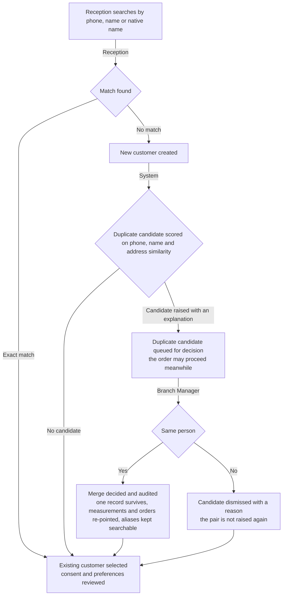

A merge is irreversible and authorised; it is never performed automatically by a score. No customer record is
ever deleted.

#### 2.4.2 Missing or insufficient material

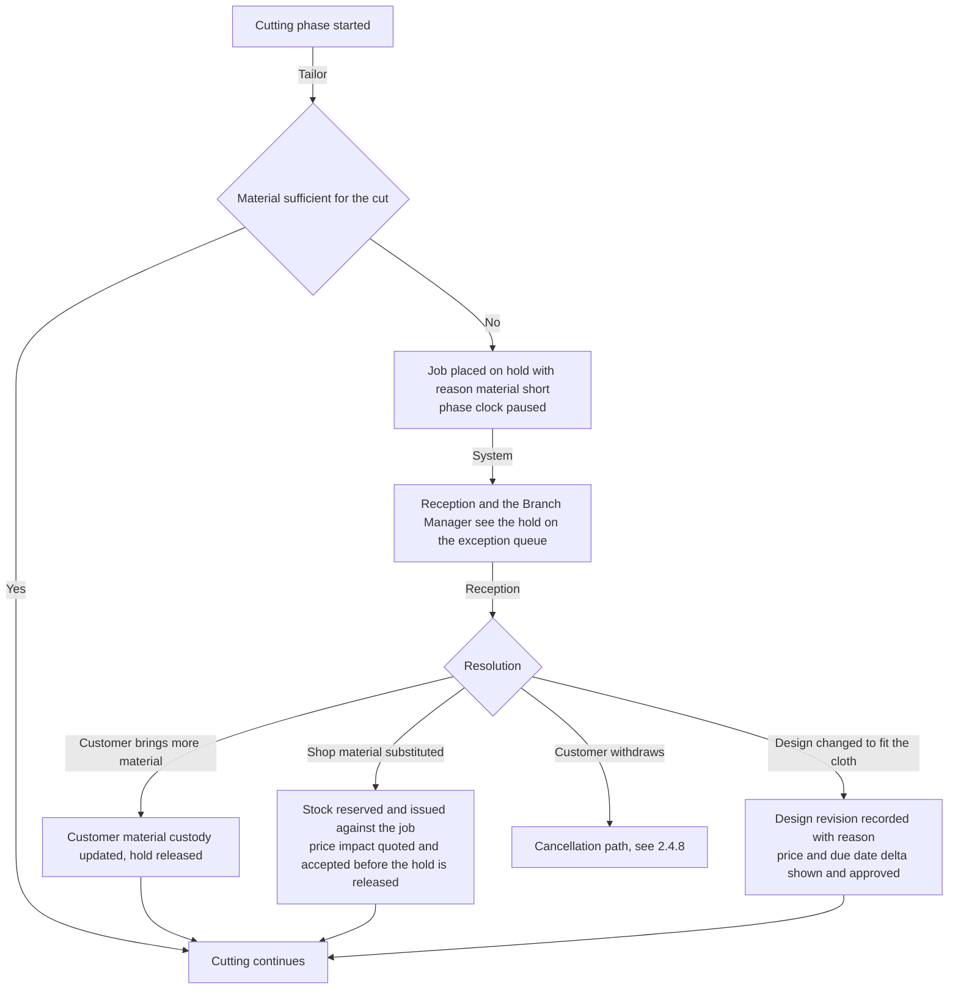

Shop stock is reserved under a row lock on the balance, so two jobs can never reserve the same last metre. If
the reservation drops the balance below the reorder point, `LowStockRaised` reaches the Inventory Clerk without
anyone remembering to look.

#### 2.4.3 Changed measurements after confirmation

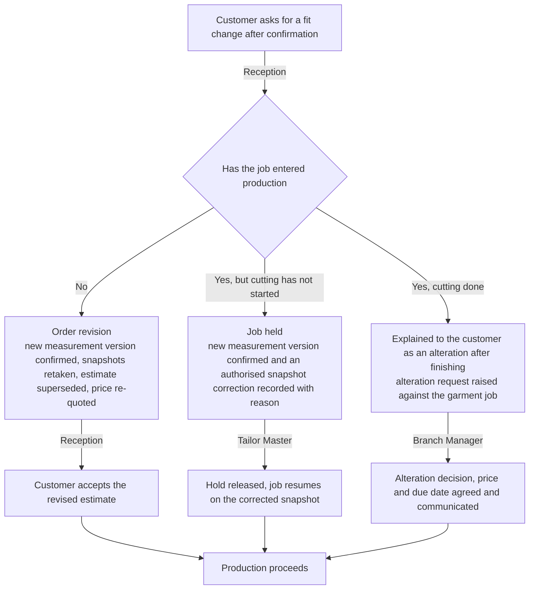

The original measurement version is never edited. A correction is a new version with a reason, and the job's
snapshot records which version it came from.

#### 2.4.4 Aari specialist work overdue, or work returned damaged

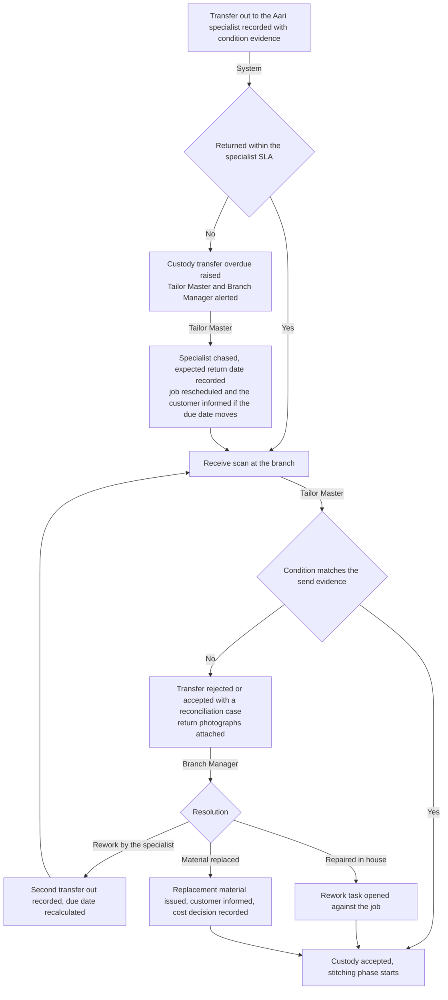

Whether an external Aari specialist holds a user account and performs their own scans, or is represented as a
location custodian with the branch scanning both legs on their behalf, is open decision `OD-WF-02`.

#### 2.4.5 Rejected QC and rework

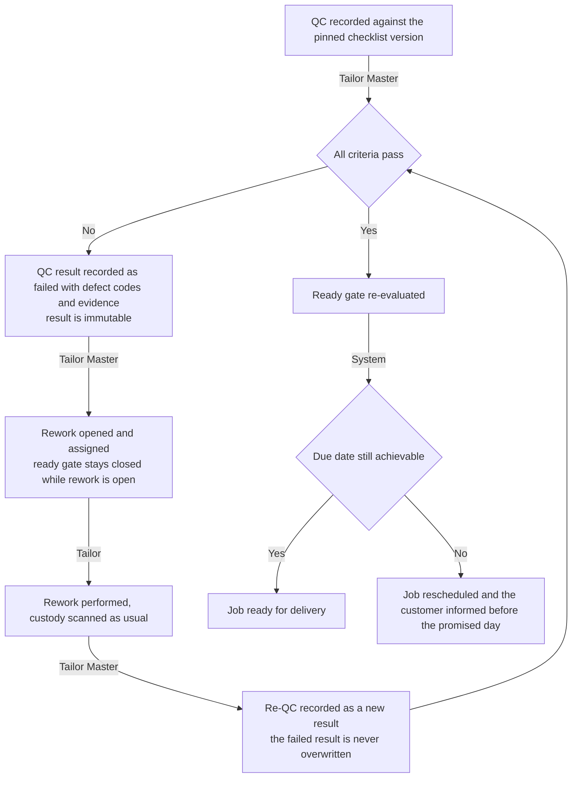

#### 2.4.6 Late order, hold and reschedule

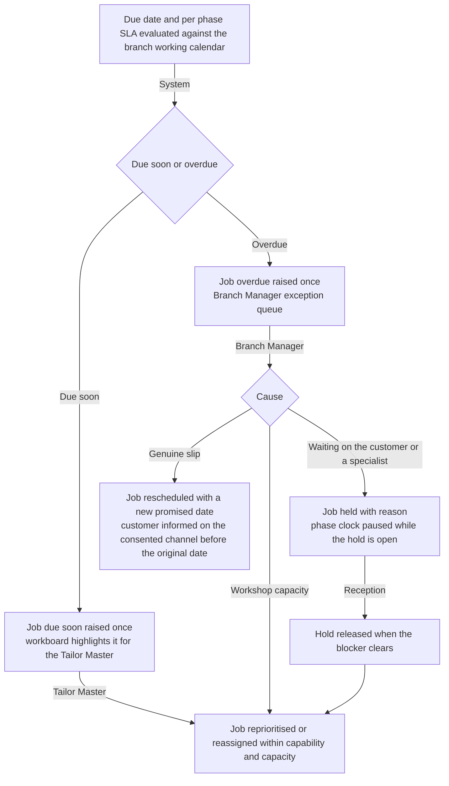

#### 2.4.7 Damaged, lost or wrong label

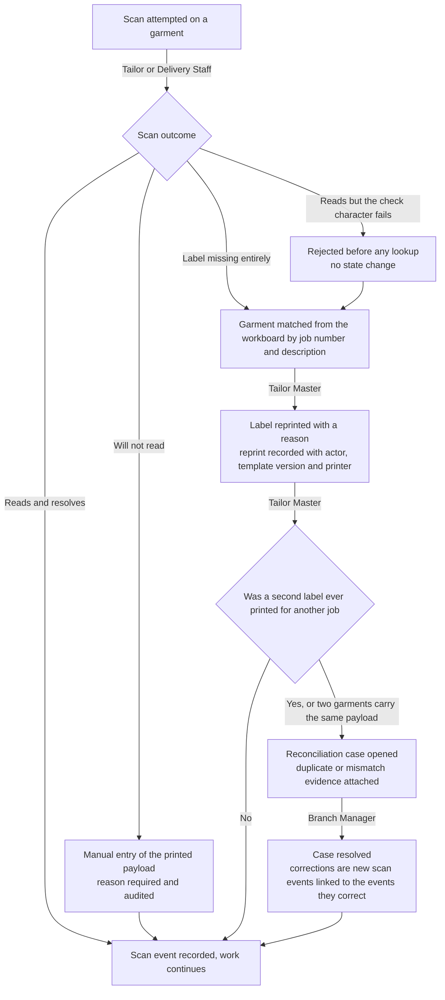

The barcode payload is opaque and carries no customer data, so a label found on the floor discloses nothing. A
payload is never re-issued, and exactly one barcode identity is active per garment job.

#### 2.4.8 Cancelled order and refund

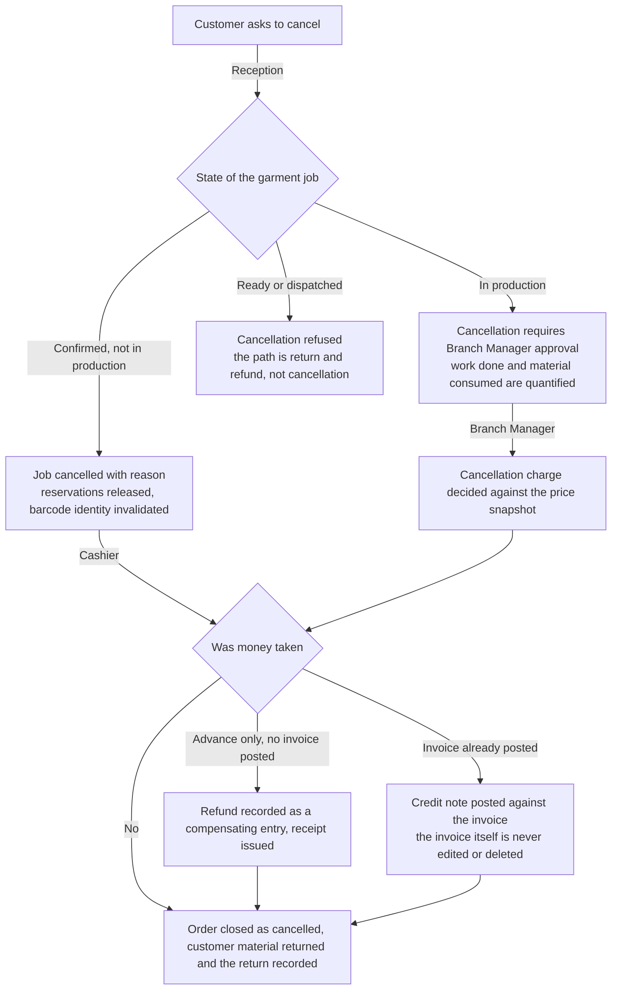

#### 2.4.9 Unpaid dispatch attempt

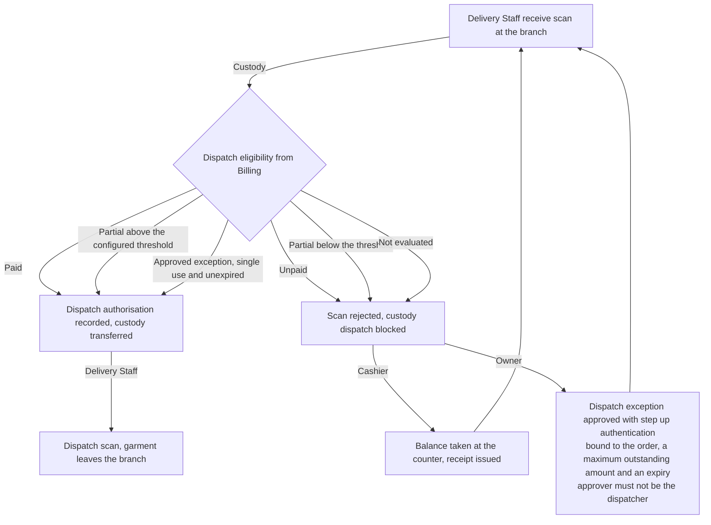

The gate **fails closed**: an eligibility result that could not be evaluated blocks the dispatch. Neither
Custody nor Delivery Staff ever computes a balance. A job that failed QC, is on hold or is in the wrong custody
has no exception path at all. The payment rule itself — full payment, a threshold, a per-job share, whether an
advance unlocks dispatch, and who may approve an exception — is owner decision `OD-04` in
[`../assumptions-and-open-decisions.md`](../assumptions-and-open-decisions.md).

#### 2.4.10 Counter collection instead of delivery

Most blouses are collected at the counter rather than delivered. The gate is the same; the custodian at the end
of it is the customer rather than Delivery Staff.

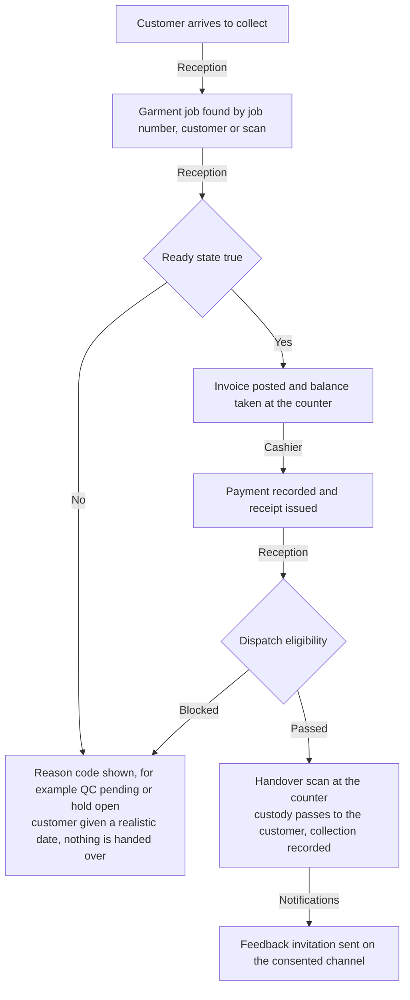

#### 2.4.11 Negative feedback and alteration

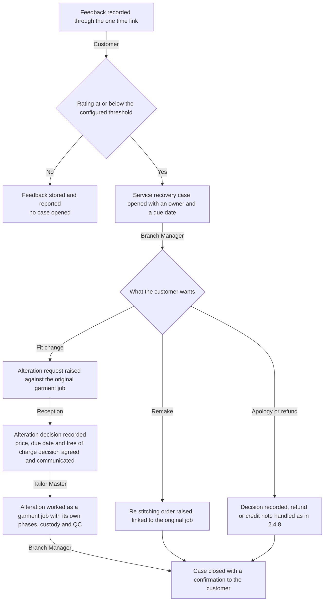

An Aari blouse carries one extra rule at this point: an alteration crossing an embroidered area may damage the
work, and the service type shows that warning at intake. The warning text is configuration on the service type,
not code.

---

## 3. What changes for staff

This table is the source for the blouse modules of the training material in issue #61c, and for the role-based
UAT scripts in #61b.

| Role | Today | After Tailor360 | Training note |
| --- | --- | --- | --- |
| Reception | Writes the register line, the paper job card and a token; quotes a price and a date from memory; takes cash without always recording it | Finds or creates the customer with duplicate detection, captures measurements into a versioned record, picks design options that are validated, issues a priced estimate, confirms the order and prints the label; the due date comes from the service type and the branch calendar | Practise the intake to label sequence until it is faster than writing a card. Emphasise that the estimate is not a bill, that consent must be recorded before a photograph is taken, and that a date is never promised outside the system |
| Tailor Master | Allots bundles verbally, keeps the queue in their head, sends Aari bundles out on trust | Starts production, pins the workflow version, assigns jobs from the workboard against capability and capacity, records the Aari transfer out and receive with condition evidence, records QC and decides rework | Focus on the workboard as the single queue, and on the two-sided Aari transfer. Nothing leaves the shop without a transfer out; nothing is stitched on without a receive |
| Tailor | Picks up a bundle, works from a handwritten card, hands the garment on verbally | Scans the label to take custody, works phases that are started and completed on the phone, records material consumed and wastage, hands over by scan | Practise the scan first, then the phase. Teach that a scan is what proves the garment was in their hands, and that manual entry always asks for a reason |
| Inventory Clerk | Hands out cloth, stones and thread without counting them against a garment | Reserves and issues stock against the garment job, records returns and wastage, responds to low-stock alerts | Show that an issue against a job is what makes the blouse's cost knowable, and that customer material is tracked but never valued |
| Cashier | Writes cash-book lines when the counter is quiet | Records advances and payments against the order, allocates them, issues numbered receipts, opens and closes the session with a denomination count | Emphasise that an unrecorded advance now blocks nothing and loses everything: the balance the delivery gate checks is only as right as what was recorded |
| Delivery Staff | Takes whatever is on the ready rack and settles up later | Works the delivery queue, performs the receive scan that evaluates the gate, dispatches only against an authorisation, confirms the doorstep handover with a one-time password or signature | Teach the blocked-dispatch screen as a normal, expected outcome, not a fault, and that they never calculate a balance themselves |
| Branch Manager | Firefights from memory and the register | Works exception queues — holds, overdue jobs, reconciliation cases, duplicate candidates, service-recovery cases — and approves what the permission matrix reserves to them | Focus on the queues as the day's work list, and on the fact that approvals carry a reason that is read later |
| Owner | Learns about problems when a customer complains | Reads cross-branch reports on volume, lead time, rework rate, Aari specialist turnaround and margin per category; approves prices, the catalogue and dispatch exceptions with step-up authentication | Emphasise that the Aari margin becomes visible only if stones and thread are issued against the job, and that a dispatch exception is a deliberate, audited decision |

---

## 4. Open decisions

Recorded here and mirrored centrally in [`../assumptions-and-open-decisions.md`](../assumptions-and-open-decisions.md).
Items that map to a business-owner decision in [Section 11](../../IMPLEMENTATION_PLAN.md) of the implementation plan
carry that reference. Nothing in this document may be read as settled where a row below says otherwise.

| ID | Question | Proposed default, not yet agreed | Owner | Raised | Needed by |
| --- | --- | --- | --- | --- | --- |
| `OD-WF-01` | Is the specialist work phase performed in house by an Aari team, by an external unit, or both, and at which branches? | Both, modelled identically as a custody transfer; branch availability of `BLOUSE_AARI` follows where a specialist works | Owner, with each Branch Manager | 2026-09-04 | #33 workflow definitions, wave 4. Related to plan Section 11 item 6 |
| `OD-WF-02` | Does an external Aari specialist hold a user account and perform their own scans, or is the unit a location custodian with the branch scanning both legs? | Location custodian at launch, with the branch scanning out and in; accounts for specialists are considered after the pilot | Owner, with the technical reviewer | 2026-09-04 | #37 custody transfers, wave 4. Related to plan Section 11 item 13 |
| `OD-WF-03` | What evidence is mandatory on an Aari transfer out and receive — photographs of the panels, a count of stones and thread issued, or both? | Both: at least one photograph per leg and the issued trims as stock ledger entries against the job | Owner, with the Tailor Master | 2026-09-04 | #34 evidence requirements and #38 material issue, wave 4 |
| `OD-WF-04` | Is the specialist turnaround an SLA that raises an alert, and at how many working days for a standard Aari blouse? | Yes, alerting at the service type's expected duration less two working days, so the branch learns before the customer does | Owner, with the Tailor Master | 2026-09-04 | #33 SLA evaluation, wave 4. Related to `OD-CAT-05` |
| `OD-WF-05` | Who may release a hold and reschedule a promised date — Reception, the Tailor Master, or the Branch Manager only? | Reception may release a hold they raised; only the Branch Manager may move a promised date already communicated to a customer | Owner | 2026-09-04 | #24 permission matrix, wave 1. Plan Section 11 item 13 |
| `OD-WF-06` | Is counter collection the normal ending for blouse orders, with delivery the exception, and does that differ by branch? | Counter collection is the default for blouse; the delivery queue is used where the branch offers delivery | Owner, with each Branch Manager | 2026-09-04 | #48 delivery queue, wave 4. Related to plan Section 11 item 4 |

---

## 5. Related documents

| Document | Why it matters here |
| --- | --- |
| [`salwar.md`](./salwar.md), [`lehenga.md`](./lehenga.md), [`gown.md`](./gown.md), [`kids.md`](./kids.md) | The other category maps; they cite the reference exception flows in Section 2.4 |
| [`branch-scenarios.md`](./branch-scenarios.md) | Single branch, a customer served at a second branch, cross-branch garment and material transfer, branch-specific availability, branch closure |
| [`../00-overview.md`](../00-overview.md) | The end-to-end journey and the dispatch gate in product terms |
| [`../glossary.md`](../glossary.md) | Authoritative definitions of every role, phase and record named above |
| [`../category-hierarchy.md`](../category-hierarchy.md) | `BLOUSE_PATTERN` and `BLOUSE_AARI`, their service types and the five links each carries |
| [`../measurement-templates.md`](../measurement-templates.md) | `MT_BLOUSE_PATTERN`, `MT_BLOUSE_AARI` and the Aari placement group; the ease convention applied at cutting |
| [`../state-transitions.md`](../state-transitions.md) | Transition, actor, preconditions, outputs, audit event and exception behaviour for every step drawn above |
| [`../raci.md`](../raci.md) | Who is responsible, accountable, consulted and informed for each step |
| [`../configurable-vs-fixed.md`](../configurable-vs-fixed.md) | Which parts of this workflow an administrator may change without a deployment |
| [`../assumptions-and-open-decisions.md`](../assumptions-and-open-decisions.md) | The central register that mirrors Section 4 |
| [`../../IMPLEMENTATION_PLAN.md`](../../IMPLEMENTATION_PLAN.md) | Decisions D8 to D12, the #17 blueprint in Section 8 and the owner decisions in Section 11 |
