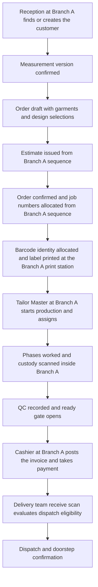
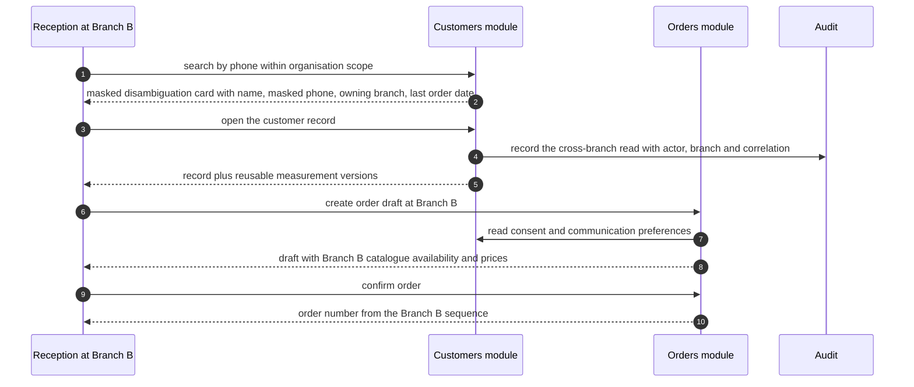
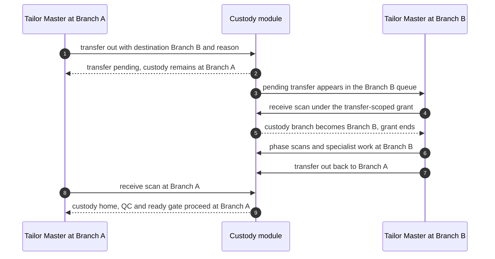
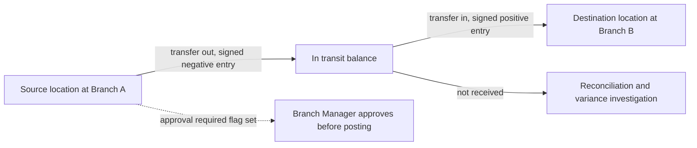
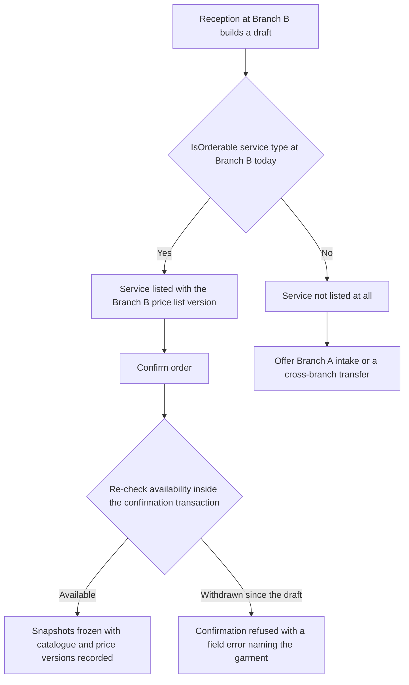
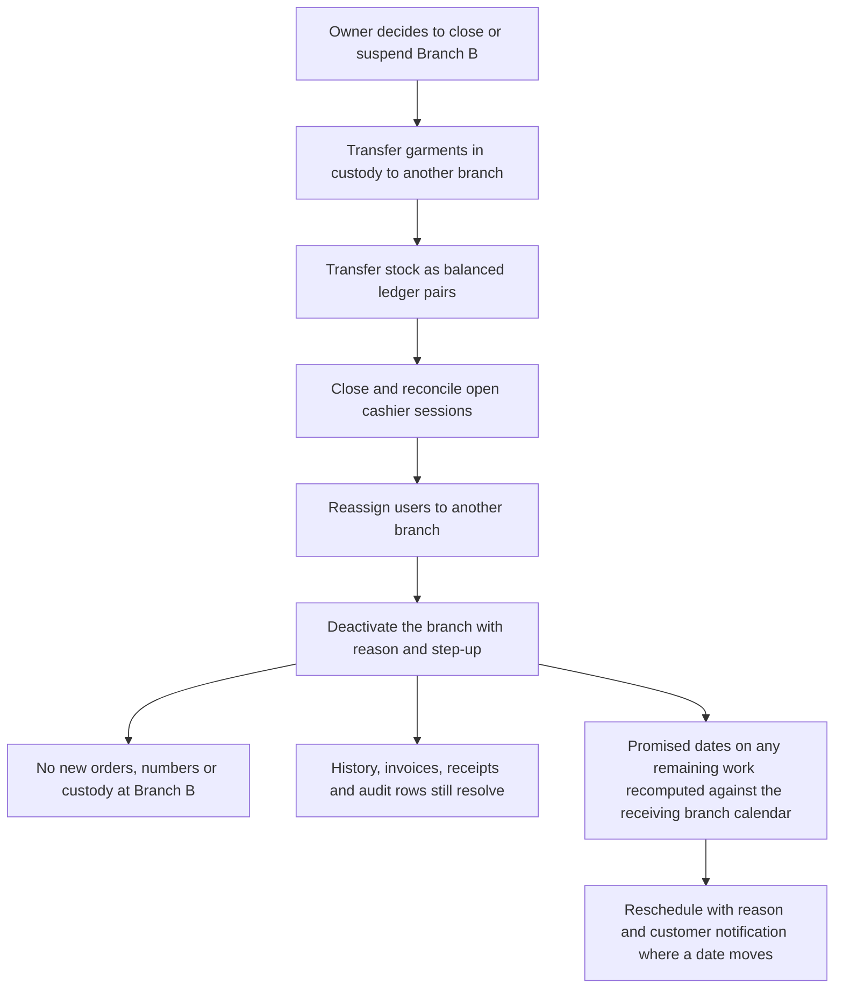

# Branch scenarios

HyFib Tailor 360 is **branch-aware from day one**: one organisation, one or more branches, `organisation_id` fixed
and `branch_id` present on every operational aggregate, and authorisation evaluated on permission **plus** branch
scope on every request (plan D7, plan Section 4.4, issue #24). This document works through the five situations in
which the branch dimension actually decides behaviour, and says for each one what must be branch-scoped, what is
organisation-wide, which module owns the rule and which authorisation rule applies. It is the branch companion to
[`../state-transitions.md`](../state-transitions.md); terms are defined in [`../glossary.md`](../glossary.md), the
journey in [`../00-overview.md`](../00-overview.md), the configuration levers in
[`../configurable-vs-fixed.md`](../configurable-vs-fixed.md) and the failure paths in
[`../exceptions.md`](../exceptions.md). Open items are registered in section 7 against plan
[Section 11](../../IMPLEMENTATION_PLAN.md) and mirrored into
[`../assumptions-and-open-decisions.md`](../assumptions-and-open-decisions.md).

---

## 1. The branch rules that hold in every scenario

| # | Rule | Source |
| --- | --- | --- |
| BR-1 | There is exactly one organisation. Multi-legal-entity tenancy is out of scope; the branch is never a tenant | Plan D7, assumption A1 |
| BR-2 | Every operational aggregate carries `organisation_id` and, where it is scoped, `branch_id` | Plan D7, Section 5.2 |
| BR-3 | A request is authorised on the permission **and** the branch scope of the principal, evaluated by `BranchScopeRequirement` against the resource's branch. Deny by default | Issue #24 |
| BR-4 | A user may be assigned to more than one branch. Branch assignment is administered by Admin or Owner with step-up and a reason | Issue #25 |
| BR-5 | Display numbers are allocated from per-branch, per-financial-year sequences — `O-<branch>-<FY>-000001`, `J-…-01`, `E-…`, invoice and receipt numbers. A number is never reused and never crosses a branch | Plan D9, issue #42 |
| BR-6 | Barcode payloads are opaque and carry **no** branch, no display number and no PII. The branch is resolved server-side from the identity, never read off the label | Plan D9, issue #35 |
| BR-7 | Due dates, SLA clocks and report cut-offs are evaluated in the branch IANA timezone, default `Asia/Kolkata`, against the branch working calendar where one is configured | Plan D11, issue #33 |
| BR-8 | The one narrow exception to BR-3 is `TransferScopeRequirement`: while a cross-branch custody transfer is pending, users of the destination branch holding `custody.receive` may perform exactly the receive, reject and resolve actions on the listed jobs, and nothing else | Issue #37 |
| BR-9 | Configuration is versioned and carries branch availability; a child's branch availability must be a subset of its parent's | Plan D8, issue #29 |
| BR-10 | Media is served only by an endpoint that re-authorises every request, including the branch check, and streams the bytes. There is no stable storage URL to leak across branches | Plan D4, issue #31 |

Permission names below are those of the catalogue fixed by issue #24; where the plan does not yet name a
permission, the name shown is this document's proposal and is corrected in the pull request that implements the
endpoint.

### 1.1 What is organisation-wide and what is branch-scoped

| Data | Placement | Why |
| --- | --- | --- |
| Users, roles, permission catalogue | Organisation-wide **definitions**, branch-scoped **assignments** | A role is a bundle of permissions; where a user may use it is the branch assignment (issue #24) |
| Branches with code, timezone, working calendar, GST registration, print stations | Organisation-wide list, each row **is** a branch | Issue #25 |
| Customers, aliases, consent records, communication preferences | Organisation-wide records with **branch visibility** | One person may be served at more than one branch; consent is given to the organisation, not to a counter (issue #26) |
| Measurement templates and versions; measurement values captured for a customer | Organisation-wide | A body does not change between branches; the template version is the same everywhere (issues #27, #28) |
| Category hierarchy, service types, design option groups and options, QC checklist templates, workflow definitions | Organisation-wide **definitions** with per-branch **availability** | One catalogue, published once; what a branch may sell is availability, not a second catalogue (issue #29) |
| Price lists and price-list versions; tax configuration versions | Organisation-wide versions with branch availability; GST registration per branch | Tax rates are statutory; the GSTIN and place of supply are the branch's (issues #41, #42) |
| Orders, estimates, garment jobs, holds, QC results, alterations | Branch-scoped | Owned by the branch that confirmed the order (issue #32a) |
| Barcode identities, scan events, custody transfers, reconciliation cases, delivery queue entries | Branch-scoped, with `from_branch_id` and `to_branch_id` on transfers | Custody is physical and therefore local (issue #37) |
| Stock items, locations, ledger entries, balances, reservations, stocktakes | Branch- and location-scoped | Stock is physical (issues #38, #39) |
| Suppliers | Organisation-wide with approval status | The business buys as one organisation (issue #38) |
| Invoices, credit and debit notes, payments, receipts, cashier sessions, document sequences | Branch-scoped | Statutory numbering and cash accountability are per branch (issues #42, #43) |
| Notification templates and versions | Organisation-wide; routing, quiet hours and alert policies per branch | One wording, locally routed (issues #47, #40) |
| Feature flags | Organisation **or** branch scope | Plan Section 4.4 |
| Audit events | Organisation-wide append-only chain carrying the branch on every row | The chain must be one chain to be verifiable (issue #21) |

---

## 2. Scenario 1 — Single branch baseline

**Owning modules:** all. **Branch-scope rule:** BR-3 in its simplest form — the principal is assigned to exactly
one branch, every resource carries that `branch_id`, and every request matches.

### 2.1 Narrative

One branch, one counter, one workshop. Reception finds the customer, captures measurements, builds the draft,
issues the estimate and confirms the order; the confirmation allocates `O-<branch>-<FY>-…` and `J-…-01` from that
branch's sequences and a `G-…` barcode identity per garment. The Tailor Master starts production, the workflow
version is pinned, tailors scan and work phases, QC is recorded, the ready gate opens, the Cashier takes the
balance and the Delivery Staff dispatch and confirm. Nothing in the flow needs a branch decision, because there is
only one answer to every branch question. This is the baseline the other four scenarios deviate from, and it is
what a single-branch shop experiences on day one.

The important point is that the single-branch shop still runs the full branch machinery: `branch_id` is written,
sequences are per branch, and the working calendar drives due dates. Adding a second branch later is therefore an
administrative act (issue #25), not a migration.

### 2.2 Data placement and authorisation

| Aspect | Position |
| --- | --- |
| Branch-scoped | Order, garment jobs, custody events, invoice, payments, receipts, stock, delivery queue, document sequences |
| Organisation-wide | Customer, consent, measurement template and version, catalogue, price list, tax configuration, notification templates, permission catalogue, audit chain |
| Authorisation rule | `PermissionRequirement` plus `BranchScopeRequirement`; a Tailor additionally passes `ResourceOwnershipRequirement` and sees only assigned jobs, with customer contact details, pricing and payment state masked out of the job card by the field-level minimisation policy (issue #24) |

---

## 3. Scenario 2 — A customer served at a second branch

**Owning module:** Customers/Measurements for the record and its visibility; Orders/Workflow for the order that
follows. **Branch-scope rule:** the customer record is organisation-wide, its **visibility** is branch-scoped, and
contact details are a separate permission (`customers.read_contact`) from the ability to find the record at all
(`customers.read`).

### 3.1 Narrative

A customer measured and served at Branch A walks into Branch B — a different part of town, or the branch nearer
her workplace. Reception at Branch B searches by phone. The search returns a disambiguation card showing name,
native name, **masked** phone, the branch the record belongs to and the last-order date, so Reception can tell
whether this is the same person without opening the record. Reception opens the record, which adds Branch B to the
customer's visibility, and proceeds: the measurement versions captured at Branch A are reusable at Branch B
because measurements are organisation-wide, so the customer is not measured a second time for the same template.
The new order is a **Branch B order**: it takes Branch B's order and job numbers, Branch B's price-list
availability, Branch B's GST registration and Branch B's working calendar for the promised date.

The record itself is never copied. Creating a second customer record because the first was not visible is the
duplicate-customer exception (EX-01 in [`../exceptions.md`](../exceptions.md)), and the remedy — an irreversible,
step-up merge — is more expensive than the reveal, which is why the search deliberately reaches across branches
with masked contact details.

### 3.2 Data placement

| Data | Placement | Note |
| --- | --- | --- |
| Customer record, aliases, consent, preferences, native name | Organisation-wide | Consent is given once to the organisation; it is not re-collected per branch |
| Customer visibility branches | Branch-scoped attribute of an organisation-wide record | Controls which branches see the record in ordinary search results |
| `customer_number` `C-<branch>-000001` | Allocated at the creating branch, stable for life | It is a display number, never a lookup key on a customer-facing surface |
| Measurement versions and the template versions they were captured against | Organisation-wide | Reuse across branches is the point; the order stores a **copy** as its snapshot |
| Material and reference images | Branch-owning media objects, re-authorised per request | A Branch B user sees a Branch A image only where the media policy allows it for the linked order or job |
| The new order, its jobs, invoice, payments and custody | Branch B | BR-5 applies: Branch B sequences |

### 3.3 Authorisation rule

| Action | Permission | Branch-scope rule |
| --- | --- | --- |
| Find a customer across branches | `customers.read` | Organisation-wide search with permission filtering; results are masked disambiguation cards, not records |
| See contact details | `customers.read_contact` | Field-level minimisation: a role without it never receives the phone or address in the DTO |
| Open the record and serve the customer at Branch B | `customers.read`, `orders.intake` | The order that follows is a Branch B resource and is authorised as such |
| Merge two records found to be the same person | `customers.merge` — reason and **step-up** | Irreversible; the merged number survives as an alias |
| Read the measurement sheet | `measurements.read_sheet` | A sensitive read, audited explicitly, never inferred from order access |

> **Open decision OD-13 (permission matrix).** Whether adding a branch to a customer's visibility on first service
> is automatic or an explicit authorised act, and which roles may search across branches at all, is part of the
> owner-approved permission matrix. The position stated above is the plan's interim design derived from issue
> #26's search screen and issue #24's field-level minimisation, and is **proposed, to be confirmed** —
> see [`../assumptions-and-open-decisions.md`](../assumptions-and-open-decisions.md).

---

## 4. Scenario 3 — Cross-branch garment or material transfer

**Owning modules:** Custody/Barcode for a garment; Inventory for material. **Branch-scope rule:** BR-8 —
`TransferScopeRequirement` grants the destination branch exactly the receive, reject and resolve actions while the
transfer is pending, and nothing more.

### 4.1 Narrative — a garment moves to another branch

Branch A has the order, but the Aari specialist works at Branch B. The Branch A custodian records a
**transfer out** naming Branch B as the destination; the transfer sits `pending` and appears on Branch B's pending
queue. While it is pending, Branch B users holding `custody.receive` can see and act on exactly those listed jobs
— receive, reject, or open a case — and nothing else at Branch A. On receive, the job's
`current_custody_branch_id` becomes Branch B and ordinary branch scope applies to custody actions there. **Order
and billing ownership stay with Branch A**: the invoice, the numbers, the payment and the customer relationship
never move. When the specialist work is done, the reverse transfer brings custody home for QC, the ready gate and
dispatch.

A transfer that is not received within the configured SLA raises `CustodyTransferOverdue` and can expire; custody
stays with the sender until a receive is actually recorded, so a garment is never stateless in a van.

### 4.2 Narrative — material moves to another branch

Material is not a garment: it moves as a **balanced pair of ledger entries** in one transaction, `transfer_out`
from the source location and `transfer_in` at the destination, with an in-transit balance in between. Locations
carry their allowed destinations and an approval-required flag, so a cross-branch destination exists only where an
administrator has configured it. Customer-supplied material is never valued and travels as a customer material
custody record attached to the order, not as stock.

### 4.3 Data placement

| Data | Placement | Note |
| --- | --- | --- |
| `custody_transfers` | Carries `from_branch_id` and `to_branch_id` | Append-only; pending, accepted, rejected or expired |
| `garment_jobs.current_custody_branch_id` | Moves to the destination on acceptance | Order and billing ownership do **not** move |
| Order, invoice, payments, document numbers | Stay at the originating branch | BR-5: numbers never cross a branch |
| Ledger entries and balances | Per item and location, therefore per branch | Transfers post a balanced pair in one transaction |
| Customer material custody | Attached to the order and job, never valued | Issue #38 |

### 4.4 Authorisation rule

| Action | Permission | Branch-scope rule |
| --- | --- | --- |
| Transfer a garment out | `custody.transfer_out` | Ordinary branch scope at the source branch; the actor must be the expected custodian |
| Receive, reject or resolve at the destination | `custody.receive` | **Transfer-scoped** grant, limited to the listed jobs and ending when the transfer is accepted, rejected or expires (BR-8, tested for IDOR in issue #24) |
| Act on anything else at the source branch | Any | Denied. The grant is not a branch assignment |
| Post a cross-branch material transfer | `inventory.record_movement`; approval where the location's flag requires it | Both locations must be in the actor's branch scope, or the movement is a two-step transfer with an approval at the receiving branch |
| Approve a resulting variance | `inventory.approve_variance` — reason and **step-up** | The approver must differ from the person who recorded the count |

---

## 5. Scenario 4 — Branch-specific category and price availability

**Owning modules:** Catalog/Design for availability; Billing/Payments for price-list and tax version availability.
**Branch-scope rule:** availability is an attribute of an organisation-wide, versioned definition; BR-9 requires a
child's availability to be a subset of its parent's.

### 5.1 Narrative

Branch A does Aari work; Branch B does not, because it has no Aari specialist. The Owner does not maintain two
catalogues: there is one published catalogue version, and the Aari work service type is simply **not available**
at Branch B. The effect is uniform and server-enforced: `ICatalogAvailabilityQuery.IsOrderable(serviceTypeId,
branchId, at)` returns false, so the service is neither listed in `GET /catalog/current` for a Branch B user nor
accepted at confirmation if a stale client sends it. Prices work the same way: a price-list version carries branch
availability, so Branch B may legitimately charge a different rate for the same blouse, and the order's price
snapshot records exactly which price-list and tax configuration versions were used.

Two consequences matter on the shop floor. First, a Branch B customer who wants Aari work is served by taking the
order at Branch A, or by a cross-branch custody transfer as in scenario 3 — the branch availability rule is not
something Reception can override at the counter. Second, republishing the catalogue never disturbs work in flight,
because a confirmed job carries copies of its category and service version, design snapshot and price snapshot.

### 5.2 Data placement

| Data | Placement | Note |
| --- | --- | --- |
| Category, sub-category, service type, design option group and option | Organisation-wide definitions inside a published catalogue version | Administrators add categories without a deployment |
| `branch_availability` on each of the above | Branch-scoped attribute | Must be a subset of the parent's availability, enforced by a publish-time validator |
| Feature flags gating a category or module | Organisation or branch scope, safe default off | Propagation bound of at most 30 seconds |
| Price-list versions and their items | Organisation-wide versions with branch availability | Whether branches share one price list is an owner decision under OD-06 with OD-05 |
| Tax configuration versions | Organisation-wide | GST registration and place of supply are per branch |
| The order's price and design snapshots | Branch-scoped, immutable copies | A republish never changes a confirmed job |

### 5.3 Authorisation rule

| Action | Permission | Branch-scope rule |
| --- | --- | --- |
| Edit the catalogue or a price list | `catalog.edit`, `billing.manage_price_lists` | Organisation-level administration, not branch work |
| Publish a version | `catalog.publish`, `catalog.workflows.publish`, `billing.publish_price_list` — reason and **step-up** | Publishing runs every registered dependency validator; a failing version cannot be published |
| Set branch availability | The same administration permissions | Availability may only narrow, never widen beyond the parent |
| Order a service at a branch | `orders.intake`, `orders.confirm` | Availability is re-checked **inside** the confirmation transaction, not only in the picker |
| Override a price above the configured threshold | `billing.override_price` — reason and **step-up** | Branch-scoped to the order's branch |

---

## 6. Scenario 5 — Branch closure, holidays and the working calendar

**Owning modules:** Identity/Admin for the branch, its timezone and its working calendar; Orders/Workflow for due
dates and SLA clocks; Notifications/Feedback for what the customer is told. **Branch-scope rule:** BR-7 — every
promised date and every SLA clock is evaluated in the branch's own timezone against the branch's own calendar.

### 6.1 Narrative — a holiday or a weekly closing day

The branch working calendar is administered per branch (`PUT /api/v1/admin/branches/{id}/calendar`, reason and
step-up) and publishes `BranchCalendarChanged`. Non-working days are skipped when a promised date is computed, and
phase SLA clocks pause on them where the workflow is configured to pause. The due-date and SLA evaluator runs
every fifteen minutes under a worker scope, raising `JobDueSoon`, `JobOverdue` and `PhaseSlaBreached` **exactly
once** per job and condition and clearing them on completion, with the due-soon window and the escalation delay as
branch configuration. Pongal, a local temple festival or a Sunday closing therefore produce honest promised dates
rather than dates the workshop cannot meet.

A calendar changed **after** dates have been promised does not silently move those dates: a promise already given
to a customer is changed only by an explicit reschedule with a reason and a customer notification (see
[`../state-transitions.md`](../state-transitions.md) section 3.2, and open question BQ-02 below).

### 6.2 Narrative — a branch closes

A branch is **deactivated**, never deleted: historical orders, invoices, receipts and audit rows must keep
resolving, and its document sequences must never be reissued elsewhere. Before deactivation the branch's live work
has to go somewhere — garments in custody move by cross-branch transfer as in scenario 3, stock moves by balanced
ledger transfer, users are reassigned to another branch, and open cashier sessions are closed and reconciled.
Deactivation then blocks new orders, new document numbers and new custody at that branch while leaving every
historical reference intact and readable.

### 6.3 Data placement

| Data | Placement | Note |
| --- | --- | --- |
| Branch timezone, working calendar, holidays, status | Branch row, organisation-wide list | Changed only through audited administration with step-up |
| Due dates, SLA clocks, due-soon and overdue conditions | Branch-scoped per garment job | Evaluated in branch time; each condition raised once per job |
| Alert policies, escalation delays, quiet hours, dispatch policy, recipient confirmation policy, scanning confirmation list | Branch configuration | Deliberately local: branches differ in staffing |
| Document sequences | Branch-scoped, never reissued after closure | BR-5 |
| Historical orders, invoices, receipts, scans, audit rows | Branch-scoped, immutable, still readable after closure | No soft delete of business records |
| Reporting projections and cut-offs | Organisation-wide store, branch-filtered, using branch cut-offs | Never authoritative; carries a freshness indicator |

### 6.4 Authorisation rule

| Action | Permission | Branch-scope rule |
| --- | --- | --- |
| Edit a branch working calendar | `admin.branches` — reason and **step-up** | Administration, not branch work; publishes `BranchCalendarChanged` |
| Deactivate a branch | `admin.branches` — reason, **step-up** and dual confirmation for Owner-level changes | No deletion; referenced branches are deactivated only |
| Reschedule a promised date | `orders.reschedule` — reason | Branch-scoped to the job's branch; triggers a customer notification on the consented channel |
| Reassign users to another branch | `admin.users` — reason and **step-up** | Session and permission changes take effect within the revocation target of issue #19 |
| Read cross-branch reports during and after closure | `reports.read`, `reports.export` above the row threshold with **step-up** | Owner and Auditor read across branches; operational roles do not |

---

## 7. Open decisions raised by this document

Registered against plan [Section 11](../../IMPLEMENTATION_PLAN.md) and to be transcribed into
[`../assumptions-and-open-decisions.md`](../assumptions-and-open-decisions.md) when settled. None may be presented
as decided until then.

| ID | Question | Interim position | Resolves under | Owner | Raised |
| --- | --- | --- | --- | --- | --- |
| **BQ-01** | Which roles may search customers across branches, and whether serving a customer at a second branch adds that branch to the record's visibility automatically | Proposed, to be confirmed: cross-branch search returns masked disambiguation cards to roles holding `customers.read`; opening the record at a second branch adds that branch to visibility and is audited | OD-13 permission matrix, with OD-06 | Business owner | 2026-09-04 |
| **BQ-02** | Whether a working-calendar change may move promised dates that have already been given to customers | Proposed, to be confirmed: it may not. SLA clocks are re-evaluated, and any job whose promised date now falls on a non-working day is surfaced for an explicit reschedule with reason and notification | OD-06 branches and calendars, with issue #33 | Business owner | 2026-09-04 |
| **BQ-03** | The preconditions for deactivating a branch — whether open garment jobs, open cashier sessions or on-hand stock block it | Proposed, to be confirmed: deactivation is refused while custody, an open cashier session or a non-zero balance remains at the branch, so the closure checklist of section 6.2 must complete first | OD-06, with issue #25 | Business owner | 2026-09-04 |
| **BQ-04** | Whether all branches share one price list or each branch prices separately | Already registered: price-list versions carry branch availability, and the business rule is confirmed at the workshop | OD-06 with OD-05 | Business owner | 2026-09-04 |
| **BQ-05** | Whether an order may be taken at one branch for production and collection at another as a first-class flow, rather than as a cross-branch custody transfer after confirmation | Proposed, to be confirmed: not in the first release. Order and billing ownership stay with the confirming branch; the garment moves by custody transfer | Plan Section 11 with issues #37 and #48 | Business owner | 2026-09-04 |

---

## 8. Maintenance

Amended by pull request only, in the same change that alters a branch rule, an availability rule or a
branch-scoped permission. Any new endpoint that reads or writes a branch-scoped resource adds its role by
own-branch and other-branch expectations to the authorisation matrix fixtures in the same pull request, so this
document and the enforced behaviour cannot drift apart.
