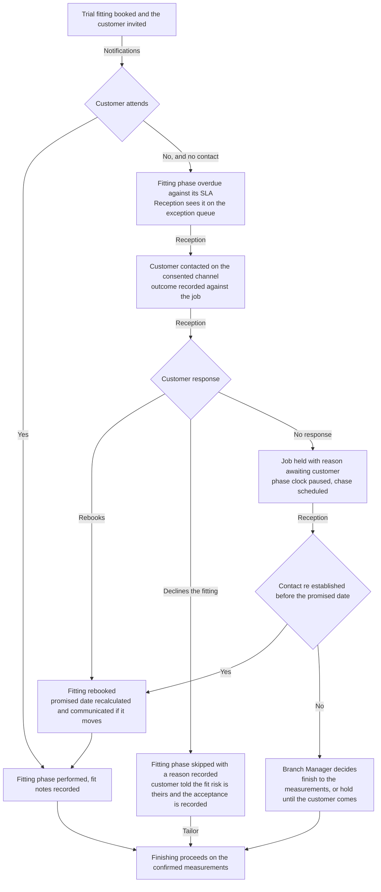
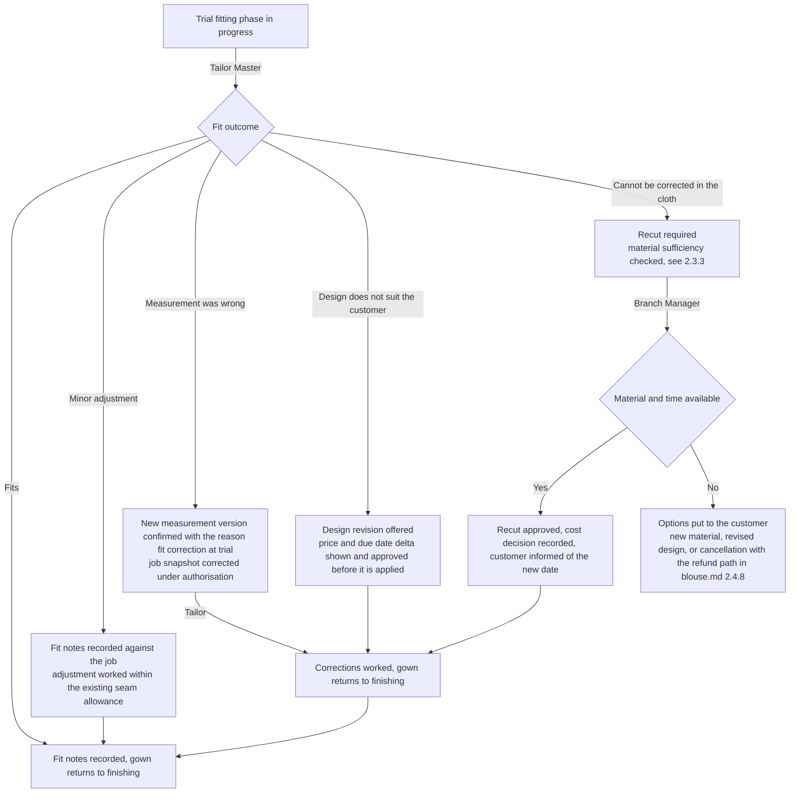
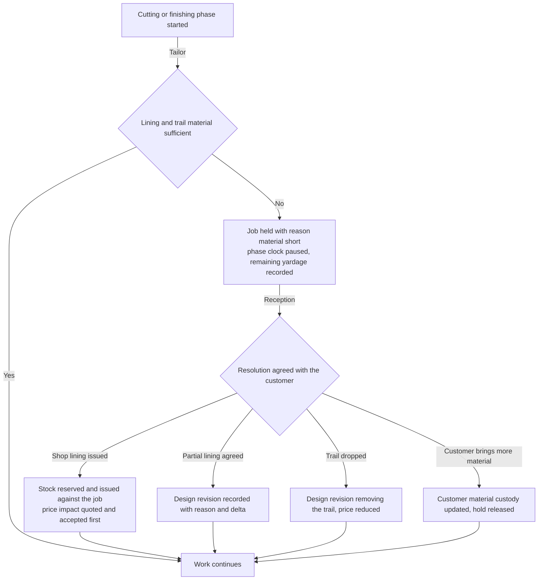
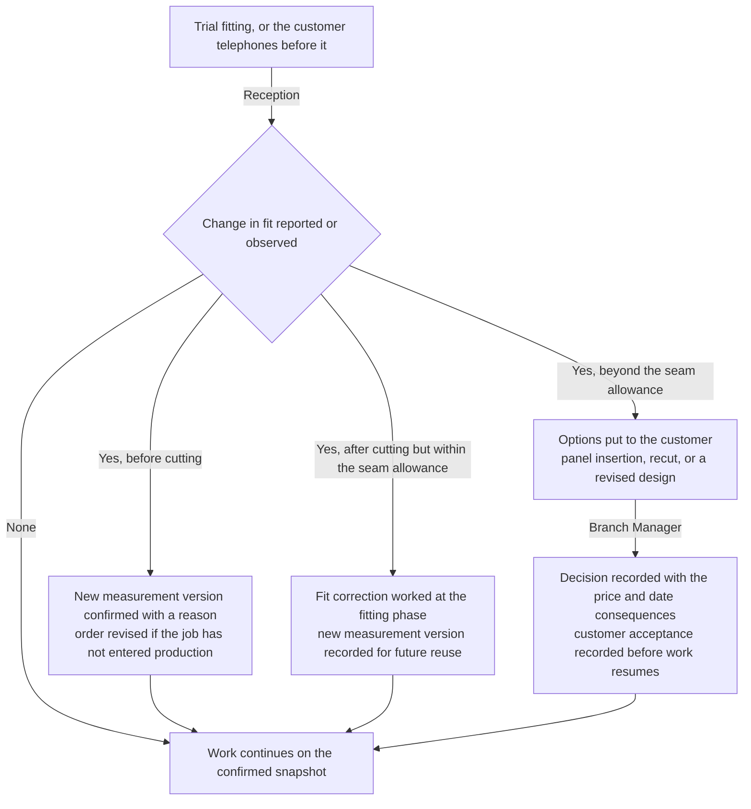

# Gown workflow

This document maps how a gown order runs in the workshop **today**, on paper, and how it will run on HyFib
Tailor 360. A gown is a single long garment — floor-length or calf-length, A-line, flared or fitted, with an
optional slit, lining and trail — and its production risk is concentrated in one place: the **fit of the bodice
and the hang of the hem**, judged on the body rather than on the table. That is why this category is the one
whose target workflow declares a **trial fitting phase**, and why its exceptions are mostly about what happens
at and around that fitting.

Sections 1 and 2 are the two main sections of this map. Section 3 is the closing "what changes for staff" table
that feeds the training material of issue #61c; Sections 4 and 5 are the open-decision register and the document
map. The common exception flows — duplicate customer, missing material, changed measurements, rejected QC, late
order, damaged label, cancellation and refund, unpaid dispatch attempt, negative feedback — are drawn in full in
[`blouse.md`](./blouse.md) Section 2.4 and are cited rather than repeated here. Every role name and term is used
exactly as [`../glossary.md`](../glossary.md) defines it.

| Aspect | Value |
| --- | --- |
| Category covered | `GOWN` |
| Service types | `STITCHING`, `ALTERATION`, `RESTITCHING` |
| Measurement template | `MT_GOWN` — bodice, sleeve, neckline and silhouette groups, including `gown_flare` and the conditional `slit_height` — see [`../measurement-templates.md`](../measurement-templates.md) |
| Proposed lead time, working days | Stitching 7, alteration 2, re-stitching 4 — **proposed, to be confirmed** under `OD-CAT-05` |
| Owning modules | Customers/Measurements, Catalog/Design, Media, Orders/Workflow, Custody/Barcode, Inventory, Billing/Payments, Notifications/Feedback |
| Implementing issues | #26, #27, #28, #30, #31, #32, #33, #34, #35, #36, #37, #38, #41, #42, #43, #47, #48, #49 |
| Status | **Drafted for the owner workshop, not approved.** Approval of the workflow maps is the W0 exit gate of plan [Section 6.2](../../IMPLEMENTATION_PLAN.md) |

---

## 1. Current practice

### 1.1 How a gown order runs today

| # | What happens | Who does it | The record made today | Where that record lives |
| --- | --- | --- | --- | --- |
| 1 | Customer arrives with gown material, or buys it, usually for a named function | Reception | None until an order is written | — |
| 2 | Name, phone and "gown" are written into the counter register with a token | Reception | One register line | Counter register |
| 3 | Measurements are taken over the customer's clothing; the full length is judged by eye against the customer's footwear on the day | Reception, often the Tailor Master for a fitted gown | Handwritten figures on a paper job card | The job card in the bundle |
| 4 | Silhouette, flare, lining, slit and trail are agreed from a photograph | Reception | Words on the card, for example "A-line, full lining, side slit" | The job card |
| 5 | A price is quoted verbally, higher if the gown is lined or has a trail | Reception or the Owner | Nothing, or a pencilled figure | — |
| 6 | An advance is taken | Reception or Cashier | A cash-book line if the counter is quiet | Cash book, or nothing |
| 7 | The material is bundled with the card and put on the rack | Reception | Token number on the card | The bundle |
| 8 | The Tailor Master gives the bundle to a Tailor and describes the gown verbally | Tailor Master, verbally | Nothing | — |
| 9 | The gown is cut, the bodice is stitched and the skirt joined | Tailor | Nothing | — |
| 10 | Where there is time, the customer is telephoned for a trial fitting; more often the gown is finished without one | Reception, verbally | Nothing | — |
| 11 | Fit corrections agreed at the fitting are remembered by whoever was standing there | Tailor Master, verbally | Sometimes a pin and a pencil note | The garment |
| 12 | The gown is hemmed, pressed and put on the ready rack | Tailor | Nothing | — |
| 13 | The customer collects, pays the balance and leaves | Reception or Cashier | A cash-book line | Cash book |

### 1.2 The records the shop keeps today

| Record | Kept by | What it contains | What it cannot answer |
| --- | --- | --- | --- |
| Counter order register | Reception | Date, name, phone, "gown", token, promised date | Whether a fitting was offered, held or missed |
| Paper job card | In the bundle | Body figures and a few silhouette words | Whether the length was measured with or without heels, and what was changed at the fitting |
| Fitting pins and pencil notes | The garment itself | The corrections agreed | Anything, once the pins come out or a different Tailor takes over |
| Cash book | Reception or Cashier | Daily cash in and out | What is outstanding on this gown |

### 1.3 Failure modes observed, and what removes each

The general failures of the paper system are catalogued in [`blouse.md`](./blouse.md) Section 1.4 and apply here
unchanged. The failures below are the ones this category produces most.

| Failure mode | How it happens today | What it costs | What removes it |
| --- | --- | --- | --- |
| **Fitting never happens** | Nobody owns the task of calling the customer in | The gown is finished to the tape and fails on the body, days before the function | The trial fitting is a declared phase of the workflow with an actor and an SLA, so an unheld fitting is visible on the workboard, not invisible in a diary |
| **Fitting corrections are lost** | Corrections are pinned and remembered | The gown is finished to the original figures; the same correction is discovered again at collection | Fit notes are recorded against the garment job at the fitting phase, and a changed measurement becomes a new measurement version with a reason |
| **Hem measured without the customer's footwear** | The length is judged by eye on the day | The gown drags or hangs short; the hem is re-set at the shop's cost | `gown_full_length` is a **finished** measurement with help text that names the footwear assumption, and the assumption is captured with the value |
| **Lining forgotten in the quote** | Lining is agreed verbally and never priced | The shop absorbs the material and the extra day | Lining is a design option with a price and time impact, frozen into the design and price snapshots at confirmation |
| **Lost job card** | The paper card leaves the bundle | The gown is cut to a guess | Immutable measurement, design and price snapshots on the garment job; the job card is reprintable |
| **No traceability of who held the garment** | A long garment moves between the cutting table, the machine, the fitting room and the press | Nobody can say who last held it when it cannot be found | Every movement is an append-only scan event naming the from and to custodian, the location, the actor and the server time |
| **Unrecorded advance** | Busy counter, no cash-book line | Cash short at closing, or the customer pays twice | Advances are payment records allocated to the order, with a numbered receipt |
| **Forgotten alteration after a function** | The customer returns to have the hem lifted and it is agreed verbally | The customer returns twice | An alteration is a recorded request with a decision, a price and a due date, on a queue |

---

## 2. Target workflow

### 2.1 The phases the system tracks

The phase list, the actor for each phase and the events recorded are exactly as tabulated in
[`blouse.md`](./blouse.md) Section 2.1. Gown differs in these points:

| Point | Gown behaviour |
| --- | --- |
| Measurement | One measurement version against `MT_GOWN`. `gown_full_length`, `gown_flare`, `slit_height`, the sleeve and the neckline depths are **finished** measurements; the bodice chest, waist and hip are body measurements to which the published ease is applied at cutting |
| Design | Silhouette, lining, slit and trail are design options with price and time impacts, frozen into the design snapshot at confirmation |
| Trial fitting | A declared phase between stitching and finishing. The gown is fitted on the customer, fit notes are recorded against the job, and any changed figure becomes a new measurement version with a reason. See `OD-WF-16` |
| Finishing | The hem is set after the fitting, not before, and the footwear assumption recorded with the length is shown to the Tailor on the job card |
| QC | The checklist adds hang and drape criteria and a lining criterion, evaluated against the pinned checklist version |

There is no specialist work phase in this category unless the gown carries hand embroidery, in which case the
specialist work phase and its two-sided custody transfer are exactly as drawn in [`blouse.md`](./blouse.md)
Section 2.3 and 2.4.4.

### 2.2 Happy path

```mermaid
flowchart TD
  A[Customer arrives with gown material and a design reference] -->|Reception| B[Customer found or created<br/>consent recorded for measurement storage and photo capture]
  B -->|Reception or Measurement Staff| C[Measurement draft captured against MT GOWN<br/>bodice, sleeve, neckline and silhouette groups<br/>footwear assumption recorded with the full length<br/>confirmed into an immutable measurement version]
  C -->|Reception| D[Category GOWN and service STITCHING selected<br/>silhouette, lining, slit and trail chosen as design options<br/>material and reference images captured]
  D -->|Reception| E[Estimate issued<br/>lining and trail priced as their own lines, shared as an expiring customer link]
  E -->|Reception| F[Order confirmed in one transaction<br/>measurement, design and price snapshots frozen<br/>order and garment job numbers allocated]
  F -->|Custody, inside the confirmation transaction| G[Barcode identity allocated<br/>opaque G payload, no PII]
  G -->|Reception| H[Label printed at the print station]
  H -->|Cashier| I[Advance recorded and numbered receipt issued]
  I -->|Tailor Master| J[Start production<br/>workflow version pinned, garment job assigned]
  J -->|Inventory Clerk| K[Material issue<br/>customer material into custody, lining, canvas, boning, zip and hooks issued to the job]
  K -->|Tailor| L[Scan to take custody of the garment job]
  L -->|Tailor| M[Cutting phase<br/>bodice cut with the published ease, skirt cut to the recorded flare]
  M -->|Tailor| N[Stitching phase<br/>bodice assembled, skirt joined, lining made up]
  N -->|Reception| O[Trial fitting booked and the customer invited on the consented channel]
  O -->|Tailor Master| P[Trial fitting phase<br/>gown fitted on the customer, fit notes recorded against the job<br/>any changed figure confirmed as a new measurement version with a reason]
  P -->|Tailor| Q[Fit corrections worked]
  Q -->|Tailor| R[Finishing phase<br/>hem set to the recorded footwear assumption, slit finished, pressing]
  R -->|Tailor| S[Handover scan to the QC custodian]
  S -->|Tailor Master| T[QC recorded against the pinned checklist version<br/>including hang, drape and lining criteria]
  T -->|Ready gate, computed by the system| U[Ready state true<br/>workflow complete, QC passed, no hold, custody reconciled]
  U -->|System| V[Garment job enters the branch delivery queue]
  V -->|Cashier| W[Invoice posted and balance payment recorded<br/>receipt issued]
  W -->|Delivery Staff| X[Receive scan at the branch<br/>Billing evaluates dispatch eligibility]
  X -->|Custody| Y[Dispatch authorisation recorded<br/>custody passes to Delivery Staff]
  Y -->|Delivery Staff| Z[Dispatch scan, the gown leaves the branch]
  Z -->|Delivery Staff| AA[Doorstep confirmation<br/>recipient name plus one-time password or signature]
  AA -->|Notifications| AB[Feedback invitation sent on the consented channel]
  AB -->|Customer| AC[Feedback recorded<br/>a low rating opens a service recovery case]
```

Where the customer collects at the counter — the usual ending for this category, because a gown is normally
tried on before it is taken — the flow after the ready state follows [`blouse.md`](./blouse.md) Section 2.4.10
without change.

### 2.3 Exceptions

| Exception | Where it is drawn |
| --- | --- |
| Duplicate customer at intake | [`blouse.md`](./blouse.md) 2.4.1 |
| Missing or insufficient material | [`blouse.md`](./blouse.md) 2.4.2, extended by 2.3.3 below |
| Changed measurements after confirmation | [`blouse.md`](./blouse.md) 2.4.3 |
| Rejected QC and rework | [`blouse.md`](./blouse.md) 2.4.5 |
| Late order, hold and reschedule | [`blouse.md`](./blouse.md) 2.4.6 |
| Damaged, lost or wrong label | [`blouse.md`](./blouse.md) 2.4.7 |
| Cancelled order and refund | [`blouse.md`](./blouse.md) 2.4.8 |
| Unpaid dispatch attempt | [`blouse.md`](./blouse.md) 2.4.9 |
| Counter collection instead of delivery | [`blouse.md`](./blouse.md) 2.4.10 |
| Negative feedback and alteration | [`blouse.md`](./blouse.md) 2.4.11 |
| Function date will not be met | [`lehenga.md`](./lehenga.md) 2.4.4 |
| Customer does not attend the trial fitting | 2.3.1 below |
| The gown fails at the trial fitting | 2.3.2 below |
| Lining or trail material short | 2.3.3 below |
| The customer's size has changed since measurement | 2.3.4 below |

#### 2.3.1 Customer does not attend the trial fitting

A skipped fitting is recorded as a skipped optional phase with a reason, never as a fitting that silently did
not happen. Whether the fitting phase may be skipped at all, and by whom, is `OD-WF-17`.

#### 2.3.2 The gown fails at the trial fitting

#### 2.3.3 Lining or trail material short

#### 2.3.4 The customer's size has changed since measurement

Occasion wear is often ordered weeks ahead, and a gown is the least forgiving garment in the catalogue.

The customer's reusable measurement history is updated by a new version, never by editing the old one, so the
next order starts from what is now true and the history of what changed is readable.

---

## 3. What changes for staff

| Role | Today | After Tailor360 | Training note |
| --- | --- | --- | --- |
| Reception | Writes a card, judges the length by eye, offers a fitting only if there is time | Captures a measurement version with the footwear assumption recorded, prices lining, slit and trail as design options, issues a priced estimate, confirms the order, prints the label, and books the trial fitting as a real appointment | Practise recording the footwear assumption and booking the fitting. Emphasise that the fitting is part of the job, not a favour |
| Tailor Master | Fits the gown when the customer happens to be there and remembers the corrections | Runs the trial fitting phase, records fit notes against the job, confirms a new measurement version when a figure was wrong, records QC including hang and drape | Focus on writing the fit note into the job at the fitting, while the customer is still standing there |
| Tailor | Works from a card and from what the Tailor Master said | Scans to take custody, works cutting, stitching, fitting corrections and finishing as phases, records lining, canvas, boning and closures consumed | Teach that the hem is set after the fitting, to the recorded footwear assumption shown on the job card |
| Inventory Clerk | Hands out lining and boning without counting | Issues them against the garment job, records returns and wastage, responds to low-stock alerts on lining | Show that lining is the single largest hidden cost in this category |
| Cashier | Writes a cash-book line | Records the advance and the balance against the order, allocates them, issues numbered receipts | Emphasise that a fitting visit is a good moment to settle a balance, and that every rupee taken is receipted |
| Delivery Staff | Takes the gown from the rack | Works the delivery queue, receive scan evaluates the gate, dispatches only against an authorisation, confirms the handover | Teach careful handling and packing evidence for a long garment, and that a blocked dispatch is expected behaviour |
| Branch Manager | Discovers a failed fitting when the customer complains | Works the exception queues — overdue fittings, awaiting-customer holds, recut approvals — and approves the costed decisions | Focus on the overdue fitting: it is the earliest signal that a gown will fail, and it is now visible days ahead |
| Owner | Prices lining and trails by habit | Reads lead time, fitting attendance, recut rate and margin per category | Emphasise that the recut rate is the number that tells whether the fitting phase is being used properly |

---

## 4. Open decisions

Recorded here and mirrored centrally in [`../assumptions-and-open-decisions.md`](../assumptions-and-open-decisions.md).
Items that map to a business-owner decision in [Section 11](../../IMPLEMENTATION_PLAN.md) of the implementation plan
carry that reference.

| ID | Question | Proposed default, not yet agreed | Owner | Raised | Needed by |
| --- | --- | --- | --- | --- | --- |
| `OD-WF-16` | Is the trial fitting a declared phase of the `GOWN.STITCHING` workflow definition, and is it mandatory or optional? | A declared phase, optional but defaulted on, with an SLA that raises an alert when the fitting has not happened by the configured point | Owner, with the Tailor Master | 2026-09-04 | #33 workflow definitions, wave 4. Related to `OD-WF-13` in [`lehenga.md`](./lehenga.md) |
| `OD-WF-17` | Who may skip the trial fitting phase, and does the customer's acceptance of the fit risk have to be recorded? | Reception may skip it only with a reason and a recorded customer acceptance; the Branch Manager may skip it without customer contact when the customer cannot be reached | Owner | 2026-09-04 | #24 permission matrix and #33 skippable phases, wave 1 and 4. Plan Section 11 item 13 |
| `OD-WF-18` | Is the footwear assumption for `gown_full_length` a structured field on the measurement template, or help text plus a job note? | A structured choice captured with the length, because it is the most common cause of a re-hemmed gown | Owner, with the Tailor Master | 2026-09-04 | #27 measurement templates, wave 3. Related to `OD-MEA-03` in [`../measurement-templates.md`](../measurement-templates.md) |
| `OD-WF-19` | When a recut is caused by a fit failure, who decides whether the customer is charged, and is that decision reported? | The Branch Manager decides and records a reason; recut cost by cause is a reported figure so the pattern is visible | Owner | 2026-09-04 | #34 rework and #45 reporting, wave 4 |

---

## 5. Related documents

| Document | Why it matters here |
| --- | --- |
| [`blouse.md`](./blouse.md) | The reference file: the phase table and the common exception flows cited above |
| [`salwar.md`](./salwar.md), [`lehenga.md`](./lehenga.md), [`kids.md`](./kids.md) | The other category maps; `lehenga.md` carries the function-date escalation flow |
| [`branch-scenarios.md`](./branch-scenarios.md) | Branch-level variations, including a fitting held at a branch other than the one that took the order |
| [`../00-overview.md`](../00-overview.md) | The end-to-end journey and the dispatch gate in product terms |
| [`../glossary.md`](../glossary.md) | Authoritative definitions of every role, phase and record named above |
| [`../category-hierarchy.md`](../category-hierarchy.md) | `GOWN`, its service types and the five links each carries |
| [`../measurement-templates.md`](../measurement-templates.md) | `MT_GOWN`, the finished-measurement convention and the ease applied at cutting |
| [`../state-transitions.md`](../state-transitions.md) | Transition, actor, preconditions, outputs, audit event and exception behaviour |
| [`../raci.md`](../raci.md) | Who is responsible, accountable, consulted and informed for each step |
| [`../configurable-vs-fixed.md`](../configurable-vs-fixed.md) | What an administrator may change here without a deployment |
| [`../assumptions-and-open-decisions.md`](../assumptions-and-open-decisions.md) | The central register that mirrors Section 4 |
| [`../../IMPLEMENTATION_PLAN.md`](../../IMPLEMENTATION_PLAN.md) | Decisions D8 to D12, the #17 blueprint in Section 8 and the owner decisions in Section 11 |
