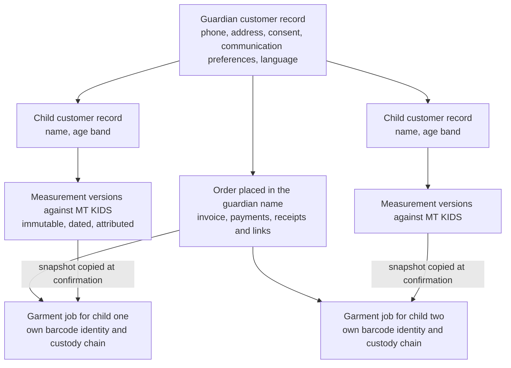
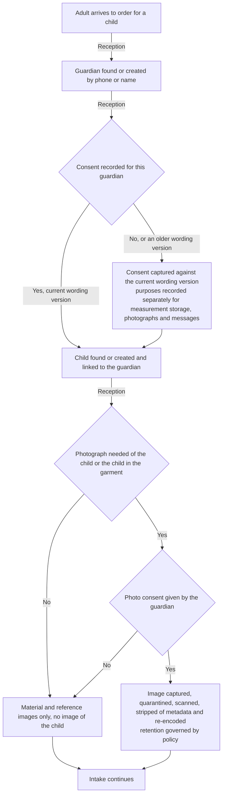
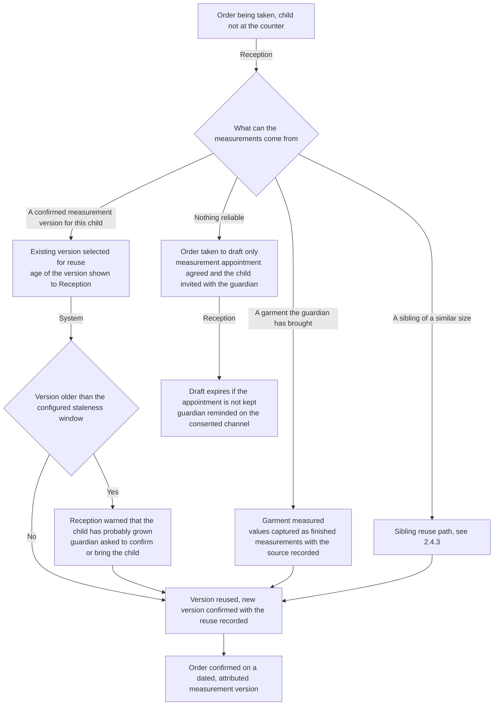
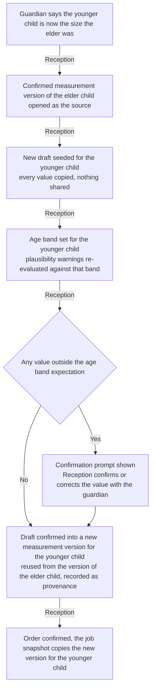
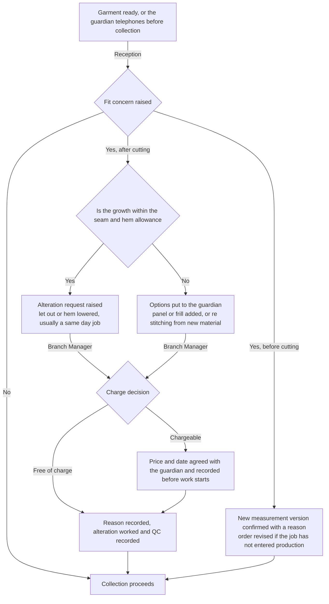
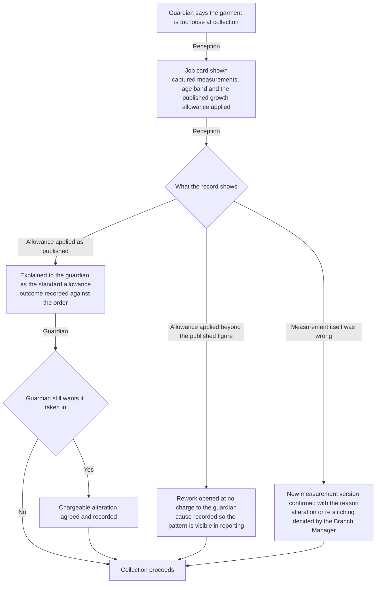
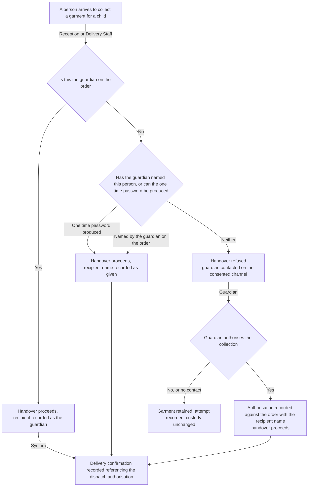

# Kids workflow

This document maps how a children's garment order runs in the workshop **today**, on paper, and how it will run
on HyFib Tailor 360. The `KIDS` category covers frocks, pattu pavadai, kids salwar and kids gowns up to the
fourteen-year age band. Three things make it different from every other category, and this map is organised
around them: **the guardian is the contact**, not the wearer; **measurements are reused across siblings** far more
often than they are re-taken; and a **growth allowance** is applied at cutting because the child will be bigger
by the festival than they were at the counter.

Sections 1 and 2 are the two main sections of this map. Section 3 is the closing "what changes for staff" table
that feeds the training material of issue #61c; Sections 4 and 5 are the open-decision register and the document
map. The common exception flows — duplicate customer, missing material, rejected QC, late order, damaged label,
cancellation and refund, unpaid dispatch attempt, negative feedback — are drawn in full in
[`blouse.md`](./blouse.md) Section 2.4 and are cited rather than repeated here. Every role name and term is used
exactly as [`../glossary.md`](../glossary.md) defines it.

| Aspect | Value |
| --- | --- |
| Category covered | `KIDS` |
| Service types | `STITCHING`, `ALTERATION`, `RESTITCHING` |
| Measurement template | `MT_KIDS` — nine fields including the `age_band` choice, deliberately short because a child will not stand still — see [`../measurement-templates.md`](../measurement-templates.md) |
| Contact | The guardian. The child never holds an account, is never contacted, and never receives a link |
| Proposed lead time, working days | Stitching 3, alteration 1, re-stitching 2 — **proposed, to be confirmed** under `OD-CAT-05` |
| Owning modules | Customers/Measurements, Catalog/Design, Media, Orders/Workflow, Custody/Barcode, Inventory, Billing/Payments, Notifications/Feedback |
| Implementing issues | #26, #27, #28, #30, #31, #32, #33, #34, #35, #36, #37, #38, #41, #42, #43, #47, #48, #49, and #57 for the retention of a child's data |
| Status | **Drafted for the owner workshop, not approved.** Approval of the workflow maps is the W0 exit gate of plan [Section 6.2](../../IMPLEMENTATION_PLAN.md) |

---

## 1. Current practice

### 1.1 How a kids order runs today

| # | What happens | Who does it | The record made today | Where that record lives |
| --- | --- | --- | --- | --- |
| 1 | A mother or grandmother arrives, usually with material for two or three children and often without the children | Reception | None until an order is written | — |
| 2 | The guardian's name and phone go into the counter register; the children are described as "big girl" and "small girl" | Reception | One register line for the whole visit | Counter register |
| 3 | If a child is present, measurements are taken quickly; if not, an old frock the guardian has brought is measured instead | Reception | Handwritten figures on one paper card, often for two children on the same sheet | The job card in the bundle |
| 4 | The guardian says "same as last time, a little bigger" | Reception | A pencil note, for example "add 1 inch" | The job card |
| 5 | Design is agreed from a sample frock or a photograph | Reception | A few words on the card | The job card |
| 6 | A price is quoted verbally, usually per garment | Reception | Nothing | — |
| 7 | An advance is taken, often small and often forgotten | Reception | A cash-book line if the counter is quiet | Cash book, or nothing |
| 8 | Everything is tied into one bundle with one token, whichever child it belongs to | Reception | One token on the card | The bundle |
| 9 | The Tailor Master gives the bundle to a Tailor with verbal instructions about which piece is for which child | Tailor Master, verbally | Nothing | — |
| 10 | The garments are cut with an allowance the Tailor judges by eye from the age of the child | Tailor | Nothing | — |
| 11 | The garments are stitched, finished and put on the ready rack in one bundle | Tailor | Nothing | — |
| 12 | The guardian, or an aunt, or a neighbour, collects the bundle | Reception | A cash-book line | Cash book |
| 13 | A garment that does not fit comes back and is altered as a favour | Reception, verbally | Nothing | — |

### 1.2 The records the shop keeps today

| Record | Kept by | What it contains | What it cannot answer |
| --- | --- | --- | --- |
| Counter order register | Reception | Date, guardian's name and phone, "kids", token | Which garment belongs to which child |
| Paper job card | In the bundle | Two or three children's figures on one sheet, undated | Which figures belong to which child, when they were taken, and whether they were the child's or an old frock's |
| The old frock the guardian brought | The guardian, taken home again | The measurements the shop actually worked from | Anything, once it goes home |
| Cash book | Reception | Daily cash in and out | The outstanding balance for this family |
| Ready rack | Physical | A bundle for the family | Whether every child's garment is in it |

### 1.3 Failure modes observed, and what removes each

The general failures of the paper system are catalogued in [`blouse.md`](./blouse.md) Section 1.4 and apply here
unchanged. The failures below are the ones this category produces most, and they cluster around identity and
allowance.

| Failure mode | How it happens today | What it costs | What removes it |
| --- | --- | --- | --- |
| **Siblings' measurements confused** | Two or three children on one sheet, described by size rather than by name | The younger child's frock fits the elder; both are altered or remade before a festival | Each child has their own record and their own measurement versions; a garment job names the child it is for |
| **"Same as last time" cannot be found** | The old slip is in a folder, undated, or on the guardian's phone | The child is measured again, or the shop guesses | Confirmed measurement versions are dated, attributed and reusable, and a reuse records where it came from |
| **Growth allowance judged by eye** | Each Tailor adds a different allowance from the child's apparent age | The frock is tight by the festival, or comically loose | The growth allowance is part of the published ease convention for `KIDS`, applied at cutting, and the `age_band` is a captured field rather than a guess |
| **Forgotten alteration on a child's garment** | Alterations are agreed as a favour and passed on verbally | The garment is collected unaltered on the eve of the festival | An alteration is a recorded request with an owner, a due date and a communication status |
| **Unrecorded advance** | Small advances at a busy counter | Cash short at closing, and an awkward conversation with a regular family | Advances are payment records allocated to the order with a numbered receipt |
| **No traceability of who held the garment** | Several small garments in one bundle passing through several hands | A missing frock is discovered on collection day | Each garment job has its own barcode identity and its own append-only custody chain |
| **Handed to whoever comes** | The bundle is given to an aunt or a neighbour who says the family sent them | The wrong family receives a garment; a dispute follows | The handover records the recipient's name with a one-time password or a signature, referencing the dispatch authorisation |
| **A child's photograph taken without asking** | A picture is taken to remember the design | An avoidable privacy problem | Photographs are captured only against a recorded consent given by the guardian, and their retention is governed by policy |

---

## 2. Target workflow

### 2.1 Who the customer is

The guardian is the person the branch communicates with, bills, and takes consent from. The child is the wearer,
and the measurements belong to the child, not to the guardian. The proposed default is that **each child has
their own customer record**, carrying the child's name and age band, linked to the guardian's customer record,
with contact details, communication preferences and consent held on the **guardian** record and used for every
message. Duplicate detection is tuned so that children sharing a guardian's phone number are not raised as
duplicate candidates of each other.

This shape is **proposed, not settled** — it needs a guardian link on the customer model in issue #26. The
alternative, in which the guardian is the only customer record and each child is a named measurement profile
beneath it, is recorded as open decision `OD-WF-20`. Nothing in the rest of this document depends on which is
chosen; both keep the guardian as the contact and both keep each child's measurements separate.

### 2.2 The phases the system tracks

The phase list, the actor for each phase and the events recorded are exactly as tabulated in
[`blouse.md`](./blouse.md) Section 2.1. Kids differs in these points:

| Point | Kids behaviour |
| --- | --- |
| Intake | The guardian is identified first and consent is recorded on the guardian record, including consent to photograph the child's garment or the child. The child is then found or created |
| Measurement | A measurement version against `MT_KIDS`. `age_band` is captured first because it drives the growth allowance and narrows the plausibility warnings. Where the child is not present, the source of the values — a garment the guardian brought — is recorded with the version |
| Measurement reuse | A sibling's or the same child's earlier confirmed version may seed a new draft; confirming it creates a **new** version that records what it was reused from. A version is never shared between two children and never edited |
| Cutting | The published `KIDS` ease is applied, including the growth allowance on garment length. The allowance is configuration on the category, shown on the job card, and is not a decision the Tailor makes by eye |
| Order shape | One order commonly carries one garment job per child; the jobs are linked and are usually bound by `deliver_together` for a festival, exactly as drawn in [`lehenga.md`](./lehenga.md) Section 2.1 |
| Delivery | The recipient is the guardian or a person the guardian has named; the confirmation records who actually received the garment |

### 2.3 Happy path

```mermaid
flowchart TD
  A[Guardian arrives with material for one or more children] -->|Reception| B[Guardian found or created<br/>contact details, language and communication preferences confirmed<br/>consent recorded for measurement storage and photo capture]
  B -->|Reception| C[Child found or created and linked to the guardian<br/>name and age band recorded]
  C -->|Reception or Measurement Staff| D[Measurement draft captured against MT KIDS<br/>age band first, then the nine fields<br/>source recorded where a brought garment was measured<br/>confirmed into an immutable measurement version]
  D -->|Reception| E[Category KIDS and service STITCHING selected per child<br/>design options chosen, material and reference images captured]
  E -->|Reception| F[Estimate issued in the guardian name<br/>one line per child, shared as an expiring customer link]
  F -->|Reception| G[Order confirmed in one transaction<br/>one garment job per child with measurement, design and price snapshots<br/>deliver together dependency written where the family wants them at once]
  G -->|Custody, inside the confirmation transaction| H[One barcode identity allocated per garment job]
  H -->|Reception| I[One label printed per job at the print station<br/>each naming the child on the human readable cue]
  I -->|Cashier| J[Advance recorded and numbered receipt issued]
  J -->|Tailor Master| K[Start production per job<br/>workflow version pinned, jobs assigned]
  K -->|Inventory Clerk| L[Material issue<br/>customer material into custody per job, elastic, lace, buttons and lining issued]
  L -->|Tailor| M[Scan to take custody of a garment job]
  M -->|Tailor| N[Cutting phase<br/>published kids ease applied, including the growth allowance on garment length]
  N -->|Tailor| O[Stitching phase]
  O -->|Tailor| P[Finishing phase<br/>hems, closures, pressing, each garment packed under its own job]
  P -->|Tailor| Q[Handover scan to the QC custodian]
  Q -->|Tailor Master| R[QC recorded per job against the pinned checklist version<br/>including the growth allowance criterion]
  R -->|Ready gate, computed by the system| S[Ready state per job<br/>deliver together holds the family set until every job passes]
  S -->|System| T[Jobs enter the branch delivery queue as one set]
  T -->|Cashier| U[Invoice posted in the guardian name and balance payment recorded<br/>receipt issued]
  U -->|Delivery Staff| V[Receive scan of each job<br/>Billing evaluates dispatch eligibility for the order]
  V -->|Custody| W[Dispatch authorisation recorded<br/>custody passes to Delivery Staff]
  W -->|Delivery Staff| X[Dispatch scan, the set leaves the branch]
  X -->|Delivery Staff| Y[Doorstep confirmation<br/>recipient name plus one-time password or signature]
  Y -->|Notifications| Z[Feedback invitation sent to the guardian on the consented channel]
  Z -->|Guardian| AA[Feedback recorded<br/>a low rating opens a service recovery case]
```

Counter collection is the usual ending for this category and follows [`blouse.md`](./blouse.md) Section 2.4.10,
with the recipient check of Section 2.4.6 below applied at the counter as well as at the door.

### 2.4 Exceptions

| Exception | Where it is drawn |
| --- | --- |
| Duplicate customer at intake | [`blouse.md`](./blouse.md) 2.4.1, extended by 2.4.1 below |
| Missing or insufficient material | [`blouse.md`](./blouse.md) 2.4.2 |
| Changed measurements after confirmation | [`blouse.md`](./blouse.md) 2.4.3 |
| Rejected QC and rework | [`blouse.md`](./blouse.md) 2.4.5 |
| Late order, hold and reschedule | [`blouse.md`](./blouse.md) 2.4.6 |
| Damaged, lost or wrong label | [`blouse.md`](./blouse.md) 2.4.7 |
| Cancelled order and refund | [`blouse.md`](./blouse.md) 2.4.8 |
| Unpaid dispatch attempt | [`blouse.md`](./blouse.md) 2.4.9 |
| Counter collection instead of delivery | [`blouse.md`](./blouse.md) 2.4.10 |
| Negative feedback and alteration | [`blouse.md`](./blouse.md) 2.4.11 |
| One job of a family set fails QC | [`lehenga.md`](./lehenga.md) 2.4.1 |
| Guardian identity and consent at intake | 2.4.1 below |
| Child is not present to be measured | 2.4.2 below |
| Measurements reused across siblings | 2.4.3 below |
| The child has grown before the garment is collected | 2.4.4 below |
| Growth allowance disputed at collection | 2.4.5 below |
| Someone other than the guardian collects | 2.4.6 below |

#### 2.4.1 Guardian identity and consent at intake

The retention period and the data classification for images of a child are confirmed in the data-classification
work of issue #19 and enforced by the retention job of issue #57; the item is flagged for legal review and is
recorded as `OD-WF-21`. Until it is settled, the working default is that no image of a child is captured unless
the guardian has given photo consent, and that reference images of the **garment** are preferred to images of
the child.

#### 2.4.2 Child is not present to be measured

The staleness window for a child's measurement version — proposed at 90 days, considerably shorter than for an
adult — is open decision `OD-WF-22`.

#### 2.4.3 Measurements reused across siblings

Two children never share a measurement version. Reuse is a copy with recorded provenance, so a later correction
to one child's measurements can never silently change another child's garment, and the reuse itself is visible
on both children's timelines.

#### 2.4.4 The child has grown before the garment is collected

#### 2.4.5 Growth allowance disputed at collection

Because the allowance is published configuration rather than a Tailor's judgement, this conversation is settled
from the record rather than from memory, and a genuine over-allowance is visible as a pattern rather than as an
argument.

#### 2.4.6 Someone other than the guardian collects

The confirmation always records **who actually received the garment**, whether or not that is the guardian, so
a later question about a collection is answered from the record.

---

## 3. What changes for staff

| Role | Today | After Tailor360 | Training note |
| --- | --- | --- | --- |
| Reception | Writes two or three children's figures on one card, describes them as big and small, adds "one inch" as a note | Records the guardian once, records each child separately, captures the age band first, reuses a sibling's or an earlier version as a seeded copy with provenance, and issues one estimate for the family | Practise the sibling reuse path until it is quicker than re-measuring. Emphasise that consent belongs to the guardian and that a child's photograph is never taken without it |
| Tailor Master | Allots a bundle of small garments verbally and trusts the Tailor's judgement on allowance | Assigns one job per child, sees which child's garment is outstanding on the workboard, records QC per job including the growth allowance criterion | Focus on one job per child. A family bundle is several jobs, and the ready gate holds the set until every child's garment passes |
| Tailor | Cuts a child's garment with an allowance judged by eye | Scans the job to take custody, applies the published growth allowance shown on the job card, records lace, elastic and buttons consumed | Teach that the allowance is on the job card and is not theirs to change; if it looks wrong, that is a note on the job, not a silent correction |
| Inventory Clerk | Hands out lace, elastic and buttons loosely | Issues them against the named garment job, records returns and wastage, responds to low-stock alerts before a festival | Show that festival demand is predictable and that low-stock alerts exist so lace is not found missing on the busiest week |
| Cashier | Takes a small advance and rarely writes it down | Records the advance against the guardian's order, allocates it, issues a numbered receipt | Emphasise that small advances are the most commonly lost money in the shop, and that the family sees one balance for all the children |
| Delivery Staff | Hands the bundle to whoever comes | Receive-scans each job, dispatches against an authorisation, records the actual recipient with a one-time password or signature | Teach the recipient check as normal courtesy rather than suspicion, and that refusing a handover is a supported outcome with a clear next step |
| Branch Manager | Settles fit arguments from memory before every festival | Works the exception queues, decides charge or no charge on growth alterations with a recorded reason, resolves reconciliation cases | Focus on the growth-allowance dispute flow: the record settles it, and repeated over-allowance is a reportable pattern |
| Owner | Sees kids work as low value and does not measure it | Reads volume, alteration rate and margin per category, including the alteration rate caused by growth | Emphasise that the kids alteration rate is a quality signal, not an unavoidable cost of children |

---

## 4. Open decisions

Recorded here and mirrored centrally in [`../assumptions-and-open-decisions.md`](../assumptions-and-open-decisions.md).
Items that map to a business-owner decision in [Section 11](../../IMPLEMENTATION_PLAN.md) of the implementation plan
carry that reference.

| ID | Question | Proposed default, not yet agreed | Owner | Raised | Needed by |
| --- | --- | --- | --- | --- | --- |
| `OD-WF-20` | Is each child a customer record linked to a guardian, or is the guardian the only customer record with each child as a named measurement profile beneath it? | A customer record per child with a guardian link on the customer model; contact details, preferences and consent live on the guardian record and drive every message | Owner, with the technical reviewer | 2026-09-04 | #26 customers and #27 measurements, wave 3. Requires a guardian link in the #26 scope |
| `OD-WF-21` | What is the retention period and the data classification for a child's measurements and for any image of a child, and does the wording of the guardian's consent need legal review? | Photographs of the garment are preferred to photographs of the child; images of a child are captured only against explicit guardian photo consent, with a retention period shorter than the adult default. **Requires legal review before it is treated as settled** | Owner, co-signed by the legal reviewer | 2026-09-04 | #19 data classification and #57 retention, wave 1 and wave 5. Plan Section 11 item 8 |
| `OD-WF-22` | How old may a child's confirmed measurement version be before Reception is warned that it is stale? | 90 days, against a longer default for adults; the window is configuration per category, not code | Owner, with the Tailor Master | 2026-09-04 | #27 measurement templates and #28 capture, wave 3 |
| `OD-WF-23` | Should the growth allowance vary by age band rather than being one figure for the whole category? | One published figure at launch — plus 20 mm on garment length — reviewed after one festival season with the measured alteration rate | Owner, with the Tailor Master | 2026-09-04 | #27 and #33, wave 3 and 4. Related to `OD-MEA-04` in [`../measurement-templates.md`](../measurement-templates.md) |
| `OD-WF-24` | May a guardian name in advance the people permitted to collect, and is that list held on the order or on the guardian record? | Named on the order at confirmation, because permission is usually specific to one collection | Owner | 2026-09-04 | #48 delivery confirmation, wave 4. Related to plan Section 11 item 4 |
| `OD-WF-25` | Are children's garments for one family always bound by `deliver_together`, or is that a choice at intake? | A choice at intake, defaulted on, because families almost always collect together for a festival | Owner, with each Branch Manager | 2026-09-04 | #32 order confirmation and #48 delivery queue, wave 3 and 4 |

---

## 5. Related documents

| Document | Why it matters here |
| --- | --- |
| [`blouse.md`](./blouse.md) | The reference file: the phase table and the common exception flows cited above |
| [`lehenga.md`](./lehenga.md) | The multi-garment order structure and the `deliver_together` behaviour reused for a family set |
| [`salwar.md`](./salwar.md), [`gown.md`](./gown.md) | The other category maps |
| [`branch-scenarios.md`](./branch-scenarios.md) | Branch-level variations, including a family served at a second branch |
| [`../00-overview.md`](../00-overview.md) | The end-to-end journey and the dispatch gate in product terms |
| [`../glossary.md`](../glossary.md) | Authoritative definitions of every role, phase and record named above |
| [`../category-hierarchy.md`](../category-hierarchy.md) | `KIDS`, its service types and the five links each carries |
| [`../measurement-templates.md`](../measurement-templates.md) | `MT_KIDS`, the `age_band` choice field, the age-band overlay and the growth allowance in the ease convention |
| [`../state-transitions.md`](../state-transitions.md) | Transition, actor, preconditions, outputs, audit event and exception behaviour |
| [`../raci.md`](../raci.md) | Who is responsible, accountable, consulted and informed for each step |
| [`../configurable-vs-fixed.md`](../configurable-vs-fixed.md) | What an administrator may change here without a deployment |
| [`../assumptions-and-open-decisions.md`](../assumptions-and-open-decisions.md) | The central register that mirrors Section 4 |
| [`../../IMPLEMENTATION_PLAN.md`](../../IMPLEMENTATION_PLAN.md) | Decisions D8 to D12, the #17 blueprint in Section 8 and the owner decisions in Section 11 |
