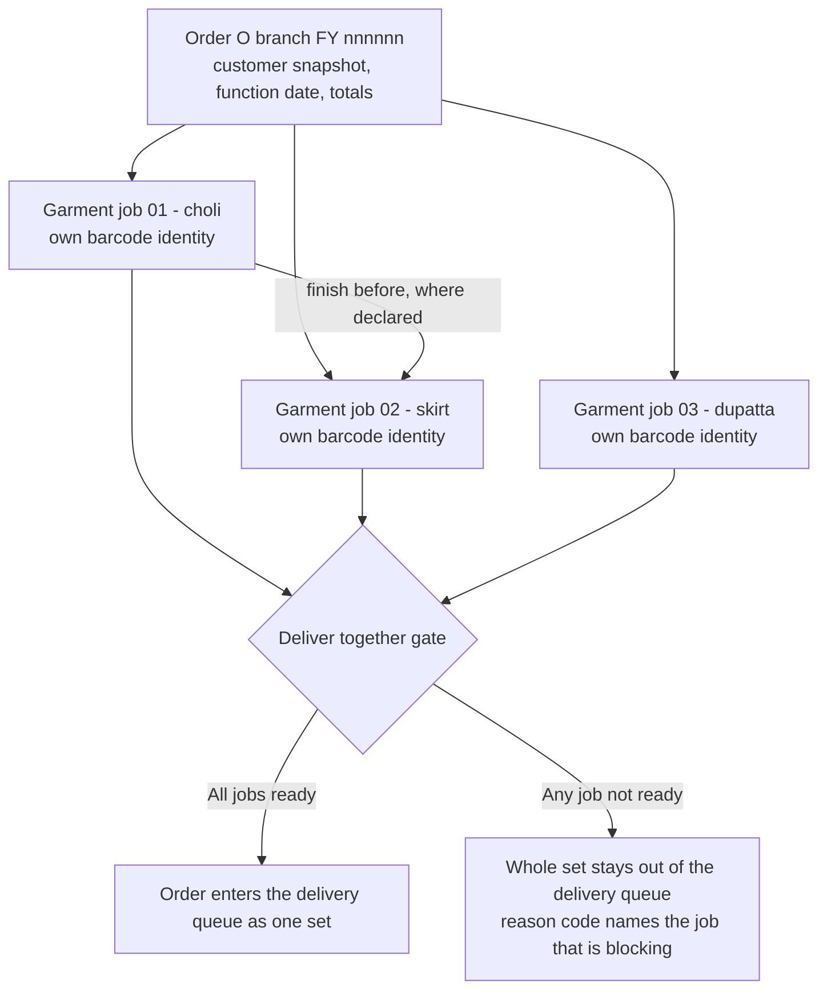
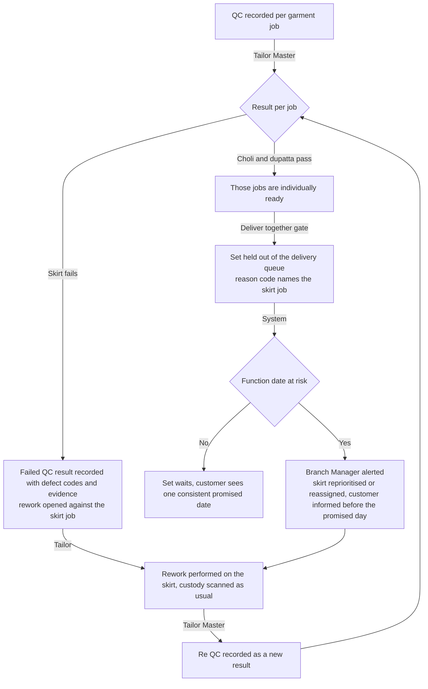
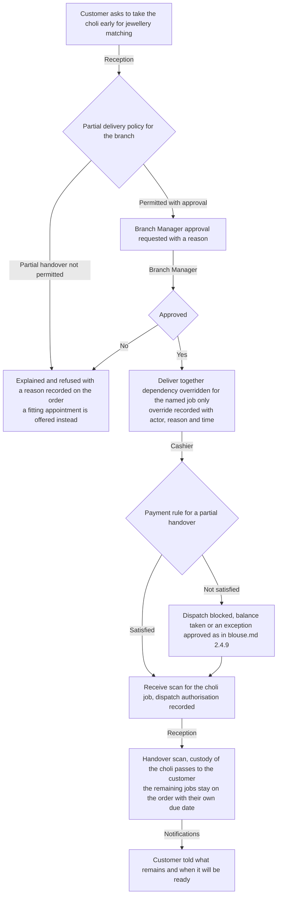
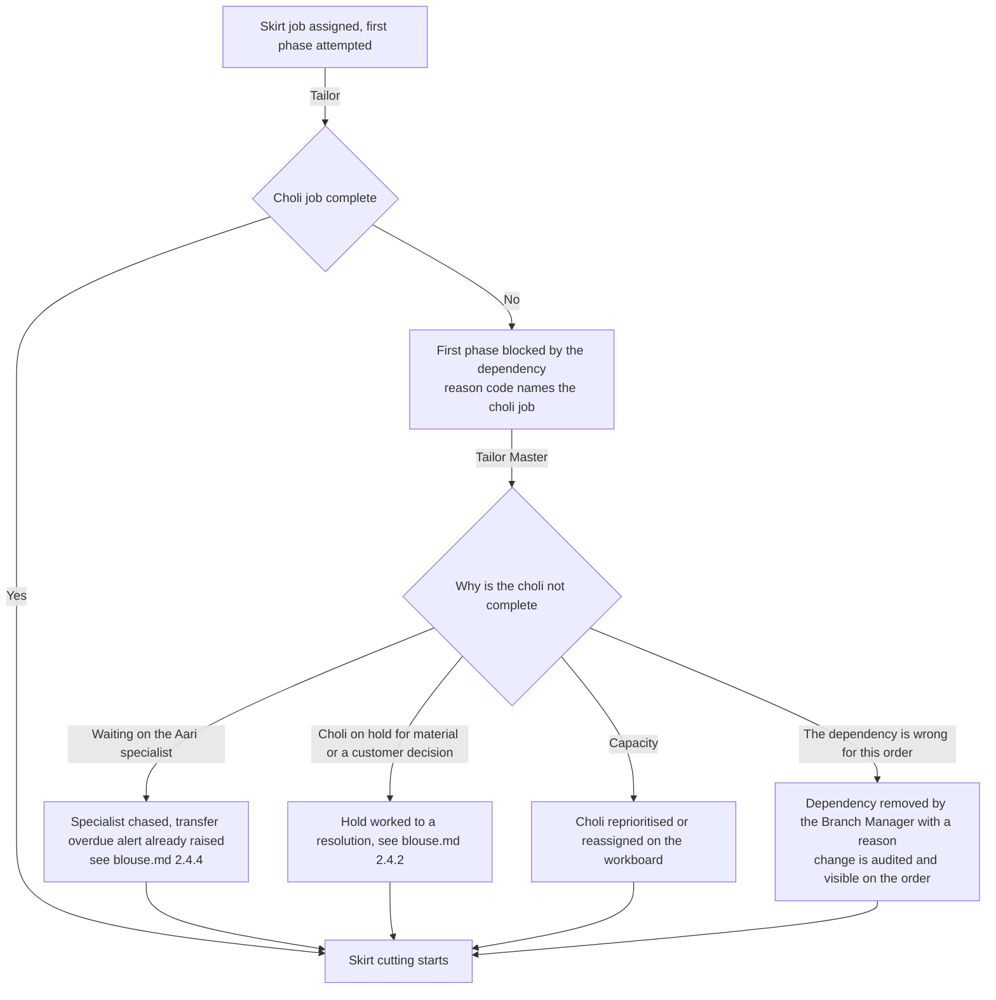
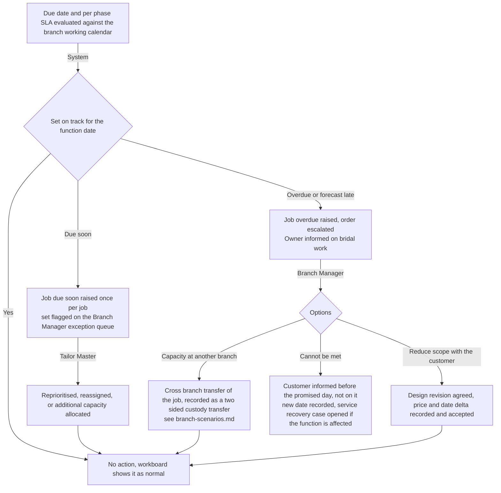
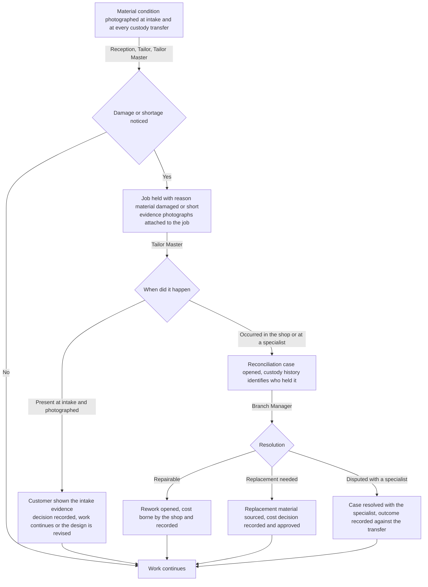

# Lehenga workflow — a multi-garment order

This document maps how a lehenga order runs in the workshop **today**, on paper, and how it will run on HyFib
Tailor 360. A lehenga is the clearest case of a **multi-garment order**: one order carrying several **linked
garment jobs** — the choli, the kali skirt and the dupatta — each with its own barcode identity, its own phases,
its own custody chain and often its own specialist, bound together by job dependencies so that they are finished
in the right order and delivered as one set. It is also the category with the longest lead time and the highest
material value in the shop, which is why the current paper practice fails here most expensively.

Sections 1 and 2 are the two main sections of this map. Section 3 is the closing "what changes for staff" table
that feeds the training material of issue #61c; Sections 4 and 5 are the open-decision register and the document
map. The common exception flows — duplicate customer, missing material, changed measurements, rejected QC, late
order, damaged label, cancellation and refund, unpaid dispatch attempt, negative feedback — are drawn in full in
[`blouse.md`](./blouse.md) Section 2.4 and are cited rather than repeated here. Every role name and term is used
exactly as [`../glossary.md`](../glossary.md) defines it.

| Aspect | Value |
| --- | --- |
| Category covered | `LEHENGA`, frequently ordered alongside `BLOUSE_PATTERN` or `BLOUSE_AARI` in the same order |
| Service types | `STITCHING`, `ALTERATION`, `RESTITCHING` |
| Measurement templates | `MT_LEHENGA` — choli, sleeve, neckline, shaping, skirt and dupatta groups — plus `MT_BLOUSE_AARI` where the choli is ordered as Aari work. See [`../measurement-templates.md`](../measurement-templates.md) |
| Garment jobs in one order | Proposed default three — choli, skirt, dupatta — linked by `finish_before` and `deliver_together`; see `OD-WF-11` |
| Proposed lead time, working days | Stitching 12, alteration 2, re-stitching 6 — **proposed, to be confirmed** under `OD-CAT-05` |
| Owning modules | Customers/Measurements, Catalog/Design, Media, Orders/Workflow, Custody/Barcode, Inventory, Billing/Payments, Notifications/Feedback |
| Implementing issues | #26, #27, #28, #30, #31, #32, #33, #34, #35, #36, #37, #38, #41, #42, #43, #47, #48, #49 |
| Status | **Drafted for the owner workshop, not approved.** Approval of the workflow maps is the W0 exit gate of plan [Section 6.2](../../IMPLEMENTATION_PLAN.md) |

---

## 1. Current practice

### 1.1 How a lehenga order runs today

| # | What happens | Who does it | The record made today | Where that record lives |
| --- | --- | --- | --- | --- |
| 1 | Customer arrives, usually well before a wedding, with expensive material and a folder of photographs | Reception, often with the Owner | None until an order is written | — |
| 2 | Name, phone, "lehenga set" and the function date are written into the counter register | Reception | One register line, the function date sometimes underlined | Counter register |
| 3 | Choli, skirt and dupatta measurements are taken in one sitting on one paper card | Reception, usually with the Tailor Master | Handwritten figures, kali count and flare argued over verbally | The job card in the bundle |
| 4 | The design is agreed from photographs on the customer's phone | Reception | A few words, sometimes a rough sketch | The job card |
| 5 | A price is quoted by the Owner, often as a single figure for the whole set | Owner | Nothing, or a pencilled figure on the register line | — |
| 6 | A substantial advance is taken, usually cash | Reception or Cashier | A cash-book line | Cash book |
| 7 | The material is bundled and put on the high rack; heavy embroidery material may go straight to an Aari unit | Reception, Tailor Master | A diary note if anyone remembers | Diary, or nothing |
| 8 | Cutting is done by the Tailor Master personally because of the value of the cloth | Tailor Master | Nothing | — |
| 9 | Choli, skirt and dupatta are worked by different hands, sometimes in different rooms, over several weeks | Tailor | Nothing | — |
| 10 | The customer telephones for progress and is told an estimate over the phone | Reception | Nothing | — |
| 11 | A trial fitting is arranged by telephone if there is time | Reception, verbally | Nothing | — |
| 12 | The set is gathered, pressed and put aside for collection | Tailor Master | Nothing | — |
| 13 | The balance is collected and the set handed over, often on the day before the function | Reception or Cashier | A cash-book line | Cash book |

### 1.2 The records the shop keeps today

| Record | Kept by | What it contains | What it cannot answer |
| --- | --- | --- | --- |
| Counter order register | Reception | Date, name, phone, "lehenga set", function date, token | Which of the three pieces is finished, which is not, and who holds each |
| Paper job card | In the bundle, if it stays with it | Choli, skirt and dupatta figures on one sheet | Which figures belong to which piece once the pieces separate |
| Aari outwork diary | Tailor Master, where kept | Bundle sent to the embroidery unit | The condition it was sent in, or what stones went with it |
| Cash book | Reception or Cashier | The advance and the balance | What is still outstanding two weeks before the function |
| Customer's phone | The customer | The photographs of the design they wanted | Anything the shop can rely on later in a dispute |

### 1.3 Failure modes observed, and what removes each

The general failures of the paper system are catalogued in [`blouse.md`](./blouse.md) Section 1.4 and apply here
unchanged. Multi-piece bridal work adds the following, and each of them is expensive.

| Failure mode | How it happens today | What it costs | What removes it |
| --- | --- | --- | --- |
| **Pieces finish out of order** | The skirt hem is set before the choli is fitted, so the fall of the set is wrong | The skirt is re-hemmed at the shop's cost, days before the function | A `finish_before` dependency blocks the dependent job's first phase until its predecessor is complete |
| **One piece is ready and the rest are not, and the set goes out anyway** | The customer collects the choli to try with jewellery and it is never brought back for the final check | The set is never checked as a set, and problems surface on the function day | A `deliver_together` dependency binds the jobs at the ready gate and in the delivery queue; a deliberate partial handover is a policy decision, not an accident |
| **No traceability of who held the garment** | Three pieces, several hands, one embroidery unit, no records | When a piece cannot be found, days are lost searching for it | Every movement is an append-only scan event naming the from and to custodian, the location, the actor and the server time; each piece has its own barcode identity |
| **Lost job card carrying all three pieces** | One paper sheet holds every figure | The whole set is re-measured, if the customer can come back | Immutable measurement, design and price snapshots per garment job; job cards and labels are reprintable |
| **Unrecorded advance on a large sum** | A five-figure advance taken at a busy counter | The largest cash risk in the shop | Advances are payment records allocated to the order, with a numbered receipt and a cashier session counted at close |
| **Forgotten alteration before the function** | A fitting note is agreed verbally and the piece goes back on the rack | The customer collects an unaltered garment on the eve of the function | The alteration is a recorded request with an owner and a due date, and it appears on the exception queue |
| **Damage to costly customer material is discovered late** | Nobody records the condition the material arrived in or left in | The dispute is settled by argument, and usually at the shop's cost | Condition evidence at intake and at every custody transfer, and a reconciliation case when the evidence disagrees |
| **The function date is not the promised date** | The promised date is a verbal guess | Everything is a rush at the end | The due date is derived from the service type's expected duration against the branch working calendar, and the function date is recorded so due-soon alerts fire early |

---

## 2. Target workflow

### 2.1 How the order is structured

One **order** carries three linked **garment jobs**. Each job has its own job number, its own barcode identity,
its own phases and its own custody chain; the order carries the customer snapshot, the function date and the
totals.

| Job | Category and service | Typical specialist | Dependency | Why it is its own job |
| --- | --- | --- | --- | --- |
| Choli | `LEHENGA.STITCHING`, or `BLOUSE_AARI.STITCHING` where the embroidery is heavy | Blouse tailor, or an Aari specialist | None inbound; `finish_before` the skirt where the fall of the set depends on the fitted choli | It has the shortest phases and the highest fit risk, and it often leaves the shop for embroidery |
| Skirt | `LEHENGA.STITCHING` | Skirt tailor | `finish_before` from the choli, where declared | Kali cutting, joining, lining and hemming are days of work that must not start on a wrong assumption |
| Dupatta | `LEHENGA.STITCHING` | Finisher, or the Aari specialist for a border | None | It is frequently added, dropped or sent for a border after the rest is under way |

All three jobs carry `deliver_together`, so the ready gate does not open for any of them until every one of them
is ready. Whether the dupatta is a garment job in its own right or a declared piece of the skirt job is open
decision `OD-WF-11`; whether the choli is ordered under `LEHENGA` or under a blouse sub-category when it carries
Aari work is `OD-WF-12`.

### 2.2 The phases the system tracks

The phase list, the actor for each phase and the events recorded are exactly as tabulated in
[`blouse.md`](./blouse.md) Section 2.1, applied **per garment job**. Lehenga differs in these points:

| Point | Lehenga behaviour |
| --- | --- |
| Measurement | One measurement version against `MT_LEHENGA` covers the choli, skirt and dupatta groups, including `kali_count` as a count field and `lehenga_flare` as a finished measurement. Where the choli is ordered as `BLOUSE_AARI`, a second version against `MT_BLOUSE_AARI` is captured in the same sitting, seeded from the choli values with the reuse recorded as provenance |
| Order confirmation | One transaction creates the order and all three garment jobs, allocates all three job numbers, allocates a barcode identity for each and writes the dependencies |
| Labels | Three labels are printed, one per job. Each carries its own opaque payload; the human-readable cue names the piece so a bundle is not mis-scanned |
| Material issue | The customer's material is high value: condition photographs are taken at intake, and the customer-material custody record names the pieces received. Lining, canvas, hooks, fall and embroidery trims are shop stock issued against the specific job |
| Specialist work | Where the choli or the dupatta border goes to an Aari specialist, the specialist work phase and its two-sided custody transfer are exactly as drawn in [`blouse.md`](./blouse.md) Section 2.3 and 2.4.4 |
| Trial fitting | A trial fitting phase is used on bridal work. It is a configured, optional phase of the workflow definition, not an informal telephone call; see `OD-WF-13` |
| Ready | The gate evaluates each job, and `deliver_together` holds the whole set until every job passes |

### 2.3 Happy path

```mermaid
flowchart TD
  A[Customer arrives with lehenga material and design references] -->|Reception| B[Customer found or created<br/>consent recorded for measurement storage and photo capture<br/>function date recorded on the order]
  B -->|Reception or Measurement Staff| C[Measurement draft captured against MT LEHENGA<br/>choli, skirt with kali count and flare, dupatta groups<br/>confirmed into an immutable measurement version]
  C -->|Reception| D[Category LEHENGA selected for each piece<br/>design options chosen per piece, material and reference images captured<br/>condition photographs taken of the customer material]
  D -->|Reception| E[Estimate issued for the whole order<br/>each piece priced as its own line, shared as an expiring customer link]
  E -->|Reception| F[Order confirmed in one transaction<br/>three garment jobs created with measurement, design and price snapshots<br/>finish before and deliver together dependencies written]
  F -->|Custody, inside the confirmation transaction| G[One barcode identity allocated per garment job]
  G -->|Reception| H[Three labels printed at the print station<br/>each naming its piece]
  H -->|Cashier| I[Advance recorded against the order and numbered receipt issued]
  I -->|Tailor Master| J[Start production per job<br/>workflow versions pinned, jobs assigned by capability]
  J -->|Inventory Clerk| K[Material issue<br/>customer material into custody with condition evidence<br/>lining, canvas, fall, hooks and embroidery trims issued per job]
  K -->|Tailor| L[Scan to take custody of the choli job]
  L -->|Tailor| M[Choli cutting phase]
  M -->|Tailor Master| N[Transfer out to the Aari specialist where the choli carries embroidery<br/>condition evidence recorded on both legs]
  N -->|Tailor| O[Choli stitching phase]
  O -->|Tailor| P[Trial fitting phase where the workflow declares one<br/>fit notes recorded against the job]
  P -->|Tailor| Q[Choli finishing phase]
  Q -->|System| R[Choli complete<br/>finish before dependency released for the skirt]
  R -->|Tailor| S[Scan to take custody of the skirt job]
  S -->|Tailor| T[Skirt cutting phase<br/>kali panels cut to the recorded kali count and flare]
  T -->|Tailor| U[Skirt stitching phase<br/>panels joined, lining and canvas fitted]
  U -->|Tailor| V[Skirt finishing phase<br/>hem set against the fitted choli, pressing]
  V -->|Tailor| W[Dupatta job worked in parallel<br/>cut, edged, border applied, finished]
  W -->|Tailor| X[Handover scans of all three jobs to the QC custodian]
  X -->|Tailor Master| Y[QC recorded per job against the pinned checklist versions]
  Y -->|Ready gate, computed by the system| Z[Ready state evaluated per job<br/>deliver together holds the set until every job passes]
  Z -->|System| AA[Order enters the branch delivery queue as one set]
  AA -->|Cashier| AB[Invoice posted and balance payment recorded<br/>receipt issued]
  AB -->|Delivery Staff| AC[Receive scan of each job at the branch<br/>Billing evaluates dispatch eligibility for the order]
  AC -->|Custody| AD[Dispatch authorisation recorded<br/>custody of all three jobs passes to Delivery Staff]
  AD -->|Delivery Staff| AE[Dispatch scan, the set leaves the branch]
  AE -->|Delivery Staff| AF[Doorstep confirmation<br/>recipient name plus one-time password or signature]
  AF -->|Notifications| AG[Feedback invitation sent on the consented channel]
  AG -->|Customer| AH[Feedback recorded<br/>a low rating opens a service recovery case]
```

Where the customer collects at the counter — common for bridal work, because the set is tried on before it is
taken — the ending follows [`blouse.md`](./blouse.md) Section 2.4.10, with the receive scan performed for each of
the three jobs.

### 2.4 Exceptions

| Exception | Where it is drawn |
| --- | --- |
| Duplicate customer at intake | [`blouse.md`](./blouse.md) 2.4.1 |
| Missing or insufficient material | [`blouse.md`](./blouse.md) 2.4.2 |
| Changed measurements after confirmation | [`blouse.md`](./blouse.md) 2.4.3 |
| Aari specialist overdue, or work returned damaged | [`blouse.md`](./blouse.md) 2.4.4 |
| Rejected QC and rework | [`blouse.md`](./blouse.md) 2.4.5, extended by 2.4.1 below |
| Late order, hold and reschedule | [`blouse.md`](./blouse.md) 2.4.6, extended by 2.4.4 below |
| Damaged, lost or wrong label | [`blouse.md`](./blouse.md) 2.4.7 |
| Cancelled order and refund | [`blouse.md`](./blouse.md) 2.4.8 |
| Unpaid dispatch attempt | [`blouse.md`](./blouse.md) 2.4.9 |
| Negative feedback and alteration | [`blouse.md`](./blouse.md) 2.4.11 |
| One job fails QC while its siblings are ready | 2.4.1 below |
| Customer asks for one ready piece before the rest | 2.4.2 below |
| A `finish_before` dependency cannot be met | 2.4.3 below |
| The function date will not be met | 2.4.4 below |
| High-value customer material damaged or short | 2.4.5 below |

#### 2.4.1 One job fails QC while its siblings are ready

The customer is never given three different answers about one set: the order has one promised date and one ready
state, computed from the jobs.

#### 2.4.2 Customer asks for one ready piece before the rest

Whether a partial handover is permitted at all, who may approve it, and what payment it requires, is business
owner decision `OD-04` in [`../assumptions-and-open-decisions.md`](../assumptions-and-open-decisions.md). Until
that decision is taken, the documented default is that `deliver_together` holds and a partial handover is
refused.

#### 2.4.3 A `finish_before` dependency cannot be met

A dependency is never worked around by simply starting the blocked job: it is either resolved or explicitly
removed with a reason, so the workshop cannot quietly re-create the failure the dependency exists to prevent.

#### 2.4.4 The function date will not be met

#### 2.4.5 High-value customer material damaged or short

---

## 3. What changes for staff

| Role | Today | After Tailor360 | Training note |
| --- | --- | --- | --- |
| Reception | Writes one card for three pieces, promises a date against a wedding, takes a large cash advance | Captures one measurement version covering all three pieces, creates one order with three linked garment jobs, issues a per-piece priced estimate, records the function date, prints three labels and records the advance for the Cashier to confirm | Practise creating a multi-garment order. Emphasise that three labels are not three orders, and that the function date is recorded so the system warns early rather than late |
| Tailor Master | Cuts the costly material personally, holds the whole plan in memory, sends embroidery out on trust | Starts production per job, pins the workflow versions, sets and respects `finish_before`, records the Aari transfer out and receive with condition evidence, records QC per job | Focus on dependencies: a blocked job is information, not an obstacle to work around. A dependency is removed with a reason or resolved, never ignored |
| Tailor | Works whichever piece is put in front of them | Scans the specific job to take custody, works its phases, records trims consumed, hands over by scan | Teach that each piece has its own label and its own job; scanning the wrong piece is caught by the server, not discovered next week |
| Inventory Clerk | Hands out lining, canvas, fall and stones without counting | Issues them against the named garment job, records returns and wastage, responds to low-stock alerts | Show that bridal trims are where the margin leaks, and that issue against a job is what makes the set's true cost visible |
| Cashier | Writes a cash-book line for a five-figure advance | Records the advance against the order, allocates it, issues a numbered receipt, closes the session against a counted total | Emphasise that the largest cash risk in the shop now has a receipt, an allocation and a reconciliation |
| Delivery Staff | Takes what is on the rack when the customer arrives | Works the delivery queue, receive-scans each job of the set, dispatches only against an authorisation, confirms the handover | Teach that the set moves as one: three receive scans, one dispatch authorisation, one confirmation |
| Branch Manager | Firefights the week before every function | Works the exception queues, approves dependency changes and any permitted partial handover, resolves reconciliation cases on damaged material | Focus on the forecast-late escalation and on approving with a reason that reads well six months later |
| Owner | Quotes bridal prices personally and learns about slippage late | Reads lead time, specialist turnaround, rework rate and margin per order; approves prices and dispatch exceptions with step-up authentication | Emphasise that bridal margin depends on trims, wastage and specialist turnaround, all of which become measurable |

---

## 4. Open decisions

Recorded here and mirrored centrally in [`../assumptions-and-open-decisions.md`](../assumptions-and-open-decisions.md).
Items that map to a business-owner decision in [Section 11](../../IMPLEMENTATION_PLAN.md) of the implementation plan
carry that reference.

| ID | Question | Proposed default, not yet agreed | Owner | Raised | Needed by |
| --- | --- | --- | --- | --- | --- |
| `OD-WF-11` | Is a lehenga ordered as three linked garment jobs — choli, skirt, dupatta — or as one job with three declared pieces, as a salwar set is? | Three linked jobs, because the pieces move independently through the workshop and often through different specialists; `deliver_together` keeps them one set for the customer | Owner, with the Tailor Master | 2026-09-04 | #32 order confirmation and #33 dependencies, wave 3 and 4. Related to `OD-WF-08` |
| `OD-WF-12` | When the choli carries heavy Aari work, is it ordered under `LEHENGA` or under `BLOUSE_AARI`? | Under `BLOUSE_AARI`, so it inherits the Aari measurement group, the specialist phase and the Aari QC criteria; it stays linked to the lehenga order | Owner, with the Tailor Master | 2026-09-04 | #29 catalogue and #30 design options, wave 3. Related to `OD-CAT-03` |
| `OD-WF-13` | Is a trial fitting a configured phase of the bridal workflow definition, and is it mandatory on lehenga work above a value threshold? | A configured, optional phase, made mandatory by the workflow definition for `LEHENGA.STITCHING`; the value threshold is not used at launch | Owner, with the Tailor Master | 2026-09-04 | #33 workflow definitions, wave 4. Related to `OD-WF-16` in [`gown.md`](./gown.md) |
| `OD-WF-14` | Is the customer's function date a first-class field on the order that drives due dates and alerts, distinct from the promised date? | Yes: the function date is recorded and the promised date is derived to fall before it; due-soon alerts are evaluated against the promised date | Owner | 2026-09-04 | #32 order confirmation and #33 due dates, wave 3 and 4 |
| `OD-WF-15` | Is condition photography of customer material mandatory at intake for this category, and at every custody transfer? | Mandatory at intake for `LEHENGA`, and on both legs of any transfer that leaves the branch; configured as an evidence requirement on the workflow phase | Owner, with the Tailor Master | 2026-09-04 | #31 media and #34 evidence requirements, wave 3 and 4. Related to `OD-WF-03` |

---

## 5. Related documents

| Document | Why it matters here |
| --- | --- |
| [`blouse.md`](./blouse.md) | The reference file: the phase table, the Aari specialist transfer and the common exception flows cited above |
| [`salwar.md`](./salwar.md), [`gown.md`](./gown.md), [`kids.md`](./kids.md) | The other category maps |
| [`branch-scenarios.md`](./branch-scenarios.md) | Cross-branch garment and material transfer, used when capacity at another branch is the answer to a late set |
| [`../00-overview.md`](../00-overview.md) | The end-to-end journey and the dispatch gate in product terms |
| [`../glossary.md`](../glossary.md) | Authoritative definitions, including job dependency, ready state and dispatch authorisation |
| [`../category-hierarchy.md`](../category-hierarchy.md) | `LEHENGA`, its service types and the five links each carries |
| [`../measurement-templates.md`](../measurement-templates.md) | `MT_LEHENGA`, including `kali_count` and `lehenga_flare`, and the ease convention applied at cutting |
| [`../state-transitions.md`](../state-transitions.md) | Transition, actor, preconditions, outputs, audit event and exception behaviour |
| [`../raci.md`](../raci.md) | Who is responsible, accountable, consulted and informed for each step |
| [`../configurable-vs-fixed.md`](../configurable-vs-fixed.md) | What an administrator may change here without a deployment |
| [`../assumptions-and-open-decisions.md`](../assumptions-and-open-decisions.md) | The central register that mirrors Section 4, including `OD-04` on partial delivery |
| [`../../IMPLEMENTATION_PLAN.md`](../../IMPLEMENTATION_PLAN.md) | Decisions D8 to D12, the #17 blueprint in Section 8 and the owner decisions in Section 11 |
