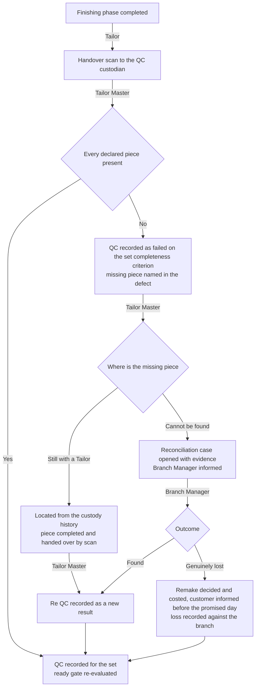
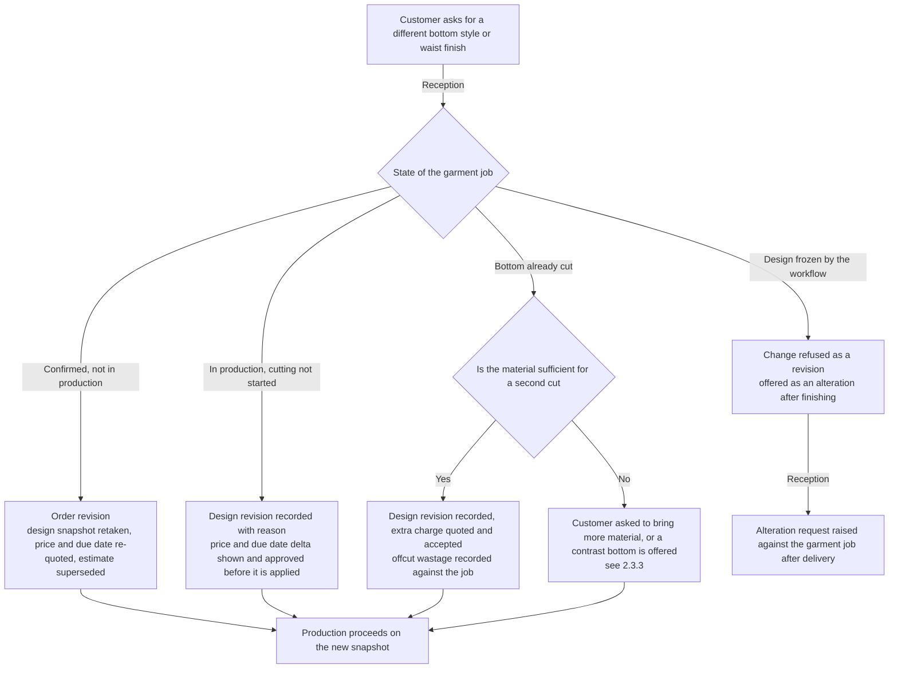
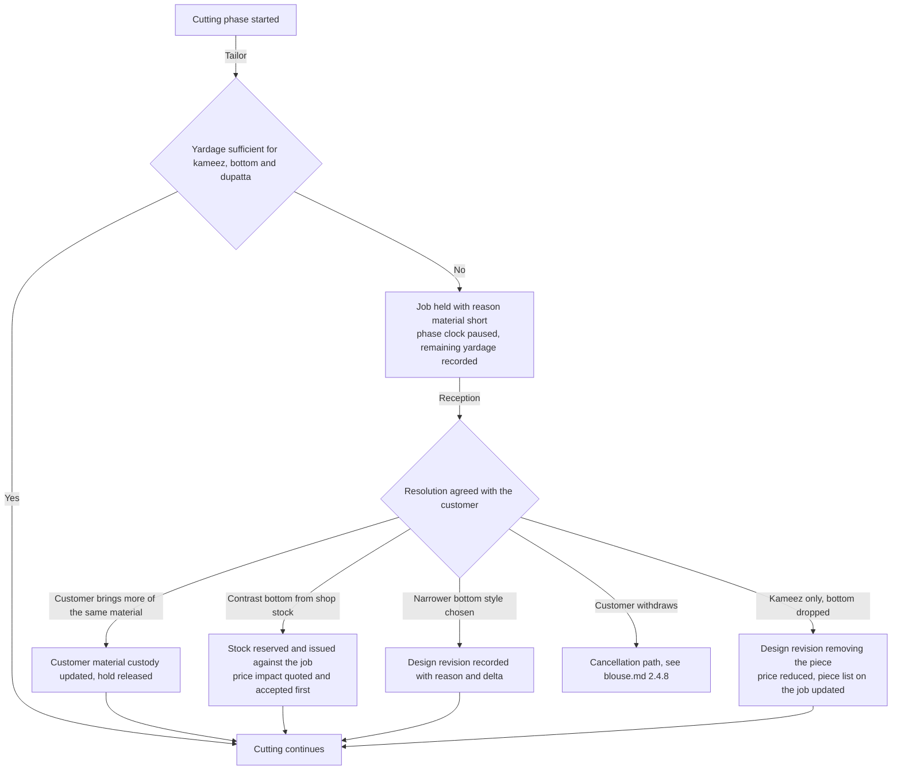
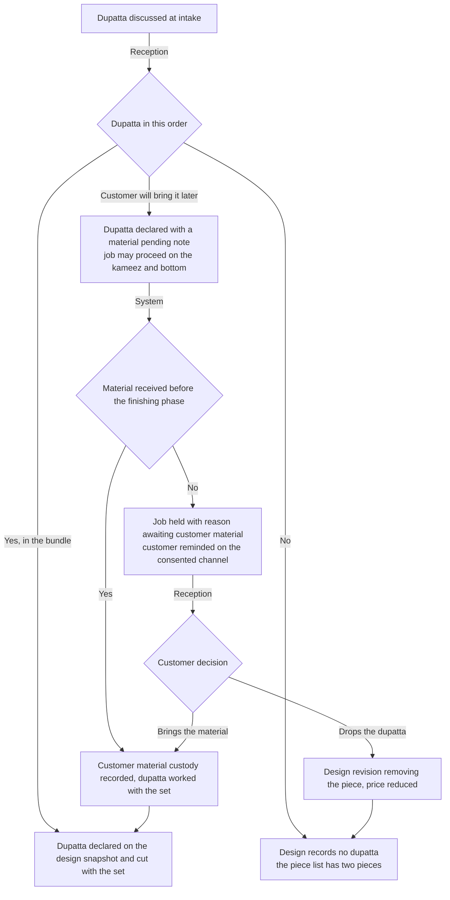
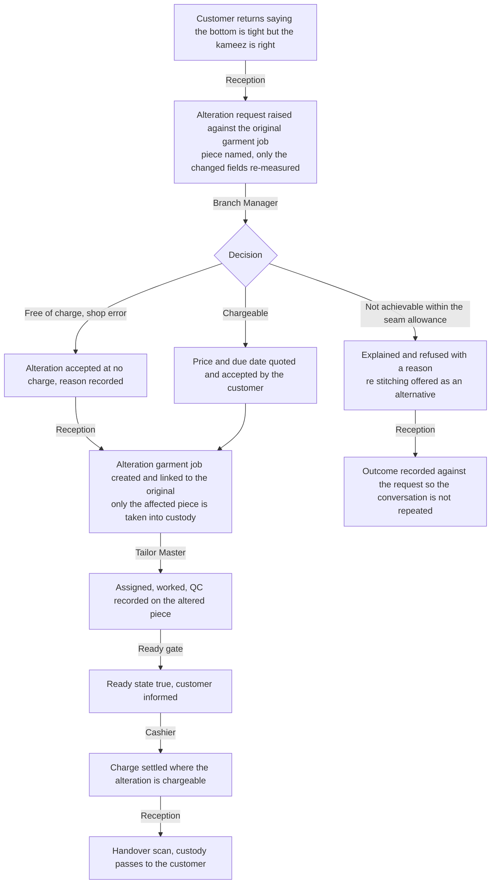

# Salwar workflow

This document maps how a salwar kameez order runs in the workshop **today**, on paper, and how it will run on
HyFib Tailor 360. A salwar order is a **set**: a kameez, a bottom — salwar, churidar, pant or palazzo — and
optionally a dupatta, priced and measured as **one garment job** covering every piece, as fixed in
[`../category-hierarchy.md`](../category-hierarchy.md). That single fact drives most of what is specific to this
category: the pieces are cut from one length of material, they are worked in one job, they are checked as a set,
and they are handed over as a set.

Sections 1 and 2 are the two main sections of this map. Section 3 is the closing "what changes for staff" table
that feeds the training material of issue #61c; Sections 4 and 5 are the open-decision register and the document
map. The common exception flows — duplicate customer, rejected QC, late order, damaged label, cancellation and
refund, unpaid dispatch attempt, negative feedback — are drawn in full in [`blouse.md`](./blouse.md) Section 2.4
and are cited rather than repeated here. Every role name and term is used exactly as
[`../glossary.md`](../glossary.md) defines it.

| Aspect | Value |
| --- | --- |
| Category covered | `SALWAR` |
| Service types | `STITCHING`, `ALTERATION`, `RESTITCHING` |
| Measurement template | `MT_SALWAR` — kameez, sleeve, neckline and bottom groups in one template — see [`../measurement-templates.md`](../measurement-templates.md) |
| Pieces in one garment job | Kameez, bottom, optional dupatta |
| Proposed lead time, working days | Stitching 4, alteration 1, re-stitching 3 — **proposed, to be confirmed** under `OD-CAT-05` |
| Owning modules | Customers/Measurements, Catalog/Design, Media, Orders/Workflow, Custody/Barcode, Inventory, Billing/Payments, Notifications/Feedback |
| Implementing issues | #26, #27, #28, #30, #31, #32, #33, #34, #35, #36, #37, #38, #41, #42, #43, #47, #48, #49 |
| Status | **Drafted for the owner workshop, not approved.** Approval of the workflow maps is the W0 exit gate of plan [Section 6.2](../../IMPLEMENTATION_PLAN.md) |

---

## 1. Current practice

### 1.1 How a salwar order runs today

| # | What happens | Who does it | The record made today | Where that record lives |
| --- | --- | --- | --- | --- |
| 1 | Customer brings a salwar material set — kameez length, bottom length and often a dupatta already cut | Reception | None until an order is written | — |
| 2 | Name, phone and "salwar set" are written into the counter register with a token | Reception | One register line | Counter register |
| 3 | Kameez and bottom measurements are taken together and written on one paper job card | Reception | Handwritten figures, mixed inches and rough fractions | The job card in the bundle |
| 4 | The bottom style is agreed verbally — salwar, churidar, pant or palazzo — with elastic or drawstring | Reception | One or two words on the card, for example "churidar, elastic" | The job card |
| 5 | Neck and sleeve design is agreed from a sample or the customer's phone | Reception | A few words on the card | The job card |
| 6 | A price for the set is quoted verbally | Reception | Nothing, or a pencilled figure | — |
| 7 | An advance is taken | Reception or Cashier | A cash-book line if the counter is quiet | Cash book, or nothing |
| 8 | The whole set is tied into one bundle with the dupatta and put on the rack | Reception | Token number on the card | The bundle |
| 9 | The Tailor Master gives the bundle to a Tailor; sometimes the bottom goes to a different Tailor | Tailor Master, verbally | Nothing | — |
| 10 | Kameez and bottom are cut, stitched and finished, often on different days by different hands | Tailor | Nothing | — |
| 11 | The pieces are gathered back together, pressed and put on the ready rack | Tailor | Nothing | — |
| 12 | The customer collects, pays the balance and leaves | Reception or Cashier | A cash-book line | Cash book |

### 1.2 The records the shop keeps today

| Record | Kept by | What it contains | What it cannot answer |
| --- | --- | --- | --- |
| Counter order register | Reception | Date, name, phone, "salwar set", token, promised date | Which pieces the set contains and whether all of them came back |
| Paper job card | In the bundle | Kameez and bottom measurements together, style words | Who took the measurements, when, and whether the bottom style was changed later |
| Cash book | Reception or Cashier | Daily cash in and out | What is outstanding on this set |
| Ready rack | Physical | Bundles by token | Whether a bundle is complete |

### 1.3 Failure modes observed, and what removes each

The general failures of the paper system are catalogued in [`blouse.md`](./blouse.md) Section 1.4 and apply here
unchanged. The failures below are the ones this category produces most.

| Failure mode | How it happens today | What it costs | What removes it |
| --- | --- | --- | --- |
| **Split set** | Kameez and bottom are worked by different hands on different days and are never formally re-united | The customer collects a kameez and is told the bottom is "coming"; sometimes a piece is genuinely lost | One garment job covers every piece, the ready gate closes until the set is complete, and a set-completeness criterion is part of the QC checklist |
| **Lost job card taking both piece measurements with it** | One card carries the kameez and the bottom figures | The whole set is re-measured or cut to a guess | Immutable measurement and design snapshots on the garment job; the job card is reprintable |
| **Bottom style changed verbally after cutting** | The customer telephones and says churidar instead of salwar; the message is passed on verbally | The bottom is cut wrong and the material is often not enough for a second attempt | A design revision is an authorised, reasoned command showing the price and due-date delta before approval, and it is refused once the workflow freezes the design |
| **Dupatta forgotten** | The dupatta is not in the bundle, or it is finished but left on the rack | The customer returns for one piece | The dupatta is a declared piece of the job when the design says so; the ready gate and the handover both check the piece list |
| **Unrecorded advance on a set** | Busy counter, no cash-book line | Cash short at closing, or the customer pays twice | Advances are payment records allocated to the order with a numbered receipt |
| **No traceability of who held the garment** | Bundles are handed over verbally, and a set may be in two pairs of hands | Nobody can say who last held which piece | Every movement is an append-only scan event naming the from and to custodian, the location, the actor and the server time |
| **Elastic and drawstring confusion** | "Both" is agreed verbally and never written | The bottom is remade | `waist_finish` is a captured choice field on the measurement version, not a memory |

---

## 2. Target workflow

### 2.1 The phases the system tracks

The phase list, the actor for each phase and the events recorded are exactly as tabulated in
[`blouse.md`](./blouse.md) Section 2.1. Salwar differs in four points only:

| Point | Salwar behaviour |
| --- | --- |
| Measurement | One measurement version against `MT_SALWAR` carries the kameez, sleeve, neckline and bottom groups, including the `waist_finish` choice and the conditional `elastic_relaxed_length` and `kameez_slit_height` fields |
| Design | The bottom style — salwar, churidar, pant or palazzo — and the dupatta are **design options**, not separate categories, so they are frozen into the design snapshot at confirmation |
| Cutting | Kameez, bottom and dupatta are cut from the customer's material in one cutting phase, because the yardage is shared; the published ease for the kameez and the bottom differs and is applied at the table |
| Ready | The ready gate does not open until every declared piece of the set has passed QC and is in the same custody |

There is no specialist work phase in this category. Where a salwar carries Aari or maggam embroidery, it is
ordered as the embroidery category rather than as a `SALWAR` add-on — the same rule the catalogue applies to
blouses, recorded as `OD-CAT-03`.

### 2.2 Happy path

```mermaid
flowchart TD
  A[Customer arrives with a salwar material set] -->|Reception| B[Customer found or created<br/>consent recorded for measurement storage and photo capture]
  B -->|Reception or Measurement Staff| C[Measurement draft captured against MT SALWAR<br/>kameez, sleeve, neckline and bottom groups including waist finish<br/>confirmed into an immutable measurement version]
  C -->|Reception| D[Category SALWAR and service STITCHING selected<br/>bottom style, waist finish, neck, sleeve and dupatta chosen as design options<br/>material and reference images captured]
  D -->|Reception| E[Estimate issued for the set<br/>pieces listed, shared as an expiring customer link]
  E -->|Reception| F[Order confirmed in one transaction<br/>measurement, design and price snapshots frozen<br/>one garment job created for the whole set]
  F -->|Custody, inside the confirmation transaction| G[Barcode identity allocated<br/>opaque G payload, no PII]
  G -->|Reception| H[Label printed at the print station and tied to the bundle]
  H -->|Cashier| I[Advance recorded and numbered receipt issued]
  I -->|Tailor Master| J[Start production<br/>workflow version pinned, garment job assigned]
  J -->|Inventory Clerk| K[Material issue<br/>customer material set taken into custody, lining, elastic, cord and closures issued]
  K -->|Tailor| L[Scan to take custody of the garment job]
  L -->|Tailor| M[Cutting phase<br/>kameez, bottom and dupatta cut from the shared yardage<br/>kameez and bottom ease applied separately]
  M -->|Tailor| N[Stitching phase<br/>kameez and bottom stitched under the same job]
  N -->|Tailor| O[Finishing phase<br/>waist finish fitted, hems, pressing, set packed together]
  O -->|Tailor| P[Handover scan to the QC custodian]
  P -->|Tailor Master| Q[QC recorded against the pinned checklist version<br/>including the set completeness criterion]
  Q -->|Ready gate, computed by the system| R[Ready state true<br/>every declared piece present, QC passed, no hold, custody reconciled]
  R -->|System| S[Garment job enters the branch delivery queue]
  S -->|Cashier| T[Invoice posted and balance payment recorded<br/>receipt issued]
  T -->|Delivery Staff| U[Receive scan at the branch<br/>Billing evaluates dispatch eligibility]
  U -->|Custody| V[Dispatch authorisation recorded<br/>custody passes to Delivery Staff]
  V -->|Delivery Staff| W[Dispatch scan, the set leaves the branch]
  W -->|Delivery Staff| X[Doorstep confirmation<br/>recipient name plus one-time password or signature]
  X -->|Notifications| Y[Feedback invitation sent on the consented channel]
  Y -->|Customer| Z[Feedback recorded<br/>a low rating opens a service recovery case]
```

Where the customer collects at the counter rather than taking delivery — the usual ending for this category —
the flow after the ready state follows [`blouse.md`](./blouse.md) Section 2.4.10 without change.

### 2.3 Exceptions

| Exception | Where it is drawn |
| --- | --- |
| Duplicate customer at intake | [`blouse.md`](./blouse.md) 2.4.1 |
| Rejected QC and rework | [`blouse.md`](./blouse.md) 2.4.5 |
| Late order, hold and reschedule | [`blouse.md`](./blouse.md) 2.4.6 |
| Damaged, lost or wrong label | [`blouse.md`](./blouse.md) 2.4.7 |
| Cancelled order and refund | [`blouse.md`](./blouse.md) 2.4.8 |
| Unpaid dispatch attempt | [`blouse.md`](./blouse.md) 2.4.9 |
| Counter collection instead of delivery | [`blouse.md`](./blouse.md) 2.4.10 |
| Negative feedback and alteration | [`blouse.md`](./blouse.md) 2.4.11 |
| Incomplete set at QC or handover | 2.3.1 below |
| Bottom style or waist finish changed after confirmation | 2.3.2 below |
| Material short for the bottom | 2.3.3 below |
| Dupatta added, omitted or brought later | 2.3.4 below |
| Alteration on one piece only | 2.3.5 below |

#### 2.3.1 Incomplete set at QC or handover

The ready gate stays closed for the whole job while any piece is missing, so an incomplete set can never reach
the delivery queue and can never be dispatched. Whether a set may ever be handed over in parts, and under what
approval, is open decision `OD-WF-07`.

#### 2.3.2 Bottom style or waist finish changed after confirmation

The `waist_finish` value lives on the measurement version, so a change from elastic to drawstring is a new
measurement version with a reason, not an edit. The bottom style lives on the design snapshot, so a change is a
design revision. Both are audited; neither is a pencil correction.

#### 2.3.3 Material short for the bottom

#### 2.3.4 Dupatta added, omitted or brought later

#### 2.3.5 Alteration on one piece only

Only the piece being altered is taken into custody, so the customer keeps the rest of the set. The linked
original job makes the alteration visible on the customer timeline and in the rework and alteration reporting.

---

## 3. What changes for staff

| Role | Today | After Tailor360 | Training note |
| --- | --- | --- | --- |
| Reception | Writes one card for the whole set and a token; agrees the bottom style verbally; quotes a price from memory | Captures one measurement version covering kameez and bottom, records the bottom style and dupatta as design options, issues a priced estimate listing the pieces, confirms the order and prints one label for the set | Emphasise that the set is one job with a declared piece list, and that a later style change is a recorded revision with a price and date delta, never a pencil correction |
| Tailor Master | Splits kameez and bottom between hands and hopes they come back together | Assigns the job as a set, sees on the workboard whether any piece is outstanding, records QC including set completeness | Teach the set-completeness criterion: QC is on the set, not on whichever piece is on the table |
| Tailor | Works from one handwritten card that may cover two pieces | Scans to take custody, works cutting, stitching and finishing phases against the job, records lining, elastic, cord and closures consumed | Practise recording the pieces completed within one job, and handing over by scan even when a piece stays behind |
| Inventory Clerk | Hands out elastic, cord and lining without counting | Issues them against the garment job and records returns and wastage; responds to low-stock alerts on fast-moving trims | Show that elastic and cord are low-value but high-frequency: unrecorded, they hide the true cost of a set |
| Cashier | Writes a cash-book line for the set when there is time | Records the advance and the balance against the order, allocates them, issues numbered receipts | Emphasise that a set is one balance, and that the delivery gate reads that balance |
| Delivery Staff | Takes the bundle that is on the rack | Works the delivery queue, receive scan evaluates the gate, dispatches only against an authorisation, confirms the handover | Teach them to expect a blocked dispatch when a piece is missing: the gate closes on an incomplete set as firmly as on an unpaid one |
| Branch Manager | Firefights split sets from memory | Works the exception queues — holds for material short, awaiting customer material, reconciliation cases for missing pieces | Focus on the "awaiting customer material" hold: it is the most common salwar hold and it needs a chase, not a wait |
| Owner | Sees only the day's cash | Reads lead time, rework rate and margin per category, including trim consumption on sets | Emphasise that salwar margin is thin and is decided by trims and offcut wastage, both of which are now measurable |

---

## 4. Open decisions

Recorded here and mirrored centrally in [`../assumptions-and-open-decisions.md`](../assumptions-and-open-decisions.md).
Items that map to a business-owner decision in [Section 11](../../IMPLEMENTATION_PLAN.md) of the implementation plan
carry that reference.

| ID | Question | Proposed default, not yet agreed | Owner | Raised | Needed by |
| --- | --- | --- | --- | --- | --- |
| `OD-WF-07` | May a salwar set ever be handed over in parts — for example the kameez now and the bottom next week — and if so, with whose approval? | No. The ready gate opens only for the complete set; a genuine exception is handled as two orders, not as a partial handover | Owner, with each Branch Manager | 2026-09-04 | #34 ready gate and #48 delivery queue, wave 4. Related to plan Section 11 item 4 |
| `OD-WF-08` | Is the dupatta a declared piece on the design snapshot, or a separate linked garment job as it is for a lehenga? | A declared piece of the same job for `SALWAR`, because it is cut from the same yardage; a separate linked job for `LEHENGA` | Owner, with the Tailor Master | 2026-09-04 | #30 design options and #32 order confirmation, wave 3 |
| `OD-WF-09` | Does a churidar bottom warrant a trial fitting phase before finishing, as a gown does? | No at launch, because the lead time is four working days; the trial phase stays specific to gown and bridal work | Owner, with the Tailor Master | 2026-09-04 | #33 workflow definitions, wave 4. Related to `OD-WF-16` in [`gown.md`](./gown.md) |
| `OD-WF-10` | When a set is cut short, may the Tailor decide a narrower bottom style at the table, or must Reception agree it with the customer first? | Reception must agree it with the customer; the Tailor raises the hold and never changes the design | Owner, with the Tailor Master | 2026-09-04 | #24 permission matrix, wave 1. Plan Section 11 item 13 |

---

## 5. Related documents

| Document | Why it matters here |
| --- | --- |
| [`blouse.md`](./blouse.md) | The reference file: the phase table and the common exception flows cited above |
| [`lehenga.md`](./lehenga.md), [`gown.md`](./gown.md), [`kids.md`](./kids.md) | The other category maps |
| [`branch-scenarios.md`](./branch-scenarios.md) | Branch-level variations of every flow above |
| [`../00-overview.md`](../00-overview.md) | The end-to-end journey and the dispatch gate in product terms |
| [`../glossary.md`](../glossary.md) | Authoritative definitions of every role, phase and record named above |
| [`../category-hierarchy.md`](../category-hierarchy.md) | `SALWAR`, its service types and the five links each carries |
| [`../measurement-templates.md`](../measurement-templates.md) | `MT_SALWAR`, the `waist_finish` choice field and the ease convention applied at cutting |
| [`../state-transitions.md`](../state-transitions.md) | Transition, actor, preconditions, outputs, audit event and exception behaviour |
| [`../raci.md`](../raci.md) | Who is responsible, accountable, consulted and informed for each step |
| [`../configurable-vs-fixed.md`](../configurable-vs-fixed.md) | What an administrator may change here without a deployment |
| [`../assumptions-and-open-decisions.md`](../assumptions-and-open-decisions.md) | The central register that mirrors Section 4 |
| [`../../IMPLEMENTATION_PLAN.md`](../../IMPLEMENTATION_PLAN.md) | Decisions D8 to D12, the #17 blueprint in Section 8 and the owner decisions in Section 11 |
