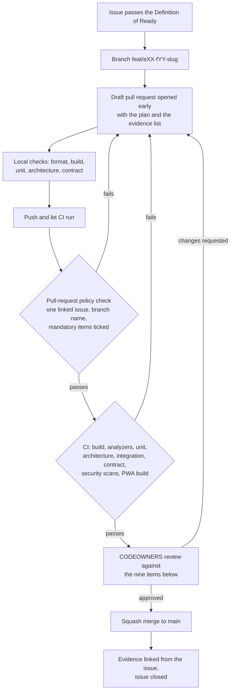

# Definition of Done — the per-pull-request checklist

This document expands the nine-point Definition of Done of plan [Section 5.1](../IMPLEMENTATION_PLAN.md) into the
checklist a reviewer actually works through, and states for every item how it is verified and who enforces it. It is
the authoritative wording; [`../../.github/pull_request_template.md`](../../.github/pull_request_template.md)
mirrors it, and the pull-request policy check of #22 enforces the mechanical parts. Read it with
[`definition-of-ready.md`](definition-of-ready.md) (what must be true before the branch is cut) and
[`release-gates.md`](release-gates.md) (what must be true before a release ships).

---

## 1. Status and scope

| Field | Value |
| --- | --- |
| Status | **Draft — proposed process**; binding once the stakeholder review in [`../nfr/reviews/stakeholder-review.md`](../nfr/reviews/stakeholder-review.md) is signed |
| Drafted | 2026-09-04, issue #19, wave W0 |
| Owner of the document | Technical reviewer |
| Applies to | Every pull request into `main` and into any `release/*` branch, in every lane, including documentation-only pull requests |
| Mirrored by | [`../../.github/pull_request_template.md`](../../.github/pull_request_template.md) — the two are changed in the same pull request or not at all |
| Partly enforced by | `.github/workflows/pr-policy.yml` (linked issue, branch name, unchecked mandatory items) and `.github/workflows/ci.yml` (build, tests, scans) |

**The rule that governs the rest.** A pull request is done when a second person can see that it is done. Every item
below therefore resolves to an artefact — a command output, a screenshot, a migration log, a scan result, a
document diff — and not to an assertion. "Tested locally" is not evidence; the output of the test run is.

---

## 2. Where the Definition of Done sits

---

## 3. The nine items, expanded

Each item keeps the number it has in plan Section 5.1 and in the pull-request template, so a review comment can
say "DoD 6" and mean one thing everywhere.

### DoD 1 — Scope, issue link and branch

| Check | How it is verified | Enforced by |
| --- | --- | --- |
| Exactly one issue or sub-issue is linked, with `Refs #NN` while the issue stays open or `Closes #NN` when merging completes it | The policy check parses the pull-request body | Machine (`pr-policy.yml`) |
| The branch is named `feat\|fix\|docs/eXX-fYY[a-c]-<slug>` | The policy check matches the branch name | Machine |
| Only changes in scope for that issue; no unrelated refactor, no drive-by formatting of untouched files | Reviewer reads the file list against the issue's scope line | Human — reviewer |
| Anything discovered but out of scope has become a new issue linked to the epic | The follow-ups section names the issue, or says "None" | Human — reviewer |
| Under about 1,500 changed lines excluding generated code and tests | The diff statistics | Human — reviewer, who asks for a split when it is exceeded |

### DoD 2 — Authorisation, validation, idempotency and audit on every state-changing endpoint

| Check | How it is verified | Enforced by |
| --- | --- | --- |
| Every new or changed endpoint declares a permission policy, or carries a justified `[AllowAnonymous("reason")]` | Architecture test; reviewer reads the justification | Machine + human |
| Branch scope and resource ownership are evaluated, not assumed from the caller's claims | Authorisation-matrix integration test with an own-branch and an other-branch case per role | Machine |
| Server-side validation exists for every input, and the error response is RFC 9457 problem details with field errors and no stack trace | Integration test; reviewer reads the validator | Machine + human |
| Endpoints that a client may retry accept `Idempotency-Key` and behave correctly on replay, including the "same key, different body" and "duplicate while in flight" cases | Integration test | Machine |
| Every state-changing endpoint carries the audit filter, and sensitive reads audit explicitly | Architecture test for the filter; integration test for the audit row | Machine |
| The authorisation-matrix fixtures gained a row for every new or changed endpoint, with the role, own-branch and other-branch expectations and the field mask where one applies — the endpoint block of `../security/permission-matrix.md`, and `tests/Tailor360.IntegrationTests/Authorization/matrix.yaml` where the route takes an identifier a caller could type | The matrix test fails on any endpoint without an entry, naming the route | Machine |
| Step-up requirements are declared where the permission carries `RequiresStepUp` | Architecture test; the matrix test's fresh and stale dimension | Machine |

### DoD 3 — Tests

| Check | How it is verified | Enforced by |
| --- | --- | --- |
| Unit tests cover the domain rules the change introduces, including the invariant that must not be violable | The test run | Machine |
| Integration tests cover persistence and the application programming interface surface, against a real PostgreSQL and object store | The test run | Machine |
| Architecture tests are still green, and any new rule is added with a stable identifier | The test run | Machine |
| End-to-end coverage exists for any new critical journey, at the phone, tablet and desktop profiles the journey is used at | The Playwright run and its artefacts | Machine |
| Only synthetic data is used; no production or customer-derived data appears in a fixture | Reviewer reads new fixtures; the seeding command refuses to run in production unconditionally | Human + machine |
| Tests were run twice to expose order dependence | The evidence section states it | Human — author declares, reviewer spot-checks |

### DoD 4 — Migrations and rollback

| Check | How it is verified | Enforced by |
| --- | --- | --- |
| Migrations are forward-only and backward compatible with the previous release, following expand–migrate–contract | Migration compatibility check in CI; reviewer reads the migration | Machine + human |
| The pull request states the rollback or restore note: which forward fix undoes a bad migration, and when a restore is the only route | The risk and rollback section is filled | Human — reviewer |
| Applying the migration to an empty database and to a database at the previous release both succeed | The migration job output attached as evidence | Machine |
| Append-only tables keep their triggers; no migration grants the application role the ability to update or delete an append-only row | Integration test; reviewer reads the migration | Machine + human |

The migration rules themselves live in [`../dev/migrations.md`](../dev/migrations.md).

### DoD 5 — Application programming interface contract

| Check | How it is verified | Enforced by |
| --- | --- | --- |
| The OpenAPI document is regenerated and committed, or the endpoint is explicitly marked internal | Contract test comparing the generated document to the committed one | Machine |
| The generated TypeScript client is regenerated, so a contract change breaks the frontend type check rather than production | `pnpm typecheck` | Machine |
| No undocumented breaking change: the difference report is clean, or the break is deliberate, versioned and described in the pull request | `oasdiff` gate | Machine + human |
| Integration events carry their versioned name, JSON Schema and example under `docs/integration/events/` | Contract test; reviewer reads the schema | Machine + human |

### DoD 6 — Secrets, personal data, telemetry and the threat model

| Check | How it is verified | Enforced by |
| --- | --- | --- |
| No secret is added to the repository, including test fixtures and compose files | Secret scanning in CI | Machine |
| No personal data, token, measurement, image byte, rendered message body, recipient address or card datum is written to a log, a trace attribute, a metric label, a health payload or a problem-details response | Redaction tests with sentinel values; reviewer reads new log statements | Machine + human |
| New telemetry names and attributes are reviewed against the redaction allowlist | Reviewer reads the diff against [`../nfr/data-classification.md`](../nfr/data-classification.md) | Human |
| The threat model covering the flow is referenced by name, and the controls it maps to this change are closed — applies from #56a onwards | Reviewer opens the threat model and checks the mapped controls | Human — reviewer, with the security owner for a flow rated high |
| Anything newly stored is classified, and its retention is configured rather than assumed | The data-classification row exists | Human |

### DoD 7 — User-interface changes

Applies to any change under `clients/pwa/`. It does not apply to backend-only or documentation-only pull requests.

| Check | How it is verified | Enforced by |
| --- | --- | --- |
| Automated accessibility check passes with no serious or critical violation on every changed screen and state | axe in the Playwright run | Machine |
| The screen-reader items in [`../nfr/a11y-checklist.md`](../nfr/a11y-checklist.md) are worked through for any new journey | The completed checklist attached as evidence | Human — author, spot-checked by the reviewer |
| Responsive check at the phone, tablet and desktop profiles, including the helper that asserts no horizontal overflow and no focus obscured by a bottom bar or the virtual keyboard, at 320, 360, 768, 1024 and 1280 pixels and at 200% zoom | The helper's output and screenshots | Machine + human |
| A pseudo-locale story exists, and the layout tolerates about 40% text growth | Storybook story; reviewer looks at it | Human |
| Content Security Policy clean: no inline script or style, no new external origin | The browser console in the end-to-end run; CI reports violations | Machine |
| Storybook stories exist for the loading, empty, error, offline and forbidden state of every new screen | Reviewer opens Storybook | Human |
| One network-failure step in the journey's end-to-end test: the request is aborted, the retry succeeds, and exactly one effect is recorded | The Playwright run | Machine |
| All user-facing text goes through message identifiers, with no string concatenation, and every format goes through the shared formatters module | Lint rule and reviewer | Machine + human |

### DoD 8 — Documentation

| Check | How it is verified | Enforced by |
| --- | --- | --- |
| The module README states what the module owns and publishes, if that changed | Reviewer | Human |
| An architecture decision record is added or superseded if a decision changed — never edited silently | Reviewer; the decision-record index | Human |
| A runbook is added or updated if operations changed: a new alert, a new failure mode, a new manual step | Reviewer | Human |
| The metric dictionary is updated if a report, projection or exported column changed | Reviewer | Human |
| Any number this pull request makes real is reflected in [`../nfr/traceability.md`](../nfr/traceability.md), and any decision it closes is marked **Decided** with the date in [`../prd/assumptions-and-open-decisions.md`](../prd/assumptions-and-open-decisions.md) | Reviewer | Human |

### DoD 9 — Evidence checklist complete

| Check | How it is verified | Enforced by |
| --- | --- | --- |
| The evidence section contains the actual outputs, not descriptions of them | Reviewer refuses to start the review otherwise | Human |
| Test output or the CI run link, with the tier summary | Attached | Human |
| Screenshots or a short recording for any user-interface change, at phone, tablet and desktop widths | Attached | Human |
| Migration output for any schema change | Attached | Human |
| Security notes: the secret-scan result and anything the threat model touches | Attached | Human |
| The linked issue, the branch name and the mandatory checklist items are verified by the required status check | The policy check | Machine |

---

## 4. What counts as evidence

| Kind of change | Minimum evidence |
| --- | --- |
| Domain or application logic | Test run output naming the new tests; the failing-then-passing history is not required, but a test that fails when the rule is removed is |
| Schema change | Migration applied to an empty database and to a database at the previous release; the rollback note |
| Endpoint | Authorisation-matrix rows; the OpenAPI difference report; an idempotency replay test where the endpoint is retried |
| Screen | Screenshots at three widths, the accessibility run, the Storybook state stories, the pseudo-locale story |
| Label, receipt or invoice rendering | A rendered artefact attached, and for labels a photograph of the printed output and a successful scan with each scanner source |
| Worker job | A run log showing the lease acquired, the work done and the lease released; the behaviour when the lease expires mid-run |
| Report or export | The golden-master comparison, and the injection-corpus test for the export path |
| Documentation | The rendered diff; for a diagram, confirmation that the Mermaid block renders |

Evidence is attached to the pull request, and the link is carried into the issue when it closes, so the release
evidence index of #61c can find it later.

---

## 5. When an item does not apply

Delete an item from the pull-request description only when it genuinely cannot apply, and say why in one line. The
common legitimate cases:

| Item | Legitimately not applicable when |
| --- | --- |
| DoD 2 | The pull request adds no endpoint and changes no authorisation rule |
| DoD 4 | No schema change |
| DoD 5 | No endpoint, event or contract change |
| DoD 7 | No change under `clients/pwa/` |
| DoD 8 | Nothing the documentation set describes has changed — rare, and the reviewer should challenge it |

DoD 1, 3, 6 and 9 always apply. A documentation-only pull request still needs a linked issue, still must not add a
secret or an unclassified personal-data field to an example, and still needs evidence — for a document, the rendered
diff and confirmation that its diagrams render and its relative links resolve.

---

## 6. The reviewer's obligations

The Definition of Done binds the reviewer as much as the author.

1. **Do not start on an empty evidence section.** Ask for the evidence instead; this is the single most effective
   quality control the project has.
2. **Read the tests before the implementation.** If the tests do not describe the behaviour the issue promised, the
   implementation cannot.
3. **Check the negative cases.** Deny-by-default, other-branch access, replayed idempotency key, expired link,
   unpaid dispatch attempt, damaged label. Positive-path-only coverage is the most common gap.
4. **Challenge silent decisions.** Any number, retention period, rounding rule or role grant that appears in the
   diff without a decision reference is a change to the product, not to the code.
5. **Approve or request changes explicitly.** An unreviewed pull request that ages is a worse outcome than a
   rejected one.

---

## 7. Relationship to the other gates

| Gate | Scope | Failure means |
| --- | --- | --- |
| [`definition-of-ready.md`](definition-of-ready.md) | One issue, before the branch | The issue is parked, not started |
| **This document** | One pull request, before the merge | The pull request is not merged |
| [`release-gates.md`](release-gates.md) | One release, before the tag is deployed | The release does not ship, unless a recorded waiver in [`waivers.md`](waivers.md) permits it |

An item that is repeatedly waived at the pull-request level is not a process problem to be tolerated; it is a
finding for the wave retrospective and, where it touches a published target, for
[`../nfr/risk-review.md`](../nfr/risk-review.md).

---

## 8. Open decisions recorded by this document

Raised 2026-09-04 by issue #19; mirrored in
[`../prd/assumptions-and-open-decisions.md`](../prd/assumptions-and-open-decisions.md), and referenced against plan
[Section 11](../IMPLEMENTATION_PLAN.md).

| ID | Question | Blocks | Owner | Status |
| --- | --- | --- | --- | --- |
| **DOD-OD-01** | The minimum number of approving reviews on a pull request into `main`, and whether the technical reviewer may approve their own work during a single-maintainer period | Branch protection configuration in #22 and #59 | Business owner, with the technical reviewer | **Open** — needed before the W1 exit gate; the proposed settings and the interim single-maintainer arrangement are in [`branch-protection.md`](branch-protection.md) as **BP-OD-01** |
| **DOD-OD-02** | The per-project code-coverage floor enforced in CI | The coverage gate of #22 | Technical reviewer | **Proposed, to be confirmed** — the baseline exists now: #22 measured **82.8% solution-wide** on 2026-09-05 and wrote the per-project floors, each two to three points under what the project achieved, into [`../../.github/coverage-floors.json`](../../.github/coverage-floors.json), where the CI gate reads them. What is outstanding is the owner's confirmation of those numbers, not the measurement |
| **DOD-OD-03** | Whether an end-to-end journey must run on Firefox and WebKit per pull request, or nightly only with Chromium per pull request | The pull-request pipeline budget of 15 minutes | Technical reviewer | **Proposed** — the plan's split stands: Chromium per pull request, the full matrix nightly |
| **DOD-OD-04** | Who holds the "security owner" role that DoD 6 escalates a high-rated flow to, before #56a appoints one | DoD 6 review of high-risk flows in waves W1 and W2 | Business owner | **Open** — needed before W2 |

---

## 9. Related documents

| Document | Why it matters here |
| --- | --- |
| [`definition-of-ready.md`](definition-of-ready.md) | The conditions before the branch is cut |
| [`release-gates.md`](release-gates.md) | The gates a release must pass, several of which are the same checks run again over a whole release |
| [`branch-protection.md`](branch-protection.md) | The required status checks and review rules that make the mechanical items of this checklist binding |
| [`release-evidence.md`](release-evidence.md) | Where a pull request's evidence ends up at the release |
| [`waivers.md`](waivers.md) | The register for anything a release ships without |
| [`../../.github/pull_request_template.md`](../../.github/pull_request_template.md) | The template that mirrors this checklist |
| [`../dev/migrations.md`](../dev/migrations.md) | The expand–migrate–contract rules DoD 4 relies on |
| [`../nfr/a11y-checklist.md`](../nfr/a11y-checklist.md) | The per-screen screen-reader items DoD 7 requires |
| [`../nfr/data-classification.md`](../nfr/data-classification.md) | The classes DoD 6 checks new data against |
| [`../nfr/traceability.md`](../nfr/traceability.md) | Where a pull request's non-functional effect is recorded |
| [`../architecture/architecture-rules.md`](../architecture/architecture-rules.md) | The `ARCH-nnn` rules the architecture tests assert |
| [`../IMPLEMENTATION_PLAN.md`](../IMPLEMENTATION_PLAN.md) | Section 5.1, the source of the nine items, and Section 5.3, the test pyramid |
