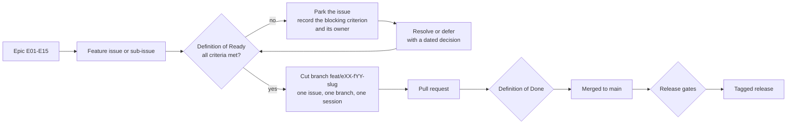

# Definition of Ready — when an issue may enter a wave

This document states the conditions an issue must satisfy **before** a session picks it up and a branch is cut. It
exists because the expensive failures on this project are not coding failures: they are an issue started before its
dependency merged, a screen built before anyone classified the personal data it displays, or a flow implemented
before the owner decided the business rule it depends on. The Definition of Ready is the checklist that catches
those failures while they still cost a conversation rather than a rewrite. Read it with
[`definition-of-done.md`](definition-of-done.md) (what must be true before the pull request merges),
[`release-gates.md`](release-gates.md) (what must be true before a release ships) and
[`../IMPLEMENTATION_PLAN.md`](../IMPLEMENTATION_PLAN.md) Section 6 (the waves, lanes and ordering rules this
checklist enforces).

---

## 1. Status and scope

| Field | Value |
| --- | --- |
| Status | **Draft — proposed process**; binding once the stakeholder review in [`../nfr/reviews/stakeholder-review.md`](../nfr/reviews/stakeholder-review.md) is signed |
| Drafted | 2026-09-04, issue #19, wave W0 |
| Owner of the document | Technical reviewer |
| Applies to | Every feature issue (#17–#61) and every sub-issue, in every lane |
| Enforced by | The person opening the branch, checked by the reviewer at the first review; the mechanical parts (linked issue, branch name) by the pull-request policy check of #22 |
| Review cadence | At the end of each wave, and whenever a wave exit gate is missed |

**Vocabulary.** A **wave** (W0–W5) is a dependency-ordered group of issues from plan Section 6.2. A **lane** is one
of the three parallel streams — Lane A backend platform and modules, Lane B progressive web application and design
system, Lane C governance, security and operations. An issue is **ready** when every criterion in section 3 is
either met or carries a recorded, dated deferral under section 5. Readiness is a property of the issue, not of the
person: an issue that is not ready is not started, however available the session is.

---

## 2. Where readiness sits in the delivery loop

The loop is deliberately one-way: an issue that fails the Definition of Ready goes back to the register of open
decisions or to its dependency, never forward into a branch "to see how far it gets".

---

## 3. The readiness criteria

Every criterion is stated so that the answer is observable by a second person. "The author believes it is fine" is
not evidence.

| ID | Criterion | What "met" looks like | Where the evidence lives |
| --- | --- | --- | --- |
| **DOR-01** | **Linked epic.** The issue belongs to exactly one epic (E01–E15) and one wave, and the epic is the parent link in GitHub | The issue shows its epic and its wave; the plan's Section 7 row for the issue exists and matches | Plan [Section 7](../IMPLEMENTATION_PLAN.md), the GitHub issue |
| **DOR-02** | **Acceptance criteria.** The issue's acceptance criteria are written, testable and phrased as observable behaviour, including at least one negative case and one exception case | Each criterion can be turned into a named test; no criterion says "works correctly" or "is fast" without a number or a reference to a target | The GitHub issue; targets in [`../nfr/slo.md`](../nfr/slo.md) and [`../nfr/capacity-and-performance.md`](../nfr/capacity-and-performance.md) |
| **DOR-03** | **Dependencies merged.** Every issue named in "Depends on" is merged to `main`, or the owner has explicitly accepted the stub or fallback contract the plan defines for it | The dependency issues are closed; if a stub is used, the plan's Section 6.2 note authorising it is quoted in the issue | Plan Section 6.2, the dependency issues |
| **DOR-04** | **Blueprint read and scope agreed.** The plan's blueprint for the issue has been read, and anything in it that the session will *not* do is listed with the follow-up issue it moves to | A scope line in the issue: what is in, what is out, which follow-up issue carries the remainder. Target under 1,500 changed lines excluding generated code and tests | Plan Sections 8 and 9 |
| **DOR-05** | **Threat-model coverage.** The flow the issue touches is covered by a threat model, or — before #56a merges — is listed in the threat-model backlog with the date it will be covered and the interim controls that apply | From #56a onwards: the threat model file is named in the issue and its mapped controls are listed. Before #56a: the flow appears in the backlog list with a date | `docs/security/` threat models (#56a); until then the issue text |
| **DOR-06** | **Data classification of anything new.** Every new field, table, integration event payload, log field, telemetry attribute, export column and media class is classified against [`../nfr/data-classification.md`](../nfr/data-classification.md), including credentials and secrets | A short table in the issue: item, class, purpose, retention, who may read it, whether it may appear in logs, telemetry or an export. Nothing new is unclassified | [`../nfr/data-classification.md`](../nfr/data-classification.md) |
| **DOR-07** | **Test strategy.** The tiers that will prove the change are named before work starts: unit, property, architecture, integration, contract, end-to-end, accessibility, performance, resilience, migration | A list in the issue of the test tiers and the specific journeys or invariants each will cover, plus any new fixture the change needs | Plan Section 5.3; `tests/` layout in plan Section 4.2 |
| **DOR-08** | **Evidence list.** The evidence the pull request will carry is agreed in advance, so it is produced during the work rather than reconstructed afterwards | A list in the issue: which command outputs, screenshots at phone, tablet and desktop widths, migration output, printed artefacts, security notes | [`definition-of-done.md`](definition-of-done.md) section 4 |
| **DOR-09** | **Owner decisions resolved or explicitly deferred.** Every owner decision (`OD-01`–`OD-15`) and every document-level decision the issue depends on is either **Decided**, or **Proposed** with the default the work will follow, or **Deferred** with a dated record under section 5 | The issue names each decision id, its status and the default in force. No decision is silently assumed | [`../prd/assumptions-and-open-decisions.md`](../prd/assumptions-and-open-decisions.md) |
| **DOR-10** | **Authorisation impact named.** New or changed permissions, branch-scope rules and step-up requirements are identified, together with the authorisation-matrix fixtures that will be extended | A list of permission ids the issue adds or uses, with the roles expected to hold them, in the vocabulary of the glossary: Reception, Tailor Master, Tailor, Inventory Clerk, Cashier, Delivery Staff, Branch Manager, Owner | `docs/security/permission-matrix.md` (#24), [`../prd/glossary.md`](../prd/glossary.md) |
| **DOR-11** | **Configuration, not code.** Anything the issue would hard-code that plan Section 2.2 requires to be configurable — categories, measurement templates, workflow phases, QC checklists, taxes, prices, alerts, retention, feature availability — is identified and planned as versioned configuration data | A line in the issue confirming which parts are configuration and where the seed data comes from | [`../prd/configurable-vs-fixed.md`](../prd/configurable-vs-fixed.md), plan D8 |
| **DOR-12** | **Module ownership respected.** The modules the issue touches are named, and no cross-module table access is planned; anything another module needs arrives through a `Contracts` project or an integration event | A list of modules touched and the contracts or events consumed and published | [`../architecture/module-ownership.md`](../architecture/module-ownership.md), [`../architecture/architecture-rules.md`](../architecture/architecture-rules.md) |
| **DOR-13** | **Non-functional impact named.** The rows of [`../nfr/traceability.md`](../nfr/traceability.md) the issue affects are listed, so the change is measured against them rather than after them | A list of NFR ids, and for each whether the issue must extend a test, a monitor or an evidence artefact | [`../nfr/traceability.md`](../nfr/traceability.md) |
| **DOR-14** | **Accessibility and localisation impact.** For any user-interface change, the new screens and states are listed, together with the message ids they need and any measurement or currency formatting they display | A list of screens and their loading, empty, error, offline and forbidden states; confirmation that all text goes through message ids and formats through the shared formatters module | [`../nfr/accessibility-localisation.md`](../nfr/accessibility-localisation.md), [`../nfr/a11y-checklist.md`](../nfr/a11y-checklist.md) |
| **DOR-15** | **Migration and rollback shape.** Any schema change is planned as expand–migrate–contract, and the rollback or restore path is identified before the work starts | A line in the issue: which migration expands, what the previous release still tolerates, and how a bad migration is undone | [`../dev/migrations.md`](../dev/migrations.md), plan Section 4.7 |
| **DOR-16** | **Environment available.** The session can actually build and test what the issue needs — the .NET software development kit for backend work, a database and object store for integration tests, a device or printer for a physical rehearsal | `./scripts/dev doctor` output, or the named staging environment and hardware, recorded in the issue | [`../dev/setup.md`](../dev/setup.md), plan Section 12 |

### 3.1 Criteria that apply only to some issues

| Criterion | Applies when | Note |
| --- | --- | --- |
| DOR-14 | The issue changes any screen | Governance and infrastructure issues in Lane C are exempt |
| DOR-15 | The issue changes the schema | Documentation-only issues are exempt |
| DOR-16 physical hardware | The issue's evidence includes a printed label, a scanned barcode or a real device journey | #35, #36, #37, #48 and #61c always; others rarely |

No other criterion is optional. DOR-06 and DOR-09 in particular apply to documentation issues as much as to code
issues: a document that publishes an unclassified data item or an undecided rule as fact is the same defect as code
that does.

---

## 4. Who declares an issue ready

| Step | Who | What they do |
| --- | --- | --- |
| 1 | The session or engineer picking up the issue | Works through section 3 and writes the readiness note into the issue as a comment |
| 2 | Technical reviewer | Confirms DOR-03, DOR-04, DOR-10 and DOR-12 — the criteria where an outside eye catches what the author cannot |
| 3 | Business owner | Confirms DOR-09 for any decision that is theirs, in writing in the issue or the decision register |
| 4 | Whoever declared it ready | Cuts the branch `feat\|fix\|docs/eXX-fYY[a-c]-<slug>` and opens the pull request early, in draft, with the readiness note in the description |

An issue may be declared ready by one person when every criterion is unambiguously met and no owner decision is
involved; a second pair of eyes is required whenever DOR-03, DOR-05 or DOR-09 is answered by "deferred".

---

## 5. Deferring a criterion

Some issues must start before everything about them is settled — that is why the plan schedules drafting ahead of
approval. A deferral is legitimate; an unrecorded assumption is not.

A deferral record is written into the issue and contains all six fields:

| Field | Content |
| --- | --- |
| Criterion | The `DOR-nn` being deferred |
| Reason | Why the work cannot wait for it |
| Default in force | The behaviour the work will implement while the answer is missing, and where that default is written down |
| Owner | The named person who owes the answer — business owner, technical reviewer, accountant, or the operations owner |
| Date recorded | The date the deferral was agreed |
| Condition for closure | The event that ends the deferral, and the issue or wave gate it must close before |

Three rules bound deferrals:

1. **A deferral is never open-ended.** It names the wave gate before which it must close. A deferral that reaches
   its gate unresolved becomes a blocking item for that gate, exactly like an expired waiver in
   [`waivers.md`](waivers.md).
2. **A deferral never covers DOR-06.** New data is classified before it is stored. If the class is genuinely
   undecided, the field is not built yet.
3. **A deferral that changes a published number** — a target in [`../nfr/slo.md`](../nfr/slo.md) or
   [`../nfr/capacity-and-performance.md`](../nfr/capacity-and-performance.md) — is mirrored into
   [`../prd/assumptions-and-open-decisions.md`](../prd/assumptions-and-open-decisions.md) in the same pull request,
   so one register holds every open item.

---

## 6. Wave entry rules this checklist enforces

These come from plan Section 6.1 and are repeated here because they are what "may enter a wave" actually means.

| Rule | Consequence for readiness |
| --- | --- |
| One issue = one branch = one session = one pull request | An issue that cannot be delivered in one branch is split into sub-issues *before* it is declared ready (the plan splits #32, #56 and #61 this way) |
| An issue starts only when its dependencies are merged | DOR-03 has no soft form: "nearly merged" is not merged |
| Three lanes may run concurrently; issues in a parallel group touch disjoint modules | Before declaring ready, check that no in-flight issue in another lane is touching the same module; where two issues must touch one module, they are sequenced |
| Business approvals are review gates at the end of the wave that produced the draft, never blockers for drafting | A Lane C document issue is ready even when the approval it will feed is outstanding, provided DOR-09 records the decision as open |
| Target under 1,500 changed lines per pull request, excluding generated code and tests | An issue whose blueprint clearly exceeds this is split at readiness time, not at review time |

---

## 7. Worked example — issue #35, labels and barcode allocation

This is how a readiness note reads in practice. It is an illustration of the format, not a record of a review that
has taken place.

| Criterion | Answer |
| --- | --- |
| DOR-01 | Epic E05, wave W3, plan Section 7 row present |
| DOR-02 | Acceptance criteria include: exactly one active barcode identity per garment job; a reprint supersedes rather than duplicates; a damaged label is replaced through the documented exception |
| DOR-03 | #34 and #32 merged; the confirmation-participant hook that allocates the identity inside the confirmation transaction exists |
| DOR-04 | In: identity allocation, label template, print queue, print station. Out: the network print bridge, which stays in #55 |
| DOR-05 | Threat model for the custody flow named, with the "label forgery" and "barcode enumeration" abuse cases and their mapped controls |
| DOR-06 | New data: barcode payload (opaque, no personal data), label print record, print job. Classified; the payload is explicitly *not* personal data and carries no customer identifier |
| DOR-07 | Unit tests for the checksum and namespace; property test that a decoded payload round-trips; integration test for one-active-identity; end-to-end test for print-station queue drain; a physical rehearsal on the shop's printer |
| DOR-08 | Evidence: printed label sheet photographed, scan of each printed label with all three scanner sources, migration output, print-queue screenshots at phone and desktop widths |
| DOR-09 | **OD-09 label format is open.** Default in force: the plan's payload format is fixed in code and unaffected; the template is built parameterised by label size so the owner's answer changes configuration, not code. Deferral recorded, closes before the W3 exit gate |
| DOR-10 | Permissions `custody.print_label` and `custody.scan`; Reception prints at the counter, Tailor Master and Tailor scan, Delivery Staff scan at dispatch |
| DOR-11 | Label size, whether a QR accompanies the Code 128, and the human-readable cues are configuration |
| DOR-12 | Modules: Custody (owner), Platform (print queue port). No table outside `custody` and `platform` is touched |
| DOR-13 | NFR rows for scan round-trip latency, custody integrity and print fallback |
| DOR-14 | Screens: print station, label reprint dialog, damaged-label replacement. All five states each |
| DOR-15 | Expand-only migration adding the barcode identity and label print tables; rollback is redeploy of the previous tag with the tables unused |
| DOR-16 | Thermal printer and at least one keyboard-wedge scanner available at the head branch for the rehearsal |

---

## 8. Open decisions recorded by this document

Raised 2026-09-04 by issue #19; mirrored in
[`../prd/assumptions-and-open-decisions.md`](../prd/assumptions-and-open-decisions.md) and referenced against plan
[Section 11](../IMPLEMENTATION_PLAN.md).

| ID | Question | Blocks | Owner | Status |
| --- | --- | --- | --- | --- |
| **DOR-OD-01** | Who may declare an issue ready when the technical reviewer is the author — a second engineer, or the business owner? | The two-eyes rule in section 4 for a single-maintainer period | Business owner, with the technical reviewer | **Open** — needed before the W1 exit gate |
| **DOR-OD-02** | Whether readiness is recorded as an issue comment (proposed) or as a GitHub `ready` label applied by a check | Whether the pull-request policy check of #22 can assert readiness mechanically | Technical reviewer | **Proposed** — an issue comment stands until reviewed |
| **DOR-OD-03** | The wave gate by which a deferral raised in wave W*n* must close, when the issue itself spans waves | The escalation path in section 5 | Technical reviewer, approved by the Owner | **Proposed** — the deferral closes at the exit gate of the wave that raised it |
| **OD-13** (plan Section 11 item 13) | The approved role-to-permission grants | DOR-10 has no approved matrix to check against until this exists | Business owner | **Open** — needed before the W1 exit gate |

---

## 9. Related documents

| Document | Why it matters here |
| --- | --- |
| [`definition-of-done.md`](definition-of-done.md) | The conditions at the other end of the branch |
| [`release-gates.md`](release-gates.md) | What a release must pass once the issues are merged |
| [`waivers.md`](waivers.md) | The register that a deferral escalates into if it reaches a release |
| [`../nfr/traceability.md`](../nfr/traceability.md) | The non-functional rows DOR-13 points an issue at |
| [`../nfr/data-classification.md`](../nfr/data-classification.md) | The classes DOR-06 uses |
| [`../prd/assumptions-and-open-decisions.md`](../prd/assumptions-and-open-decisions.md) | The owner decision register DOR-09 checks |
| [`../prd/glossary.md`](../prd/glossary.md) | The role and domain vocabulary every issue must use |
| [`../architecture/architecture-rules.md`](../architecture/architecture-rules.md) | The `ARCH-nnn` rules DOR-12 relies on |
| [`../IMPLEMENTATION_PLAN.md`](../IMPLEMENTATION_PLAN.md) | Sections 5, 6, 7, 8 and 9 — standards, waves, traceability and the per-issue blueprints |
