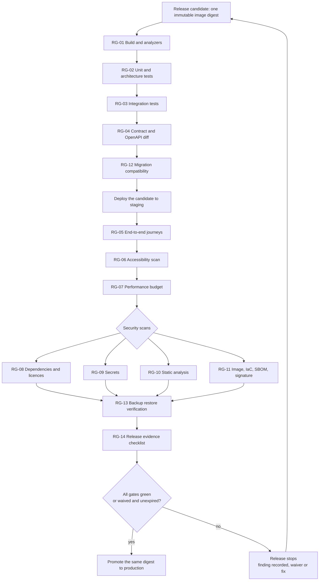
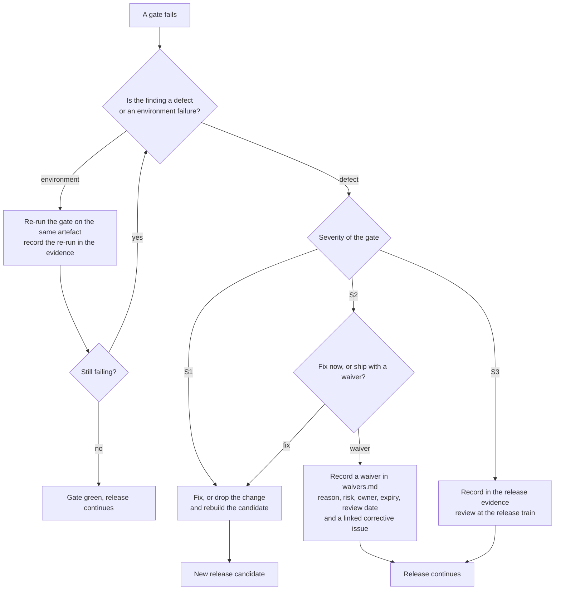

# Release gates — what a release must pass before it ships

This document lists every gate a HyFib Tailor 360 release must pass, and for each one states what it checks, how
badly a failure blocks the release, the evidence it leaves behind, who is authorised to waive it and for how long.
It exists so that "the release is ready" is a checkable statement rather than an opinion, and so that shipping with
a known gap is a recorded, time-bounded, owned decision instead of a silence. Read it with
[`definition-of-done.md`](definition-of-done.md) (the same rigour applied to one pull request),
[`waivers.md`](waivers.md) (the register every waiver below is written into) and
[`../nfr/traceability.md`](../nfr/traceability.md) (the targets these gates prove).

---

## 1. Status and scope

| Field | Value |
| --- | --- |
| Status | **Draft — proposed gates and proposed waiver durations**; binding once the stakeholder review in [`../nfr/reviews/stakeholder-review.md`](../nfr/reviews/stakeholder-review.md) is signed |
| Drafted | 2026-09-04, issue #19, wave W0 |
| Owner of the document | Technical reviewer, with the Owner as approver |
| Applies to | Every tagged release deployed to production, and to the release rehearsals of #59, #60 and #61b |
| Built by | #22 (first gates in CI), #52 (accessibility, cross-browser, performance), #56a and #56b (security severity gates), #59 (release workflow, signatures, evidence enforcement), #60 (restore verification), #61b and #61c (regression and evidence index) |
| Review cadence | Every release train, and after any incident that a gate should have caught |

**Every waiver duration in this document is proposed, to be confirmed** at the stakeholder review. The severities
are proposed too, with one exception that is not open for discussion because it comes from the roadmap's own
release criteria (#1): a release ships with **no unresolved critical or high security finding**.

---

## 2. Vocabulary

### 2.1 Blocking severity

| Severity | Meaning |
| --- | --- |
| **S1 — blocking, no waiver** | The release does not ship. There is no signature that makes it ship. The only route is to fix the finding or to drop the change that caused it |
| **S2 — blocking, waiver possible** | The release does not ship unless a waiver is recorded in [`waivers.md`](waivers.md) by the authorised owner, with a reason, a risk statement, an expiry and a review date |
| **S3 — advisory** | The result is recorded in the release evidence and reviewed at the release train, but does not block. An advisory finding that recurs in three consecutive releases is escalated to S2 |

### 2.2 Gate owners

| Owner | Who this is | Note |
| --- | --- | --- |
| **Technical reviewer** | The engineer accountable for the codebase | Waives engineering-quality gates only |
| **Security owner** | The person accountable for the security baseline | Appointed by #56a. Until then the Owner holds it — see **RG-OD-02** |
| **Operations owner** | The person accountable for running the system, its backups and its alerts | Named by owner decision **OD-15** |
| **Owner** | The business owner | The only person who may waive a gate that changes what the business promises its customers or its accountant |
| **Accountant** | The external accountant | Not a waiver owner, but a required approver for the financial evidence in RG-14 |

Two rules bound every waiver owner: **nobody waives their own work**, and **no gate is waived twice in a row for
the same reason** without escalation to the Owner.

### 2.3 When gates run

| Cadence | Gates |
| --- | --- |
| Every pull request | RG-01, RG-02, RG-03, RG-04, RG-08, RG-09, RG-10, RG-12; RG-05, RG-06 and RG-07 for touched journeys |
| Nightly | RG-05 across the full browser and device matrix, RG-06 and RG-07 across all journeys, RG-11 against the deployed digests |
| Every release | All fourteen, over the exact artefact being released |
| Scheduled independently of the release | RG-13 weekly, with monthly point-in-time recovery and quarterly disaster-recovery exercises |

A gate that passed on a pull request does **not** count as passed for the release: the release runs it again over
the built artefact, because what ships is the artefact, not the branch.

---

## 3. The gate pipeline

---

## 4. Summary of the gates

| ID | Gate | Severity | Authorised waiver owner | Maximum waiver duration (proposed) |
| --- | --- | --- | --- | --- |
| **RG-01** | Build and analyzers | S1 | — | No waiver |
| **RG-02** | Unit and architecture tests | S1 | — | No waiver |
| **RG-03** | Integration tests | S2 | Technical reviewer | 14 days, one release train |
| **RG-04** | Contract and OpenAPI difference | S2 | Technical reviewer | 14 days |
| **RG-05** | End-to-end journeys | S1 for a priority-zero journey; S2 otherwise | Technical reviewer (S2 only) | 14 days, one release train |
| **RG-06** | Accessibility scan | S1 for a critical violation or a blocking barrier on a priority-zero journey; S2 for a serious violation with a documented workaround; S3 for moderate and minor | Owner, on the technical reviewer's recommendation | 30 days |
| **RG-07** | Performance budget | S2 | Technical reviewer | 30 days |
| **RG-08** | Security scan — dependencies and licences | S1 for critical or high, and for a licence outside the allowlist; S2 for medium; S3 for low | Security owner (medium only) | 30 days for medium, 90 days for low |
| **RG-09** | Security scan — secrets | S1 | — | No waiver |
| **RG-10** | Security scan — static analysis | S1 for critical or high; S2 for medium; S3 for low | Security owner (medium only) | 30 days |
| **RG-11** | Security scan — image, infrastructure as code, software bill of materials, signature and provenance | S1 for a missing or invalid signature or provenance, and for critical or high in a shipped layer; S2 for medium | Security owner (medium only) | 30 days |
| **RG-12** | Migration compatibility check | S1 | — | No waiver |
| **RG-13** | Backup restore verification | S1 for a production release; S2 for a staging-only release | Operations owner (staging only) | 7 days |
| **RG-14** | Release evidence checklist | S1 | — | No waiver |

---

## 5. The gates in detail

### RG-01 — Build and analyzers

| Field | Content |
| --- | --- |
| What it checks | A clean checkout restores, builds in `Release` with analyzer warnings treated as errors, and formats cleanly (`dotnet format --verify-no-changes`); the progressive web application lints, type-checks and builds with TypeScript in strict mode and no `any` |
| Why it blocks absolutely | A build that does not reproduce from a clean checkout cannot be the artefact that ships, and an analyzer suppression is a decision that belongs in a pull request, not in a release |
| Blocking severity | **S1 — no waiver** |
| Evidence produced | Build log, formatting result, lint and type-check output, the resolved dependency lock files, and the image digest built from them |
| Waiver owner | None |
| Where it is implemented | `.github/workflows/ci.yml` (#22), extended by the release workflow of #59 |

### RG-02 — Unit and architecture tests

| Field | Content |
| --- | --- |
| What it checks | Every unit and property test passes, and every architecture rule `ARCH-nnn` holds: module boundaries, `Domain` referencing only `Platform.Abstractions`, no cross-schema mapping, every endpoint declaring a policy or a justified anonymous marker, every command endpoint carrying the audit filter, provider software development kits confined to `Integration.Infrastructure` |
| Why it blocks absolutely | The architecture rules are the only mechanical defence the modular monolith has against becoming a ball of mud; a release that suspends them suspends the design |
| Blocking severity | **S1 — no waiver** |
| Evidence produced | Test result files per tier, the coverage report, and the list of architecture rules asserted |
| Waiver owner | None |
| Where it is implemented | `tests/Tailor360.UnitTests`, `tests/Tailor360.ArchitectureTests` (#20 onwards) |

### RG-03 — Integration tests

| Field | Content |
| --- | --- |
| What it checks | Persistence and application programming interface behaviour against a real PostgreSQL and a real object store, including the authorisation matrix (every endpoint × every role × own branch and other branch, with field masks), idempotency replay, concurrency conflicts, append-only enforcement, outbox dispatch and inbox de-duplication |
| Blocking severity | **S2 — waiver possible** |
| Why a waiver is conceivable | An infrastructure outage in the test environment can fail the tier without any defect in the release; the waiver covers *the run*, never a *failing assertion* |
| What may never be waived | A failing authorisation-matrix case, a failing append-only case and a failing idempotency case are defects, not run failures, and are treated as S1 |
| Evidence produced | Test result files, container logs, the matrix report listing every endpoint and its expectations |
| Waiver owner | Technical reviewer |
| Maximum waiver duration | 14 days, one release train — **proposed, to be confirmed** |

### RG-04 — Contract and OpenAPI difference

| Field | Content |
| --- | --- |
| What it checks | The committed OpenAPI document matches the one the code generates; the specification lints cleanly; `oasdiff` reports no undocumented breaking change against the previous release; the endpoint inventory has no endpoint missing from the specification or from the authorisation matrix; every integration event has a versioned name, a JSON Schema and an example; the generated TypeScript client compiles |
| Blocking severity | **S2 — waiver possible** |
| Why a waiver is conceivable | A deliberate, documented breaking change with a client migration note and a raised minimum client version is a decision the release makes on purpose; the waiver records that decision |
| What may never be waived | A breaking change with no migration note, and any endpoint absent from the inventory |
| Evidence produced | The specification difference report, the lint report, the endpoint inventory, and the client build result |
| Waiver owner | Technical reviewer |
| Maximum waiver duration | 14 days — **proposed, to be confirmed** |

### RG-05 — End-to-end journeys

| Field | Content |
| --- | --- |
| What it checks | The business journeys run on the built artefact with synthetic data across the supported browsers and device profiles: customer intake and consent, measurement capture, design selection and media, order confirmation and estimate, label printing and barcode scanning including the keyboard-wedge and manual fallbacks, production phases and custody transfer, QC with rework and alteration, stock reservation and consumption, GST invoice and payment, the dispatch gate blocking an unpaid dispatch, delivery confirmation and feedback |
| Priority-zero journeys | Order confirmation, custody transfer, the dispatch gate, invoice posting and payment recording. A failure in any of these is **S1** |
| Blocking severity | **S1** for a priority-zero journey; **S2** otherwise |
| Evidence produced | Playwright reports and traces, screenshots and videos of failures, the per-journey pass matrix by browser and device profile |
| Waiver owner | Technical reviewer, for a non-priority-zero journey only |
| Maximum waiver duration | 14 days, one release train — **proposed, to be confirmed** |
| Note | Emulation is supplementary. The physical rehearsals — a printed label, a real scanner, a real printer — are evidence for RG-14, not for RG-05 |

### RG-06 — Accessibility scan

| Field | Content |
| --- | --- |
| What it checks | axe-core across every screen and every state on the journeys of RG-05, at the phone, tablet and desktop profiles and at 200% zoom and 320 pixels; the overflow and obscured-focus helper; keyboard-only completion of each priority-zero journey; the screen-reader items of [`../nfr/a11y-checklist.md`](../nfr/a11y-checklist.md) for any journey changed since the previous release |
| Commitment being defended | WCAG 2.2 AA, a stated release criterion of the roadmap (#1) and of [`../nfr/accessibility-localisation.md`](../nfr/accessibility-localisation.md) |
| Blocking severity | **S1** for a critical violation, and for any barrier that stops a member of staff completing a priority-zero journey with a keyboard or a screen reader; **S2** for a serious violation with a documented workaround; **S3** for moderate and minor |
| Evidence produced | The axe report per screen and state, the keyboard walkthrough record, the completed screen-reader checklist, and the list of accepted violations with their waiver identifiers |
| Waiver owner | Owner, on the technical reviewer's recommendation — because an accessibility waiver is a decision about who can use the system, not about engineering convenience |
| Maximum waiver duration | 30 days — **proposed, to be confirmed** |

### RG-07 — Performance budget

| Field | Content |
| --- | --- |
| What it checks | Lighthouse CI budgets on a throttled mobile profile — Largest Contentful Paint, Interaction to Next Paint, Cumulative Layout Shift, and the JavaScript, CSS and image weight budgets; the k6 smoke scenario at the stated load; the application programming interface latency percentiles against [`../nfr/slo.md`](../nfr/slo.md); memory on the lowest supported device for the scan and capture screens; and, per release, the full load and mixed-load run |
| Blocking severity | **S2 — waiver possible** |
| Why a waiver is conceivable | A budget breach on a non-critical screen with a measured, scheduled fix is a trade-off the technical reviewer may make; a breach on the scan or capture screen is not, because it is felt at the counter and in the workshop on every order |
| What is treated as S1 in practice | A regression that pushes a priority-zero journey past its stated target on the reference device |
| Evidence produced | The Lighthouse report, the k6 summary, the before-and-after profile in `docs/nfr/performance-report.md`, and the measured percentiles against the targets |
| Waiver owner | Technical reviewer |
| Maximum waiver duration | 30 days — **proposed, to be confirmed** |

### RG-08 — Security scan: dependencies and licences

| Field | Content |
| --- | --- |
| What it checks | Dependency review of every added or changed dependency in the .NET and Node.js graphs against known vulnerabilities, and every licence against the allowlist; the vulnerability service-level agreements of [`../nfr/security-operations-targets.md`](../nfr/security-operations-targets.md); the expired-exception check from #56a |
| Blocking severity | **S1** for critical or high, and for any licence outside the allowlist; **S2** for medium; **S3** for low |
| Why critical and high cannot be waived | The roadmap's release criteria state plainly that a release carries no unresolved critical or high security finding. A licence breach is likewise a legal exposure, not a risk appetite question |
| Evidence produced | The dependency review report, the software bill of materials, the licence report, and the vulnerability register with due dates |
| Waiver owner | Security owner, for medium findings only |
| Maximum waiver duration | 30 days for medium, 90 days for low — **proposed, to be confirmed**, and never beyond the remediation deadline the vulnerability's severity already carries |

### RG-09 — Security scan: secrets

| Field | Content |
| --- | --- |
| What it checks | `gitleaks` over the repository and the release artefact, including compose files, fixtures, example environment files and documentation; the startup assertion that no secret appears in a log, a problem-details response, a health payload or telemetry, tested with sentinel values |
| Blocking severity | **S1 — no waiver** |
| Why there is no waiver | A leaked credential is not a risk to be accepted for a fortnight; it is an incident. The gate's failure path is rotation and an incident record, not a signature |
| Evidence produced | The scan report, and where a finding occurred, the rotation record naming what was rotated and when |
| Waiver owner | None |

### RG-10 — Security scan: static analysis

| Field | Content |
| --- | --- |
| What it checks | CodeQL over the .NET and TypeScript code, plus the analyzers that enforce the project's own security rules — no endpoint without a policy, no command endpoint without the audit filter, no outbound call bypassing the outbound-HTTP port, no raw SQL concatenation |
| Blocking severity | **S1** for critical or high; **S2** for medium; **S3** for low |
| Evidence produced | SARIF results attached to the release, the triage note for every finding, and the list of accepted findings with waiver identifiers |
| Waiver owner | Security owner, for medium findings only |
| Maximum waiver duration | 30 days — **proposed, to be confirmed** |
| Note | A false positive is dismissed with a written justification in the triage note, which is not a waiver; a waiver is for a *real* finding the release ships with |

### RG-11 — Security scan: image, infrastructure as code, bill of materials, signature and provenance

| Field | Content |
| --- | --- |
| What it checks | Trivy over the container images and the infrastructure-as-code definitions; the images run as non-root with a read-only filesystem and dropped capabilities, from pinned base images; a software bill of materials is generated and attached; the artefact carries a cosign signature and a provenance attestation, and the deployment verifies both against the digest before pulling |
| Blocking severity | **S1** for a missing or invalid signature or provenance, and for a critical or high vulnerability in a shipped layer; **S2** for medium |
| Why signature and provenance cannot be waived | The deployment model is "build once, promote the identical digest". Without a verified signature, "the identical digest" is an assumption rather than a fact, and the pull-based deployment on the virtual machine has nothing to check |
| Evidence produced | The image scan report, the infrastructure-as-code scan report, the bill of materials, the signature and provenance verification output, and the digest that was promoted |
| Waiver owner | Security owner, for medium findings only |
| Maximum waiver duration | 30 days — **proposed, to be confirmed** |

### RG-12 — Migration compatibility check

| Field | Content |
| --- | --- |
| What it checks | Migrations apply cleanly to an empty database and to a database restored at the previous release; the previous release's application still starts and serves its journeys against the migrated database (expand–migrate–contract); the startup check tolerates applied-but-unknown migrations, so release N runs against a database at N+1; no migration weakens an append-only trigger or grants schema-definition rights to the runtime role; the preflight recorded the latest backup label and the write-ahead-log position as the point-in-time-recovery target |
| Blocking severity | **S1 — no waiver** |
| Why there is no waiver | Rollback is the project's only cheap recovery from a bad release. A migration that breaks backward compatibility removes it, and the alternative — restoring the database — costs the shop its day's work |
| Evidence produced | The migration logs for both directions, the schema snapshot difference, the rollback rehearsal record from #59, and the recorded recovery target |
| Waiver owner | None |

### RG-13 — Backup restore verification

| Field | Content |
| --- | --- |
| What it checks | A restore that actually happened, recently, from the real backup repository: the weekly automated restore on the staging or a throwaway virtual machine, restoring to one hour before now, running the migration check and the invariant queries — ledger balances rebuilt from the ledger, no invoice sequence gap, media references verified against the media bucket — and recording the measured recovery point and recovery time against the targets in [`../nfr/slo.md`](../nfr/slo.md); plus the monthly point-in-time-recovery and missing-object exercises and the quarterly disaster-recovery exercise run by an operator who did not write the runbook |
| Freshness requirement | The most recent successful restore must be **no more than 7 days old** at the moment of the release — **proposed, to be confirmed** |
| Blocking severity | **S1** for a production release; **S2** for a staging-only release |
| Why there is no production waiver | An untested backup is not a backup. The one failure mode that would end this business is data loss it cannot recover from, and the only proof against it is a restore that ran |
| Evidence produced | The restore log, the measured recovery point and recovery time, the invariant query results, the backup age and completeness metrics, and the exercise record naming the operator |
| Waiver owner | Operations owner, for a staging-only release only |
| Maximum waiver duration | 7 days — **proposed, to be confirmed** |

### RG-14 — Release evidence checklist

| Field | Content |
| --- | --- |
| What it checks | That the GitHub Release for the tag carries the complete evidence set, and that the deployment workflow refuses to run without it |
| The checklist | See section 6; the fillable form a release copies is [`release-evidence.md`](release-evidence.md) |
| Blocking severity | **S1 — no waiver** |
| Why there is no waiver | Every other gate produces evidence; this gate is the one that makes the evidence findable a year later, when the accountant, an auditor or the next engineer needs it. Waiving it would mean shipping a release nobody can reconstruct |
| Evidence produced | The release record itself, indexed in `docs/launch/release-evidence-index.md` (#61c) |
| Waiver owner | None |

---

## 6. The release evidence checklist

The GitHub Release for the tag carries every item below, or the deployment workflow fails. The list here is the
definition; [`release-evidence.md`](release-evidence.md) is the form a release copies and fills in, with one row per
item, the person who confirms it and the date. Both are changed in the same pull request or not at all.

| # | Item | Produced by | Who confirms |
| --- | --- | --- | --- |
| 1 | The promoted image digest, its cosign signature and its provenance attestation | RG-11 | Technical reviewer |
| 2 | Build, analyzer, format, lint and type-check results | RG-01 | Technical reviewer |
| 3 | Test tier summary: unit, property, architecture, integration, contract, with counts and coverage | RG-02, RG-03, RG-04 | Technical reviewer |
| 4 | The authorisation-matrix report, listing every endpoint with its role and branch expectations | RG-03 | Technical reviewer |
| 5 | The OpenAPI difference report and the endpoint inventory | RG-04 | Technical reviewer |
| 6 | The end-to-end regression report with the per-journey pass matrix by browser and device profile | RG-05 | Technical reviewer |
| 7 | The accessibility report and the accepted-violation list | RG-06 | Owner |
| 8 | The performance report: Lighthouse budgets, k6 summary, measured percentiles against the service level objectives | RG-07 | Technical reviewer |
| 9 | The security scan summary: dependencies, licences, secrets, static analysis, image and infrastructure as code, with every finding's severity and status | RG-08 to RG-11 | Security owner |
| 10 | The software bill of materials | RG-11 | Security owner |
| 11 | The migration dry-run output, the rollback note and the recorded recovery target | RG-12 | Technical reviewer |
| 12 | The most recent restore verification record with its measured recovery point and recovery time | RG-13 | Operations owner |
| 13 | Every active waiver applying to this release, with its expiry and review date | [`waivers.md`](waivers.md) | Owner |
| 14 | The release notes: what changed, the expected interruption window, the compatibility matrix for the progressive web application, the application programming interface, the database and the worker, and the minimum supported client | #59 | Technical reviewer |
| 15 | The user-acceptance-testing sign-off link, and for any release changing pricing, tax, invoice layout, rounding or a financial report, the accountant's approval of the GST output | #61c | Owner, with the accountant |
| 16 | The go or no-go record naming the decision owner, the rollback decision owner and the criteria used | #61c | Owner |

Items 15 and 16 apply to the go-live release and to every subsequent release that touches the financial surface;
a release that touches neither records that fact rather than omitting the row.

---

## 7. What happens when a gate fails

Three rules govern the re-run path, because "run it again until it is green" is how gates quietly stop working:

1. A re-run is recorded with its reason. Three re-runs of the same gate on one candidate is itself a finding.
2. A gate is never re-run with different inputs to make it pass — not a reduced browser set, not a smaller data
   set, not a relaxed budget. Changing the gate is a pull request against this document.
3. A flaky test is quarantined only with a linked issue and a date, and the quarantine list is part of the release
   evidence.

---

## 8. Relationship to the waiver register

Every S2 waiver granted under this document is written into [`waivers.md`](waivers.md) with its gate, reason, risk,
owner, expiry and review date, and **an expired waiver blocks the next release**. A waiver is a debt with a due
date, not a permanent exemption; the register is checked as part of RG-14, so a release cannot ship while carrying
an expired one.

---

## 9. Open decisions recorded by this document

Raised 2026-09-04 by issue #19; mirrored in
[`../prd/assumptions-and-open-decisions.md`](../prd/assumptions-and-open-decisions.md) and referenced against plan
[Section 11](../IMPLEMENTATION_PLAN.md).

| ID | Question | Blocks | Owner | Status |
| --- | --- | --- | --- | --- |
| **RG-OD-01** | Confirm every proposed severity and waiver duration in section 4, or replace them | The gate configuration built by #22, #52, #56a and #59 | Business owner, with the technical reviewer | **Open** — needed before the W1 exit gate |
| **RG-OD-02** | Who holds the security owner role, and who deputises when they are unavailable | Every waiver in RG-08 to RG-11 | Business owner | **Open** — needed before W2, when #56a lands |
| **OD-15** (plan Section 11 item 15) | Who holds the operations owner role and receives priority-one pages | RG-13's waiver authority and the alert receivers of #58 | Business owner | **Open** — needed before W5 |
| **RG-OD-03** | Whether the 7-day restore freshness requirement in RG-13 is achievable with the chosen hosting model and its restore environment cost | RG-13's freshness rule; the standing staging virtual machine in the budget | Business owner, with the operations owner | **Open** — depends on **OD-02**; see [`../nfr/risk-review.md`](../nfr/risk-review.md) |
| **RG-OD-04** | The release cadence and what a "release train" means in calendar terms, since every 14-day waiver is expressed against it | The waiver durations in section 4 | Business owner | **Proposed, to be confirmed** — a fortnightly train is assumed |
| **OD-05** (plan Section 11 item 5) | The accountant's confirmation of GST output, rounding and record retention | Evidence item 15 in section 6 | Business owner, with the accountant | **Open** |

---

## 10. Related documents

| Document | Why it matters here |
| --- | --- |
| [`release-evidence.md`](release-evidence.md) | The per-release form that carries the section 6 checklist, the gate results and the go or no-go record |
| [`branch-protection.md`](branch-protection.md) | The `main` protection and required checks the gates run under, and the read-back the release evidence attaches |
| [`waivers.md`](waivers.md) | The register every S2 waiver is written into, and the expiry rule that blocks the next release |
| [`definition-of-done.md`](definition-of-done.md) | The same checks applied to one pull request |
| [`definition-of-ready.md`](definition-of-ready.md) | Where a gate's requirements are anticipated before work starts |
| [`../nfr/traceability.md`](../nfr/traceability.md) | Which target each gate proves, and who is accountable for it |
| [`../nfr/slo.md`](../nfr/slo.md) | The availability, latency, recovery-point and recovery-time targets RG-07 and RG-13 measure against |
| [`../nfr/security-operations-targets.md`](../nfr/security-operations-targets.md) | The vulnerability service-level agreements RG-08 to RG-11 enforce |
| [`../nfr/support-matrix.md`](../nfr/support-matrix.md) | The browsers, devices, scanners and printers RG-05 and RG-06 run against |
| [`../nfr/risk-review.md`](../nfr/risk-review.md) | The targets that may prove infeasible, and the gates most likely to need a waiver |
| [`../IMPLEMENTATION_PLAN.md`](../IMPLEMENTATION_PLAN.md) | Section 2.3 release criteria, Section 5.3 test pyramid, and the #52, #56, #59, #60 and #61 blueprints that implement these gates |
