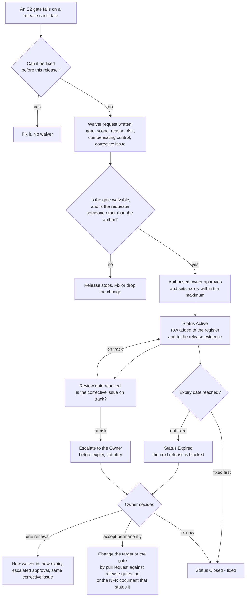

# Waiver register — shipping with a known gap, on purpose and with a date

A waiver is how HyFib Tailor 360 records a release that ships without a gate being green. It is not permission to
skip a check; it is a written, owned, time-bounded acknowledgement that a specific risk is being carried for a
specific period, with a named person accountable and a corrective issue attached. This document defines the
register's format, the rules that govern a waiver's life, and the rule that gives the register its force: **an
expired waiver blocks the next release**. Read it with [`release-gates.md`](release-gates.md) (which gates may be
waived, by whom and for how long) and [`definition-of-done.md`](definition-of-done.md) (the per-pull-request checks
that a waiver never covers).

---

## 1. Status and scope

| Field | Value |
| --- | --- |
| Status | **Draft — proposed process**; binding once the stakeholder review in [`../nfr/reviews/stakeholder-review.md`](../nfr/reviews/stakeholder-review.md) is signed |
| Drafted | 2026-09-04, issue #19, wave W0 |
| Owner of the document | Technical reviewer, with the Owner as approver |
| Register state at drafting | **Empty.** No waiver has been granted, because no release has been made |
| Enforced by | The release evidence checklist gate **RG-14**, which reads this register and fails the release when any waiver applying to it has passed its expiry date |
| Review cadence | Every release train, every wave exit gate, and at each quarterly security and operations review |

---

## 2. What a waiver is, and what it is not

| A waiver **is** | A waiver **is not** |
| --- | --- |
| A dated decision to ship with one specific gate failure | A standing exemption for a class of failures |
| Owned by one named person who carries the risk | Owned by "the team" or "engineering" |
| Bounded by an expiry date that is at most the maximum in [`release-gates.md`](release-gates.md) | Open-ended, or renewable indefinitely |
| Accompanied by a linked corrective issue with an assignee | An alternative to fixing the problem |
| Visible in the release record every reader of that release sees | A private agreement between two people |
| Granted before the release ships | Written afterwards to explain what happened |

A waiver granted after the fact is not a waiver; it is an incident record, and it belongs in the incident process
of [`../nfr/security-operations-targets.md`](../nfr/security-operations-targets.md).

---

## 3. What may never be waived

These come straight from [`release-gates.md`](release-gates.md) section 4 and from the roadmap's own release
criteria (#1). No signature in this register makes any of them shippable.

| Never waivable | Because |
| --- | --- |
| **RG-01** build and analyzers | A release that does not build from a clean checkout is not a release |
| **RG-02** unit and architecture tests | Suspending the architecture rules suspends the design the modular monolith depends on |
| **RG-09** secrets scan | A leaked credential is an incident with a rotation, not a risk to carry for a fortnight |
| **RG-12** migration compatibility | Backward-incompatible migrations remove rollback, the only cheap recovery this business has |
| **RG-14** release evidence checklist | The evidence is what makes the release reconstructable later |
| Any **critical or high** security finding — dependency, static analysis or image | The roadmap states that a release carries no unresolved critical or high finding |
| A **licence outside the allowlist** | Legal exposure, not risk appetite |
| A **missing or invalid signature or provenance** | "Promote the identical digest" becomes an assumption without it |
| A failing **authorisation-matrix**, **append-only** or **idempotency** integration case | These are defects in the controls that protect customer data, custody and money |
| An accessibility **barrier that stops a member of staff completing a priority-zero journey** with a keyboard or a screen reader | It would mean shipping a system a member of staff cannot use to do their job |
| **RG-13** restore verification, for a production release | An untested backup is not a backup |

---

## 4. The register

### 4.1 Columns

| Column | Content | Rule |
| --- | --- | --- |
| **ID** | `WV-nnn`, allocated in sequence and never reused | Stable; quoted in the release record and in the corrective issue |
| **Gate** | The `RG-nn` identifier and name from [`release-gates.md`](release-gates.md) | Exactly one gate per waiver; two gate failures are two waivers |
| **Scope** | What the waiver covers: which release or releases, which journey, which screen, which finding identifier | Narrow enough that a reader can tell whether a new failure is covered by it. "The accessibility gate" is not a scope; "the serious contrast violation on the stock-adjustment dialog" is |
| **Reason** | Why the release is shipping without it, in plain language | Not "no time"; what would have to happen to fix it, and why that cannot happen before this release |
| **Risk** | What could go wrong, who is affected, how it would be noticed, and what compensating control is in place meanwhile | The compensating control is the part reviewers most often omit |
| **Risk owner** | The named person accountable for the risk while the waiver is active | A person, never a role with no name attached |
| **Approved by** | The authorised waiver owner for that gate, per [`release-gates.md`](release-gates.md) section 2.2 | Never the same person as the author of the change that failed the gate |
| **Granted** | Date the waiver was approved | ISO format, `YYYY-MM-DD` |
| **Expires** | Date the waiver stops being valid | At most the maximum duration for that gate. The next release after this date is blocked until the waiver is closed or escalated |
| **Review date** | The date the waiver is looked at before it expires, so the fix has a chance to land | Proposed rule: the midpoint between granted and expires, or 7 days before expiry, whichever is earlier |
| **Corrective issue** | The GitHub issue that removes the need for the waiver | Must exist and have an assignee before the waiver is granted |
| **Status** | `Active`, `Closed — fixed`, `Closed — no longer applicable`, `Expired`, or `Escalated` | An `Expired` row blocks releases until it becomes `Closed` or `Escalated` |

### 4.2 The register

No waiver has been granted. New rows are appended here, most recent first, and a row is never deleted — a waiver
that is closed keeps its row with the closing date, so the register also serves as the history of what this project
has been prepared to ship without.

| ID | Gate | Scope | Reason | Risk | Risk owner | Approved by | Granted | Expires | Review date | Corrective issue | Status |
| --- | --- | --- | --- | --- | --- | --- | --- | --- | --- | --- | --- |
| _(none)_ | | | | | | | | | | | |

### 4.3 Worked example — illustrative only

The row below is an **illustration of the format**. It is not a granted waiver, it does not apply to any release,
and it must be removed the first time a real row is added above it.

| Field | Illustrative content |
| --- | --- |
| ID | `WV-001` |
| Gate | RG-06 accessibility scan |
| Scope | One serious axe violation — insufficient contrast on the disabled state of the "Send to print station" button — on the label reprint dialog only, in release `v0.9.0` |
| Reason | The colour token that produces the disabled state is shared by every disabled control in the design system. Changing it is a design-system change with its own visual-regression baselines, which cannot be reviewed before this release |
| Risk | A member of staff with low vision may not distinguish the disabled state from the enabled one and may believe a print was sent when it was not. Compensating control: the dialog also shows the print-queue status in text, and the button carries a text label that changes with state, so the state is never conveyed by colour alone |
| Risk owner | The named engineer who owns the design system |
| Approved by | Owner, on the technical reviewer's recommendation |
| Granted | 2026-11-03 |
| Expires | 2026-12-03 (30 days, the maximum for RG-06) |
| Review date | 2026-11-18 |
| Corrective issue | The design-system contrast issue, assigned |
| Status | Active |

---

## 5. Waiver lifecycle

---

## 6. The rules

1. **An expired waiver blocks the next release.** RG-14 reads this register; a release whose scope is covered by an
   `Expired` row does not ship. There is no override. This is the rule that makes every other rule in this document
   mean something.
2. **A waiver is granted before the release, never after.** A gap discovered after shipping is an incident.
3. **Nobody waives their own work.** The approver is never the author of the change that failed the gate.
4. **One gate, one waiver, one scope.** A waiver that covers "the accessibility findings" covers nothing, because
   nobody can later tell whether a new finding was included.
5. **No waiver without a corrective issue that has an assignee.** A risk with nobody working on it is not being
   carried; it is being abandoned.
6. **No waiver without a compensating control, or an explicit statement that none exists.** "None exists" is an
   acceptable answer that changes how the risk reads, and it should.
7. **At most one renewal**, and the renewal is approved one level up — a technical reviewer's waiver is renewed by
   the Owner; an Owner's waiver is not renewed at all, it becomes a change to the target. A second renewal is the
   project telling you the target is wrong; change the target through a pull request, with the reasoning recorded,
   rather than renewing forever.
8. **The maximum durations in [`release-gates.md`](release-gates.md) are ceilings, not defaults.** The expiry is
   the date the fix is genuinely expected, and is shorter than the ceiling in most cases.
9. **A waiver never covers a Definition of Done item.** The Definition of Done is a merge condition, not a release
   condition; a pull request that cannot meet it is not merged, and there is nothing to waive.
10. **Every active waiver appears in the release record**, so anyone reading that release sees exactly what it
    shipped without.

---

## 7. Waiver request form

Copy this into the release thread or the corrective issue and fill in every field. A request missing any field is
returned rather than approved.

| Field | Your answer |
| --- | --- |
| Gate (`RG-nn` and name) | |
| Release candidate this applies to | |
| Scope — the precise failure, narrow enough to test against | |
| Reason it cannot be fixed before this release | |
| Risk — what could go wrong, to whom, and how it would be noticed | |
| Compensating control in force meanwhile, or "none exists" | |
| Risk owner (named person) | |
| Requested expiry, and why that date | |
| Proposed review date | |
| Corrective issue and its assignee | |
| Confirmation that the approver is not the author of the failing change | |

---

## 8. Reporting and review

| When | What is reviewed | By whom |
| --- | --- | --- |
| Every release | Every waiver applying to the release, listed in the release evidence under RG-14 | Owner |
| Every wave exit gate | All `Active` waivers, their corrective issues and their ages | Technical reviewer, with the Owner |
| Quarterly | The register as a whole: which gates are waived most often, and whether that gate's target or the implementation is wrong | Owner, technical reviewer, security owner, operations owner |
| After any incident | Whether an active or recently expired waiver contributed | Whoever runs the post-incident review |

Two numbers are reported at each release train and are worth watching more than the individual rows: **the count of
active waivers**, and **the age of the oldest one**. A register that only grows is a delivery process shipping its
quality standard away one fortnight at a time.

---

## 9. Neighbouring registers, and how they differ

| Register | Covers | Lives in |
| --- | --- | --- |
| **This register** | A release gate that is not green at release time | Here |
| **Security exception register** (#56a) | A vulnerability or an ASVS control accepted for a period, independent of any one release; a continuous-integration check fails on an expired exception | `docs/security/` |
| **Owner decision register** | Business decisions not yet taken, with the engineering default in force meanwhile | [`../prd/assumptions-and-open-decisions.md`](../prd/assumptions-and-open-decisions.md) |
| **Definition of Ready deferrals** | A readiness criterion deliberately deferred for one issue, closing at a wave gate | Recorded on the issue, per [`definition-of-ready.md`](definition-of-ready.md) section 5 |
| **Risk review** | Targets that may prove infeasible or too costly, before anything has been built against them | [`../nfr/risk-review.md`](../nfr/risk-review.md) |

A single problem can appear in more than one: a medium vulnerability may hold a security exception *and*, at
release time, a waiver against RG-08. The security exception governs the finding's remediation deadline; the waiver
governs this release shipping with it. Both must be within their dates.

---

## 10. Open decisions recorded by this document

Raised 2026-09-04 by issue #19; mirrored in
[`../prd/assumptions-and-open-decisions.md`](../prd/assumptions-and-open-decisions.md) and referenced against plan
[Section 11](../IMPLEMENTATION_PLAN.md).

| ID | Question | Blocks | Owner | Status |
| --- | --- | --- | --- | --- |
| **WV-OD-01** | Whether the register stays a Markdown table read by a human at release time, or becomes a machine-parsed file that the release workflow validates automatically | Whether RG-14's expiry rule is enforced by a person or by a check in #59 | Technical reviewer | **Proposed** — a Markdown table stands, with a parser added by #59 if the register grows beyond a handful of rows |
| **WV-OD-02** | Confirm the renewal rule in section 6 item 7 — one renewal, approved one level up | The escalation path for every waiver | Business owner | **Proposed, to be confirmed** |
| **WV-OD-03** | Who approves a waiver when the authorised owner for that gate is unavailable, and whether a release may wait instead | Release timing when the Owner or the security owner is away | Business owner | **Open** — needed before the first production release |
| **RG-OD-02** | Who holds the security owner role, and their deputy | Approval of every RG-08 to RG-11 waiver | Business owner | **Open** — needed before W2 |
| **OD-15** (plan Section 11 item 15) | Who holds the operations owner role | Approval of an RG-13 staging waiver | Business owner | **Open** — needed before W5 |

---

## 11. Related documents

| Document | Why it matters here |
| --- | --- |
| [`release-gates.md`](release-gates.md) | The gates, their severities, their authorised waiver owners and the maximum durations this register enforces |
| [`definition-of-done.md`](definition-of-done.md) | The merge conditions a waiver never covers |
| [`definition-of-ready.md`](definition-of-ready.md) | Deferrals, the readiness-time relative of a waiver |
| [`../nfr/risk-review.md`](../nfr/risk-review.md) | The targets most likely to generate the first waivers, assessed before they do |
| [`../nfr/security-operations-targets.md`](../nfr/security-operations-targets.md) | The vulnerability remediation deadlines a security waiver may never outlive |
| [`../nfr/traceability.md`](../nfr/traceability.md) | What each gate proves, so the risk statement can say what stops being proven |
| [`../IMPLEMENTATION_PLAN.md`](../IMPLEMENTATION_PLAN.md) | Section 2.3 release criteria and the #56a exception register this register sits beside |
