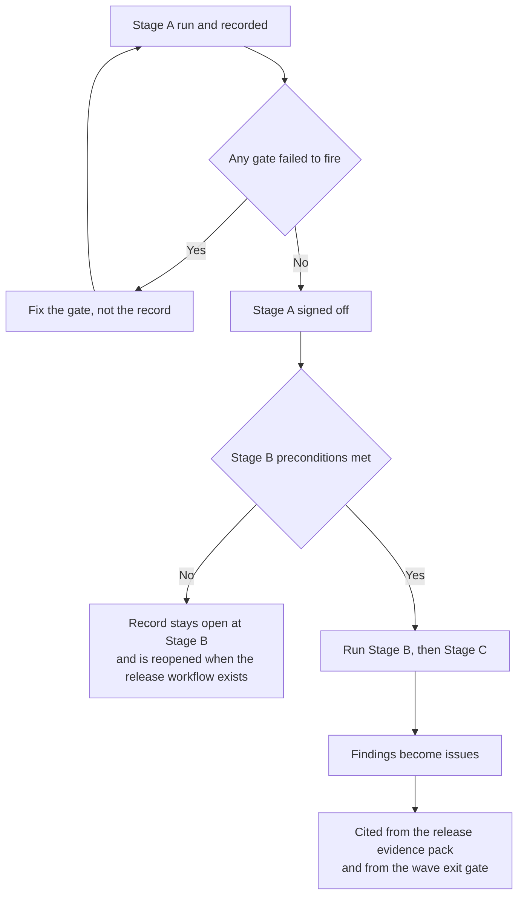

# Workflow demonstration — procedure and record

This is the demonstration issue #22 owes: one real change taken through the whole process — issue, branch, pull
request with a plan and an evidence checklist, green continuous integration, code-owner review, squash merge,
tagged build — and then reverted through a second pull request, so that rollback is observed rather than assumed.

It is both the script for running the demonstration and the record signed at the end of it. Read it with
[`definition-of-done.md`](definition-of-done.md) (what each pull request must satisfy),
[`branch-protection.md`](branch-protection.md) (what `main` enforces) and
[`release-gates.md`](release-gates.md) (what a release must satisfy). The point is not to prove that a person can
follow the process; it is to prove that the **machinery** stops them when they do not.

> **Status: not performed.** No demonstration has been run. Every "Result" and "Evidence" cell below is empty on
> purpose, and none of them may be filled in from memory, from a similar run, or from what the configuration
> implies would happen. Several preconditions in section 3 are not met yet, so the run cannot start today — the
> table says which, and which stage each one blocks.
> **Date of the demonstration: _to be filled in_.**

---

## 1. Session details

| Field | Value |
| --- | --- |
| Date started | _to be filled in_ |
| Date completed | _to be filled in_ |
| Performed by | _to be filled in_ — the author role for the demonstration change |
| Reviewer | _to be filled in_ — must be a different person from the author, or section 3's single-maintainer note applies |
| Repository at the start | _to be filled in_ — the `main` commit the demonstration branched from |
| Sample change used | _to be filled in_ — section 4 proposes one; confirm or replace it at the run |
| Wall-clock time for the whole demonstration | _to be filled in_ |
| Record confirmed by | _to be filled in_ — author and reviewer both, after reading this file as it stands at the end |

---

## 2. What the demonstration proves

Each row is a claim written somewhere else in this repository that is currently asserted and not observed. The
demonstration converts it into an observation with an artefact attached.

| # | Claim | Where the claim is made | What proves it here |
| --- | --- | --- | --- |
| C1 | No change reaches `main` except through a reviewed pull request linked to one issue | **NFR-MQ-02**, [`../nfr/traceability.md`](../nfr/traceability.md) | Steps 2, 9 and 11, plus step 14's check that no direct push occurred |
| C2 | The pull-request policy check actually blocks a pull request that breaks its three rules | [`../../.github/workflows/pr-policy.yml`](../../.github/workflows/pr-policy.yml); **DoD 1** | Steps 4, 5 and 6 — three deliberate failures, each observed and then corrected |
| C3 | Code-owner review is required, and the right owner is requested | [`../../.github/CODEOWNERS`](../../.github/CODEOWNERS); [`branch-protection.md`](branch-protection.md) | Steps 8 and 9 |
| C4 | The continuous integration gates fail on the things they claim to fail on | [`../../.github/workflows/ci.yml`](../../.github/workflows/ci.yml) | Section 6, the five deliberately broken branches |
| C5 | A merged change reaches a tagged, reproducible build | Plan Section 4.7; [`release-gates.md`](release-gates.md) | Steps 10 and 11 |
| C6 | A change can be taken back out without a database restore | Plan Section 4.7 (rollback = redeploy the previous digest); **DoD 4** | Steps 12 to 14 |
| C7 | The pull-request pipeline finishes inside its budget | Plan Section 5.3, ≤ 15 minutes wall clock | Section 7 |

---

## 3. Preconditions

The demonstration is in three stages, and each stage has its own preconditions. A stage whose preconditions are
not met is not attempted and not written up as a partial pass.

Status vocabulary: **Met** (verified at the run), **Not met** (blocks the stage), **To verify** (check it at the
run rather than assuming it).

| # | Precondition | How to verify it | Blocks | Status |
| --- | --- | --- | --- | --- |
| P1 | `CODEOWNERS` is valid and applies. A personally owned repository cannot use team handles, and GitHub silently applies **none** of an invalid file | `gh api repos/{owner}/{repo}/codeowners/errors` returns an empty list, and a test pull request shows the owner requested | Stage A | _to verify_ |
| P2 | Branch protection or a ruleset is applied to `main`, requiring a pull request, a review, and the status checks by name | The settings page, and an attempted direct push to `main` being refused | Stage A | _to verify — see **BP-OD-02**; on a private repository owned by a personal account this may not be enforceable at all, in which case section 3.1 applies_ |
| P3 | The pull-request policy check and the continuous integration jobs are configured as **required** status checks | The branch-protection settings list them by the job name the workflow reports | Stage A | _to verify_ |
| P4 | The number of required approving reviews is decided | **DOD-OD-01** / **BP-OD-01**, [`definition-of-done.md`](definition-of-done.md) | Stage A | **Not met** — open owner decision |
| P5 | A release workflow exists that produces a tagged build from a merge to `main` | `.github/workflows/` contains one, and a merge triggers it | Stage B | **Not met** — no release workflow exists |
| P6 | The container images are built, signed and promoted by digest | The workflow of P5, plus `infra/docker/Dockerfile.cli` | Stage B, Stage C | **Not met** — see [`../dev/staging.md`](../dev/staging.md) section 12 |
| P7 | An interim staging machine exists to deploy the tag to | [`../dev/staging.md`](../dev/staging.md) section 10 | Stage C | **Not met** — blocked on owner decision **OD-02** |
| P8 | A `release-ready` label exists and is applied only by the policy check | The label list, and the check's own step | Stage B | _to verify_ |

**Stage A** — issue, branch, pull request, policy check, continuous integration, review, squash merge, revert.
Needs P1 to P4.
**Stage B** — the tagged build and the signed images. Needs P5, P6, P8.
**Stage C** — deploying the tag to interim staging and reverting it there. Needs P6 and P7.

Stage A is the part that gates every later pull request, so it is run first and on its own. Stages B and C are run
when their preconditions are met, and this record is reopened and completed then rather than replaced.

### 3.1 If branch protection cannot be enforced

If P2 turns out to be unavailable on the repository's current plan, the demonstration is still run, and the
difference is recorded rather than hidden: each step whose enforcement is by convention instead of by the platform
is marked **"convention"** in its Result cell. A convention that a person can bypass without anything noticing is
not the same control as one they cannot, and a release evidence pack that blurs the two is misleading. See
[`branch-protection.md`](branch-protection.md) section 6 and **BP-OD-02**.

---

## 4. The sample change

The change must be **real**. A change invented for the demonstration teaches the wrong lesson, because a reviewer
approves it without reading it and the revert costs nothing. Criteria:

1. Small enough to review in a few minutes, and to revert cleanly.
2. Touches production code, a test and a document, so that all three continuous-integration lanes do real work.
3. Observable from outside — somebody can look at a running build and see whether it is there.
4. Safe to have in `main` for the hour between the merge and the revert, and safe to remove again.
5. Genuinely wanted, so that the revert is followed by a proper re-application later rather than by nothing.

**Proposed change (confirm or replace at the run): add the `X-Robots-Tag` response header to the web host's
security-headers middleware, with a unit test asserting it.** It is one line of production code and one test; it
closes a real gap recorded in [`../dev/staging.md`](../dev/staging.md) section 12, where the header is set by the
reverse proxy but not by the application; and it is observable with a single request against a running build. Its
revert restores exactly the prior behaviour, which is the current behaviour, so nothing depends on it.

| Field | Value |
| --- | --- |
| Change actually used | _to be filled in_ |
| Issue it was done under | _to be filled in_ |
| Why it satisfied the five criteria | _to be filled in_ |

---

## 5. The demonstration steps

One row per step. **Expected** is what the machinery should do; **Result** is what it did, and is the only column
that may not be filled in ahead of the run. "Evidence" names the artefact attached to the issue — a run URL, a
screenshot of a refusal, a log excerpt — because [`definition-of-done.md`](definition-of-done.md)'s governing rule
is that every item resolves to an artefact and not to an assertion.

### Stage A — issue to merge, and back out again

| # | Step | Expected | Evidence to capture | Result |
| --- | --- | --- | --- | --- |
| 1 | Open the issue for the sample change against the feature issue template, and check it against [`definition-of-ready.md`](definition-of-ready.md) | The template's required fields are enforced; the issue is ready | Issue URL; the readiness note | |
| 2 | Cut the branch, named to match the branch rule of [`../../.github/workflows/pr-policy.yml`](../../.github/workflows/pr-policy.yml) | — | The branch name | |
| 3 | Open a **draft** pull request early, with the plan and the evidence checklist from [`../../.github/pull_request_template.md`](../../.github/pull_request_template.md) | The template is applied; the policy check runs but does not yet apply the ready-for-review rules | Pull request URL | |
| 4 | **Deliberate failure 1** — edit the body to link two issues (`Refs #NN` and `Refs #MM`) | The policy check fails on "exactly one linked issue" | The failing check's log line | |
| 5 | **Deliberate failure 2** — open a scratch pull request from a branch whose name does not match the rule | The policy check fails on the branch name | The failing check's log line; then close the scratch pull request | |
| 6 | **Deliberate failure 3** — mark the real pull request ready for review with a mandatory evidence item unticked (the items [`definition-of-done.md`](definition-of-done.md) marks as always applying — at the time of writing DoD 1, 3, 6 and 9) | The policy check fails on the unchecked mandatory item | The failing check's log line | |
| 7 | Correct all three, and let the full pipeline run | Every required check is green; the run is inside the budget of section 7 | The run URL; per-job durations | |
| 8 | Observe the review request | The code owner for the touched paths is requested automatically (P1) | Screenshot of the requested reviewer | |
| 9 | Attempt to merge **before** approval | The merge is refused (or, under section 3.1, is possible and is recorded as "convention") | Screenshot of the refusal | |
| 10 | Review and approve, then squash merge | One commit lands on `main`, with the issue reference in its message | The merge commit hash and message | |
| 11 | Confirm the issue closed or was updated as the body specified (`Closes #NN` closes it; `Refs #NN` leaves it open) | Whichever the body said, and nothing else | The issue's state | |
| 12 | Open the **revert** pull request: `git revert` of the squash commit, on a branch named to the same rule, linked to the same issue | The revert is a normal pull request and passes the same gates. It is not a force-push and not an administrative rewrite | Pull request URL | |
| 13 | Let the pipeline run, get the review, squash merge the revert | Green, approved, merged. `main` is byte-identical to its state before step 10 for the reverted files | `git diff` between the two commits over the touched paths | |
| 14 | Confirm no direct commit reached `main` during the whole exercise | Every commit on `main` in the window is a squash-merge commit from a pull request | `git log --first-parent main` for the window | |

### Stage B — the tagged build

| # | Step | Expected | Evidence to capture | Result |
| --- | --- | --- | --- | --- |
| 15 | The merge in step 10 triggers the release workflow | A tag and a build are produced from that commit and no other | Workflow run URL; the tag | |
| 16 | The images are built once, signed, and pushed by digest | Three images (`tailor360-web`, `-worker`, `-cli`), each with a digest and a signature | The digests; the signature verification output | |
| 17 | The `release-ready` label is present, and was applied by the policy check rather than by a person | The label's event history names the check | The label event | |
| 18 | Repeat 15 to 17 for the revert merge in step 13 | A second tag, from the revert commit | The tag and digests | |

### Stage C — the environment

| # | Step | Expected | Evidence to capture | Result |
| --- | --- | --- | --- | --- |
| 19 | Deploy the step-16 digests to interim staging with the documented procedure | The one-shot migration runs first; web and worker become healthy; the smoke check passes | The deploy log; `GET /api/version` output | |
| 20 | Observe the sample change in the running environment | The change is visible from outside — for the proposed change, the header is present on a response | The response headers | |
| 21 | Roll back by redeploying the **previous** digest | The environment returns to the earlier build with no database restore and no manual repair | The deploy log; `GET /api/version` output | |
| 22 | Deploy the step-18 digests (the revert) | The environment reaches the reverted state by the ordinary route as well | The deploy log | |

---

## 6. Deliberately broken branches

Five throwaway branches, each breaking exactly one thing, to show that the gate catches it. Every one of them is
opened as a pull request (a check that only runs on `push` proves nothing about the gate a pull request meets),
recorded here, then **closed and the branch deleted**.

Two rules that are not negotiable:

- **Never push a real credential to test the secret scanner.** Use a value that is obviously synthetic and that
  has never been valid anywhere. Do not paste the literal value into this document either: this file is scanned
  too, and a demonstration that makes the scanner noisy for everyone afterwards has cost more than it proved.
- **Delete every branch afterwards**, so that nobody later mistakes a deliberate break for a real one.

| # | What is broken | Where to break it | Gate expected to fail | Expected message | Result |
| --- | --- | --- | --- | --- | --- |
| B1 | **Formatting** | Reformat a C# file so `dotnet format --verify-no-changes` disagrees — a changed brace position is enough | The .NET job's format step | The formatter names the file and the rule | |
| B2 | **A failing test** | Invert one assertion in an existing unit test | The .NET job's unit tier, and the failing-test names in the step summary | The test name appears in the job summary, not only in the log | |
| B3 | **An architecture rule** | Break one rule the suite asserts — for example use the ambient clock or mint an identifier directly, both of which [`../../tests/Tailor360.ArchitectureTests/NegativeControlTests.cs`](../../tests/Tailor360.ArchitectureTests/NegativeControlTests.cs) already keeps a detector control for | The architecture tier | The failure names the rule identifier (`ARCH-0NN`), so the message is actionable | |
| B4 | **A secret** | Add a synthetic, never-valid high-entropy value in a shape the scanner recognises | The secret-scanning step of the security job | The finding names the file and the rule | |
| B5 | **A vulnerable dependency** | Add a package version with a known advisory | The dependency-review gate | The advisory is named, with its severity | |

Two notes to record honestly against B4 and B5 when they run:

| Question | Answer at the run |
| --- | --- |
| Did the gate **fail the job**, or only warn? A warning that nobody reads is not a gate | _to be filled in_ |
| Was the finding visible in the pull request itself, or only inside a job log? | _to be filled in_ |
| For any gate that is disabled because the repository plan does not offer the feature, was the reason visible in the run summary rather than silent? | _to be filled in_ |

The waiver route for a finding that must be accepted rather than fixed is [`waivers.md`](waivers.md). No finding
from this exercise is ever waived — they are all deliberate, and they are all deleted.

---

## 7. Continuous-integration duration baseline

The budget is fixed in plan Section 5.3: **a pull-request pipeline completes within 15 minutes of wall clock**,
covering build, unit, architecture, integration and contract tests, and the touched-journey end-to-end run on
Chromium once that suite exists. Firefox, WebKit and the device matrix run nightly and are not in the budget.

Measure three runs of the demonstration pull request, not one: the first is cold and unrepresentative, and a
single number hides the variance that makes a budget fail intermittently.

One row per job the two workflows report, under the name they report it by — the same names
[`branch-protection.md`](branch-protection.md) section 3 requires. A job added to either workflow is added here in
the same pull request, or the baseline is measured against a narrower pipeline than the one that runs.

| Job (as reported) | Timeout | Run 1 | Run 2 | Run 3 | Median | Notes |
| --- | ---: | --- | --- | --- | --- | --- |
| `Pull-request policy` | 5:00 | | | | | |
| `.NET build and tests` | 30:00 | | | | | Four test tiers and a real PostgreSQL service container |
| `PWA build and tests` | 20:00 | | | | | |
| `Documentation links` | 5:00 | | | | | |
| `Security checks` | 15:00 | | | | | gitleaks scans the whole history |
| `Database migrations` | 20:00 | | | | | Builds the command line and runs a second PostgreSQL |
| `CodeQL (csharp)` | 25:00 | | | | | `build-mode: none` |
| `CodeQL (javascript-typescript)` | 25:00 | | | | | |
| `Container and dependency scan` | 15:00 | | | | | |
| `Software bill of materials` | 20:00 | | | | | Restores and builds all 66 projects a second time |
| **Whole pipeline (wall clock)** | — | | | | | Budget: **≤ 15:00** |

The timeout column is a ceiling that stops a hung job, not an expectation: five of the ten permit more than the
whole budget on their own. Whether the pipeline fits is what the Median column is for, and until it has numbers
nothing anywhere should be read as a claim that it does.

| Question | Answer |
| --- | --- |
| Is the median inside the budget? | _to be filled in_ |
| Which job is the critical path? | _to be filled in_ |
| What is the first thing to cut if the budget is breached? | _to be filled in_ |
| Was a cache cold or warm on each run? | _to be filled in_ |

**The escalation rule, from the same plan section:** when a pull-request pipeline exceeds the budget **twice in
one week**, an issue is opened to bring it back under. The rule needs somebody to notice, so the recorded baseline
above is what "exceeded" is measured against — without it, every slow run looks normal.

---

## 8. Findings and actions

Anything the demonstration exposes. A demonstration that finds nothing has usually not been run honestly: the
first end-to-end pass over a process almost always finds a step that only worked because the person who wrote it
was the person doing it.

| # | Finding | Severity | Owner | Action | Issue | Status |
| --- | --- | --- | --- | --- | --- | --- |
| 1 | _to be filled in_ | | | | | Open |
| 2 | | | | | | Open |
| 3 | | | | | | Open |
| 4 | | | | | | Open |
| 5 | | | | | | Open |

Status vocabulary: **Open**, **In progress**, **Done** (with the pull request that closed it), **Dropped** (with
the reason).

---

## 9. Sign-off

The demonstration is complete when every Result cell for the stages that were attempted is filled in, section 8
has an owner against every finding, and both people below have read this file as it finally stands.

| Role | Name | Date | Confirms |
| --- | --- | --- | --- |
| Author of the demonstration change | _to be filled in_ | | ☐ The record matches what happened, including the parts that did not work |
| Reviewer | _to be filled in_ | | ☐ The refusals in steps 4, 5, 6 and 9 were observed, not inferred |
| Technical reviewer | _to be filled in_ | | ☐ Stages not attempted are marked as such, and no cell was filled in from expectation |
| Business owner | _to be filled in_ | | ☐ Noted, for the wave exit gate |

---

## 10. What happens after

A demonstration is not a one-off. It is repeated after any change to branch protection, to the required checks or
to the release workflow, because those are exactly the changes that quietly turn a gate into a suggestion. The
repeat reuses this file: a new dated section, not a new document.

---

## 11. Related documents

| Document | Why it is here |
| --- | --- |
| [`definition-of-ready.md`](definition-of-ready.md) | What step 1 checks the issue against |
| [`definition-of-done.md`](definition-of-done.md) | The nine items the pull request is reviewed against, and which of them are mandatory |
| [`branch-protection.md`](branch-protection.md) | What `main` enforces, what it cannot enforce on this repository, and **BP-OD-01** / **BP-OD-02** |
| [`release-gates.md`](release-gates.md) | The gates a release must pass, several of which take their evidence from this exercise |
| [`release-evidence.md`](release-evidence.md) | Where the artefacts collected here are filed per release |
| [`waivers.md`](waivers.md) | The route for a finding that is accepted rather than fixed |
| [`../dev/staging.md`](../dev/staging.md) | The environment Stage C deploys to, and what is still owed before it exists |
| [`../nfr/traceability.md`](../nfr/traceability.md) | **NFR-MQ-02**, the claim this exercise turns into evidence |
