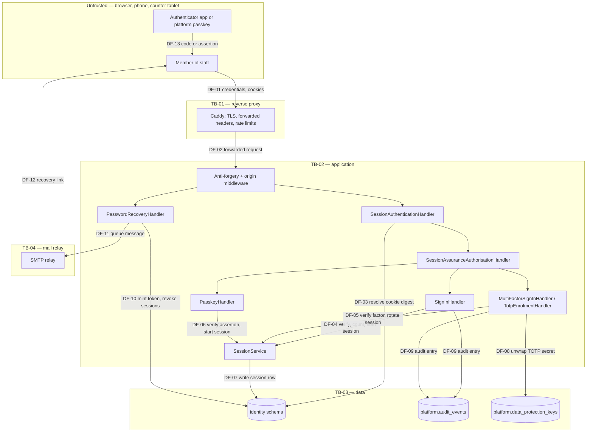

# Threat model — authentication, sessions, multi-factor and recovery

The argument that a member of staff who signs in to this system is who they say they are, that a session cannot be
taken from them, and that somebody who has stolen one of their credentials cannot use it to acquire the rest.

Every control in section 8 names the test that fails when it stops being true. Where a mitigation has no test, or
no implementation, it is not listed as a control — it is a residual risk in section 9, with an owner and a date.
There are nine, and the two worth reading first are **RR-04** (the data-protection key ring is stored unencrypted)
and **RR-07** (no endpoint demands a *recent* second factor yet).

---

## 1. Status and scope

| Field | Value |
| --- | --- |
| Flow modelled | Authentication: sign-in, the second-factor challenge, enrolment, passkeys, sessions and their revocation, password recovery, and the administrator reset that #25 will add |
| Status | **Reviewed** |
| Drafted | 2026-09-05, issue #23, wave W1 |
| Author | The #23 implementation stream |
| Reviewed by | The technical reviewer, standing in for the security owner until #56a appoints one |
| Review date | 2026-09-05 |
| Issues that change this flow | #24 (roles, effective permissions, `RequiresStepUp`, step-up re-authentication), #25 (administrator reset, invitation, suspension), #53 (API standards and the problem-details envelope), #59 (the data-protection key ring) |
| Architecture references | Plan Section 4.4 (the session and BFF design) and Section 4.6; [`../../architecture/module-ownership.md`](../../architecture/module-ownership.md) section 5.1 |
| Related architecture decision records | [`../../adr/0006-bff-cookie-session.md`](../../adr/0006-bff-cookie-session.md), [`../../adr/0001-modular-monolith.md`](../../adr/0001-modular-monolith.md) |
| Next review trigger | Any change to the session store, to what a session may reach before it has finished signing in, to the step-up rule, or to how a factor is enrolled — and OD-12 being decided against the A2 default |

---

## 2. What is in scope, and what is not

**In scope.** `POST /api/v1/auth/login`, `/mfa/challenge`, `/mfa/enrol`, `/mfa/enrol/confirm`,
`/mfa/recovery-codes`, `/passkeys/*`, `/recovery/request`, `/recovery/confirm`, `/logout`, `/logout-all`,
`GET /api/v1/me`, `GET|DELETE /api/v1/sessions`, the anti-forgery token endpoint, the session cookie and its
resolution on every request, and the `identity` schema tables that back all of them.

**Out of scope**, each with the reason and, where one exists, the model that will cover it:

| Not modelled here | Why | Covered by |
| --- | --- | --- |
| What a caller may do **once** authenticated — roles, effective permissions, branch reach | This model ends at "who is this"; that one begins at "and what may they touch". The ticket's permission set is empty until #24 fills it, so every `RequirePermission` endpoint denies today | `threat-models/authorisation.md` (#24) |
| The customer's expiring purpose-bound links | Customers hold no account (assumption A2), so nothing in this flow authenticates them | `threat-models/customer-links.md` (#56a) |
| TLS termination, the reverse proxy and the container runtime | Outside the application; the flow assumes TB-01 below terminates TLS and forwards a trustworthy client address | `threat-models/deployment.md` (#56a) |
| The mail relay's own security | Outside this system's control. What is modelled here is what a recovery message may contain and how long the token in it lives | `threat-models/deployment.md` (#56a) |
| The browser, the device and the authenticator application | Outside this system. RR-02 records what a compromised one costs | — |

**Assumptions this model rests on.**

| ID | Assumption | If it is false |
| --- | --- | --- |
| **AS-01** | Assumption **A2** of [`../../prd/assumptions-and-open-decisions.md`](../../prd/assumptions-and-open-decisions.md): staff-only, local accounts, password plus TOTP or passkeys, no customer accounts. **OD-12 is open**, and #23 shipped under this documented default | Federation moves authentication out of this system entirely. The session model, revocation, `Identity.Infrastructure/Security` and most of section 8 would be rewritten; this model would be superseded rather than amended |
| **AS-02** | TLS terminates at the reverse proxy and every response reaches the browser over HTTPS. The session and anti-forgery cookies are `Secure`, so nothing works at all if this is false | Every cookie in this flow is exposed in transit. Sections 6 and 8 assume it and do not restate it per row |
| **AS-03** | The client address the application sees has been set by the trusted proxy through forwarded headers. Both rate-limit partitions and the throttle key on it | A caller could choose its own partition and the per-address halves of CTL-05 and CTL-06 would count nothing. The per-account halves and CTL-07 would still bind |
| **AS-04** | One web replica, or sticky routing between the two requests of one WebAuthn ceremony | The passkey ceremony store is per instance (RR-03), so an assertion begun on one replica cannot be completed on another and passkey sign-in fails closed rather than open |
| **AS-05** | The data-protection key ring in `platform.data_protection_keys` is readable only by the application's database role | The ring is not itself encrypted (RR-04), so anybody who can read that table can decrypt every enrolled TOTP secret |

---

## 3. Assets

Classified against [`../../nfr/data-classification.md`](../../nfr/data-classification.md).

| ID | Asset | Class | Why it is worth attacking | Impact if lost, altered or disclosed |
| --- | --- | --- | --- | --- |
| **A-01** | The session cookie value, and the `identity.sessions` row it resolves to | Credentials and secrets | A copied value **is** the account for as long as the session lives | Full impersonation of a member of staff, with their branch reach, until the session is revoked or expires |
| **A-02** | Stored password hashes (`identity.user_credentials`) | Credentials and secrets | Offline cracking against a dump; reuse against other systems | Argon2id at m=19456, t=2, p=1 makes bulk cracking expensive but not impossible for weak passwords |
| **A-03** | The TOTP shared secret (`identity.totp_enrolments.protected_secret`) | Credentials and secrets | It generates the second factor for ever, silently | Whoever holds it can answer every future challenge; the holder sees nothing wrong |
| **A-04** | Recovery codes (`identity.recovery_codes`, hashed) and the sheet returned once in a response body | Credentials and secrets | Each one is a complete second factor, and they are written down by design | Second-factor bypass, plus a plausible reason for the real holder to find themselves locked out |
| **A-05** | Password-recovery tokens (`identity.recovery_tokens`, hashed) | Credentials and secrets | For its lifetime a token is a password with a timer on it | Account takeover from control of one mailbox — but not of the second factor, which recovery deliberately never touches |
| **A-06** | Remembered-device cookies (`identity.trusted_devices`, hashed) | Credentials and secrets | Skipping the challenge on later sign-ins | A stolen device cookie plus a stolen password reaches a complete session — but not one with a satisfied factor |
| **A-07** | The account directory: who works here, their sign-in names and addresses, and which accounts are locked out | Personal | Target selection for phishing and stuffing; confirming a lockout attack landed | Not a takeover on its own, and it is what makes every other attack in this model cheaper |
| **A-08** | The `platform.audit_events` chain for identity actions | Internal, append-only | An attacker would rather not be in it | Repudiation, and an investigation that cannot answer "what did this person do" |
| **A-09** | The data-protection key ring (`platform.data_protection_keys`) | Credentials and secrets | It unwraps every A-03 | Every enrolled authenticator secret in the deployment, at once |

---

## 4. Data flow diagram and trust boundaries

| ID | Trust boundary | What changes when it is crossed |
| --- | --- | --- |
| **TB-01** | Internet to reverse proxy | Everything becomes attacker controlled. TLS terminates; the client address becomes a forwarded header the application trusts (AS-03); per-address rate limits apply |
| **TB-02** | Proxy to application | The origin check and the anti-forgery pair run before any handler. The session cookie is resolved to a row; nothing the cookie itself carries is believed |
| **TB-03** | Application to database | Only digests of credentials cross this boundary in the outbound direction. The audit chain is append-only and hash-chained by a trigger |
| **TB-04** | Application to mail relay | A recovery token leaves the system in a message body. It is the only credential in this flow that travels somewhere the system cannot revoke |

| ID | Data flow | Carries | Protection in transit | Authenticated as |
| --- | --- | --- | --- | --- |
| **DF-01** | Browser to proxy | Password, TOTP code, recovery code, session and device cookies, anti-forgery pair | TLS 1.2+ (AS-02) | Anonymous, a half session, or a complete one |
| **DF-03** | Handler to `identity.sessions` | SHA-256 digest of the presented cookie value | In-cluster | The application's database role |
| **DF-08** | Enrolment to the key ring | The wrapped TOTP secret | In-cluster | The application's database role — see RR-04 |
| **DF-11/12** | Application to relay to inbox | An absolute recovery link containing a 256-bit token | TLS to the relay; **beyond the relay, unknown** | Nobody. Possession of the inbox is the whole authentication (TM-014) |
| **DF-13** | Authenticator to person | A six-digit code, or a WebAuthn assertion bound to the origin | Out of band | The device's own user verification |

---

## 5. Actors, entry points and privileges

| Actor | Trust level | Reaches this flow through | Privileges it should have | Privileges it must never have |
| --- | --- | --- | --- | --- |
| Anonymous caller | Untrusted | `/login`, `/passkeys/assert*`, `/recovery/*`, `/antiforgery` | Attempt to authenticate, at a bounded rate | Learn whether an account exists; learn whether one is locked out; start a session it has not authenticated |
| **Half-signed-in holder** | Has proved a password and nothing else | The four endpoints below | Finish signing in, read its own profile, sign itself out | Anything that mints, discloses or replaces credential material; ending anybody's other sessions; the session inventory |
| Signed-in holder | Sign-in finished, no factor satisfied on this session | Self-service endpoints | Its own profile, its own sessions, sign out everywhere, enrol a first factor | Change a factor on an account that already holds one |
| Holder with a satisfied factor | Answered a challenge, or asserted a passkey | All of the above | Print a new sheet of recovery codes; remove a passkey | Leave the account with no factor at all |
| Administrator (#25) | Signed in, holds `admin.*`, under step-up | Administration endpoints | Reset somebody's second factor, with a mandatory reason | Read a secret, a hash, a code or a token; act without an audit entry |

| Entry point | Method and route | Authentication | Authorisation | Rate limited |
| --- | --- | --- | --- | --- |
| Sign in | `POST /api/v1/auth/login` | None, by necessity | `AllowAnonymousWithJustification` | Per address, plus the credential throttle per account and per address |
| Passkey assertion | `POST /api/v1/auth/passkeys/assert[/options]` | None, by necessity | `AllowAnonymousWithJustification` | Per address |
| Recovery request and confirm | `POST /api/v1/auth/recovery/{request,confirm}` | None, by necessity | `AllowAnonymousWithJustification` | Per address and per account |
| Second-factor challenge | `POST /api/v1/auth/mfa/challenge` | Session cookie | `AllowPendingSignIn` | Per address, plus the throttle per account |
| Sign out | `POST /api/v1/auth/logout` | Session cookie | `AllowPendingSignIn` | Write policy |
| Own profile | `GET /api/v1/me` | Session cookie | `AllowPendingSignIn` | Default user policy |
| Enrol an authenticator | `POST /api/v1/auth/mfa/enrol[/confirm]` | Session cookie | `AllowPendingSignIn` **plus** the handler's factor guard | Write / challenge policy |
| Print recovery codes | `POST /api/v1/auth/mfa/recovery-codes` | Session cookie | `RequireSatisfiedSecondFactor` | Write policy |
| Register a passkey | `POST /api/v1/auth/passkeys/register[/options]` | Session cookie | `RequireSignedInHolder` **plus** the handler's factor guard | Write policy |
| Remove a passkey | `DELETE /api/v1/auth/passkeys/{id}` | Session cookie | `RequireSatisfiedSecondFactor` | Write policy |
| List passkeys | `GET /api/v1/auth/passkeys` | Session cookie | `RequireSignedInHolder` | Default user policy |
| Sign out everywhere | `POST /api/v1/auth/logout-all` | Session cookie | `RequireSignedInHolder` | Write policy |
| Session inventory and revoke | `GET|DELETE /api/v1/sessions[/{id}]` | Session cookie | `RequireSignedInHolder` | Default / write policy |

### 5.1 The trust ladder, stated once

This table is the one an attacker reads first, and writing it out is what made TM-001 obvious. Four levels, each
strictly stronger than the last:

| Level | What has been proved | Declared as | What it reaches |
| --- | --- | --- | --- |
| **L0 Anonymous** | Nothing | `AllowAnonymousWithJustification` | Sign in, assert a passkey, ask for a recovery link, fetch an anti-forgery pair |
| **L1 Half session** | A password | `AllowPendingSignIn` | `/mfa/challenge`, `/mfa/enrol[/confirm]`, `GET /me`, `/logout` — **and nothing else** |
| **L2 Sign-in complete** | A password, and nothing further is owed | `RequireSignedInHolder` | Own sessions, sign out everywhere, list passkeys, register the account's first passkey |
| **L3 Factor satisfied** | A second factor, on **this** session | `RequireSatisfiedSecondFactor` | Print recovery codes, remove a passkey, change a factor on an account that has one |

An account with no confirmed factor reaches L2 by signing in, and may enrol its first factor there — that narrow
exception is decided in the handler from `StaffUser.HasConfirmedSecondFactor`, never from a step the client claims
to have reached. See CTL-01 and CTL-02.

---

## 6. STRIDE analysis

| ID | Element | Category | Threat | Likelihood | Impact | Controls | Residual |
| --- | --- | --- | --- | --- | --- | --- | --- |
| **TM-001** | L1 half session | Elevation of privilege | An attacker with a stuffed or phished password signs in, prints the account a fresh sheet of recovery codes, and answers the challenge with one of them — destroying the holder's own sheet on the way past | high | high | CTL-01, CTL-02, CTL-03 | — |
| **TM-002** | L1 half session | Elevation of privilege | The same attacker enrols their own authenticator, or registers their own passkey, against the victim's account | high | high | CTL-01, CTL-02 | — |
| **TM-003** | `StaffUser.RemovePasskey` | Elevation of privilege | An attacker removes the account's passkeys one at a time until nothing but the password is left, then signs in with the password alone | medium | high | CTL-04, CTL-03 | — |
| **TM-004** | `POST /login` | Information disclosure | The response time distinguishes a known account from an unknown one, giving a directory of who works here and which accounts are locked out | high | medium | CTL-05, CTL-06 | RR-01 |
| **TM-005** | `POST /login` | Information disclosure | The response body or status distinguishes wrong password, unknown account, suspended, invited and locked out | high | medium | CTL-07 | — |
| **TM-006** | `POST /login` | Denial of service, elevation | Credential stuffing: a breach corpus tried across many accounts from rotating addresses | high | high | CTL-08, CTL-09, CTL-10 | RR-01 |
| **TM-007** | Session cookie | Spoofing | A value planted in the victim's browser before they sign in is still the value in use afterwards (session fixation) | medium | high | CTL-11 | — |
| **TM-008** | Session cookie | Spoofing | A cookie captured or read by script is replayed | medium | high | CTL-12, CTL-13, AS-02 | RR-02 |
| **TM-009** | `identity.sessions` | Tampering | A stolen database dump yields usable tickets | low | high | CTL-14 | — |
| **TM-010** | Any state-changing endpoint | Spoofing | A request forged from another origin rides the browser's cookie — planting the attacker's account in the victim's browser at `/login`, or acting as the victim elsewhere | medium | high | CTL-15, CTL-16 | — |
| **TM-011** | Revocation | Elevation of privilege | A session revoked elsewhere — sign out everywhere, a suspended account, an administrator — keeps working | medium | high | CTL-17, CTL-18 | — |
| **TM-012** | Session lifetime | Elevation of privilege | An unattended counter tablet is used by whoever sits down next; or repeated rotation extends a session indefinitely | medium | medium | CTL-19, CTL-20 | RR-02 |
| **TM-013** | `/recovery/request` | Information disclosure | The response, or its timing, says whether an address belongs to an account | high | medium | CTL-21, CTL-22 | — |
| **TM-014** | `/recovery/confirm` | Elevation of privilege | Somebody who can read the mailbox — or who intercepts the link — takes over the account outright | medium | high | CTL-23, CTL-24, CTL-25, CTL-26 | RR-05 |
| **TM-015** | Recovery link in transit | Information disclosure | The link is sent over plain HTTP because the deployment copied the development setting | medium | high | CTL-27 | — |
| **TM-016** | `/mfa/challenge` | Elevation of privilege | A recovery code is replayed, or a TOTP code is used twice within its step | medium | high | CTL-28, CTL-29 | — |
| **TM-017** | `/mfa/challenge` | Denial of service | Multi-factor fatigue: an attacker with the password repeatedly triggers challenges, or guesses six digits at volume | medium | medium | CTL-09, CTL-30 | — |
| **TM-018** | Trusted device | Elevation of privilege | A remembered device is treated as having passed the challenge, so a shared counter tablet reaches what multi-factor gates | medium | high | CTL-31, CTL-32 | — |
| **TM-019** | Passkey assertion | Spoofing | A captured assertion is replayed, or a cloned authenticator is used | low | high | CTL-33, CTL-34, CTL-35 | — |
| **TM-020** | TOTP secret at rest | Information disclosure | Whoever reads `identity.totp_enrolments` can generate the second factor for every enrolled account | low | high | CTL-36 | **RR-04** |
| **TM-021** | Audit trail | Repudiation | An attacker enrols a factor or reprints a sheet and the action leaves no trace, so the holder's own sheet stops working with no explanation | high | medium | CTL-37, CTL-38, CTL-39 | — |
| **TM-022** | Logs and telemetry | Information disclosure | A password, a code, a token or a cookie value reaches a log line, a trace attribute or a problem-details body | medium | high | CTL-40, CTL-41 | — |
| **TM-023** | Deny-by-default register | Elevation of privilege | An endpoint ships with no policy, or with a justification citing a review that never happened | medium | high | CTL-42, CTL-43 | — |
| **TM-024** | Administrator reset (#25) | Elevation of privilege | An administrator, or somebody using an administrator's unattended session, clears a second factor and takes the account | low | high | CTL-04 (partial) | **RR-06** |
| **TM-025** | `/mfa/recovery-codes`, `/passkeys/register` | Elevation of privilege | Somebody who sits down at an unattended screen whose holder answered a factor hours ago mints themselves a credential that outlives their access to the screen | medium | high | CTL-03 (partial) | **RR-07** |
| **TM-026** | Passkey ceremony store | Denial of service, spoofing | A ceremony begun on one replica is completed on another; or a challenge is reused | low | medium | CTL-34 | **RR-03** |
| **TM-027** | Outbound mail queue | Denial of service | The in-process queue is lost on restart, so recovery messages are silently not sent | medium | medium | CTL-44 | **RR-08** |
| **TM-028** | `/login` throttle | Denial of service | Two spellings of one account — the sign-in name and the address — each get their own budget, doubling the attempts allowed | low | low | CTL-45, CTL-46 | — |

**Recorded negatives**, so the next reader does not re-derive them: there is no *tampering* threat against the
session row from the client, because the client holds nothing but an opaque value and every fact is re-read
server-side; there is no *spoofing* threat from claims, because the ticket carries none; and there is no
*repudiation* threat against sign-in attribution any more, because the entry names the account explicitly rather
than deferring to a request context in which nobody is yet authenticated (CTL-39).

---

## 7. Abuse cases

| ID | Abuse case | Actor and motive | Steps | Defeated by | Test |
| --- | --- | --- | --- | --- | --- |
| **AB-01** | **Second-factor bypass with the password alone** | Somebody holding a stuffed or phished password | Sign in → `POST /mfa/recovery-codes` → read the sheet from the response → `POST /mfa/challenge` with one of the codes → a session with both factors satisfied, and the holder's own sheet destroyed | CTL-01, CTL-02, CTL-03 | `HalfSignedInSessionTests.APasswordOnlySessionCannotPrintItselfASheetOfRecoveryCodes` |
| **AB-02** | **Enrol your own authenticator** | The same attacker, on an account whose only factor is a passkey | Sign in → `POST /mfa/enrol` → `POST /mfa/enrol/confirm` with a code from their own phone → a fresh sheet of recovery codes as a bonus | CTL-01, CTL-02 | `HalfSignedInSessionTests.APasswordOnlySessionCannotEnrolAnAuthenticatorOfItsOwn`, `MfaEnrolmentTests.AnAuthenticatorCannotBeSwappedOnceItIsConfirmed` |
| **AB-03** | **Register your own passkey** | The same attacker | Sign in → `POST /passkeys/register/options` → `POST /passkeys/register` → assert with it, arriving at a session with both factors satisfied in one step | CTL-01, CTL-02 | `HalfSignedInSessionTests.APasswordOnlySessionCannotRegisterAPasskeyOrListWhatIsRegistered` |
| **AB-04** | **Strip the account of its factors** | The same attacker | Sign in → `GET /passkeys` → `DELETE /passkeys/{id}` for each → the next password-only sign-in completes with no challenge at all | CTL-03, CTL-04 | `MultiFactorTests.TheLastFactorCannotBeRemovedFromAnAccountThatHasOne`, `HalfSignedInSessionTests.APasswordOnlySessionCannotRegisterAPasskeyOrListWhatIsRegistered` |
| **AB-05** | **Credential stuffing** | An external attacker with a breach corpus | Automated attempts across many accounts from rotating addresses | CTL-08, CTL-09, CTL-10 | `AuthenticationEndpointTests.FiveWrongPasswordsLockTheAccountWithoutSayingSo`, `AuthenticationEndpointTests.TheThrottleRefusesFurtherAttemptsWithARetryAfterTheClientCanObey`, `LockoutPolicyTests.TheLockoutDoublesWithEachFurtherFailure` |
| **AB-06** | **Enumerate the staff directory** | The same attacker, choosing targets, or confirming that a lockout attack landed | Submit names and addresses and read the difference — in the body, the status, or the clock | CTL-05, CTL-06, CTL-07 | `AuthenticationEndpointTests.AWrongPasswordAndAnUnknownAccountAreAnsweredIdentically`, `AuthenticationEndpointTests.AWrongPasswordAndAnUnknownAccountTakeTheSameTimeToAnswer`, `AuthenticationEndpointTests.ASuspendedAccountIsRefusedTheSameWayAWrongPasswordIs` |
| **AB-07** | **Recovery-token interception** | Somebody with access to the mailbox, a forwarding rule, or a link scanner that follows URLs | Ask for a link for the victim's address, read it, set a password | CTL-23, CTL-24, CTL-25, CTL-26 | `PasswordRecoveryTests.ALinkWorksOnceAndThenStopsWorking`, `PasswordRecoveryTests.AnExpiredLinkIsRefused`, `RecoveryAndMultiFactorPersistenceTests.AResetChangesThePasswordAndLeavesTheAuthenticatorAndItsCodesUntouched`, `PasswordRecoveryTests.TheSignInAfterAResetStillHasToAnswerTheAuthenticator` |
| **AB-08** | **Multi-factor fatigue** | An attacker with the password, hoping the holder eventually types a code or approves out of irritation | Trigger the challenge repeatedly | CTL-09, CTL-30 | `CredentialThrottleTests.AnAttemptIsAllowedUntilTheAccountsLimitIsReached`, `MultiFactorEndpointTests.AWrongCodeIsRefusedWithoutSayingWhichFactorWasCloser` |
| **AB-09** | **Session fixation** | An attacker who can set a cookie on the victim's browser — a shared machine, a cookie-tossing subdomain, a link | Plant a known session value, wait for the victim to sign in, then use it | CTL-11 | `SessionLifecycleTests.TheSessionIdentifierChangesWhenTheHolderAuthenticates`, `AuthenticationEndpointTests.SigningInReplacesAnyTicketThePersonWasAlreadyHolding` |
| **AB-10** | **Step-up bypass** | Somebody at an unattended, signed-in counter tablet | Use the screen as it stands to reach something that should demand a fresh proof | CTL-19, CTL-31, CTL-32; **partially unmitigated** | `SessionTests.StepUpFreshnessExpiresWithTheWindow`, `MultiFactorTests.ARememberedDeviceDoesNotCountAsAStrongAuthentication`, `SessionLifecycleTests.ARotationThatIsNotAStrongFactorLeavesTheStepUpWindowAlone` — and **RR-07** for what is not covered |
| **AB-11** | **Administrator reset misuse** | An administrator acting outside their remit, or somebody using an administrator's session | Reset a member of staff's second factor, then sign in as them with a recovered password | CTL-04, and #25's mandatory reason, session revocation and alert | **No test — #25 owns the endpoint.** RR-06 |
| **AB-12** | **Cross-site sign-in** | An attacker who wants the victim's work recorded against an account the attacker controls | Forge a sign-in from another origin so the victim's browser holds the attacker's session | CTL-15, CTL-16 | `AuthenticationEndpointTests.AForgedSignInFromAnotherOriginIsRefusedBeforeTheCredentialsAreRead`, `CrossSiteDefenceTests.ACrossSiteStateChangeIsRefusedBeforeTheTokenIsEvenConsidered` |
| **AB-13** | **Replay a revoked ticket** | Somebody holding a cookie the holder has since signed out of | Present the old value on the next request | CTL-17, CTL-18 | `SessionLifecycleTests.ARevokedSessionIsRefusedOnTheVeryNextRequest`, `AuthenticationEndpointTests.SigningOutClearsTheCookieAndTheOldTicketStopsWorkingImmediately` |

---

## 8. Controls, and the test that proves each one

| ID | Control | Type | Where it lives | Test that fails if it is removed |
| --- | --- | --- | --- | --- |
| **CTL-01** | A session records what it still owes (`Session.PendingStep`), and a session that owes anything reaches only `/mfa/challenge`, `/mfa/enrol[/confirm]`, `GET /me` and `/logout` | Preventive | `Session`, `SessionAssuranceAuthorisationHandler`, `SelfServiceEndpointExtensions` | `HalfSignedInSessionTests.APasswordOnlySessionCanOnlyFinishSigningInOrEndItself`, `AuthorisationTests.AHalfSignedInSessionSatisfiesOnlyTheWeakestLevel` |
| **CTL-02** | A factor may not be added or replaced on an account that already holds one unless the session making the request has satisfied it — decided from `StaffUser.HasConfirmedSecondFactor`, not from the client | Preventive | `TotpEnrolmentHandler.MayNotChangeFactors`, `PasskeyHandler.MayNotChangeFactors` | `HalfSignedInSessionTests.APasswordOnlySessionCannotEnrolAnAuthenticatorOfItsOwn`, `MfaEnrolmentTests.AnAuthenticatorCannotBeSwappedOnceItIsConfirmed` |
| **CTL-03** | Printing recovery codes and removing a passkey demand a satisfied second factor on this session | Preventive | `RequireSatisfiedSecondFactor` on the routes; `TotpEnrolmentHandler.ReissueRecoveryCodesAsync` | `HalfSignedInSessionTests.APasswordOnlySessionCannotPrintItselfASheetOfRecoveryCodes`, `MfaEnrolmentTests.APasswordOnlySessionCannotPrintAFreshSheetOfRecoveryCodes` |
| **CTL-04** | The domain refuses to remove the last remaining factor from an account that has one, whatever any policy says | Preventive | `StaffUser.RemovePasskey` | `MultiFactorTests.TheLastFactorCannotBeRemovedFromAnAccountThatHasOne` |
| **CTL-05** | An unusable account is verified against a decoy hash derived **once for the process**, so both branches cost exactly one Argon2id verification | Preventive | `IDecoyCredential` / `DecoyCredential`, registered singleton | `AuthenticationEndpointTests.AWrongPasswordAndAnUnknownAccountTakeTheSameTimeToAnswer` |
| **CTL-06** | The whole sign-in is held to a uniform response floor, covering the aggregate load and the failure write that only the known branch performs | Preventive | `SignInTimingOptions.UniformResponseTime`, `UniformResponseTime` | Same test |
| **CTL-07** | Every sign-in refusal returns `identity.invalid-credentials` with a byte-identical body | Preventive | `SignInHandler` | `AuthenticationEndpointTests.AWrongPasswordAndAnUnknownAccountAreAnsweredIdentically`, `AuthenticationEndpointTests.ASuspendedAccountIsRefusedTheSameWayAWrongPasswordIs` |
| **CTL-08** | Argon2id at m=19456, t=2, p=1, with a per-password salt | Preventive | `Argon2idPasswordHasher` | `Argon2idPasswordHasherTests` |
| **CTL-09** | A credential throttle per account and per address, checked **before** the hash | Preventive | `CredentialThrottle`, checked in the endpoint | `CredentialThrottleTests.AnAttemptIsAllowedUntilTheAccountsLimitIsReached`, `AuthenticationEndpointTests.TheThrottleRefusesFurtherAttemptsWithARetryAfterTheClientCanObey` |
| **CTL-10** | A progressive account lockout that survives a restart, because it is a column | Preventive | `LockoutPolicy`, `StaffUser.RecordFailedSignIn` | `LockoutPolicyTests.TheLockoutDoublesWithEachFurtherFailure`, `AuthenticationEndpointTests.FiveWrongPasswordsLockTheAccountWithoutSayingSo` |
| **CTL-11** | Any ticket presented before authentication is revoked in the same unit of work as the new one is created, and the session is rotated at every step that raises what it can do | Preventive | `SessionService.StartAsync`, `RotateAsync` | `SessionLifecycleTests.TheSessionIdentifierChangesWhenTheHolderAuthenticates`, `AuthenticationEndpointTests.SigningInReplacesAnyTicketThePersonWasAlreadyHolding` |
| **CTL-12** | The session cookie is `__Host-` prefixed, `HttpOnly`, `Secure`, `SameSite=Lax`, path `/` | Preventive | `SessionCookie` | `SessionCookieTests`, `AuthenticationEndpointTests.SigningInIssuesAHostPrefixedCookieAndReturnsNoTokenInTheBody` |
| **CTL-13** | The cookie value never appears in a response body, a log line or a problem-details document | Preventive | `SignInHandler`, `SessionAuthenticationHandler`, `LogRedaction` | `AuthenticationEndpointTests.SigningInIssuesAHostPrefixedCookieAndReturnsNoTokenInTheBody`, `LogRedactionTests` |
| **CTL-14** | Only the SHA-256 digest of the cookie value is stored, enforced by a database check constraint | Preventive | `Session`, `HashedSecret`, `ck_sessions_token_hash_is_digest` | `SessionLifecycleTests.OnlyTheDigestOfTheCookieValueIsEverStored`, `SessionTests.ARawTicketValueCannotBeStored` |
| **CTL-15** | An anti-forgery token pair is required on every state-changing request, including sign-in | Preventive | `AntiforgeryEnforcementMiddleware` | `CrossSiteDefenceTests.AStateChangingRequestWithoutATokenIsRefused`, `CrossSiteDefenceTests.ATokenWithoutItsCookieHalfIsRefused` |
| **CTL-16** | The `Origin` and `Sec-Fetch-Site` check runs before the token is even considered | Preventive | `OriginValidationMiddleware` | `CrossSiteDefenceTests.ACrossSiteStateChangeIsRefusedBeforeTheTokenIsEvenConsidered`, `AuthenticationEndpointTests.AForgedSignInFromAnotherOriginIsRefusedBeforeTheCredentialsAreRead` |
| **CTL-17** | Revocation is checked on every request, against the row, with no cached copy to go stale | Detective / preventive | `SessionTicketStore.ResolveAsync` | `SessionLifecycleTests.ARevokedSessionIsRefusedOnTheVeryNextRequest`, `SessionAuthenticationHandlerTests.ARevokedCookieIsRefusedAndClearedOnTheNextRequest` |
| **CTL-18** | A session on an account that is no longer active is revoked when it is next presented | Corrective | `SessionTicketStore.ResolveAsync` | `SessionLifecycleTests.ASessionOnASuspendedAccountIsRefusedAndEnded` |
| **CTL-19** | An inactivity timeout and an absolute lifetime, and rotation carries the original absolute expiry so repeated rotation cannot extend it | Preventive | `Session.Touch`, `RotateTo` | `SessionLifecycleTests.WorkingSteadilySlidesTheDeadlineButNotPastTheAbsoluteLifetime`, `SessionTests.RotationCarriesTheOriginalAbsoluteExpiryIntoTheReplacement` |
| **CTL-20** | An expired session cannot be revived by using it, and revocation is final | Preventive | `Session.Touch`, `Revoke` | `SessionTests.AnExpiredSessionCannotBeRevivedByUsingIt`, `SessionTests.RevocationIsFinal` |
| **CTL-21** | A recovery request answers identically for a known and an unknown address, in the same words and the same object | Preventive | `PasswordRecoveryHandler`, `RecoveryEndpoints` | `PasswordRecoveryTests.AKnownAndAnUnknownAddressAreAnsweredIdentically`, `MultiFactorEndpointTests.ARecoveryRequestAnswersIdenticallyForAKnownAndAnUnknownAddress` |
| **CTL-22** | Both branches are held to a timing floor, and the message is queued rather than sent inside it | Preventive | `UniformResponseTime`, `RecoveryOptions.UniformResponseTime` | `PasswordRecoveryTests.TheRequestTakesTheSameTimeWhicheverBranchItRuns` |
| **CTL-23** | A recovery token is 256 bits of server entropy, stored only as its digest, and works exactly once | Preventive | `RecoveryTokenService`, `RecoveryToken.Consume` | `RecoveryTokenTests.AMintedTokenIsUrlSafeRandomnessAndIsStoredOnlyAsItsDigest`, `RecoveryTokenTests.ATokenIsSpentExactlyOnce`, `PasswordRecoveryTests.ALinkWorksOnceAndThenStopsWorking` |
| **CTL-24** | The lifetime is capped at one hour by the domain, whatever configuration says, and enforced again by a check constraint | Preventive | `RecoveryToken`, `ck_recovery_tokens_lifetime` | `RecoveryTokenTests.ALifetimeLongerThanAnHourIsRefusedHoweverItWasConfigured`, `PasswordRecoveryTests.AnExpiredLinkIsRefused` |
| **CTL-25** | Asking again withdraws the outstanding link | Preventive | `IIdentityStore.InvalidateOutstandingRecoveryTokensAsync` | `PasswordRecoveryTests.AskingAgainWithdrawsTheLinkThatWasSentFirst`, `RecoveryAndMultiFactorPersistenceTests.AskingForASecondLinkWithdrawsTheFirstInTheDatabase` |
| **CTL-26** | **Completing a reset changes the password and nothing else** — the authenticator, the recovery codes and the passkeys are untouched, so control of a mailbox is not control of an account | Preventive | `PasswordRecoveryHandler.ConfirmAsync` | `RecoveryAndMultiFactorPersistenceTests.AResetChangesThePasswordAndLeavesTheAuthenticatorAndItsCodesUntouched`, `PasswordRecoveryTests.TheSignInAfterAResetStillHasToAnswerTheAuthenticator` |
| **CTL-27** | The recovery link's public origin must be an absolute `https` URI, validated at start-up; plain HTTP requires an explicit opt-out that exists for a developer's loopback | Preventive | `RecoveryOptions.IsPublicBaseUrlUsable`, wired through `.Validate(…).ValidateOnStart()`. Note that the command-line tool builds its host without starting it, so the check binds the web host and the worker — the two that send mail — and not `migrate`, which never reads the setting | `PasswordRecoveryTests.ThePublicOriginMustBeAnAbsoluteHttpsAddress`, `PasswordRecoveryTests.TheMessageCarriesAnAbsoluteLinkAndNothingElseOfValue` |
| **CTL-28** | A recovery code is spent exactly once, and an unknown code and a spent one fail identically | Preventive | `StaffUser.RedeemRecoveryCode` | `MultiFactorEndpointTests.ARecoveryCodeCannotBeSpentTwice`, `RecoveryAndMultiFactorPersistenceTests.ARecoveryCodeSpentInOneRequestIsStillSpentInTheNext` |
| **CTL-29** | A TOTP code from a step already accepted is refused | Preventive | `TotpEnrolment.Confirm`, `MfaChallengeService` | `MultiFactorTests.ACodeFromAStepAlreadyUsedIsRefused` |
| **CTL-30** | A wrong second factor is refused without saying which factor was closer, and is counted against the account and the address rather than locking the account | Preventive | `MultiFactorSignInHandler` | `MultiFactorEndpointTests.AWrongCodeIsRefusedWithoutSayingWhichFactorWasCloser` |
| **CTL-31** | A remembered device skips the challenge and never satisfies it: the session it starts carries `MfaSatisfied = false` | Preventive | `SessionService.StartAsync`, `SignInHandler` | `SessionLifecycleTests.ARememberedDeviceSkipsTheChallengeWithoutPassingIt`, `MultiFactorTests.ARememberedDeviceDoesNotCountAsAStrongAuthentication` |
| **CTL-32** | A device may be remembered for at most thirty days, enforced by the domain and again by a check constraint | Preventive | `TrustedDevice`, `ck_trusted_devices_lifetime` | `MultiFactorTests.ADeviceCannotBeRememberedForLongerThanThirtyDays` |
| **CTL-33** | A passkey whose signature counter did not advance is refused, and the refusal is audited under its own action | Detective / preventive | `PasskeyCredential.RecordUse`, `PasskeyHandler` | `MultiFactorTests.APasskeyWhoseCounterDidNotAdvanceIsRefused` |
| **CTL-34** | A ceremony challenge is 256 bits held server-side, spent on first use, and bound to the session that started it | Preventive | `PasskeyCeremonyStore` | `PasskeyCeremonyStoreTests.ACeremonyIssuedToOneSessionCannotBeCompletedByAnother`, `PasskeyCeremonyStoreTests.ACeremonyIsSpentOnItsFirstAnswerRightOrWrong` |
| **CTL-35** | The same passkey cannot be registered twice, on one account or across accounts | Preventive | `StaffUser.RegisterPasskey`, `Fido2PasskeyCeremony` | `MultiFactorTests.TheSamePasskeyCannotBeRegisteredTwice` |
| **CTL-36** | The TOTP secret is wrapped with data protection rather than stored in the clear, and an unreadable secret is reported as a server problem rather than a wrong code | Preventive | `DataProtectionSecretProtector` | `MfaEnrolmentTests.ASecretThatCannotBeUnwrappedIsReportedAsAServerProblemNotAWrongCode`, `MfaEnrolmentTests.EnrolmentOffersTheLinkAndTheTypeableKeyAndStoresNeitherInTheClear` |
| **CTL-37** | Enrolment, confirmation and reprinting recovery codes each write an audit entry through `IAuditWriter` | Detective | `TotpEnrolmentHandler` | `HalfSignedInSessionTests.EnrolmentAndReprintingRecoveryCodesLeaveAnAuditTrail`, `MfaEnrolmentTests.EnrolmentAndReissueAreBothRecordedInTheAuditTrail` |
| **CTL-38** | Asking for a recovery link and completing a reset each write an audit entry, attributed to the account rather than to `system` | Detective | `PasswordRecoveryHandler` | `PasswordRecoveryTests.AskingForALinkAndCompletingAResetAreBothWrittenToTheAuditTrail`, `HalfSignedInSessionTests.AskingForARecoveryLinkIsAuditedAgainstTheAccount` |
| **CTL-39** | A sign-in is attributed to the account that signed in, not to `system`, so an actor query finds it | Detective | `AuditEntry.ActorId`, `SignInHandler.RecordAsync` | `HalfSignedInSessionTests.ASignInIsAttributedToTheAccountThatSignedInRatherThanToTheSystem` |
| **CTL-40** | No credential reaches a log line, a trace attribute or an audit entry; `LogRedaction` masks by property name | Preventive | `LogRedaction`, `IdentityLog`, `AuthenticationLog` | `LogRedactionTests`, `AuthenticationEndpointTests.AFailedSignInIsAuditedAgainstTheAccountWithoutRecordingWhatWasTyped` |
| **CTL-41** | Every refusal is an RFC 9457 problem document carrying a stable code and the correlation identifier — never a stack trace or an exception message | Preventive | `Problems`, `SecurityProblemDetails`, `AuthorisationProblemResultHandler` | `CrossSiteDefenceTests.ARefusalIsAProblemDetailsBodyCarryingTheCorrelationIdentifier`, `HalfSignedInSessionTests.APasswordOnlySessionCannotPrintItselfASheetOfRecoveryCodes` |
| **CTL-42** | Every endpoint declares an authorisation policy or a justified anonymous exposure (ARCH-007), and every state-changing endpoint declares its audit action (ARCH-008) | Preventive | `EndpointAuthorisationExtensions`, `SelfServiceEndpointExtensions` | `EndpointPolicyTests.Arch007_EveryEndpointDeclaresAPolicyOrAJustifiedAnonymousExposure`, `EndpointPolicyTests.Arch008_EveryStateChangingEndpointIsAudited` |
| **CTL-43** | Every such declaration cites where the exposure was reviewed, and the citation must resolve to a document that exists | Preventive | `EndpointReviewCitationTests` | `EndpointReviewCitationTests.EveryReviewCitationNamesADocumentThatExists` |
| **CTL-44** | A relay that is not accepting messages does not change the answer the caller gets | Preventive | `IdentityMailer`, `ChannelEmailDispatchQueue` | `PasswordRecoveryTests.ARelayThatIsNotAcceptingMessagesDoesNotChangeTheAnswerTheCallerGets` |
| **CTL-45** | The throttle is keyed on the normalised identifier, decided in one place shared with the directory lookup | Preventive | `SignInIdentifier.Normalise` | `CredentialThrottleTests.TheAccountKeyIsCaseAndWhitespaceInsensitive` |
| **CTL-46** | Attempts are counted again against the account the directory resolved, so a sign-in name and an address share one budget | Preventive | `SignInHandler.RecordAttemptFailure` and its second throttle check | `CredentialThrottleTests.TheAccountsCounterIsSharedAcrossAddresses` (the mechanism); **no end-to-end test of the alias case — see RR-09** |

---

## 9. Residual risk

| ID | Residual risk | Threats | Why it is not fully mitigated | Rating | Owner | Accepted on | Review by | Waiver |
| --- | --- | --- | --- | --- | --- | --- | --- | --- |
| **RR-01** | The timing floor and the shared decoy make the branches indistinguishable in a handful of samples, not in a million. A patient attacker with a very large sample could still separate them | TM-004, TM-006 | A floor is a mitigation, not a proof. What bounds the sample count is CTL-09 and CTL-10, which is where the guarantee actually rests | low | Technical reviewer | 2026-09-05 | Any change to the sign-in path's work | — |
| **RR-02** | A stolen unlocked device with a live session acts as that member of staff until the inactivity timeout, the absolute lifetime or a revocation | TM-008, TM-012 | Device security is outside this system. The mitigations are a short inactivity timeout and self-service revocation, both of which exist; a timeout short enough to defeat this outright was rejected as unworkable at a counter | medium | Owner | 2026-09-05 | OD-12, which settles the shared-device question | — |
| **RR-03** | The WebAuthn ceremony store is per instance, so a deployment behind more than one web replica needs sticky routing for the two requests of one ceremony, or passkey sign-in fails | TM-026 | A shared store is a dependency this deployment does not have yet. It fails closed — the assertion is refused, not accepted | low | Technical reviewer | 2026-09-05 | The first multi-replica deployment | — |
| **RR-04** | **The data-protection key ring is stored unencrypted.** `AddTailor360DataProtection` persists it to `platform.data_protection_keys` and nothing calls `ProtectKeysWith…`, because no certificate is provisioned. Anybody who can read that table can decrypt every enrolled TOTP secret | TM-020 | Provisioning and rotating a key-encryption certificate is deployment work owned by #59 | **medium** | Technical reviewer | 2026-09-05 | #59 | Listed in [`../../process/waivers.md`](../../process/waivers.md) section 4.2 as a known gap needing a row at the first release; no waiver is granted yet, because a waiver is granted against a release and none has been made |
| **RR-05** | Somebody who controls the mailbox can set a password. They cannot reach the account, because the second factor is untouched — but on an account with **no** second factor, mailbox control is account control | TM-014 | Requiring a second factor of every account is OD-12's decision, not this issue's. The MFA-required set is configured in `Identity:Mfa` and defaults to Owner, Admin and Cashier plus `admin.*`/`billing.*` holders once #24 supplies roles | medium | Owner | 2026-09-05 | OD-12 and #24 | — |
| **RR-06** | **The administrator reset is not built or tested here.** #25 owns it. Until then nothing can clear a second factor, which is the fail-closed direction and also means a genuinely locked-out member of staff has no route back except their recovery codes | TM-024, AB-11 | The endpoint is #25's | medium | Technical reviewer | 2026-09-05 | #25 | — |
| **RR-07** | **Step-up freshness is not demanded by any endpoint.** Printing recovery codes and registering a passkey require a satisfied second factor but not a recent one, so somebody at an unattended screen whose holder answered a factor hours ago can mint a credential | TM-025, AB-10 | A caller refused for staleness needs a way to prove a factor again without signing out. That endpoint arrives with #24 alongside the `RequiresStepUp` permissions (ARCH-018), and a level nobody can satisfy is a level that gets removed at the first support call. The freshness machinery itself exists and is enforced for permissions by `PermissionAuthorisationHandler` | **medium** | Technical reviewer | 2026-09-05 | #24 | — |
| **RR-08** | The outbound mail queue is in process and does not survive a restart, so a recovery message queued at the wrong moment is silently lost | TM-027 | A durable queue is the transactional outbox, and moving identity mail onto it is #47's work. The person can ask again, and asking again withdraws the lost link | low | Technical reviewer | 2026-09-05 | #47 | — |
| **RR-09** | The alias-doubling of the throttle (TM-028) is closed by CTL-46 but proved only at the unit level; there is no end-to-end test that alternating a sign-in name and an address shares one budget | TM-028 | The durable lockout binds long before either throttle number is reached, so the gap is in the evidence rather than in the behaviour | low | Technical reviewer | 2026-09-05 | #24's authorisation regression suite | — |

No residual risk here is rated **high**. RR-04 and RR-07 are also listed in
[`../../process/waivers.md`](../../process/waivers.md) section 4.2 as gaps that will need a waiver row at the first
release; RR-04 in particular is a control that
[`../../architecture/module-ownership.md`](../../architecture/module-ownership.md) claimed and did not have, and
that sentence has been corrected.

---

## 10. ASVS traceability

Filled in from #56a onwards. Left deliberately empty rather than partly filled, so that a half-populated table is
not mistaken for a completed assessment.

| ASVS requirement | Level | Control | Test | Evidence | Residual | Owner | Review date |
| --- | --- | --- | --- | --- | --- | --- | --- |
| | | | | | | | |

---

## 11. Dependencies on other models and documents

| Depends on | For what |
| --- | --- |
| `threat-models/authorisation.md` (#24) | What a caller may reach once this model has established who they are, and the `RequiresStepUp` permissions that will consume the freshness machinery RR-07 leaves unused |
| `threat-models/deployment.md` (#56a) | TB-01, AS-02 and AS-03: TLS, the trusted proxy and the client address this model believes |
| [`../../platform/secrets.md`](../../platform/secrets.md) | How A-09 and the SMTP credentials are mounted, and where the certificate RR-04 wants would come from |
| [`../../architecture/module-ownership.md`](../../architecture/module-ownership.md) | The tables in section 3 and who owns them |
| [`../../nfr/data-classification.md`](../../nfr/data-classification.md) | The seven classes section 3 assigns, and the handling rules each implies |

---

## 12. Review record

| Date | Reviewer | Trigger | Outcome |
| --- | --- | --- | --- |
| 2026-09-05 | The #23 implementation stream | First draft, written after a security review of the shipped code | Sixteen endpoints re-tiered against section 5.1; TM-001 to TM-003 and TM-021 raised as blocking and closed by CTL-01 to CTL-04 and CTL-37 to CTL-39; TM-004 closed by CTL-05 and CTL-06; RR-04, RR-06, RR-07 and RR-09 recorded rather than claimed |

---

## 13. Related documents

| Document | Why it matters here |
| --- | --- |
| [`../../nfr/data-classification.md`](../../nfr/data-classification.md) | The classes section 3 assigns |
| [`../../nfr/security-operations-targets.md`](../../nfr/security-operations-targets.md) | The remediation service levels a finding from this model is fixed under |
| [`../../process/definition-of-done.md`](../../process/definition-of-done.md) | **DoD 6**, which requires a pull request touching this flow to name this model |
| [`../../process/definition-of-ready.md`](../../process/definition-of-ready.md) | **DOR-05**, satisfied for this flow by this file |
| [`../../process/waivers.md`](../../process/waivers.md) | Section 4.2, where RR-04 and RR-07 are listed as the gaps that will need a waiver row at the first release |
| [`../../architecture/architecture-rules.md`](../../architecture/architecture-rules.md) | ARCH-007, ARCH-008 and ARCH-019, which are CTL-42 and the scheme guarantee |
| [`../README.md`](../README.md) | Where this model is filed, and what else lives beside it |
| [`../../adr/0006-bff-cookie-session.md`](../../adr/0006-bff-cookie-session.md) | Why the session is a server-side row behind an opaque cookie rather than a token |
| [`../../prd/assumptions-and-open-decisions.md`](../../prd/assumptions-and-open-decisions.md) | Assumption **A2** and open decision **OD-12**, which AS-01 rests on |
