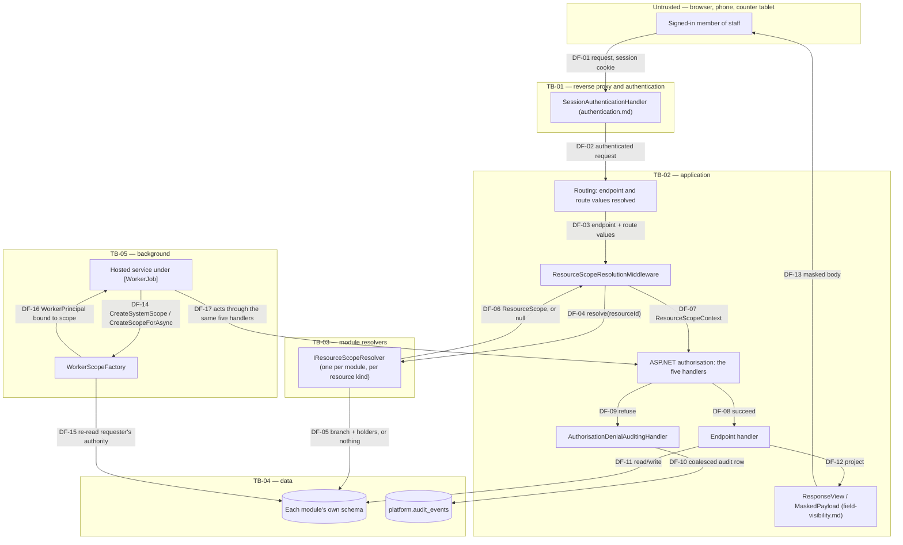

# Threat model — authorisation, roles and branch scope

The argument that a signed-in member of staff reaches only what their role, their branch assignments and
the specific row they named actually entitle them to — and that editing an identifier, retrying a request,
or acting from a queue never widens that.

Every control in section 8 names the test that fails when it stops being true. There are six residual
risks; the one worth reading first is **RR-01** (branch reach for a list, a search or an export has no
mechanism at all — the row-level guarantees below apply to a single named resource and stop at the door of
a collection).

---

## 1. Status and scope

| Field | Value |
| --- | --- |
| Flow modelled | Authorisation: the permission, branch-scope and resource-ownership decision behind every `/api/v1/**` business endpoint; the resource-scope resolution pipeline that loads a row before that decision is made; field-level minimisation as the second half of "what a caller is shown"; background-job scoping; the denial audit trail |
| Status | **Reviewed** |
| Drafted | 2026-09-19, issue #578, wave W3 |
| Author | The #578 implementation stream |
| Reviewed by | The technical reviewer, standing in for the security owner until #56a appoints one (**RG-OD-02** is open) |
| Review date | 2026-09-19 |
| Issues that change this flow | #24 (the mechanism and the catalogue), #25 (administration), #26 (the first business routes — Customers), #42 and #43 (Billing), #29 and #30 (Catalog), #33 (Orders, workflow and job endpoints), #46 (Reporting exports), #56a (the ASVS audit and the exception register) |
| Architecture references | [`../../architecture/components.md`](../../architecture/components.md) section 5 (the endpoint pipeline); [`../../architecture/module-ownership.md`](../../architecture/module-ownership.md) section 5 (who owns which resource resolver) |
| Related architecture decision records | None dedicated to this flow. The resource-scope pipeline is a `Platform.Security` mechanism whose rationale is written into ARCH-023 rather than into a separate record |
| Next review trigger | A new resource kind; a change to the coarseness ordering in `AuthorisationProblemResultHandler.Classify`; OD-13 changing a grant; the first route published under `/api/ext/v1/**` (ARCH-019); the first collection, search or export endpoint that needs the mechanism RR-01 says does not exist yet |

**Why this is being written now, and why it is not a forward declaration.** `docs/security/README.md`
section 3.2 has listed this flow as covered by "**#32a**, the first issue to publish a permissioned
route" since #22 was written, on 2026-09-05. `#32a` was a plan-section placeholder, never a GitHub issue,
and its trigger fired long before anyone noticed: of the 208 routes the application publishes today
(`../permission-matrix.md` section 1), 186 declare a permission, and `RoleMatrixTests` exercises 107
permissions as each of 12 roles, in two branches, against a real database. Unlike `authentication.md`,
which modelled a flow built in the same issue that wrote it, this model is checking work that has been
shipping since 2026-09-06 and has not been looked at as a whole since.

---

## 2. What is in scope, and what is not

**In scope.** The five-handler decision that runs on every permissioned endpoint
(`PermissionAuthorisationHandler`, `BranchScopeAuthorisationHandler`, `ResourceBranchAuthorisationHandler`,
`ResourceOwnershipAuthorisationHandler`, `StepUpAuthorisationHandler`); the
`ResourceScopeResolutionMiddleware` that loads a row before any of them runs; the permission catalogue and
the 12 seeded roles; step-up freshness (ARCH-018); how a caller's permissions and branch assignments reach
`ICurrentUser` in the first place, as far as this model's own boundary with `authentication.md`; the
denial audit trail; background-job permission and branch declarations (ARCH-020, ARCH-021); the mechanism
of field-level minimisation (`field-visibility.md`) as far as "a view cannot carry a class it withholds" —
not the 60-odd individual field decisions, which are that document's own.

**Out of scope**, each with the reason and where it is or will be covered:

| Not modelled here | Why | Covered by |
| --- | --- | --- |
| Who the caller is — password, second factor, session, recovery | This model begins where that one ends: at a session that is `IsAuthenticated` and `IsSignInComplete`. `PermissionAuthorisationHandler` re-checks both defensively, but the ordinary refusal for an absent session is authentication's 401, not this flow's 403 | [`authentication.md`](authentication.md) |
| Workflow-state bypass — calling a state-changing endpoint out of sequence | A permission held and a branch reached both say nothing about whether the aggregate is in a state that accepts the command. That is an invariant of the domain, not of who is asking (ABF-03) | `order-workflow.md` (#378, not yet written) |
| Barcode replay and custody-event sequencing | The identity and event-ordering guarantees are a different mechanism from branch or resource reach (ABF-04) | `barcode-custody.md` (#378, not yet written) |
| The individual field decisions of `field-visibility.md` — which of the customer record's fields a Cashier is shown | This model treats the mechanism ("a view cannot carry a class it withholds") as a control; the field-by-field table is a separate approved document with its own tests | [`../field-visibility.md`](../field-visibility.md) |
| A customer link as a bearer credential | A link authenticates nobody as staff; it is a different trust primitive answering `ABF-10`, not `ABF-01`/`ABF-02` | `customer-links.md` (#366, not yet written) |
| Media upload and download re-authorisation | No media endpoint exists yet (`MediaEndpoints` maps no routes); the rule that a stream re-authorises on every request has nothing to attach to | `customer-and-media.md` (#366, not yet written) |
| TLS, the reverse proxy, the trusted forwarded-address chain | This model assumes `AS-02` below and does not re-derive it | `deployment.md` (#394, not yet written) |
| Server-side request forgery through a webhook or provider callback | A different trust boundary — outbound, not inbound | `integrations.md` (#394, not yet written) |

**Assumptions this model rests on.**

| ID | Assumption | If it is false |
| --- | --- | --- |
| **AS-01** | Every request reaching a permissioned endpoint has already been through `authentication.md`'s pipeline. `PermissionAuthorisationHandler` still checks `IsAuthenticated` inline, folded into the same `PermissionNotHeld` refusal as "does not hold the permission" — deliberately, because ASP.NET's own challenge (401, `AuthenticationRequiredCode`) is expected to answer an absent session before any requirement handler runs at all | An unauthenticated caller reaching this far would be answered `403 security.forbidden` rather than `401`, which is a worse answer but not a permissive one — every handler in section 8 fails closed regardless of how it got here |
| **AS-02** | The forwarded client address is set by a trusted proxy, per `authentication.md` **AS-03**. Nothing in this model repartitions on it directly, but the `write` and `default-user` rate-limit policies of ARCH-017 do | A caller could choose its own rate-limit partition; the authorisation decision itself is unaffected, because it never reads the address |
| **AS-03** | **OD-13 is decided** (2026-09-19): the permission matrix is approved as shipped, with Branch Manager a distinct role. This model cites the matrix as an approved document rather than a proposal | A later change to a grant moves an HTTP outcome (`permission-matrix.md` section 9), and this model's TM/CTL rows describe the mechanism rather than any one grant, so they do not need to change when a grant does |
| **AS-04** | A resource kind's resolver never itself applies a branch filter — it answers with the row's true branch and holder set, or with nothing, and the pipeline decides reach. `IResourceScopeResolver`'s own remarks require this | A resolver that filtered by branch would make "not yours" and "not there" the resolver's decision instead of the pipeline's, and the two would stop reading alike — the guarantee TM-002 depends on |
| **AS-05** | A customer record is organisation-wide, not branch-owned (`../../nfr/data-classification.md` section 5.2, `../../prd/workflows/branch-scenarios.md` section 3.2). Routes reading one customer therefore declare `TouchesNoBranchOwnedResource` rather than `ScopedToResource`, and the coarse `AssignedBranches` gate — "is the caller assigned to at least one branch" — is the whole gate | A future decision to make customer visibility branch-scoped would need a new resource kind and a migration of every route that reads a customer by identifier; nothing here assumes that shape today |

---

## 3. Assets

Classified against [`../../nfr/data-classification.md`](../../nfr/data-classification.md).

| ID | Asset | Class | Why it is worth attacking | Impact if lost, altered or disclosed |
| --- | --- | --- | --- | --- |
| **A-01** | The permission catalogue and the 12 seeded roles' default grants (`permission-matrix.md`) | Internal | Knowing exactly what each role can and cannot do is reconnaissance for every other attack in this model | Not itself a compromise, but it tells an attacker which role is worth stealing |
| **A-02** | A caller's effective permission set and branch assignments, as resolved onto `ICurrentUser` from `SessionTicket` on every request — never carried as a claim on the `ClaimsPrincipal`, which holds only the account identifier | Personal, with the credentials of section 6 attached | It is the whole decision surface: widen it and every downstream check widens with it | Reading or acting outside a role's grant, or outside the branches it is assigned to |
| **A-03** | A branch-owned resource's true branch and holder identifiers, as answered by an `IResourceScopeResolver` | Follows the resource's own classification (a garment job is Internal in its workflow fields, an invoice is Financial) | It is the fact the whole resource-scope pipeline exists to check a caller against | Any of the IDOR outcomes below, depending on which resolver is wrong |
| **A-04** | `platform.audit_events` rows for `authz.denied` — the denial trail | Personal metadata, evidentiary (section 5.16) | A pattern of refused attempts is what makes an escalation attempt visible before it succeeds | An attacker who could suppress or flood this trail could hide a pattern of probing, or bury the one entry that mattered under noise |
| **A-05** | A background job's declared permissions and branch scope (`[WorkerJob]`) | Internal | A job runs with no ambient user; what it may do is either written down here or invented at composition time | An under-declared job fails loudly on its first check; an over-declared one is the widest principal in the deployment, quietly |
| **A-06** | The response views of `field-visibility.md` and the classes each withholds | Follows the fields it carries | The mechanism that keeps a phone number off a job card and a price off a tailor's screen | A view built without the withholding it claims would leak exactly the class it names |

---

## 4. Data flow diagram and trust boundaries

| ID | Trust boundary | What changes when it is crossed |
| --- | --- | --- |
| **TB-01** | Untrusted caller to authenticated request | `authentication.md`'s own boundary; by the time a request reaches routing it carries `IsAuthenticated`, `IsSignInComplete`, `MfaSatisfied` and `LastReauthenticatedAt`, all read from the server-side session row rather than from anything the caller sent |
| **TB-02** | Routing to the resource-scope and authorisation pipeline | The endpoint's declared metadata — permission, branch scope, resource kind, step-up — becomes the whole of what is checked. Nothing declared is nothing checked, which is exactly the failure ARCH-022 and ARCH-023 exist to catch |
| **TB-03** | Pipeline to a module's resolver | The platform never reads a module's tables directly (ARCH-004, ARCH-005); it asks the module a narrow question — the branch and holders of one identifier — and the module answers with identifiers only |
| **TB-04** | Application to data | Every module keeps its own schema; a resolver's read is one indexed lookup, never a join across modules |
| **TB-05** | A request to a background job | `WorkerJobRequest` carries an identifier, a branch and a boolean — never a permission set or a role — so a job re-reads the requester's authority at run time rather than trusting what was true when it was queued |

| ID | Data flow | Carries | Protection in transit | Authenticated as |
| --- | --- | --- | --- | --- |
| **DF-04** | Middleware to resolver | A `Guid` route value, or a raw string that failed to parse as one | In-process | The application's own database role |
| **DF-06** | Resolver to middleware | `ResourceScope(kind, id, branchId, holderIds)`, or null | In-process | Same |
| **DF-10** | Denial handler to the audit trail | Actor, endpoint, refusal class, coalescing minute — never the request body, never which field was being written | In-cluster | The application's database role, INSERT only |
| **DF-15** | Worker scope factory to the database | The requester's identifier, re-read for current roles, branch assignments and permissions | In-cluster | The application's own database role |

---

## 5. Actors, entry points and privileges

| Actor | Trust level | Reaches this flow through | Privileges it should have | Privileges it must never have |
| --- | --- | --- | --- | --- |
| A signed-in caller with no relevant permission | Authenticated, `IsSignInComplete` | Any permissioned route | Told nothing about a resource it cannot reach | Learn whether a resource exists by comparing refusal answers |
| A caller holding the permission, working in one branch | Authenticated, permission held | A `current-branch` or `assigned-branches` route | Everything the permission and branch scope approve, in the branches it is assigned to | The same, in a branch it is not assigned to |
| A caller holding the permission and `admin.organisation.read_all_branches` | Authenticated, permission held, organisation reach | An `organisation`-declared read | Read across every branch | Write across every branch — organisation reach is read-only by declaration (ARCH-023's own remarks); a write route is declared `current-branch` regardless of what the caller can read |
| A caller holding a permission whose resource also carries an assignee | Authenticated, permission and branch both satisfied | A route declaring `ResourceOwnershipRequirement` (a garment job, for example) | Its own assigned work | Somebody else's assigned work, unless it separately holds the named supervisor permission |
| A background job | No ambient user; the job's own declared principal | Any endpoint's underlying application service, called in-process | Exactly the permissions its `[WorkerJob]` attribute names, and no `RequiresStepUp` permission ever | Any permission it did not declare; the requester's current permissions when it declared none at queue time (a job "acting for a requester" re-reads them, never trusts the queue) |
| A caller who holds no code-owner-visible trust at all | Untrusted | Nothing — every business route demands a permission or is a justified anonymous exposure (ARCH-007) | — | — |

| Entry point | Method and route (representative) | Declaration | Resource declared | Rate limited |
| --- | --- | --- | --- | --- |
| Read one order draft | `GET /api/v1/orders/drafts/{draftId}` | `permission` `orders.intake`, `current-branch` | `orders.order_draft` (`ScopedToResource`) | `default-user` |
| Read one invoice | `GET /api/v1/billing/invoices/{invoiceId}` | `permission` `billing.create_invoice`, `current-branch` | `billing.invoice` (`ScopedToResource`) | `default-user` |
| Read one customer | `GET /api/v1/customers/{customerId}` | `permission` `customers.read`, `assigned-branches` | none declared (`TouchesNoBranchOwnedResource`, AS-05) | `default-user` |
| Read a confirmed measurement | `GET /api/v1/customers/measurements/{measurementVersionId}` | `permission` `measurements.capture`, `assigned-branches` | none declared (`TouchesNoBranchOwnedResource`) | `default-user` |
| Correct a design-selection draft | `PUT /api/v1/catalog/design-drafts/{draftId}` | `permission` `catalog.design.select`, `current-branch` | `catalog.design_selection_draft` (`ScopedToResource`) | `write` |
| Read the organisation's audit trail | `GET /api/v1/admin/audit/` | `permission` `admin.audit.read`, `organisation` | none — no route parameter | `default-user` |
| Change a flag | `PUT /api/v1/admin/feature-flags/{key}` | `permission` `admin.feature_flags`, `not-branch-owned` | none declared | `write` |

The full 208-row table is [`../permission-matrix.md`](../permission-matrix.md) section 5, held equal to
the live route table by the tests of its section 8. What is above is enough to see the shape: **four
declarations that are not two**, and a resource named or explicitly disclaimed on every one that carries
an identifier.

### 5.1 The five-handler pipeline, stated once

Writing this out is what made TM-006 and TM-007 obvious: the checks are independent, run in sequence, and
each can refuse on its own. `SessionAssuranceAuthorisationHandler` — the self-service level a half-signed-in
session may reach — is registered alongside these but is `authentication.md`'s own mechanism (its section
5.1), not this flow's; it is named here only because `AuthorisationProblemResultHandler.Classify` reads
its failures first, ahead of every handler below.

| # | Handler | Reads | Refuses when | Refusal class |
| --- | --- | --- | --- | --- |
| 1 | `PermissionAuthorisationHandler` | The permission catalogue, `ICurrentUser` | Unknown permission key; caller unauthenticated or lacks it; sign-in incomplete; permission needs MFA and the session has none; permission needs step-up and the last strong re-authentication is stale | `PermissionNotHeld`, `SignInIncomplete`, `SecondFactorRequired`, `StepUpRequired` |
| 2 | `BranchScopeAuthorisationHandler` | `ICurrentUser` only — no resource yet | The declared scope is `CurrentBranch` and the caller's active branch fails `CanActInBranch`; `AssignedBranches` and the caller holds none at all; `Organisation` and the caller lacks the reach permission | `OutsideBranchScope` |
| 3 | `ResourceBranchAuthorisationHandler` | `ResourceScopeContext`, `ICurrentUser` | The resource does not exist, or its branch fails the same three-way test against the *specific* resource rather than against the caller's claims in general; the pipeline never resolved anything | `ResourceUnreachable`, `PipelineIncomplete` |
| 4 | `ResourceOwnershipAuthorisationHandler` | `ResourceScopeContext`, `ICurrentUser` | A route additionally declares ownership, the resource is resolved, and the caller neither holds a named supervisor permission nor is in the resource's holder set | `NotAssigned` |
| 5 | `StepUpAuthorisationHandler` | `ICurrentUser`, via `.RequireStepUp()` | The endpoint separately declared the demand and the session is stale, independently of whether the permission itself is flagged | `StepUpRequired` |

Handler 2 is coarse on purpose — "is the caller assigned to *any* branch" — and handler 3 is what asks
whether *this* resource's branch is one of them. An endpoint that skips declaring a resource (ARCH-023's
gap) loses handler 3 and handler 4 entirely while handler 1 and 2 both still pass for any signed-in
holder of the permission: that silent narrowing is TM-001.

**Why handler 5 duplicates part of handler 1.** `RequiresStepUp` is checked twice: once inline, from the
permission's own flag (handler 1), and once from `.RequireStepUp()` on the route (handler 5) — the second
existing purely so the demand is visible on the route and in the generated API document, rather than
buried inside a catalogue lookup nobody reading the endpoint would see. ARCH-018 holds the two equal in
both directions — a flagged permission with no `.RequireStepUp()`, and a `.RequireStepUp()` on a
permission the catalogue does not flag, both fail. Clearing the flag on a permission is a one-line edit
to the catalogue; the route that named the demand out loud keeps demanding it until somebody removes
`.RequireStepUp()` too, in the same pull request, which is what makes weakening a step-up requirement a
reviewable act rather than a drive-by one.

---

## 6. STRIDE analysis

| ID | Element | Category | Threat | Likelihood | Impact | Controls | Residual |
| --- | --- | --- | --- | --- | --- | --- | --- |
| **TM-001** | A `current-branch` or `assigned-branches` route with a route parameter | Elevation of privilege | The endpoint omits `ScopedToResource` and `TouchesNoBranchOwnedResource` alike, so `ResourceScopeResolutionMiddleware` marks the resource `NotRequired`, no branch check specific to the row ever runs, and any holder of the permission reaches every row in the organisation by editing the identifier | medium | high | CTL-01, CTL-02 | — |
| **TM-002** | An `IResourceScopeResolver` implementation | Tampering, information disclosure | A resolver applies its own branch filter and returns null for a resource that exists in another branch, so "not yours" and "not there" diverge from what the pipeline would have answered, and the two stop reading alike | low | medium | CTL-03 | RR-02 |
| **TM-003** | `ResourceScopeResolutionMiddleware` | Elevation of privilege | The host is composed without `UseTailor360ResourceScope()` between `UseRouting` and `UseAuthorization`, so `ResourceScopeContext` never leaves its default `Unresolved` status for any request | high if it happened | high | CTL-04 | — |
| **TM-004** | `GET`/`PUT` on a resource in another branch | Information disclosure | The response for a resource in a branch the caller cannot reach discloses that the identifier is valid, distinguishing it from one that does not exist at all | high | medium | CTL-05 | — |
| **TM-005** | `ResourceOwnershipAuthorisationHandler` | Elevation of privilege | A caller who is not the assignee and holds no supervisor permission is nonetheless served, because a route declared ownership incorrectly or a supervisor permission list was set too broad | low | medium | CTL-06 | — |
| **TM-006** | The pipeline as a whole | Elevation of privilege | A caller who fails the resource-branch check but holds the base permission is told *which* gate failed — "your account may not do that" versus "that row is not yours" — letting the caller sort identifiers into "exists elsewhere" and "does not exist" | medium | medium | CTL-07 | — |
| **TM-007** | `admin.organisation.read_all_branches` | Elevation of privilege | A caller holding the organisation-wide read permission uses it to reach a **write** route declared `current-branch`, treating read reach as if it were write reach | low | high | CTL-08 | — |
| **TM-008** | `PermissionRequirement` | Elevation of privilege | An endpoint names a permission key with a typo, or one no module has declared, and the handler treats the unknown key as an implicit allow rather than a refusal | low | high | CTL-09 | — |
| **TM-009** | `ARCH-018` step-up permissions | Elevation of privilege | A permission the catalogue marks `RequiresStepUp` is exercised by an endpoint that never calls `.RequireStepUp()`, so a session that merely holds the permission — without a recent re-authentication — is allowed | medium | high | CTL-10 | — |
| **TM-010** | A permission exercised deep inside a request body — a pricing override, a discount beyond a rule's counter maximum | Elevation of privilege | A service checks `HasPermission` for the override but not `StepUpFreshness`, so the freshness rule that gates the *route* is silently absent from the *value* the route accepts | low | medium | CTL-11 | — |
| **TM-011** | A background job with `ActsForRequester = true` | Elevation of privilege | The job trusts the permission set the request held when it was **queued**, rather than re-reading it when the job **runs**, so a permission revoked in between is still exercised | low | high | CTL-12 | — |
| **TM-012** | A background job with no declaration | Elevation of privilege | A hosted service ships without `[WorkerJob]`, and the reflection scan that would have caught it at build time is skipped, so the job runs with whatever the composition root happened to wire in | low | high | CTL-13 | — |
| **TM-013** | A job declared `RequiresStepUp` | Elevation of privilege, denial of service | A queued job is asked to exercise a step-up permission, which can never be fresh because nothing about a queue is a recent re-authentication, so the job either silently fails every time or — worse — is built to bypass the check | low | medium | CTL-14 | — |
| **TM-014** | `AuthorisationDenialAuditingHandler` | Denial of service | An attacker probing many identifiers or many accounts floods the audit trail with one row per attempt, burying the entry an investigator needs under noise, or exhausting storage | medium | medium | CTL-15 | — |
| **TM-015** | The same handler | Repudiation | A refused attempt leaves no trace at all, so a pattern of probing — one person retried all afternoon, or forty accounts in one minute — is invisible after the fact | medium | medium | CTL-16 | — |
| **TM-016** | A refused **write** versus a refused **read** | Information disclosure | The denial trail, or a log line derived from it, records what a refused write attempted to change, disclosing the value a caller was not entitled to set | low | medium | CTL-17 | — |
| **TM-017** | `ResponseView` construction | Information disclosure | A view is built that carries a data class its own declared surface forbids — a job card built with a price field — because nothing stops the view from being constructed | low | high | CTL-18 | — |
| **TM-018** | A handler assembling a response field by field | Information disclosure | A field nobody declared reaches the response body because the handler set it directly rather than through the declared field set | medium | medium | CTL-19 | — |
| **TM-019** | The customer-record and search-card payload types | Information disclosure | A property is added to the generated client's payload type without a corresponding declaration in `field-visibility.md`, so it reaches every caller regardless of permission | low | medium | CTL-20 | — |
| **TM-020** | The permission matrix document itself | Elevation of privilege, tampering | The document approved by the owner (`permission-matrix.md`) and the code diverge — a grant added in code and never approved, or a flag changed in one place and not the other | low | high | CTL-21 | — |
| **TM-021** | The live route table | Elevation of privilege | A route is added to the application without a corresponding row in `permission-matrix.md` section 5, so its exposure was never reviewed by anyone reading that document | medium | high | CTL-22 | — |
| **TM-022** | An organisation-scoped permission | Elevation of privilege | A branch-reach role is granted an organisation-scoped permission, which the matrix's own rule says should never validate | low | high | CTL-23 | — |
| **TM-023** | A collection, search or export endpoint | Elevation of privilege, information disclosure | No branch-reach mechanism exists for a route with no single named identifier, so a list, a search or an export could be built with no branch decision at all and nothing here would catch it | medium | high | — | **RR-01** |
| **TM-024** | `StaffUser.HomeBranchId` versus `AssignedBranches` | Elevation of privilege | Not today's behaviour — the threat a future change could reintroduce. If `SessionTicket.AssignedBranches` were ever built by unioning the assignment rows with the account's home branch, as an earlier form of this code did, an administrator removing somebody's assignment to a branch would believe that removed their reach into it while the untouched home-branch field kept it open | low | high | CTL-25 | — |
| **TM-025** | The `ClaimsPrincipal` ASP.NET Core builds at sign-in | Tampering, elevation of privilege | A future change adds a role or permission claim to the identity for convenience — a shortcut past re-reading the database — reopening the exact class of bug session-based revocation exists to close: a claim survives until the cookie is replaced, a database grant does not | low | high | CTL-26 | — |

**Recorded negatives.** There is no *spoofing* threat against the resource-scope decision from anything
the client sends: `resourceId` is the only client-supplied input to the whole pipeline, and it is treated
as an opaque lookup key from the moment it fails to parse as a `Guid` — a malformed value is answered
exactly as a well-formed one belonging to nobody (`AnswersAMalformedIdentifierTheSameWayAgain`). There is
no *tampering* threat against `ResourceScope` from the client, because it is never round-tripped to one —
it is loaded server-side, held in a scoped context for the life of the request, and never serialised.

---

## 7. Abuse cases

Both cited families are this flow's central subject per
[`../abuse-cases.md`](../abuse-cases.md) section 4.1; the other nine are answered by name in section 2
above.

| ID | Abuse case | Family | Actor and motive | Steps | Defeated by | Test |
| --- | --- | --- | --- | --- | --- | --- |
| **AB-01** | **Read another branch's job by editing the identifier** | ABF-01 | A signed-in Tailor with a legitimate session and no reason to see another branch's work | Take a job identifier from one's own job card, substitute a neighbouring UUID, request it directly | CTL-01, CTL-03, CTL-05 | `ResourceScopePipelineTests.AnswersAJobInAnotherBranchExactlyAsItAnswersAJobThatDoesNotExist` |
| **AB-02** | **Read a colleague's job in the same branch** | ABF-01 | The same Tailor, this time targeting a job assigned to somebody else at their own branch | Take a job identifier a colleague mentioned, request it directly | CTL-06 | `ResourceScopePipelineTests.RefusesAJobInTheCallersBranchThatIsAssignedToSomebodyElse` |
| **AB-03** | **Enumerate customers across the organisation** | ABF-01 | A caller who holds `customers.read` at one branch, checking whether a phone number belongs to a specific named person by trying customer identifiers | Take an identifier, request `GET /api/v1/customers/{customerId}` | Not fully defeated — see AS-05: a customer at another branch of the **same** organisation is deliberately, fully readable (`ACustomerOfAnotherBranchIsReadableAndOneOfAnotherOrganisationIsNotEvenAcknowledged`, the positive half). What is defeated is reaching another **organisation**'s record | `IdentifierEditingTests.ACustomerOfAnotherBranchIsReadableAndOneOfAnotherOrganisationIsNotEvenAcknowledged` |
| **AB-04** | **Read the duplicate-candidate list for another organisation's customer** | ABF-01 | The same caller, on the screen that lists possible duplicate records | Request `.../duplicates` for a foreign-organisation identifier | CTL-05 | `IdentifierEditingTests.TheDuplicateScreenAnswersAnotherOrganisationsRecordAsOneThatDoesNotExist` |
| **AB-05** | **Merge in a foreign-organisation record** | ABF-01 | An attacker attempting to use the merge endpoint's second identifier — the record being folded in — to touch a record outside their reach | Call `.../merge` naming a foreign-organisation record as the one being absorbed | CTL-05 | `IdentifierEditingTests.AMergeNamingAnotherOrganisationsRecordIsAnsweredAsOneThatDoesNotExist` |
| **AB-06** | **Revoke or read a session that is not the caller's own** | ABF-01 | An attacker with a session of their own, guessing at another account's session identifier | Call `DELETE /api/v1/sessions/{sessionId}` for a session that belongs to someone else | CTL-05 | `IdentifierEditingTests.RevokingAnotherAccountsSessionIsAnsweredAsRevokingOneThatDoesNotExist` |
| **AB-07** | **Remove a colleague's passkey** | ABF-01 | The same attacker, targeting an authentication factor rather than a session | Call `DELETE /api/v1/auth/passkeys/{passkeyId}` for a passkey that is not theirs | CTL-05 | `IdentifierEditingTests.RemovingAnotherAccountsPasskeyIsAnsweredAsRemovingOneThatDoesNotExist` |
| **AB-08** | **Supervise from the wrong branch** | ABF-02 | A Tailor Master, holding `orders.assign`, who supervises assignment at one branch and tries to reach a job at another | Call the job-read route for a job at a branch they do not work in, while holding the permission that lets them open anybody's job **in their own branch** | CTL-05 (the branch check runs independently of the ownership check and answers first) | `ResourceScopePipelineTests.RefusesTheWorkshopLeadAJobInAnotherBranchAllTheSame` |
| **AB-09** | **Discover a resource exists by comparing refusal reasons** | ABF-02 | A caller who lacks the base permission entirely, probing to see whether a specific identifier in another branch is a real job | Request a job in a branch not their own, without holding `orders.read` at all | CTL-07 (the resource is still resolved — the middleware runs regardless of the permission decision — but both handlers fail at once, and `Classify` answers with the coarser `PermissionNotHeld`, `security.forbidden`, rather than the resource's own `security.resource-not-found`. A caller with no permission at all therefore learns nothing by varying the identifier: the answer is the same whichever branch they name) | `ResourceScopePipelineTests.TellsACallerWithoutThePermissionNothingAboutTheResource` |
| **AB-10** | **Rely on a misconfigured host to skip the resource check** | ABF-02 | Nobody in particular — this is the abuse case against the deployment, not against a person. If the resource-scope middleware were ever left out of a host's pipeline, every caller holding the base permission would reach every resource | CTL-04 | `ResourceScopePipelineTests.RefusesEverybodyWhenTheHostForgotTheResolutionStep` |
| **AB-11** | **Exercise a stale permission from a queued job** | ABF-02 | An account whose permission is revoked after queuing a job that acts on their behalf, hoping the job still carries the old authority | Queue a job that names `ActsForRequester = true`, then have the permission revoked before the job runs | CTL-12 | `WorkerScopeFactory` re-reads the requester's current roles; see section 8, no dedicated end-to-end test yet — **RR-03** |
| **AB-12** | **Grant an organisation-scoped permission to a branch role** | ABF-02 | An administrator, in error or otherwise, tries to grant `catalog.publish` (organisation-scoped) to a role whose reach is `branch` | `PUT /api/v1/admin/roles/{roleId}/permissions` naming the mismatched pair | CTL-23 | `PermissionMatrixDocumentTests` assertion 8; `RoleAdministrationEndpointTests` |

---

## 8. Controls, and the test that proves each one

| ID | Control | Type | Where it lives | Test that fails if it is removed |
| --- | --- | --- | --- | --- |
| **CTL-01** | A `current-branch` or `assigned-branches` permissioned route with a route parameter must declare `ScopedToResource` or `TouchesNoBranchOwnedResource`; omitting either fails the build | Preventive | ARCH-023, `EndpointResourceScopeTests` | `EndpointResourceScopeTests.TheInspectorCatchesAPermissionedRouteWithAnIdentifierAndNoResourceScope`, `…TheInspectorCatchesAnAssignedBranchesRouteWithAnIdentifierAndNoResourceScope` |
| **CTL-02** | An endpoint may declare a permission or a justified anonymous exposure, never both — `AllowAnonymous` wins at run time and would otherwise silently skip every check below it | Preventive | ARCH-022, `EndpointResourceScopeTests` | `EndpointResourceScopeTests.TheInspectorCatchesAnEndpointThatIsBothPermissionedAndAnonymous` |
| **CTL-03** | A resolver answers with the resource's true branch and holders, or with nothing; it never filters by the caller's own claims | Preventive | `IResourceScopeResolver` contract (design-level; enforced by review, not a build-time detector) | `ResourceScopePipelineTests.ServesTheJobAssignedToTheCallerInTheirOwnBranch` and the class's other cases against a synthetic resolver whose fixture data proves the pipeline, not the resolver, makes the branch decision |
| **CTL-04** | `ResourceScopeContext` starts in `Unresolved`, which every requirement handler downstream treats as a refusal, not as "nothing to check". A host that forgets `UseTailor360ResourceScope()` therefore refuses every caller rather than admitting them | Preventive | `ResourceScopeContext`, `ResourceBranchAuthorisationHandler` (`PipelineIncomplete` branch), `ResourceOwnershipAuthorisationHandler` (same) | `ResourceScopePipelineTests.RefusesEverybodyWhenTheHostForgotTheResolutionStep` |
| **CTL-05** | A resource that does not exist and one that exists but is unreachable answer identically. Two implementations share the pattern rather than a literal string: routes that declare a resource kind answer through `ResourceBranchAuthorisationHandler` (`ResourceUnreachable` merges the `NotFound` and unreachable-`Resolved` cases) with the platform's own `404 security.resource-not-found`; Customers, whose records are organisation-wide (AS-05) and so declare no resource kind at all, answers the same equality bespoke, with its own `404 customers.customer-not-found`. Every test below compares the two live responses to each other, not to a hard-coded expectation, which is what would catch either implementation drifting | Preventive | `ResourceBranchAuthorisationHandler`, `AuthorisationProblemResultHandler.Describe`; `CustomerEndpoints` (the module's own equality) | `ResourceScopePipelineTests.AnswersAJobInAnotherBranchExactlyAsItAnswersAJobThatDoesNotExist`; `IdentifierEditingTests` (six cases: sessions, passkeys, customers, duplicates, merge — each asserting `foreign.StatusCode.ShouldBe(invented.StatusCode)` and an identical body with only the correlation identifier stripped) |
| **CTL-06** | A route may additionally declare `ResourceOwnershipRequirement`; the caller must be the resource's assignee or hold a named supervisor permission, checked independently of the branch requirement so that removing one control never quietly widens the other | Preventive | `ResourceOwnershipAuthorisationHandler` | `ResourceScopePipelineTests.RefusesAJobInTheCallersBranchThatIsAssignedToSomebodyElse`, `.LetsTheWorkshopLeadOpenAnybodysJobInTheirBranch`, `.RefusesTheWorkshopLeadAJobInAnotherBranchAllTheSame` |
| **CTL-07** | Refusal classes are collapsed to the single coarsest one that applies, by a fixed ordering (`PipelineIncomplete` → `NotAuthenticated` → `SignInIncomplete` → `PermissionNotHeld` → `SecondFactorRequired` → `StepUpRequired` → `ResourceUnreachable` → `NotAssigned` → `OutsideBranchScope`), so a caller who fails both the permission gate and the resource gate is told only the earlier one, and a caller who fails only the resource gate cannot distinguish "wrong branch" from "does not exist" | Preventive | `AuthorisationProblemResultHandler.Classify` | `ResourceScopePipelineTests.TellsACallerWithoutThePermissionNothingAboutTheResource` (permission gate wins and answers `security.forbidden`, not `security.resource-not-found`) |
| **CTL-08** | Organisation-wide reach (`admin.organisation.read_all_branches`) satisfies `BranchScope.Organisation` for a **read**; a write route is declared `BranchScope.CurrentBranch` by the endpoint regardless of what the same caller can read, so organisation reach never becomes organisation-wide write by implication | Preventive | `ResourceBranchAuthorisationHandler.CanReach`, by construction — a route's own declared scope, not the caller's permission set, decides which branch of the switch runs | `RoleMatrixTests` assertion 19 (`../permission-matrix.md` section 8.2) |
| **CTL-09** | An endpoint referring to a permission key no module has declared fails closed rather than passing by default | Preventive | `PermissionAuthorisationHandler` (`permission is null` branch) | `AuthorisationMatrixTests` assertion 13 |
| **CTL-10** | Every endpoint demanding a `RequiresStepUp` permission declares `.RequireStepUp()`, and the converse — `.RequireStepUp()` on a permission the catalogue does not flag — also fails | Preventive | ARCH-018, `AuthorisationMatrix.Reconcile` | `AuthorisationMatrixTests.DetectsAStepUpPermissionOnAnEndpointThatDoesNotDeclareStepUp`, `.DetectsStepUpDeclaredForAPermissionThatIsNotFlaggedForIt`; `RoleMatrixTests.AStepUpPermissionSeparatesAFreshSessionFromAStaleOne` |
| **CTL-11** | `StepUpFreshness.IsFresh` is the one reading of "recently re-authenticated" and is applied wherever a step-up permission is exercised, including from inside a service that checks the permission on the strength of a request body rather than a route declaration | Preventive | `StepUpFreshness`, called from `PermissionAuthorisationHandler` and, by the same static method, from any service applying the same permission mid-request | `RoleMatrixTests.AStepUpPermissionSeparatesAFreshSessionFromAStaleOne`; **no dedicated test yet for the mid-request case — RR-04** |
| **CTL-12** | `WorkerScopeFactory.CreateScopeForAsync` re-reads the requester's current roles, permissions and branch assignments at the moment the job runs; the queue carries only an identifier, a branch and a second-factor boolean, never a permission set | Preventive | `IWorkerScopeFactory`, `WorkerJobRequest` | `WorkerJobAuthorisationException` is thrown and the job aborted, not retried, when the requester no longer holds what the job needs — **no integration test found; RR-03** |
| **CTL-13** | Every hosted service in `Tailor360.Worker` must carry `[WorkerJob(name, branchScope, permissions)]`, checked by reflection at the architecture tier and again inside `WorkerJobDescriptor` at run time so a job that slipped past the build-time scan still cannot open a scope | Preventive | ARCH-020, ARCH-021, `WorkerJobAttribute`, `WorkerJobDescriptor` | `BackgroundContextTests.Arch021_EveryWorkerJobDeclaresItsScope`, `.Arch021DetectorCatchesAJobThatDeclaresNothing` |
| **CTL-14** | A job declaring `ActsForRequester = true` may not also declare a `RequiresStepUp` permission; `CreateScopeForAsync` throws rather than admit one | Preventive | `IWorkerScopeFactory` contract | `BackgroundContextTests` (the declaration-validity assertions); **no dedicated negative test for this specific combination found — folded into RR-03** |
| **CTL-15** | Denials are coalesced by actor, endpoint and minute — one row for a retried client, a distinct row for every distinct actor, never sampled. The coalescer holds up to 20,000 keys with one minute of slack either side of the current one; once full it stops coalescing rather than dropping — every further denial is recorded, so a flood makes the trail noisier, never shorter, at exactly the moment it matters most | Detective | `AuthorisationDenialCoalescer`, consumed by `AuthorisationDenialAuditingHandler` | `DenialAuditTests.RepeatedRefusalsByOnePersonAtOneEndpointInOneMinuteAreOneEntry`, `.EveryDistinctPersonRefusedAtOneEndpointInOneMinuteIsRecorded`, `.OnePersonRefusedAtTwoEndpointsInOneMinuteIsTwoEntries`; `AuthorisationDenialCoalescerTests.RecordsEverythingOnceItHasRunOutOfRoomToRemember` |
| **CTL-16** | Every refused **write** is recorded; a refused read is not, unless the permission itself is a `StepUpRequired` read (its own sensitivity outweighs the noise a read-heavy trail would otherwise carry) | Detective | `AuthorisationDenialAuditingHandler` | `DenialAuditTests.ARefusedWriteIsRecordedWithTheActorTheEndpointAndNothingElse`, `.ARefusedReadIsNotRecorded`, `.ARefusedStepUpRequestIsRecordedEvenThoughItIsARead` |
| **CTL-17** | A recorded denial carries the actor, the endpoint and the refusal class — never the request body, never the field or value a refused write attempted to set | Preventive | `AuthorisationDenialAuditingHandler` | `DenialAuditTests.ARefusedWriteIsRecordedWithTheActorTheEndpointAndNothingElse` (asserts the entry's shape, not only its existence) |
| **CTL-18** | `ResponseView`'s constructor throws if the view is built carrying a data class its declared surface forbids | Preventive | `field-visibility.md` section 2 item 1, `ResponseView` | `FieldVisibilityDocumentTests` (holds the document's `Withheld` column equal to the code); no view in the codebase carries a forbidden class, by construction |
| **CTL-19** | Where a handler assembles a body field by field, `MaskedPayload.Set` throws on a field name the view has not declared at all; a field that *is* declared but that this caller's permissions do not allow is silently left unset rather than thrown on — the two are different mistakes and get different answers | Preventive | `field-visibility.md` section 2 item 2, `FieldMask.Set` | `CustomerFieldMaskTests.TheRecordCarriesEveryFieldTheViewDeclaresAndNoOther`, `.WithholdsEveryContactFieldFromACallerWhoHoldsOnlyCustomersRead`, `.TellsAWithheldFieldApartFromOneTheCustomerNeverGave` |
| **CTL-20** | Where the response is a published, client-generated schema — the customer record and the search card — `ResponseViewPayloadTests` holds the payload type's properties equal to the view's declared field set, so an added property fails the build rather than the first request that carries it | Preventive | `field-visibility.md` section 2 item 2 | `ResponseViewPayloadTests` |
| **CTL-20a** | A write endpoint answering with the record it just changed derives the mask from the permission it explicitly names as having reached the caller there, and throws if the caller does not actually hold that permission — so a handler cannot assert reach on a caller's behalf by naming the wrong permission | Preventive | `FieldVisibilityPolicy.MaskForReached` | `CustomerFieldMaskTests.AnswersACorrectionWithTheSameMaskAsARead`, `.AnswersADeactivationWithTheSameMaskAsARead`, `.AnswersARegistrationWithTheRecordItCreatedAndStillWithholdsContact` exercise the guard's positive path; the `InvalidOperationException` branch itself has no dedicated test, because triggering it needs a handler bug that does not exist to trigger against |
| **CTL-20b** | A correction touching any contact field is refused whole — `403 customers.contact-change-forbidden` — unless the caller holds `customers.read_contact`, even when the attempt would only clear or omit the field; the record is left byte-identical and nothing is partially applied | Preventive | `field-visibility.md` section 5, the Owner decision of 2026-09-10 (#83) | `CustomerFieldMaskTests.AContactChangeRequiresContactAccessAndRefusalLeavesNoPartialCorrection` |
| **CTL-21** | The permission catalogue, the seeded role register and `permission-matrix.md` sections 3 and 4 are held equal by a document-parsing test: module, scope and the three flags per permission; every role's keys, reach, onboarding flag and grant count | Preventive | `PermissionMatrixDocument`, `PermissionMatrixDocumentTests` | `PermissionMatrixDocumentTests` assertions 1–9 (`../permission-matrix.md` section 8) |
| **CTL-22** | The live, composed route table and `permission-matrix.md` section 5 are held equal in both directions: every published route has exactly one row, and every row names a published route | Preventive | `AuthorisationMatrix.Reconcile`, `EndpointInventory` | `AuthorisationMatrixTests` assertions 10–15 |
| **CTL-23** | An organisation-scoped permission is granted only to a role whose reach is the organisation; a branch-reach role holding one fails the document-equality check | Preventive | `PermissionMatrixDocumentTests` assertion 8 | `PermissionMatrixDocumentTests` (the organisation-scope invariant case) |
| **CTL-24** | Every assertion above that reads "these two collections agree" carries its own negative control, because two collections agree vacuously when one of them is empty | Preventive | `../permission-matrix.md` section 8, closing paragraph | `PermissionMatrixDocumentTests` assertion 9 (a malformed table is refused rather than silently satisfying every rule) |
| **CTL-25** | A caller's reachable branches are the assignment-table rows alone, never unioned with the account's home branch. The home branch is only the default a new session opens onto | Preventive | `SessionTicketStore.ResolveAsync`, with the union deliberately absent — the class's own remarks record that an earlier form read the home branch and unioned it in, and that "removing somebody from a branch stopped short of removing their reach into it" | `RoleAndBranchScopeTests.AHomeBranchWhoseAssignmentWasRemovedIsNoLongerReachable` |
| **CTL-26** | The `ClaimsPrincipal` built at sign-in carries the account identifier and nothing else — no role, no permission, no branch. Every authorisation-relevant fact is re-read from `SessionTicket` on every request through `ICurrentUser`, so nothing about them can be smuggled or kept alive by a stale claim | Preventive | `SessionAuthenticationHandler.BuildPrincipal`, `SessionTicketStore.ResolveAsync` | Enforced by construction — there is no code path that adds a claim from either type, so no test asserts its absence directly; `SessionLifecycleTests.ARevokedSessionIsRefusedOnTheVeryNextRequest` (`authentication.md` CTL-17) is the observable consequence: a claim would have survived that revocation and a re-read cannot |

---

## 9. Residual risk

| ID | Residual risk | Threats | Why it is not fully mitigated | Rating | Owner | Accepted on | Review by | Waiver |
| --- | --- | --- | --- | --- | --- | --- | --- | --- |
| **RR-01** | **There is no branch-reach mechanism for a collection, a search or an export.** `ScopedToResource` decides one identifier taken from the route table; a list, a search, a bulk command or an identifier carried in a body or query string reaches its handler with no branch decision taken at all by this pipeline. `permission-matrix.md` section 7 records this as absent, not as covered by some other mechanism, and `matrix.yaml` carries the same note so nobody writes the first list endpoint believing the question is answered | TM-023 | The scoped-query port this needs does not exist. Every endpoint the model reviewed that reads a **collection** — `GET /api/v1/orders/workflow-definitions`, `GET /api/v1/billing/invoices` — is either organisation-scoped by declaration or narrows to `current-branch` **inside the handler**, read from the caller's own session rather than checked by a requirement. That is a correct outcome today because every such handler was written carefully, and it is exactly the kind of correctness this model exists to stop depending on people getting right by hand | **medium** | Technical reviewer | 2026-09-19 | The first issue to add a genuinely cross-branch collection endpoint, or #32a's own successor if one is filed | — |
| **RR-02** | A resolver that filtered by branch internally would make "not yours" and "not there" its own decision rather than the pipeline's, and nothing at the architecture tier detects that a resolver does this — it is a design rule stated in a doc comment (`IResourceScopeResolver`), not a build-time check | TM-002 | Writing a detector for "does this LINQ query include a branch predicate" is a much harder analysis than the reflection-based checks the rest of this model relies on, and every resolver reviewed today is written correctly | low | Technical reviewer | 2026-09-19 | The next module adding a resolver | — |
| **RR-03** | **Background-job re-authorisation has no integration test, and no production code path exercises it yet.** All seven hosted services shipping in `Tailor360.Worker` today declare `WorkerBranchScope.None` except `DocumentRenderService` and `OutboxDispatcherService`, both `Organisation`; none declares `ActsForRequester = true`. `WorkerScopeFactory.CreateScopeForAsync` — the re-read-and-abort path this residual risk is about — is exercised only by unit tests against the factory directly | TM-011, AB-11 | The mechanism exists, is documented and is unit-tested in isolation; what is missing is an integration test proving it end to end (queue, revoke, run, observe the abort) and a real job that uses the path at all. Recorded now rather than left to be discovered as a gap the first time a job needs it | low | Technical reviewer | 2026-09-19 | The next issue that adds a job declaring `ActsForRequester = true` | — |
| **RR-04** | **Step-up freshness applied mid-request has no dedicated test.** `StepUpFreshness.IsFresh` is written to be callable from a service checking a step-up permission against a request-body value — a pricing override beyond a version's threshold — rather than only from the route-level `PermissionAuthorisationHandler`, but no test in the suite exercises that specific call site | TM-010 | The mechanism is the same static method either way, and the route-level case is thoroughly tested; the gap is evidence, not a different code path | low | Technical reviewer | 2026-09-19 | The next pull request touching `billing.override_price` or a similarly gated in-body value | — |
| **RR-05** | **The customer read's `TouchesNoBranchOwnedResource` reach is, in effect, organisation-wide for anybody assigned to a branch.** AS-05 is a deliberate design choice — a customer record belongs to the organisation, not to a branch — but it means `customers.read` narrows nothing beyond "signed in, holds the permission, assigned somewhere". A person legitimately assigned to one small branch can read any customer at any branch of the same organisation | AB-03 | This is the documented, tested, positive behaviour (`ACustomerOfAnotherBranchIsReadableAndOneOfAnotherOrganisationIsNotEvenAcknowledged`), not a defect — see [`../../prd/workflows/branch-scenarios.md`](../../prd/workflows/branch-scenarios.md) section 3.2. Recorded here because a reader of this model who has not read that document could mistake the wide reach for TM-001 | low | Owner | 2026-09-19 | Any change to branch-scenarios.md section 3.2 | — |
| **RR-06** | **The permission-matrix document's own status paragraph has drifted from its tables before**, and was found and corrected during this model's drafting (#575). Sections 4 and 5 are held equal to the code by test; the prose describing them is not, and nothing stops the next summary sentence from going stale the same way | — | Testing a prose assertion is a larger design question than this model answers, and is explicitly left to whoever picks it up next (#574's own follow-up note) | low | Technical reviewer | 2026-09-19 | Whenever `permission-matrix.md`'s status block is next edited | — |

No residual risk here is rated **high**.

---

## 10. ASVS traceability

The twelve requirements [`../asvs-traceability.md`](../asvs-traceability.md) already attributes to this
document, each already citing the control or test that answers it. No new `CTL-nn` is introduced here that
was not already declared in section 8; this table only draws the line from the standard's numbering to
this document's own.

| ASVS requirement | Level | Control | Test | Evidence | Residual | Owner | Review date |
| --- | --- | --- | --- | --- | --- | --- | --- |
| V1.4.1 | 2 | CTL-04 | `ResourceScopePipelineTests.RefusesEverybodyWhenTheHostForgotTheResolutionStep` | This test, run in CI on every pull request | — | Owner | W3 exit gate |
| V1.4.4 | 2 | CTL-22 | `AuthorisationMatrixTests` (assertions 10–15) | Same | — | Owner | W3 exit gate |
| V1.4.5 | 2 | CTL-01 | `EndpointResourceScopeTests.TheInspectorCatchesAPermissionedRouteWithAnIdentifierAndNoResourceScope` | Same | — | Owner | W3 exit gate |
| V4.1.1 | 2 | CTL-02, CTL-04 | `EndpointResourceScopeTests`, `ResourceScopePipelineTests` | Same | — | Owner | W3 exit gate |
| V4.1.2 | 2 | CTL-26 | Enforced by construction — see CTL-26 | `SessionAuthenticationHandler.BuildPrincipal` builds a `ClaimsPrincipal` carrying only the account identifier; `SessionTicketStore.ResolveAsync` re-reads permissions and branch assignments from the database every request | — | Owner | W3 exit gate |
| V4.1.3 | 2 | CTL-21, CTL-22 | `PermissionMatrixDocumentTests`, `AuthorisationMatrixTests`, `RoleMatrixTests` | Same | RR-01 (a collection has no least-privilege mechanism of this kind at all) | Owner | W3 exit gate |
| V4.1.5 | 2 | CTL-04 | `ResourceScopePipelineTests.RefusesEverybodyWhenTheHostForgotTheResolutionStep` | Same | — | Owner | W3 exit gate |
| V4.2.1 | 2 | CTL-05 | `ResourceScopePipelineTests.AnswersAJobInAnotherBranchExactlyAsItAnswersAJobThatDoesNotExist`, `IdentifierEditingTests` (six cases) | Same | — | Owner | W3 exit gate |
| V4.3.1 | 2 | CTL-10 | `AuthorisationMatrixTests.DetectsAStepUpPermissionOnAnEndpointThatDoesNotDeclareStepUp` | Same | — | Owner | W3 exit gate |
| V4.3.3 | 2 | CTL-10, CTL-11 | `RoleMatrixTests.AStepUpPermissionSeparatesAFreshSessionFromAStaleOne` | Same | RR-04 | Owner | W3 exit gate |
| V7.2.2 | 2 | CTL-15, CTL-16 | `DenialAuditTests` (nine cases) | Same | — | Owner | W3 exit gate |
| V13.1.4 | 2 | CTL-02 (URI level), CTL-01 (resource level) | `EndpointResourceScopeTests` | Same | — | Owner | W3 exit gate |

**RG-OD-02** is open, so "Owner" above is the Owner with the technical reviewer, exactly as section 1 of
this file and section 1 of `asvs-traceability.md` both already say.

---

## 11. Dependencies on other models and documents

| Depends on | For what |
| --- | --- |
| [`authentication.md`](authentication.md) | The identity, session completeness, MFA-satisfaction and step-up-freshness facts every handler in section 5.1 reads from `ICurrentUser` |
| [`../permission-matrix.md`](../permission-matrix.md) | The approved catalogue, the 12 roles and every default grant this model's controls are checked against |
| [`../field-visibility.md`](../field-visibility.md) | The field-level minimisation mechanism this model treats as a control (CTL-18 to CTL-20) without restating its per-field table |
| [`../abuse-cases.md`](../abuse-cases.md) | `ABF-01` and `ABF-02`, this flow's central subject, and the coverage map that scopes the other nine families elsewhere |
| [`../../architecture/architecture-rules.md`](../../architecture/architecture-rules.md) | ARCH-007, ARCH-018, ARCH-020, ARCH-021, ARCH-022 and ARCH-023, which are this model's own preventive controls |
| [`../../nfr/data-classification.md`](../../nfr/data-classification.md) | The seven classes section 3 assigns, and section 5.15's staff-identity row in particular |
| `order-workflow.md`, `barcode-custody.md`, `inventory.md`, `billing-payment.md` (all #378/#386, not yet written) | The workflow-bypass and ledger-integrity stories this model explicitly does not answer (ABF-03, ABF-05, ABF-06) |
| `customer-and-media.md`, `customer-links.md` (#366, not yet written) | Media re-authorisation and the customer-link bearer credential, neither of which this model covers |

---

## 12. Review record

| Date | Reviewer | Trigger | Outcome |
| --- | --- | --- | --- |
| 2026-09-19 | The #578 implementation stream | First draft, written after a security review of shipped code across #24, #25, #26, #29, #30, #33, #42, #43 and #46, following a decision backlog session that also closed OD-13 and BP-OD-01 | The five-handler pipeline documented for the first time as a whole, including the second, independent step-up gate; TM-001 and TM-006 raised and closed by CTL-01 and CTL-07 respectively; RR-01 recorded as the model's most consequential gap rather than left implicit in `permission-matrix.md` section 7; a stale claim in `permission-matrix.md`'s own status paragraph found and corrected separately (#575) while gathering this model's evidence, and recorded here as RR-06 so the pattern itself is visible |

---

## 13. Related documents

| Document | Why it matters here |
| --- | --- |
| [`../../nfr/data-classification.md`](../../nfr/data-classification.md) | The classes section 3 assigns |
| [`../../nfr/security-operations-targets.md`](../../nfr/security-operations-targets.md) | The remediation service levels a finding from this model is fixed under |
| [`../../process/definition-of-done.md`](../../process/definition-of-done.md) | **DoD 6**, which requires a pull request touching this flow to name this model and close its mapped controls |
| [`../../process/definition-of-ready.md`](../../process/definition-of-ready.md) | **DOR-05**, satisfied for this flow by this file from now on — the backlog stand-in this document replaces |
| [`../../process/release-gates.md`](../../process/release-gates.md) | **RG-08** to **RG-11**, the scans this model's controls are checked against at a release |
| [`../../process/waivers.md`](../../process/waivers.md) | Where a high residual risk would be recorded with an expiry — none here reaches that bar today |
| [`../../architecture/architecture-rules.md`](../../architecture/architecture-rules.md) | The `ARCH-nnn` rules several controls in section 8 cite directly |
| [`../README.md`](../README.md) | Where this model is filed, and what else lives beside it |
| [`../permission-matrix.md`](../permission-matrix.md) | The approved document this model's controls are checked against |
| [`../../prd/assumptions-and-open-decisions.md`](../../prd/assumptions-and-open-decisions.md) | **OD-13**, decided 2026-09-19, which AS-03 rests on |
