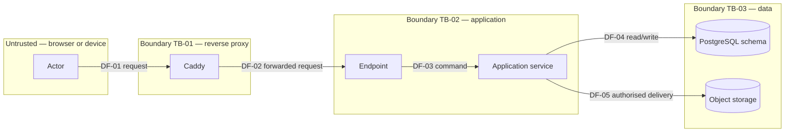

# Threat model template

Copy this file to `docs/security/threat-models/<flow>.md` and fill it in. One threat model covers one flow — login,
customer and measurement handling, the order workflow, barcode custody, inventory, billing and payment, reports and
exports, customer links, an integration adapter, or the deployment itself — because a model that covers everything
gets read by nobody and updated by no one.

A threat model here is not a document produced to satisfy a checklist. It is the argument that a flow is safe, and
the argument is only worth having if it ends in tests that fail when it stops being true. Section 8 is therefore the
section that matters most: every control names the test that proves it, and a control with no test is a residual
risk in section 9 wearing a disguise.

---

## How to use this template

1. **Delete this "How to use" section and every row marked *(example — delete)*** once the file is filled in. What
   remains must read as a statement about this flow, not as a form.
2. **Write it before the code, or alongside it.** A model written after the pull request describes what was built;
   a model written before it changes what gets built, which is the point.
3. **Keep the identifiers stable.** `TM-nnn`, `AB-nn`, `CTL-nn` and `RR-nn` are cited from pull requests, tests and
   the ASVS traceability sheet. Number them once and never renumber; retire an identifier rather than reusing it.
4. **One threat, one row.** "Input validation" is not a threat. "An unauthenticated caller submits a measurement
   sheet for another branch's customer by guessing the identifier" is.
5. **Rate honestly and record who accepted the residual risk.** An unaccepted residual risk is an open finding, not
   a footnote, and the Definition of Done gives it a name: **DoD 6** requires this file to be referenced by every
   pull request touching the flow, with its mapped controls closed.
6. **Review it when the flow changes**, not on a calendar. Section 12 records who reviewed it and when, so a stale
   model is visible rather than merely old.

---

## 1. Status and scope

| Field | Value |
| --- | --- |
| Flow modelled | |
| Status | **Draft** / **Reviewed** / **Superseded by …** |
| Drafted | Date, issue number, wave |
| Author | |
| Reviewed by | The security owner, or — until #56a appoints one — the Owner |
| Review date | |
| Issues that change this flow | |
| Architecture references | The container, component and sequence documents this flow appears in |
| Related architecture decision records | |
| Next review trigger | The change that obliges a re-read, for example "any change to the session store or to the step-up rule" |

---

## 2. What is in scope, and what is not

**In scope.** The flow's entry points, the data it reads and writes, the trust boundaries it crosses, and the
components it depends on directly.

**Out of scope**, each with the reason and, where one exists, the model that does cover it:

| Not modelled here | Why | Covered by |
| --- | --- | --- |
| *(example — delete)* The payment provider's own infrastructure | Outside this system's control; the contract tests and the provider's support-ownership record are what this project relies on | `docs/security/threat-models/billing-payment.md` |

**Assumptions this model rests on.** State them, because a threat model is only as true as its assumptions and the
next reader cannot see the ones left in your head.

| ID | Assumption | If it is false |
| --- | --- | --- |
| **AS-01** | *(example — delete)* Every request reaching this flow has already passed authentication and branch-scope authorisation | Every "authenticated caller" threat below becomes an unauthenticated one, and the ratings are wrong |

---

## 3. Assets

What an attacker would want, and what the business would miss. Classify each against
[`../nfr/data-classification.md`](../nfr/data-classification.md) — the classes are Public, Internal, Confidential,
Personal, Sensitive Personal, Financial, and Credentials and secrets.

| ID | Asset | Class | Why it is worth attacking | Impact if lost, altered or disclosed |
| --- | --- | --- | --- | --- |
| **A-01** | *(example — delete)* Session tickets in `identity.sessions` | Credentials and secrets | A copied ticket is an account | Full impersonation of a member of staff, including their branch scope |

---

## 4. Data flow diagram and trust boundaries

Draw the flow as it is, not as it is meant to be. Every arrow that crosses a boundary is where the threats in
section 6 come from.

| ID | Trust boundary | What changes when it is crossed |
| --- | --- | --- |
| **TB-01** | *(example — delete)* Internet to reverse proxy | Input becomes attacker controlled; rate limits, TLS termination and header policy apply |

| ID | Data flow | Carries | Protection in transit | Authenticated as |
| --- | --- | --- | --- | --- |
| **DF-01** | *(example — delete)* Browser to proxy | Session cookie, request body | TLS 1.2+ | The session, or anonymous |

---

## 5. Actors, entry points and privileges

| Actor | Trust level | Reaches this flow through | Privileges it should have | Privileges it must never have |
| --- | --- | --- | --- | --- |
| *(example — delete)* Reception | Authenticated staff, one branch | The web client | Create and read records for their own branch | Any read across branches; any price override |

| Entry point | Method and route, job name or queue | Authentication | Authorisation | Rate limited |
| --- | --- | --- | --- | --- |
| *(example — delete)* `POST /api/v1/…` | Cookie session | Permission `…`, own branch | Yes — per session and per address |

---

## 6. STRIDE analysis

One row per threat, keyed `TM-nnn`. Work the diagram element by element: for every process, store, data flow and
boundary, ask each STRIDE question and write down the answer even when it is "not applicable, because …" — the
recorded negative is what stops the next reader from re-deriving it.

Likelihood and impact are `low`, `medium` or `high`; the risk is the pair, not an average. Every row ends either in
a control in section 8 or in a residual risk in section 9 — never in nothing.

| ID | Element | STRIDE category | Threat | Likelihood | Impact | Controls | Residual |
| --- | --- | --- | --- | --- | --- | --- | --- |
| **TM-001** | *(example — delete)* DF-02 | Spoofing | A forged request from another origin reuses the browser's session cookie | medium | high | CTL-01, CTL-02 | RR-01 |

**The six questions, in the vocabulary of this system:**

| Category | The question to ask of each element |
| --- | --- |
| **Spoofing** | Can a caller claim to be a member of staff, a branch, a customer link holder, a scanner or a provider callback that it is not? |
| **Tampering** | Can data be altered in transit, at rest, in a queue, in a barcode, in an exported file or in a rendered document? |
| **Repudiation** | Can an actor deny having done this, and does the audit chain of `docs/platform/` make the denial checkable? |
| **Information disclosure** | Can data leak through a response, an error, a log, telemetry, a filename, an object-storage URL, a cache or a timing difference? |
| **Denial of service** | Can one caller exhaust connections, storage, worker leases, an external provider's quota or a printer queue? |
| **Elevation of privilege** | Can a caller act outside its role, outside its branch, or without the step-up its permission demands? |

---

## 7. Abuse cases

A threat is a property of the design; an abuse case is a story about somebody with a motive. Write them as an
attacker's plan, in order, and take each one to the test that defeats it.

| ID | Abuse case | Actor and motive | Steps | Defeated by | Test |
| --- | --- | --- | --- | --- | --- |
| **AB-01** | *(example — delete)* Credential stuffing against the login form | An external attacker with a breach corpus | Automated attempts across many accounts from rotating addresses | CTL-03 lockout, CTL-04 breached-password check | `…Tests.LockoutAfterThreshold` |

The abuse cases the project expects to see across its flows, so that a model can say which apply and which do not:
insecure direct object reference, privilege escalation, workflow bypass by calling the API directly, barcode
replay, invoice or payment tampering, stock manipulation, malicious upload, export leakage, server-side request
forgery, credential abuse, and denial of service.

---

## 8. Controls, and the test that proves each one

**The load-bearing section.** A control with no test is a promise; a control with a test is a property. Where the
test does not exist yet, say so in the last column with the issue that will add it — an honest gap is manageable,
an implied one is not.

| ID | Control | Type | Where it lives | Test that fails if it is removed |
| --- | --- | --- | --- | --- |
| **CTL-01** | *(example — delete)* Anti-forgery token required on every state-changing request | Preventive | `Platform.Security` middleware | `…Tests.RejectsRequestWithoutAntiForgeryToken` |
| **CTL-02** | *(example — delete)* `Origin` and `Sec-Fetch-Site` checked on cookie-authenticated requests | Preventive | Same | `…Tests.RejectsCrossSiteOrigin` |

| Control type | Meaning |
| --- | --- |
| **Preventive** | Stops the threat happening |
| **Detective** | Makes it visible after the fact — an audit event, an alert, a metric |
| **Corrective** | Limits the damage or restores the state — revocation, reversal, restore |

---

## 9. Residual risk

What remains after the controls, and who has agreed to carry it. A residual risk with no owner and no acceptance
date has not been accepted; it has been ignored.

| ID | Residual risk | Threats | Why it is not fully mitigated | Rating | Owner | Accepted on | Review by | Waiver |
| --- | --- | --- | --- | --- | --- | --- | --- | --- |
| **RR-01** | *(example — delete)* A stolen device with an unlocked browser session can act as that member of staff until the absolute timeout | TM-001 | Device security is outside this system; the mitigation is a shorter timeout, which the shop rejected as unworkable at the counter | medium | Owner | | | — |

A residual risk rated **high** is not accepted in this document alone: it goes to the waiver register in
[`../process/waivers.md`](../process/waivers.md) with an expiry and a corrective issue, and it appears in the
release evidence of [`../process/release-evidence.md`](../process/release-evidence.md).

---

## 10. ASVS traceability

Filled in from #56a onwards, and left as an empty table with a note before that. One row per ASVS requirement this
flow is judged against, so that the security baseline and this model cannot drift apart.

| ASVS requirement | Level | Control | Test | Evidence | Residual | Owner | Review date |
| --- | --- | --- | --- | --- | --- | --- | --- |
| | | | | | | | |

---

## 11. Dependencies on other models and documents

| Depends on | For what |
| --- | --- |
| *(example — delete)* `docs/security/threat-models/authentication.md` | The identity of the caller every threat here assumes has already been established |

---

## 12. Review record

| Date | Reviewer | Trigger | Outcome |
| --- | --- | --- | --- |
| | | First draft / flow changed / finding raised / periodic | Threats added, ratings changed, controls closed |

---

## 13. Related documents

| Document | Why it matters here |
| --- | --- |
| [`../nfr/data-classification.md`](../nfr/data-classification.md) | The seven classes section 3 assigns, and the handling rules each one implies |
| [`../nfr/security-operations-targets.md`](../nfr/security-operations-targets.md) | The remediation service levels a finding from this model is fixed under |
| [`../process/definition-of-done.md`](../process/definition-of-done.md) | **DoD 6**, which requires a pull request to name this model and close its mapped controls |
| [`../process/definition-of-ready.md`](../process/definition-of-ready.md) | **DOR-05**, which requires the flow to be covered by a model — or listed in the backlog — before work starts |
| [`../process/release-gates.md`](../process/release-gates.md) | **RG-08** to **RG-11**, the scans this model's controls are checked against at a release |
| [`../process/waivers.md`](../process/waivers.md) | Where a high residual risk is recorded with an expiry |
| [`../architecture/architecture-rules.md`](../architecture/architecture-rules.md) | The `ARCH-nnn` rules the architecture tests assert, several of which are controls in section 8 |
| [`../platform/secrets.md`](../platform/secrets.md) | How the Credentials-and-secrets assets of section 3 are stored, injected and rotated |
| [`../security/README.md`](../security/README.md) | Where the completed model is filed, and what else lives beside it |
